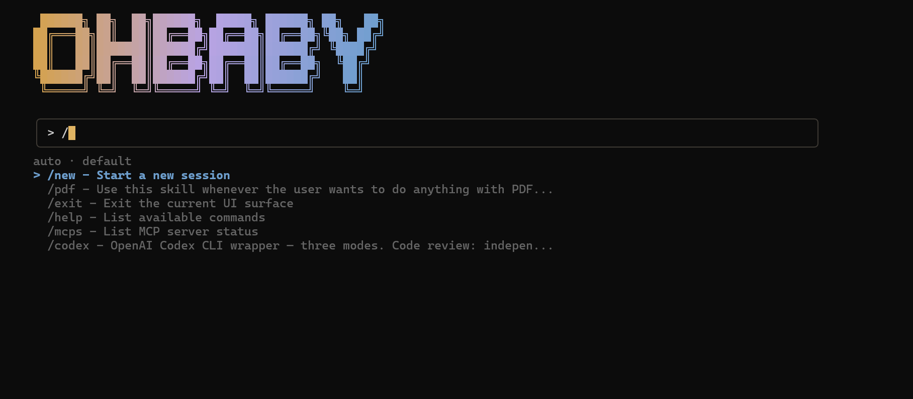
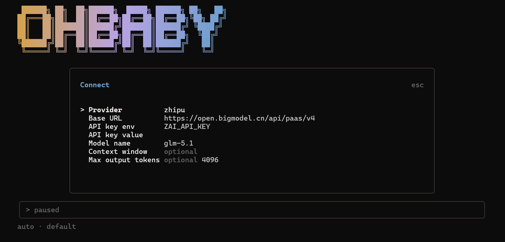
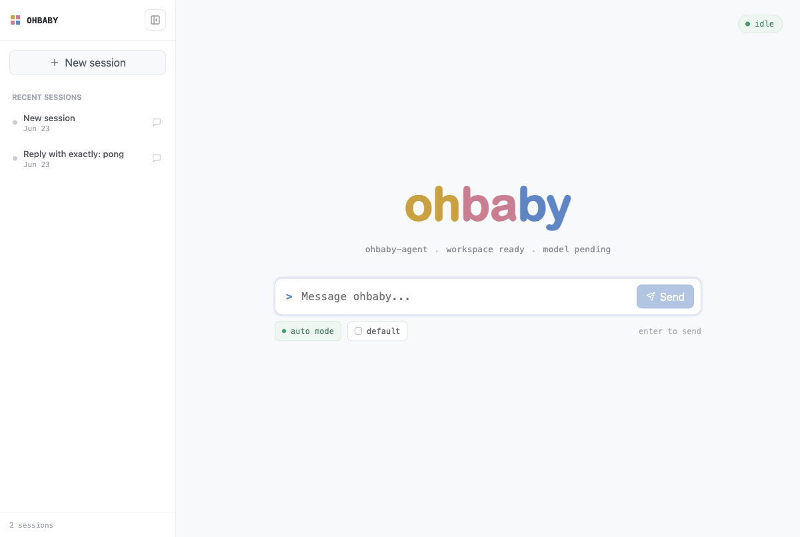

<p align="center">
  
</p>

<p align="center">An open-source AI coding agent with a terminal CLI/TUI and a local web UI.</p>

<p align="center">
  <a href="https://github.com/diverHansun/ohbaby-agent/actions/workflows/ci.yml"></a>
  <a href="https://www.npmjs.com/package/ohbaby-cli"></a>
  <a href="./LICENSE"></a>
  
  
</p>

<p align="center">
  <a href="README.md">English</a> |
  <a href="README.zh.md">简体中文</a>
</p>

<p align="center">
  
</p>

---

**ohbaby-agent** is an open-source AI coding agent. Users can interact with it through
a fast [Ink](https://github.com/vadimdemedes/ink)-based CLI/TUI or a local browser UI,
both installed from npm as `ohbaby-cli` and launched with the `ohbaby` command. The
runtime and SDK are kept separate so future app interfaces can adapt to the same agent core.

Bring your own API key from an LLM provider such as OpenAI, Anthropic, or Zhipu,
then start coding.

## ✨ Features

- **🤖 Provider-agnostic** — OpenAI, Anthropic, Zhipu, DeepSeek, Qwen/DashScope,
  and other LLM providers or OpenAI-compatible endpoints. Your keys, your models.
- **🧩 MCP support** — connect [Model Context Protocol](https://modelcontextprotocol.io)
  servers so their tools, resources, and prompts become available to the agent.
- **🛠️ Skills** — extend ohbaby-agent with reusable skills that show up as slash commands.
- **🧰 Built-in tools** — file read/edit, shell execution, web search, and todo
  management, all behind a permission layer.
- **👥 Subagents** — delegate complex, multi-step work to focused subagents.
- **💬 CLI/TUI interface** — slash commands, session history, model switching, and live
  streaming output in the terminal.
- **🌐 Local web UI** — `ohbaby serve` starts the explicit local daemon, serves the
  bundled web assets, and opens a browser for the current project.
- **🔐 Policy modes & permissions** — `auto` / `default` modes with explicit prompts
  before risky actions.

## 📦 Installation

Requires **Node.js >= 24**. Install the MVP CLI package:

```bash
npm install -g ohbaby-cli
```

This installs the `ohbaby` command globally.

## 🚀 Quick Start

**1. Launch the ohbaby-agent CLI/TUI:**

```bash
ohbaby
```

**2. Connect a model.** In the CLI/TUI, type `/connect` to open the provider setup panel,
fill in your provider, base URL, and model name, then save. API key fields are
optional for local or keyless endpoints such as LM Studio; secrets entered here
are persisted to `~/.ohbaby-agent/.env`.

<p align="center">
  
</p>

| Field | Description |
| --- | --- |
| Provider | `openai`, `anthropic`, `zhipu`, … |
| Base URL | The SDK base URL (no `/chat/completions` suffix) |
| API key env | Optional environment variable that holds the key (e.g. `OPENAI_API_KEY`) |
| API key value | Optional key value; leave blank for keyless local endpoints |
| Model name | e.g. `gpt-5.5`, `claude-sonnet-4-5`, `glm-5.1`, or your provider's model id |
| Context window / Max output tokens | Optional |

**3. Start coding.** That's it — describe what you want and ohbaby-agent gets to work.

## 🌐 Local Web UI

The npm package includes the built web assets. Start the local daemon and browser UI from
your project root:

```bash
ohbaby serve
```

The command prints and opens the real local URL, for example:

```text
ohbaby web ready: http://127.0.0.1:4096
```

Port `4096` is used by default. If that default is already occupied, ohbaby automatically
chooses an available port and prints the URL to open. Passing an explicit `--port` remains
strict, so `ohbaby serve --port 4096` fails clearly when that port is in use.

<p align="center">
  
</p>

## 🔍 Web Search (optional)

To enable the web search tool, get a free API key from
[Tavily](https://tavily.com), then type `/connect-search` in the CLI/TUI and
enter the key. ohbaby-agent saves it as `TAVILY_API_KEY` in
`~/.ohbaby-agent/.env` and keeps only search metadata in
`~/.ohbaby-agent/tools/search.json`.

You can also set the key manually in a `.env` file:

- `~/.ohbaby-agent/.env` (global), or
- `<your-project>/.env` (project)

```dotenv
TAVILY_API_KEY=tvly-...
```

Shell environment variables take precedence over the project `.env`, which takes
precedence over the global one.

## 🧩 MCP & Skills

MCP servers can be configured globally or per project under `.ohbaby-agent/mcp/`.
Skills are discovered from ohbaby-agent-compatible skill directories and exposed as slash
commands. Use `/mcps` to inspect connected MCP servers and `/skills` to list available
skills.

## 📚 Documentation

Module designs, implementation notes, and problem lists live under [`docs/`](docs/).

Agent-recognized memory files (highest priority first): `OHBABY.md`, `AGENTS.md`, `CLAUDE.md`.

## 🛠️ Development

```bash
git clone https://github.com/diverHansun/ohbaby-agent.git
cd ohbaby-agent
pnpm install
pnpm build
pnpm start            # run the built CLI
pnpm test             # run tests
pnpm preflight        # format + lint + typecheck + test + build
```

The repo is a pnpm workspace with four published packages:

- **`ohbaby-cli`** — the CLI/TUI and local web package that installs the `ohbaby` command.
- **`ohbaby-agent`** — the backend runtime: adapters, tools, sessions, policy, MCP, skills.
- **`ohbaby-server`** — the explicit local server and remote client transport package.
- **`ohbaby-sdk`** — stable TypeScript contracts shared between the runtime and interfaces
  such as the current CLI/TUI, local web UI, and future app adapters.

## 📄 License

[MIT](./LICENSE)
