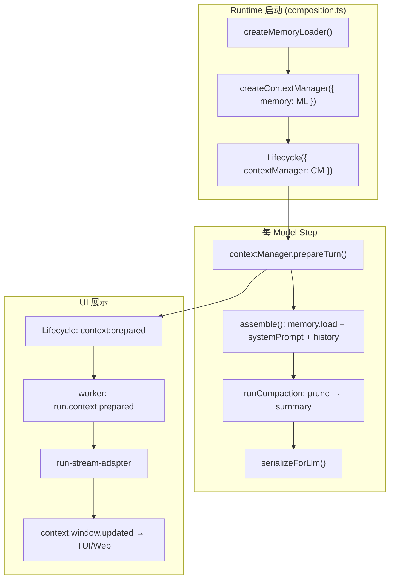

# Agent memory comparison

## User

1.详细查看本项目的上下文压缩机制和记忆模块：packages/ohbaby-agent/src/core/context ; packages/ohbaby-agent/src/core/memory 目前以我的看法，目前的memory机制，也就是长期的“记忆”并没有被充分启动，之前的commit中删除了冗余的memory工具，也就是说目前不存在agent-loop中被动调用memory的hooks，和llm主动调用/“查询”其曾经记忆的工具。2.目前起作用并且我作为开发者认为还不错的是ohbaby的上下文压缩机制：context板块，这里我看到了优秀项目/Users/hansunwork26/workspace/projects/code-cli/deepseek-harness 的context实现，请你说说并对比下现在dsh(deepseek-harness)的记忆机制是怎么样设计的？我看到比较好的设计是其记忆中可以看到当前模型上下文窗口中，各种信息的占比，如图。我也想在ohbaby-agent项目中进行实现这样的上下文窗口占用检测+显示 3.我们接着再来看看普遍好评，社区中一致公认的项目：/Users/hansunwork26/workspace/projects/code-cli/pi 其记忆机制是如何设计的？尤其是上下文窗口/上下文压缩机制  4.请你详细分析，输出关键代码/设计部分的链接，并引用其代码来从设计思路/swe规范/等plan-code-improvement说指出的：goal/数据结构/数据流的角度，来分析。然后和我通俗易懂，分层次说明，说说你的看法。同时你还可以查看我们对记忆的定义，在我的数据库中：/Users/hansunwork26/personal/projects/Hansun-database/knowledge-base/computer-science/agent-harness/memory

### Tool Read File V2

```
{"path":"/Users/hansunwork26/.codex/skills/plan-code-improvement/SKILL.md"}
```

### Tool Glob File Search

```
{"targetDirectory":"/Users/hansunwork26/workspace/projects/code-cli/ohbaby-agent/packages/ohbaby-agent/src/core/context","globPattern":"**/*"}
```

### Tool Glob File Search

```
{"targetDirectory":"/Users/hansunwork26/workspace/projects/code-cli/ohbaby-agent/packages/ohbaby-agent/src/core/memory","globPattern":"**/*"}
```

### Tool Glob File Search

```
{"targetDirectory":"/Users/hansunwork26/personal/projects/Hansun-database/knowledge-base/computer-science/agent-harness/memory","globPattern":"**/*"}
```

### Tool Read File V2

```
{"path":"/Users/hansunwork26/personal/projects/Hansun-database/knowledge-base/computer-science/agent-harness/memory/2026-02-11-agent-memory-architecture.md"}
```

### Tool Read File V2

```
{"path":"/Users/hansunwork26/personal/projects/Hansun-database/knowledge-base/computer-science/agent-harness/memory/2026-06-24-ohbaby-agent-context-borrowing.md"}
```

### Tool Read File V2

```
{"path":"/Users/hansunwork26/personal/projects/Hansun-database/knowledge-base/computer-science/agent-harness/memory/2026-06-24-agent-context-management-landscape-2026.md"}
```

### Tool Read File V2

```
{"path":"/Users/hansunwork26/personal/projects/Hansun-database/knowledge-base/computer-science/agent-harness/memory/2026-08-04-external-memory-systems-openviking-mem0-claude-mem.md"}
```

## Assistant

Knowledge base 内容已经很扎实了。现在并行深入调研三个代码库的具体实现。

### Tool New agent

### Tool New agent

### Tool New agent

## Assistant

All three subagents are running in the background. While waiting, let me also check for the specific commit mentioned by the user (removing redundant memory tools) directly.

### Tool Run Terminal Command V2

### Tool Run Terminal Command V2

## Assistant

Confirmed. This is the commit that removed `memory-tools.ts`, `memory-manager.ts`, `memory-parser.ts` and kept only a read-only loader. Let me look at the actual deleted tool definitions and the discussion doc from that refactor.

### Tool Run Terminal Command V2

### Tool Read File V2

```
{"path":"/Users/hansunwork26/workspace/projects/code-cli/ohbaby-agent/docs/core/memory/improve-1/00-discussion.md"}
```

### Tool Read File V2

```
{"path":"/Users/hansunwork26/workspace/projects/code-cli/ohbaby-agent/docs/core/memory/improve-1/02-optimization-plan-and-change-scope.md"}
```

## Assistant

这段历史文档完全印证了用户的判断——这不是"误删"，而是有意识地清除"从未真正生效的假合约"。现在等待三个并行调研子代理的结果。

### Tool Await

```
{"taskId":"","blockUntilMs":180000}
```

### Tool Await

```
{"taskId":"","blockUntilMs":120000}
```

### Tool Read File V2

```
{"path":"/Users/hansunwork26/.cursor/projects/Users-hansunwork26-workspace-projects-code-cli-ohbaby-agent/agent-transcripts/4faa4751-9757-4ef1-80b8-36ec29206056/subagents/b979d8ff-540c-4b31-9e8d-64610c1b0e34.jsonl","offset":-5}
```

### Tool Read File V2

```
{"path":"/Users/hansunwork26/.cursor/projects/Users-hansunwork26-workspace-projects-code-cli-ohbaby-agent/agent-transcripts/4faa4751-9757-4ef1-80b8-36ec29206056/subagents/fe8d04e6-53d4-48b0-b23f-f56ad798e934.jsonl","offset":-5}
```

### Tool Read File V2

```
{"path":"/Users/hansunwork26/.cursor/projects/Users-hansunwork26-workspace-projects-code-cli-ohbaby-agent/agent-transcripts/4faa4751-9757-4ef1-80b8-36ec29206056/subagents/85953d84-ba68-4ef1-a9e7-0c1afde358f2.jsonl","offset":-5}
```

## Assistant

# 调研总览

我用了三个并行子代理分别过了一遍源码，加上你之前"删除冗余 memory 工具"那次改造的完整 commit（`7d5dfbd`）和 knowledge-base 里的记忆架构文档。结论先说重点，再展开细节。

**一句话结论**：你的判断是对的。ohbaby-agent 的 context 压缩(L1-L4)做得扎实、有独立设计文档背书；但 memory 目前只是 Context 的一个"静态输入源"（读文件→拼进 prompt），**既没有 agent-loop 的被动 hook，也没有 LLM 可主动调用的记忆工具**——这不是疏漏，是你们在 `7d5dfbd` 这次重构里**主动拆除的假合约**，现在处于"故意留白，未来另行设计"的状态。而 dsh 的 `ContextMeter` 正是你截图里那个 UI 的原始实现，思路和数据结构都可以直接抄。

---

## 一、ohbaby-agent 现状

### 1.1 Context 压缩机制（已经很成熟，三档递进）

核心编排在 `context-manager.ts`，决策函数是 `decideCompactionRung`：

```150:190:/Users/hansunwork26/workspace/projects/code-cli/ohbaby-agent/packages/ohbaby-agent/src/core/context/context-manager.ts
export function decideCompactionRung(input: {
  readonly usage: ContextUsage;
  readonly compactionCount?: number;
  readonly force: boolean;
  ...
}): CompactionRung {
  if (input.force) return "force";
  if (input.thrashLocked === true) return "none";
  if (needsSummaryCompaction(input.usage, thresholds)) {
    if ((input.compactionCount ?? 0) >= (input.maxPerTurn ?? ...)) return "mask";
    return "prune-summary";
  }
  if (input.usage.usageRatio >= thresholds.mask) return "mask";
  return "none";
}
```

三档 + 阈值（`constants.ts`）：

| 档位 | 触发条件 | 动作 |
|---|---|---|
| `mask` | usageRatio ≥ 0.50 | 临时投影替换旧工具结果（不写库，仅本次推理视图，**默认关闭**） |
| `prune-summary` | usageRatio ≥ 0.95 或剩余 < 4096 token | 先 prune（标记旧 tool output 为 compacted）→ 不够再 LLM 摘要 |
| `force` | 用户手动 `/compact` 或 context overflow 重试 | 无视阈值直接摘要 |

保留最近消息用 `findCutPoint` + `KEEP_RECENT_TOKENS=20000`，切点严格卡在 user/assistant 边界（不会切断 tool_call/result 配对）。这套设计跟 dsh、pi 的思路是同源的（阈值触发 + 保护尾部 + 结构化摘要），工程成熟度不低。

`serializer.ts` / `projection.ts` / `tool-metadata-projection.ts` / `filters.ts` 一起实现了**存储与推理分离**：SQLite/MessageManager 存完整历史，`isActivePart` 过滤掉 `compacted` 的 part，`reduceForModel` 做临时 mask 投影——这正是知识库文档里 [[2026-06-24-ohbaby-agent-context-borrowing]] 提到的"方向 2.5 存储与推理分离"，**其实已经基本做到了**，只是没写进那篇借鉴文档（可以回头补一笔）。

### 1.2 `context-window-usage.ts`——只有总量，没有分类

```24:41:/Users/hansunwork26/workspace/projects/code-cli/ohbaby-agent/packages/ohbaby-agent/src/core/context/context-window-usage.ts
export function contextUsageToContextWindowUsage(input): UiContextWindowUsage | null {
  return {
    contextWindowRatio: currentTokens / contextWindowTokens,
    contextWindowTokens,
    currentTokens,
    estimatedAt: input.now?.() ?? new Date().toISOString(),
    modelId: input.usage.modelId,
    sessionId: input.sessionId,
  };
}
```

`UiContextWindowUsage` 只有 `currentTokens / contextWindowTokens / contextWindowRatio` 三个数，**没有 system/tool/message 分类字段**。目前它已经能一路展示到 TUI 状态栏（`packages/ohbaby-cli/src/tui/app.tsx`）、Web UI（`apps/ohbaby-web/src/ui/App.tsx`），格式类似 `"38K / 1M (4%)"`——也就是说管道已经通了，**缺的只是分类维度这一层数据**，UI 接入点都是现成的。这对你想做的功能是个好消息：改动面比想象中小。

### 1.3 Memory 模块——只读加载器，无主动/被动调用

```92:115:/Users/hansunwork26/workspace/projects/code-cli/ohbaby-agent/packages/ohbaby-agent/src/core/memory/memory-loader.ts
return {
  async load(directory: string): Promise<MergedMemory> {
    const project = await getProjectInfo(directory);
    const projectMemoryPath = await findProjectMemoryPath(directory, project.rootPath);
    const globalReadPath = await resolveGlobalReadPath();
    const [globalContent, projectContent] = await Promise.all([...]);
    return { global, project, merged: mergeMemory(...) };
  },
};
```

唯一的调用点在 `context-manager.ts`（assemble 阶段，仅主会话）：

```681:688:/Users/hansunwork26/workspace/projects/code-cli/ohbaby-agent/packages/ohbaby-agent/src/core/context/context-manager.ts
let memory = EMPTY_MEMORY;
if (!isSubagent) {
  try {
    memory = await options.memory.load(directory);
  } catch (error) {
    options.onWarning?.("Unable to load memory for context", error);
  }
}
```

也就是说：Memory 现在是 **Context 组装流水线里的一个数据源**，跟一个"每次都重新 fs.readFile 的静态配置文件"没有本质区别。它不是被 agent-loop 生命周期钩子（如 SessionStart/PreCompact）主动触发的模块，更不是一个 LLM 能调用的工具。

**关于删除的那批 memory 工具**，我找到了原始 commit：

```
commit 7d5dfbdc8b4c9c2fd86b3df989a21face494dbd9
refactor(memory): keep read-only loader core
2026-08-11 09:46:54 +0800
```

这次改造删除的 `memory_list / memory_add / memory_update / memory_remove` 长这样（`memory-tools.ts`，删除前）：

```typescript
export const MemoryTools = {
  memory_list:   { name: "memory_list", category: "memory", operationType: "read",  ... },
  memory_add:    { name: "memory_add",  category: "memory", operationType: "write", ... },
  memory_update: { name: "memory_update", category: "memory", operationType: "write", ... },
  memory_remove: { name: "memory_remove", category: "memory", operationType: "write", ... },
} satisfies Record<string, MemoryToolDefinition>;
```

但配套的讨论文档 `docs/core/memory/improve-1/00-discussion.md` 写得很清楚，这不是"删掉了能用的功能"，而是清理"从来没跑起来的假契约"：

> composition 曾创建一个内部 MemoryManager，但 `memory-tools.ts` **只是没有 `execute` 的静态元数据，且从未注册进 ToolScheduler**。agent include、scheduler 映射、permission 分类和旧文档因此制造了虚假的 LLM 工具契约。

也就是说这些工具此前**从来没有真正生效过**——LLM 从来没能实际调用 `memory_add`。团队的决定是"宁缺毋滥"：先做实一个只读 Loader，主动写入/查询工具"本批不新增，未来另行设计"。这和你现在的观察完全吻合：memory 长期记忆确实没有被激活，但这是有意识的技术债定位，不是遗漏。

---

## 二、dsh（deepseek-harness）：你截图里那个 UI 的原始实现

### 2.1 上下文占比展示——和你截图几乎一模一样

数据结构定义在 `token-meter/src/projection.ts`：

```59:76:/Users/hansunwork26/workspace/projects/code-cli/deepseek-harness/packages/llm/token-meter/src/projection.ts
export interface ContextBreakdownProjection {
  /** Heuristic tokens of the newest request envelope's system prompt */
  systemTokens: number
  /** Heuristic tokens of the newest request envelope's tool schemas */
  toolsTokens: number
  /** Heuristic tokens of the current model-visible conversation surface */
  messageTokens: number
}
```

**Token 计算是双轨制**：占用率（百分比）锚定 provider 真实回传的 usage，分类明细（system/tools/messages）用固定密度启发式估算（`CHARS_PER_TOKEN = 4`），文档里明确写了三类之和**不等于**总占用率，UI 故意用 `~` 前缀标近似：

```12:13:/Users/hansunwork26/workspace/projects/code-cli/deepseek-harness/packages/llm/token-meter/src/estimate.ts
/** Fixed text-density estimate used until exact tokenization is needed. */
const CHARS_PER_TOKEN = 4
```

展示入口是 Web 输入栏旁的圆环组件，点击展开面板：

```40:72:/Users/hansunwork26/workspace/projects/code-cli/deepseek-harness/packages/client/ui-conversation/src/client/skeleton/ContextMeter.tsx
export function ContextMeter({ useProjection, t }: ContextMeterProps) {
  const pressure = useProjection('contextPressure')
  const breakdown = useProjection('contextBreakdown')
  ...
```

数据流是标准的 event-sourcing fold：session 事件日志 → `contextBreakdownProjectionDefinition.apply()` 逐事件累加 → Host 推给 Web client → 组件订阅渲染。**没有 `/context` CLI 命令**，纯 UI 组件驱动，这点和 pi、Claude Code 不同。

### 2.2 压缩机制——和 ohbaby 高度同构

两阶段：先 `compaction-tool-result-pruner`（无 LLM，头尾截断，阈值 8192 字符）→ 不够再 LLM 结构化摘要。压缩不是"截断日志"，而是 event-sourced 的 `surfaceOp: { op: 'replace', start, end }`——完整历史永久保留在 append-only log，模型可见的只是 fold 后的 surface。这个"影子价格"（shadow price）机制很精巧：压缩发生时立刻算出释放了多少 token，不用等下一次 provider 回传就能更新 UI。

### 2.3 记忆机制——**没有内置长期记忆，走 MCP 外挂**

这点跟你的截图关注点不完全一样：dsh 本身不做 L5 持久记忆，官方是 opt-in 的 MCP memory server 示例（Memorix / Reference Memory / Engram），读写形式是**纯工具调用**（模型主动 `write`/`search`），不是 hooks。另外有 `session-query` 工具做跨 session 历史检索（`session_search` / `session_event_search`），这个倒是纯工具调用形式，可以给 ohbaby 的"方向 A：暴露消息查询接口"（知识库 2.6 节）做个真实参照。

---

## 三、pi：社区公认项目的做法

### 3.1 压缩机制——单次结构化摘要，不做分阶段裁剪

```235:238:/Users/hansunwork26/workspace/projects/code-cli/pi/packages/coding-agent/src/core/compaction/compaction.ts
export function shouldCompact(contextTokens: number, contextWindow: number, settings: CompactionSettings): boolean {
	if (!settings.enabled) return false;
	return contextTokens > contextWindow - settings.reserveTokens;
}
```

默认 `reserveTokens=16384`，`keepRecentTokens=20000`。跟 dsh/ohbaby 不同的是，**pi 没有独立的"先裁剪旧工具结果"阶段**——它是一步到位的 LLM 摘要，但支持"迭代摘要"（在已有摘要基础上 `UPDATE_SUMMARIZATION_PROMPT` 增量更新）和"split turn"（单轮过大时切开分别摘要再合并）。存储/推理分离做得很干净：`SessionManager` 存全量 JSONL，`buildContextEntries()` 只在最新 `CompactionEntry.firstKeptEntryId` 之后取消息喂给 LLM——这正是 `02-optimization-plan` 里"方案 A：压缩边界标记"的完整实现范本，可以直接抄它的字段设计。

### 3.2 占用展示——Footer 实时百分比 + `/session` 命令

```106:110:/Users/hansunwork26/workspace/projects/code-cli/pi/packages/coding-agent/src/modes/interactive/components/footer.ts
const contextUsage = this.session.getContextUsage();
const contextWindow = contextUsage?.contextWindow ?? state.model?.contextWindow ?? 0;
const contextPercentValue = contextUsage?.percent ?? 0;
```

也是**只有总占比，没有 system/tool/message 分类**——这点上 dsh 走得比 pi 更远。

### 3.3 记忆机制——同样没有内置跨会话语义记忆

项目级"记忆"是 `AGENTS.md`/`CLAUDE.md` 静态文件（和 ohbaby 的 `OHBABY.md` 思路一致），跨会话靠扩展实现的 `handoff`（生成新 session 起始 prompt，类似 Amp Thread Handoff）。**读写机制全部是 hooks（`session_before_compact`/`context`/`turn_end`）+ 扩展 command，没有内置 LLM 工具**。这说明一个业界共识：**长期语义记忆（L5）不是 coding agent 的标配核心能力**，dsh 和 pi 都选择了"核心不做，留扩展点"。

---

## 四、三方对比：goal / 数据结构 / 数据流

### 4.1 Goal 层——三者要解决的问题其实不完全一样

| 维度 | ohbaby-agent | dsh | pi |
|---|---|---|---|
| Context 压缩目标 | 防止超窗 + 保留可续接状态 | 同左 + **让用户"看见"占用构成** | 同左，弱化"看见构成" |
| Memory 目标 | 项目/用户偏好持久化（宁缺毋滥，克制） | 不做，交给外部 MCP 生态 | 不做，交给扩展 |
| 可观测性目标 | 有 usage 数字，无分类 | **一等公民**：专门的 projection + UI 组件 | 有 usage 数字，无分类 |

这里能看出一个关键差异：**dsh 把"上下文占用可观测性"当成一个独立的架构关注点**（专门的 `token-meter` 包、三个注册 projection），而 ohbaby 和 pi 都把它当成压缩逻辑的副产品（`ContextUsage` 顺手算出来的一个数字）。这是你想学的东西的根本原因——不是"多算几个字段"这么简单，是要把它提升为一等公民。

### 4.2 数据结构层——分类字段是缺失的一环

ohbaby 现在的 `ContextUsage`（`types.ts:64-73`）本身就只有聚合字段，没有分段。要做分类展示，最小改动应该长这样（对照 dsh 的 `ContextBreakdownProjection`）：

```typescript
// 建议扩展 packages/ohbaby-agent/src/core/context/types.ts 的 ContextUsage
export interface ContextUsageBreakdown {
  readonly systemPromptTokens: number;   // 对应 dsh systemTokens
  readonly memoryTokens: number;         // ohbaby 特有：OHBABY.md 注入部分，dsh 没有单独拆
  readonly toolSchemaTokens: number;     // 对应 dsh toolsTokens
  readonly historyTokens: number;        // 对应 dsh messageTokens
  readonly summaryTokens: number;        // ohbaby 特有：context-summary 消息部分
}
```

ohbaby 比 dsh 多一层可以拆的东西——`<memory>` 注入块和 `context-summary` 压缩块，这两个在 dsh 里是被 fold 进 `systemTokens`/`messageTokens` 的，但 ohbaby 因为有独立的 memory 注入和 summary 消息类型（`serializer.ts` 的 `<memory>`、`summary.ts` 的 `context-summary` kind），分类可以做得比 dsh 更细，这是你们的架构优势，别浪费。

### 4.3 数据流层——接入点分析

ohbaby 现在这条链路已经通了：

```
ContextManager.prepareTurn() → measureContext() → ContextUsage(聚合)
  → contextUsageToContextWindowUsage() → UiContextWindowUsage
  → Lifecycle yield "context:prepared" → run.context.prepared → run-stream-adapter
  → context.window.updated → TUI/Web 订阅渲染
```

要加分类占比，数据流上只需要在**两个节点**动手，不需要改传输链路：

1. **产生端**：在 `measureContext()`（或它内部按 role/kind 分段调用 `tokenCount`）时，除了算总数，顺便按 `system / memory / tool-schema / history / summary` 五类分别过一遍 `serialization.ts` 的估算逻辑，累加进新字段。
2. **投影端**：`contextUsageToContextWindowUsage()` 把这几个字段透传进 `UiContextWindowUsage`（SDK 层加字段），下游 `run-stream-adapter.ts` 和 TUI/Web 组件基本不用改结构，只是多渲染几行——这正是 dsh `ContextMeter.tsx` 里 `ROWS.map(row => ...)` 那种写法，可以照抄面板 UI 的组织方式。

这个改动面比新增一整套 memory 机制小得多，是"低成本高可见度"的一个改进，跟知识库 [[2026-06-24-ohbaby-agent-context-borrowing]] 里 P0/P1 那几条（reasoning 过滤、工具结果清除）优先级相当，甚至更容易先做出效果给自己看。

### 4.4 Memory 层——三个项目的共识和分歧

| | ohbaby-agent | dsh | pi |
|---|---|---|---|
| 核心是否内置长期记忆 | 只读 Loader（静态文件） | 不做，MCP 外挂 | 不做，扩展外挂 |
| 主动工具（LLM 调用） | **曾经有，已删除**，未来另行设计 | 有（MCP tools，外部实现） | 无内置，扩展可加 |
| 被动 hook（生命周期自动触发） | **无** | 无（也是外挂 hooks） | 有（`session_before_compact`/`turn_end`，但用于压缩不是记忆） |
| 数据结构 | Markdown 全文合并（`MergedMemory.merged`），无结构化条目 | Provider 自定义（jsonl 等） | 无（AGENTS.md 同 ohbaby） |

三个项目在"L5 是否该做进 harness 核心"这件事上高度一致：**都选择不做，或做最轻量的静态文件**。这跟 knowledge-base 里 [[2026-08-04-external-memory-systems-openviking-mem0-claude-mem]] 的判断吻合——"对个人或小团队自研 agent，更适合显式 memory tool，而不是默认引入 OpenViking 整栈"。所以你现在的定位（`OHBABY.md` + 只读 Loader）其实没有"落后"，只是停在了"只读"这一半，还差"主动写入"和"主动查询"两条腿。

---

## 五、我的看法（分层，给你判断依据）

**第一层——"memory 没被激活"这个判断成立，但严重程度低于你的预期。**
它不是 bug，是记录在案、有配套讨论文档的技术债定位（"本批不新增，未来另行设计"）。真正的问题不是"删错了"，而是"删完之后一直没有排期做回来"。三个参照项目里没有一个做了完整的自动化长期记忆，所以这不是紧急缺陷，更像是一个**长期悬而未决的路线选择**：到底要不要给 memory 补 `memory_add`/`memory_search` 这类主动工具？还是干脆保持"用户手动编辑 OHBABY.md"这条最省心的路子？

**第二层——上下文窗口分类占比展示，是三者对比里最值得立刻做的一件事。**
原因有三：改动面小（在已有数据流上加字段，不用碰压缩逻辑）；收益直观（你自己开发时天天要用，能立刻看到 memory 注入、summary 块各占多少）；而且能顺便验证知识库里 P0 那条"reasoning 持久化排查"的怀疑——分类字段做出来后，如果发现 `historyTokens` 里有异常大的隐藏占比，很可能就是 thinking block 没被过滤的证据。这三件事可以一次性验证。

**第三层——如果要重新激活 memory 的主动能力，建议参照的不是 dsh/pi（它们都外包了），而是知识库里已经沙盘推演过的 OpenViking/Claude-Mem 的"思想"**：不是照搬整套 server，而是学它们的 hooks 静默召回/写入 + progressive disclosure（先给摘要索引，按需展开全文），配合 ohbaby 已有的 SQLite 持久层做一个轻量 `memories` 表或 `query_history` 工具（知识库 2.6 节方案 A/B），这条路线在你的仓库里已经有现成的规划落点（`docs/core/memory/improve-1/`），只是被"第 3 批"卡在只读阶段没往下走。

---

**建议的下一步**：如果你想把"上下文窗口占比展示"这个改动正式落地，这个范围小、目标明确、有两个可直接参照的实现（dsh 的 `ContextBreakdownProjection` + pi 的 `getContextUsage`），适合用 `plan-code-improvement` 走一遍完整的 problem-list 流程（现状→方案→改动面→验收标准）。如果你想先讨论 memory 要不要重新加主动工具，这个决策更大（涉及要不要恢复 `memory_add` 之类的 LLM 工具契约、写入触发时机、与 goals 模块的边界），我建议先用一轮讨论把方向定下来，再决定是否要走同样的规划流程。你想先做哪一个,还是两个都先讨论一下?

## User

<timestamp>Thursday, Aug 20, 2026, 2:59 PM (UTC+8)</timestamp>
<system_notification>
The following task has finished. If you were already aware, ignore this notification and do not restate prior responses.

<task>
kind: subagent
status: success
task_id: b979d8ff-540c-4b31-9e8d-64610c1b0e34
title: 分析ohbaby-agent的context与memory模块实现
tool_call_id: toolu_01FCt9gjqgyDPk8oYKkwGnNn
agent_id: b979d8ff-540c-4b31-9e8d-64610c1b0e34
detail: <user_visible_high_level_summary>
已完成对 context 压缩机制与 memory 模块的源码与 git 历史调研。核心结论：压缩为 mask→prune→LLM 摘要三档；context-window-usage 仅有总量占比、无分类统计；memory 工具已在 7d5dfbd 删除，当前仅只读 MemoryLoader 经 ContextManager 注入。
</user_visible_high_level_summary>
<response>
# Context & Memory 模块调研笔记

> 调研范围：`packages/ohbaby-agent/src/core/context/` 与 `packages/ohbaby-agent/src/core/memory/`
> 仓库中无 `agent-loop` / `core/loop` 目录；实际 agent 循环在 `core/lifecycle/lifecycle.ts` 的 `Lifecycle.run()`。

---

## A. Context 压缩机制

### A1. `context-manager.ts` 核心职责

**职责**：Context 模块的编排中心，负责：

1. **组装上下文**（`assemble`）：加载 memory、system prompt、会话历史，过滤已 compact 的 part
2. **Token 计量**（`measureContext` / `getUsage`）：wire 序列化 + 启发式估算 + 校准因子
3. **多档压缩**（`runCompaction`）：mask → prune → LLM summary 三档决策与执行
4. **每步准备**（`prepareTurn`）：Lifecycle 每 model step 前的统一入口
5. **事件发布**：向 Bus 发布压缩/投影相关事件

工厂入口与对外 API：

```355:357:packages/ohbaby-agent/src/core/context/context-manager.ts
export function createContextManager(
 options: ContextManagerOptions,
): ContextManager {
```

```141:160:packages/ohbaby-agent/src/core/context/types.ts
export interface ContextManager {
 assemble(...): Promise<AssembledContext>;
 getUsage(context: AssembledContext, modelId: string): ContextUsage;
 updateCalibrationFactor(...): void;
 compact(sessionId: string, options: CompactOptions): Promise<CompactResult>;
 prepareTurn(input: PrepareTurnInput): Promise<PreparedTurn>;
 resetTurnCompactionCount(sessionId: string, contextScopeId?: string): void;
 disposeSession(sessionId: string): void;
}
```

**数据流（prepareTurn）**：

```
assemble() → measureContext() → reduceContextForModel(mask)
 → runCompaction(prune → summary) → reduceContextForModel(final)
 → serializeForLlm() → PreparedTurn { messages, usage, compaction }
```

对应代码：

```1299:1390:packages/ohbaby-agent/src/core/context/context-manager.ts
 async function prepareTurn(input: PrepareTurnInput): Promise<PreparedTurn> {
 // ... assemble → mask → runCompaction → final mask → return messages
 }
```

---

### A2. 压缩触发条件（Token 阈值等）

**决策函数**：`decideCompactionRung`，返回 `"none" | "mask" | "prune-summary" | "force"`：

```150:180:packages/ohbaby-agent/src/core/context/context-manager.ts
export function decideCompactionRung(input: {
 readonly usage: ContextUsage;
 readonly compactionCount?: number;
 readonly force: boolean;
 ...
}): CompactionRung {
 if (input.force) return "force";
 if (input.thrashLocked === true) return "none";
 ...
 if (needsSummaryCompaction(input.usage, thresholds)) {
 if ((input.compactionCount ?? 0) >= (input.maxPerTurn ?? ...)) return "mask";
 return "prune-summary";
 }
 if (input.usage.usageRatio >= thresholds.mask) return "mask";
 return "none";
}
```

**摘要压缩触发**（`needsSummaryCompaction`）：

```182:190:packages/ohbaby-agent/src/core/context/context-manager.ts
function needsSummaryCompaction(usage, thresholds): boolean {
 return (
 usage.usageRatio >= thresholds.summary ||
 usage.remainingTokens < thresholds.minRemainingInputTokens
 );
}
```

**默认阈值**（`constants.ts`）：

| 常量 | 值 | 含义 |
|------|-----|------|
| `COMPRESSION_THRESHOLD` / `summary` | **0.95** | usageRatio ≥ 95% 触发 prune-summary |
| `COMPACTION_MIN_REMAINING_INPUT_TOKENS` | **4096** | 剩余 input budget < 4096 也触发 |
| `MASK_MIN_USAGE_RATIO` / `mask` | **0.50** | usageRatio ≥ 50% 进入 mask 档 |
| `MAX_COMPACTION_PER_TURN` | **2** | 每 turn 最多 2 次 summary 压缩，超出降级为 mask |
| `KEEP_RECENT_TOKENS` | **20,000** | 保留最近消息的 token 预算 |
| `COMPRESSION_PRESERVE_RATIO` | **0.30** | 历史 ≤ 20K tokens 时，保留 30% |
| `PRUNE_PROTECT_TOKENS` | **40,000** | 最近 tool output 保护量 |
| `PRUNE_MINIMUM_TOKENS` | **20,000** | prune 最少释放量，否则跳过 |
| `THRASH_WINDOW` / `THRASH_MIN_SAVINGS_RATIO` | 2 / 0.1 | 连续低 savings 则 thrash-lock |

```1:34:packages/ohbaby-agent/src/core/context/constants.ts
export const COMPRESSION_THRESHOLD = 0.95;
export const KEEP_RECENT_TOKENS = 20_000;
export const MAX_COMPACTION_PER_TURN = 2;
...
export const DEFAULT_COMPACTION_THRESHOLDS: CompactionThresholds = {
 mask: MASK_MIN_USAGE_RATIO, // 0.5
 minRemainingInputTokens: COMPACTION_MIN_REMAINING_INPUT_TOKENS, // 4096
 summary: COMPRESSION_THRESHOLD, // 0.95
};
```

**额外触发源**：
- Lifecycle 在 context overflow 时 `force: true` 重试（`lifecycle.ts:503-516`）
- 手动 `/compact` 命令调用 `compact()`（`bypassThrashLock: true`）

**Mask 默认关闭**（dark ship）：`maskEnabled ?? false`（`context-manager.ts:386`），逻辑仍运行但不替换占位符。

---

### A3. `context-window-usage.ts` — 占比统计现状

**已实现**：将 `ContextUsage` 映射为 SDK 类型 `UiContextWindowUsage`，**仅总量**，无分类。

```24:41:packages/ohbaby-agent/src/core/context/context-window-usage.ts
export function contextUsageToContextWindowUsage(input): UiContextWindowUsage | null {
 ...
 return {
 contextWindowRatio: currentTokens / contextWindowTokens,
 contextWindowTokens,
 currentTokens,
 estimatedAt: input.now?.() ?? new Date().toISOString(),
 modelId: input.usage.modelId,
 sessionId: input.sessionId,
 };
}
```

**UiContextWindowUsage 字段**（`packages/ohbaby-sdk/src/context-window.ts:1-8`）：

- `sessionId`, `modelId`
- `currentTokens` — 当前估算总 token
- `contextWindowTokens` — 模型窗口上限
- `contextWindowRatio` — 占比
- `estimatedAt` — 估算时间

**没有** system prompt tokens / tool tokens / message tokens 等分类字段。

**UI/CLI 已展示（总量）**：

| 层 | 文件 | 作用 |
|----|------|------|
| 事件投影 | `run-stream-adapter.ts:495-514` | `run.context.prepared` → `context.window.updated` |
| TUI 状态栏 | `packages/ohbaby-cli/src/tui/app.tsx:120-121` | `formatContextWindowUsage()` |
| TUI Prompt | `packages/ohbaby-cli/src/tui/components/prompt/index.tsx:414-415` | 显示用量标签 |
| Web UI | `apps/ohbaby-web/src/ui/App.tsx:3545-3558` | `getContextWindowUsage()` |
| 格式化 | `packages/ohbaby-cli/src/tui/render/usage.ts:3-16` | `"38K / 1M (4%)"` 格式 |

**若要做分类占比，建议接入点**：
1. 在 `context-manager.ts` 的 `measureContext()` / `renderForModel()` 中按 role 分段估算
2. 扩展 `UiContextWindowUsage`（SDK）增加 breakdown 字段
3. 在 `contextUsageToContextWindowUsage()` 或 `run-stream-adapter.ts:handleContextWindowUsage()` 写入 tracker 并发布

当前 `ContextUsage` 本身也只有 aggregate 字段（`types.ts:64-73`）。

---

### A4. 压缩策略：分阶段 + 保留最近 N 条

**两阶段**（`runCompaction`，非全量一次摘要）：

1. **Prune**（`pruneHistory`）：标记旧 tool output 的 `part.time.compacted`，持久化到 MessageManager
2. **Summary**（`generateSummaryCandidate` → `commitSummaryCandidate`）：LLM 生成 checkpoint，写入 synthetic `context-summary` 消息

```1038:1124:packages/ohbaby-agent/src/core/context/context-manager.ts
async function runCompaction(req): Promise<CompactionOutcome> {
 // rung === "none" | "mask" → skip
 const pruneOutcome = await pruneHistory(...);
 // after prune, re-check rung
 if (rung !== "force" && afterPruneRung !== "prune-summary") return ...;
 const candidate = await generateSummaryCandidate(...);
 ...
}
```

**保留最近 N 条消息的逻辑** — `findCutPoint` + `getHistoryToCompress`：

```211:281:packages/ohbaby-agent/src/core/context/context-manager.ts
export function findCutPoint(input: {
 readonly history: readonly MessageWithParts[];
 readonly keepRecentTokens: number;
 ...
}): ContextCutPoint {
 // 从尾部向前累加 token，直到超过 keepRecentTokens
 // 切点必须在 user/assistant 消息边界
 // turnPrefixMessages: 保留 assistant 前一条 user（避免切断 turn）
}
```

```284:305:packages/ohbaby-agent/src/core/context/context-manager.ts
function getHistoryToCompress(input): readonly MessageWithParts[] {
 const fullTokens = tokenCount(..., serializeHistory(input.history));
 const preserveTarget = Math.max(1, Math.floor(fullTokens * input.preserveRatio));
 const cut = findCutPoint({
 history: input.history,
 keepRecentTokens:
 fullTokens <= KEEP_RECENT_TOKENS ? preserveTarget : KEEP_RECENT_TOKENS,
 ...
 });
 return [...cut.messagesToSummarize, ...cut.turnPrefixMessages];
}
```

**摘要 prompt 策略**（`compression-prompt.ts`）：
- 先用 `COMPRESSION_PROMPT`（结构化 checkpoint，目标 15-30%）
- 若摘要仍比原文长，再用 `AGGRESSIVE_COMPRESSION_PROMPT`（`context-manager.ts:823-850`）
- 追加 file ops 摘要（`file-ops.ts` + `appendFileOpsSummary`）

**Summary 识别**（`summary.ts` + `message/origin.ts`）：
- 标记：`metadata.kind === "context-summary"`
- 序列化时包装为 `<context_summary>` user 消息（`serializer.ts:95-105`）
- 多条 summary 保留全部，non-summary 在后（`partitionSummary`，`context-manager.ts:319-324`）

---

### A5. serializer / projection / filters / tool-metadata-projection 分工

| 模块 | 路径 | 用途 | 存储 vs 推理分离 |
|------|------|------|-----------------|
| **filters.ts** | `filters.ts:3-5` | `isActivePart`: `part.time.compacted === undefined` 的 part 才参与序列化/计数 | 是 — compacted part 存 DB 但不出现在 wire |
| **serialization.ts** | `serialization.ts:12-50` | 内部 token 估算用的纯文本序列化（role + parts） | 内部度量，非 wire |
| **serializer.ts** | `serializer.ts:47-71` | `serializeForLlm`: 组装 system+memory+history → `ChatCompletionMessage[]` | 是 — 读存储态，投影为 provider 格式 |
| **projection.ts** | `projection.ts:68-143` | `reduceForModel`: 旧 tool result **临时**替换为 placeholder（mask） | 是 — **不写 DB**，仅本次 inference 视图 |
| **tool-metadata-projection.ts** | `tool-metadata-projection.ts:70-233` | 按 tool 白名单裁剪 metadata，附 `<tool_metadata>` 块 | 是 — 存储完整 metadata，推理只投影子集 |

**serializer 关键路径**：

```47:71:packages/ohbaby-agent/src/core/context/serializer.ts
export function serializeForLlm(input): ChatCompletionMessage[] {
 const systemPrompt = input.isSubagent
 ? input.systemPrompt
 : appendMemoryToSystemPrompt(systemPrompt, loadMemoryForPrompt(memory.merged));
 const messages = serializeHistoryMessages(history, activeReasoningByMessageId);
 return systemPrompt.trim() === "" ? messages : [{ role: "system", content: systemPrompt }, ...messages];
}
```

**projection（mask）关键路径**：

```619:656:packages/ohbaby-agent/src/core/context/context-manager.ts
function reduceContextForModel(input): AssembledContext {
 const result = reduceForModel({ config: maskConfig, cutoff, history, usage, ... });
 if (input.publishEvent) options.bus.publish(ContextEvent.Masked, ...);
 return withHistory(input.context, result.history);
}
```

---

### A6. `events.ts` 定义与消费

**定义的 5 个 Bus 事件**（`events.ts:42-92`）：

| 事件 | 类型字符串 | Payload 要点 |
|------|-----------|-------------|
| `Compressed` | `context.compressed` | sessionId, CompressionResult |
| `Pruned` | `context.pruned` | sessionId, PruneResult |
| `TurnPrepared` | `context.turn-prepared` | sessionId, usage, tookMs, triggeredCompaction |
| `CompactSkipped` | `context.compact-skipped` | sessionId, reason, usage |
| `Masked` | `context.masked` | sessionId, enabled, maskedPartIds, maskedTokens, cutoff, usageRatio |

**发布点**：仅在 `context-manager.ts` 内 publish。

**生产代码消费情况**：
- **Bus ContextEvent 无生产订阅者** — 全仓库 `subscribe(ContextEvent.*)` 只在 `manager.unit.test.ts`
- 注册于 `bus/event-catalog.ts:226-270`（元数据/catalog 用途）
- **用户可见路径走 Lifecycle 事件链**，非直接消费 Bus ContextEvent：

```
ContextManager.prepareTurn()
 → Lifecycle yield { type: "context:prepared", usage, compaction, ... } (lifecycle.ts:1141-1150)
 → run-manager/worker.ts:347-363 发布 "run.context.prepared"
 → run-stream-adapter.ts:541-544 处理 → context.window.updated + compact notice
```

---

## B. Memory 模块现状

### B1. memory-loader / memory-discovery 职责与加载时机

**memory-discovery.ts**：

```9:11:packages/ohbaby-agent/src/core/memory/memory-discovery.ts
export function getGlobalMemoryPath(options = {}): string {
 return path.join(resolveOhbabyHome(options), MEMORY_FILENAME);
}
```

```13:39:packages/ohbaby-agent/src/core/memory/memory-discovery.ts
export async function findProjectMemoryPath(startDirectory, projectRoot): Promise<string | null> {
 // 从 startDirectory 向上 walk 到 projectRoot，找第一个 OHBABY.md
}
```

**memory-loader.ts**：

```92:115:packages/ohbaby-agent/src/core/memory/memory-loader.ts
return {
 async load(directory: string): Promise<MergedMemory> {
 const project = await getProjectInfo(directory);
 const projectMemoryPath = await findProjectMemoryPath(directory, project.rootPath);
 const globalReadPath = await resolveGlobalReadPath(); // 含 legacy path fallback
 const [globalContent, projectContent] = await Promise.all([...]);
 return { global, project, merged: mergeMemory(...) };
 },
};
```

**文件名常量**：`constants.ts:1` → `MEMORY_FILENAME = "OHBABY.md"`

**加载时机**：每次 `ContextManager.assemble()` / `prepareTurn()` 时，**仅主会话**（`!isSubagent`）：

```681:688:packages/ohbaby-agent/src/core/context/context-manager.ts
 let memory = EMPTY_MEMORY;
 if (!isSubagent) {
 try {
 memory = await options.memory.load(directory);
 } catch (error) {
 options.onWarning?.("Unable to load memory for context", error);
 }
 }
```

**注入链路**（非 Lifecycle 直接调用）：

```446:451:packages/ohbaby-agent/src/adapters/ui-runtime/composition.ts
 createContextManager({
 ...
 memory: createMemoryLoader(),
 ...
 });
```

Lifecycle 每 step 调 `prepareTurn` → 间接触发 memory 加载（`lifecycle.ts:401-413`）。

---

### B2. 主动 memory 工具 — 已删除

**相关 commit**：

| 字段 | 值 |
|------|-----|
| **Hash** | `7d5dfbd`（完整：`7d5dfbdc8b4c9c2fd86b3df989a21face494dbd9`） |
| **Message** | `refactor(memory): keep read-only loader core` |
| **Date** | 2026-08-11 09:46:54 +0800 |
| **说明** | 文档中称"清理虚假 memory_* LLM 工具契约"（improve-1 第 3 批），commit message 未含"冗余"字样 |

**删除的文件**：
- `memory-tools.ts` — 5 个 ghost tool 定义
- `memory-manager.ts` — CRUD + 写文件
- `memory-parser.ts` — 条目解析
- `events.ts` — MemoryEvent
- `manager.integration.test.ts`, `parser.unit.test.ts`

**被删 tool 定义摘要**（`memory-tools.ts`，commit 前）：

| Tool | 操作 | 参数 |
|------|------|------|
| `memory_list` | read | `scope: global\|project` |
| `memory_add` | write | `scope`, `fact` |
| `memory_update` | write | `scope`, `index`, `newText` |
| `memory_remove` | write | `scope`, `index` |
| `memory_read` | （permission 中有，tool 定义未在 memory-tools.ts） | — |

**同步清理**：
- 4 个 builtin agent 移除 `memory_list` include（如 `plan.ts`）
- `tool-scheduler/constants.ts` 移除 `memory_*` category 映射
- `permission/classifier.ts` 移除 `MEMORY_READ_TOOLS` / `MEMORY_WRITE_TOOLS` 专用分支

**当前生产代码**：`rg memory_list|memory_add|MemoryTools|createMemoryManager` 在 `src/` 下**零匹配**（仅测试断言 ghost tools 不存在）。

---

### B3. Memory 模块调用点

**Import 链（生产代码）**：

| 文件 | 行 | 用途 |
|------|-----|------|
| `adapters/ui-runtime/composition.ts` | 20, 451 | `createMemoryLoader()` 注入 ContextManager |
| `core/context/context-manager.ts` | 51, 684 | `MergedMemory` 类型；`options.memory.load()` |
| `core/context/types.ts` | 3, 7-8 | `MemoryReader` 接口 |
| `core/context/serializer.ts` | 2, 59 | 序列化时注入 `<memory>` |
| `core/memory/index.ts` | — | 公开 API |

**Lifecycle / core/loop 不直接 import memory** — 经 `ContextManager` 间接使用。

**全仓库 import 搜索**（`from.*core/memory|memory-loader`）：除上述 + 测试外无其他生产调用。

---

### B4. `types.ts` 数据结构

```1:24:packages/ohbaby-agent/src/core/memory/types.ts
export interface MergedMemory {
 readonly global: string; // 全局 OHBABY.md 原文
 readonly project: string; // 项目 OHBABY.md 原文
 readonly merged: string; // 合并后（含 HTML 注释分隔）
}

export interface ProjectInfo {
 readonly id: string;
 readonly rootPath: string;
}

export interface ProjectResolver {
 fromDirectory(directory: string): Promise<ProjectInfo> | ProjectInfo;
}

export interface MemoryLoader {
 load(directory: string): Promise<MergedMemory>;
}

export interface MemoryLoaderOptions {
 readonly projectResolver: ProjectResolver;
 readonly globalMemoryPath?: string;
 readonly onWarning?: (message: string, error?: unknown) => void;
}
```

**删除前的类型**（commit 前 `memory-manager.ts` 引用）：`MemoryEntry`, `MemoryScope`, `AddMemoryInput`, `UpdateMemoryInput`, `RemoveMemoryInput`, `MemoryToolDefinition` 等 — 均已移除。

---

## 架构关系图



---

## 关键结论摘要

1. **Context 压缩是三档渐进式**：mask（临时投影，默认关闭）→ prune（持久标记 tool output）→ LLM summary（写入 context-summary 消息）；触发阈值为 usageRatio ≥ 0.95 或 remaining < 4096。
2. **保留最近消息**由 `findCutPoint` + `KEEP_RECENT_TOKENS=20000` 控制，切点在 user/assistant 边界。
3. **context-window-usage 只有总量占比**，没有 system/tool/message 分类；TUI 和 Web 已展示 `currentTokens / contextWindowTokens (ratio)`。
4. **Memory 已无主动工具**；`7d5dfbd`（2026-08-11）删除 memory_* ghost contract，保留只读 `MemoryLoader`。
5. **Memory 仅通过 ContextManager 被动加载**，subagent 不加载；无 Lifecycle 直接依赖。
6. **ContextEvent（Bus）不被 agent loop 直接消费**；用户可见的 context 更新走 `Lifecycle → run.context.prepared → context.window.updated` 链路。
</response>
output_path: /Users/hansunwork26/.cursor/projects/Users-hansunwork26-workspace-projects-code-cli-ohbaby-agent/agent-transcripts/4faa4751-9757-4ef1-80b8-36ec29206056/subagents/b979d8ff-540c-4b31-9e8d-64610c1b0e34.jsonl
</task>
</system_notification>
<user_query>Perform any necessary follow-up actions in response to the subagent completion above. If no follow-up work is needed, no further action is required. If you mention an agent or subagent in your response, link it with the `[Name](id)` Don't use generic label such as `[agent]`, `[worker]`, or `[subagent]`. For cloud subagents, when the agent has edited code, link to `[Review](bc-id#changes)`, or, if you know the exact added and deleted line counts, `[Review +A −D](bc-id#changes)`, replacing A and D with those counts. Never write A or D literally. Use `[Try Live](bc-id#desktop)` only when the agent used computer use. Don't repeat the same confirmation every time.</user_query>

## User

<timestamp>Thursday, Aug 20, 2026, 2:59 PM (UTC+8)</timestamp>
<system_notification>
The following task has finished. If you were already aware, ignore this notification and do not restate prior responses.

<task>
kind: subagent
status: success
task_id: 85953d84-ba68-4ef1-a9e7-0c1afde358f2
title: 分析pi项目的记忆与上下文压缩机制
tool_call_id: toolu_011nA1rKrBNxEscHSuPqJxAc
agent_id: 85953d84-ba68-4ef1-a9e7-0c1afde358f2
detail: <user_visible_high_level_summary>
Pi 是 TypeScript monorepo，上下文压缩以 LLM 摘要为核心（非分阶段裁剪），存储层（JSONL 全量）与推理层（buildSessionContext 筛选）分离；无内置跨会话向量记忆，但有 Footer/`/session` 可视化与扩展 hook 机制。
</user_visible_high_level_summary>
<response>
# Pi 项目记忆/上下文机制调研报告

## 项目概览

**Pi**（`/Users/hansunwork26/workspace/projects/code-cli/pi`）是一个 **TypeScript/Node.js monorepo**（Node ≥ 22），核心包分层如下：

| 包 | 职责 |
|---|---|
| `packages/coding-agent` | 交互式 coding agent CLI（用户实际使用的产品层） |
| `packages/agent` | Agent 运行时（tool calling、agent loop、新 harness 设计） |
| `packages/ai` | 统一多 Provider LLM API |
| `packages/tui` | 终端 UI |
| `packages/session-backends/sqlite-node` | 可选 SQLite session 后端（JSONL 仍是默认） |

**上下文压缩/记忆管理的核心实现都在 `packages/coding-agent`**，底层 agent loop 在 `packages/agent`。

---

## 1. 上下文压缩/管理机制

### 1.1 核心触发逻辑与阈值

**触发判断函数**：`shouldCompact()`
**文件**：`/Users/hansunwork26/workspace/projects/code-cli/pi/packages/coding-agent/src/core/compaction/compaction.ts`

```235:238:/Users/hansunwork26/workspace/projects/code-cli/pi/packages/coding-agent/src/core/compaction/compaction.ts
export function shouldCompact(contextTokens: number, contextWindow: number, settings: CompactionSettings): boolean {
	if (!settings.enabled) return false;
	return contextTokens > contextWindow - settings.reserveTokens;
}
```

**默认配置**（同文件 + settings-manager）：

```132:136:/Users/hansunwork26/workspace/projects/code-cli/pi/packages/coding-agent/src/core/compaction/compaction.ts
export const DEFAULT_COMPACTION_SETTINGS: CompactionSettings = {
	enabled: true,
	reserveTokens: 16384,
	keepRecentTokens: 20000,
};
```

即：**当 `contextTokens > contextWindow - reserveTokens`（默认留 16384 token 给回复）时触发自动压缩**。

**实际调用链**在 `AgentSession._checkCompaction()`：

`/Users/hansunwork26/workspace/projects/code-cli/pi/packages/coding-agent/src/core/agent-session.ts`

两种触发场景（注释写得很清楚）：

```1950:2052:/Users/hansunwork26/workspace/projects/code-cli/pi/packages/coding-agent/src/core/agent-session.ts
	/**
	 * Check if compaction is needed and run it.
	 * Called after agent_end and before prompt submission.
	 *
	 * Two cases:
	 * 1. Recoverable failure: LLM returned context overflow or stopped below its desired output limit;
	 * remove the assistant message, compact, and auto-retry once
	 * 2. Threshold: Context over threshold, compact, NO auto-retry (user continues manually)
	 ...
		if (shouldCompact(contextTokens, contextWindow, settings)) {
			return await this._runAutoCompaction("threshold", false);
		}
```

| 触发原因 | 条件 | 是否 auto-retry |
|---|---|---|
| `threshold` | token 超过阈值 | 否 |
| `overflow` | context overflow / recoverable length | 是（最多一次） |
| `manual` | 用户 `/compact` | 否 |

**调用时机**：
1. 每次 `agent_end` 之后（`_handlePostAgentRun` → `_checkCompaction`）
2. 用户提交新 prompt 之前（检查上一条 assistant 消息）

```1077:1100:/Users/hansunwork26/workspace/projects/code-cli/pi/packages/coding-agent/src/core/agent-session.ts
	private async _handlePostAgentRun(): Promise<boolean> {
		const msg = this._lastAssistantMessage;
		...
		if (await this._checkCompaction(msg)) {
			return true;
		}
```

```1205:1210:/Users/hansunwork26/workspace/projects/code-cli/pi/packages/coding-agent/src/core/agent-session.ts
			// Check if we need to compact before sending (catches aborted responses).
			const lastAssistant = this._findLastAssistantMessage();
			if (lastAssistant) {
				await this._checkCompaction(lastAssistant, false);
			}
```

---

### 1.2 压缩策略

**不是**「先裁剪旧 tool 结果 → 再整体摘要」的分阶段策略。

Pi 的策略是 **单次 LLM 结构化摘要（compaction）**：

1. **找切点**：从最新消息向前累加 token 估算，直到达到 `keepRecentTokens`（默认 20k）
2. **提取待摘要消息**：从上次 compaction 边界到切点之间的消息
3. **LLM 生成结构化 summary**（Goal/Progress/Key Decisions/...）
4. **追加 `CompactionEntry`**，重建 agent 可见 context

核心准备逻辑 `prepareCompaction()`：

```710:788:/Users/hansunwork26/workspace/projects/code-cli/pi/packages/coding-agent/src/core/compaction/compaction.ts
export function prepareCompaction(
	pathEntries: SessionEntry[],
	settings: CompactionSettings,
): CompactionPreparation | undefined {
	...
	const cutPoint = findCutPoint(pathEntries, boundaryStart, boundaryEnd, settings.keepRecentTokens);
	...
	// Messages to summarize (will be discarded after summary)
	const messagesToSummarize: AgentMessage[] = [];
	for (let i = boundaryStart; i < historyEnd; i++) {
		const msg = getMessageFromEntryForCompaction(pathEntries[i]);
		if (msg) messagesToSummarize.push(msg);
	}
	...
}
```

**Split Turn（超大单轮）**：若单个 turn 超过 `keepRecentTokens`，会在 turn 中间切开，生成 **两个摘要再合并**：

```845:882:/Users/hansunwork26/workspace/projects/code-cli/pi/packages/coding-agent/src/core/compaction/compaction.ts
	if (isSplitTurn && turnPrefixMessages.length > 0) {
		...
		const turnPrefixResult = await generateTurnPrefixSummary(...);
		// Merge into single summary
		summary = `${historyText}\n\n---\n\n**Turn Context (split turn):**\n\n${turnPrefixResult.text}`;
```

**迭代摘要**：若存在上一次 compaction summary，用 `UPDATE_SUMMARIZATION_PROMPT` 增量更新，而非从头生成。

**切点规则**：可在 user/assistant 消息处切，**永不在 toolResult 处切**（保证 tool call 与 result 配对）：

```308:320:/Users/hansunwork26/workspace/projects/code-cli/pi/packages/coding-agent/src/core/compaction/compaction.ts
function isCutPointMessage(message: AgentMessage): boolean {
	switch (message.role) {
		case "user":
		case "assistant":
		...
		case "toolResult":
			return false;
	}
```

---

### 1.3 精细化清除机制

**运行时 context 层面**：没有单独清除 thinking 块或旧 tool 结果的机制。压缩后，旧消息通过 `buildContextEntries()` **整体不再进入 LLM context**，而非逐条删除。

**摘要序列化阶段**（仅用于生成 summary 的输入，不影响已存储消息）：
- tool result 截断到 2000 字符
- thinking 块会被 **包含进摘要输入**（不是清除）

```88:145:/Users/hansunwork26/workspace/projects/code-cli/pi/packages/coding-agent/src/core/compaction/utils.ts
const TOOL_RESULT_MAX_CHARS = 2000;
...
			if (thinkingParts.length > 0) {
				parts.push(`[Assistant thinking]: ${thinkingParts.join("\n")}`);
			}
...
				parts.push(`[Tool result]: ${truncateForSummary(content, TOOL_RESULT_MAX_CHARS)}`);
```

**工具输出入 context 前的截断**（独立机制，在 tool 执行层）：
- read/bash 等工具：默认 **2000 行 / 50KB**，先到先截

```1:12:/Users/hansunwork26/workspace/projects/code-cli/pi/packages/coding-agent/src/core/tools/truncate.ts
 * - Line limit (default: 2000 lines)
 * - Byte limit (default: 50KB)
...
export const DEFAULT_MAX_LINES = 2000;
export const DEFAULT_MAX_BYTES = 50 * 1024; // 50KB
```

**每次 LLM 调用前**，扩展可通过 `context` hook 修改 messages（可自定义裁剪）：

```669:673:/Users/hansunwork26/workspace/projects/code-cli/pi/packages/coding-agent/src/core/extensions/types.ts
/** Fired before each LLM call. Can modify messages. */
export interface ContextEvent {
	type: "context";
	messages: AgentMessage[];
}
```

挂载在 agent 的 `transformContext`：

```350:354:/Users/hansunwork26/workspace/projects/code-cli/pi/packages/coding-agent/src/core/sdk.ts
		transformContext: async (messages) => {
			const runner = extensionRunnerRef.current;
			if (!runner) return messages;
			return runner.emitContext(messages);
		},
```

---

### 1.4 存储层 vs 推理层分离

**有明确分离设计**：

| 层 | 存储 | 发给 LLM |
|---|---|---|
| 完整历史 | JSONL session 文件（`~/.pi/agent/sessions/.../*.jsonl`），所有 entry 永久保留 | 否 |
| 推理 context | `buildSessionContext()` 从当前 branch path 投影 | 是 |

**CompactionEntry 数据结构**（存储层）：

```69:80:/Users/hansunwork26/workspace/projects/code-cli/pi/packages/coding-agent/src/core/session-manager.ts
export interface CompactionEntry<T = unknown> extends SessionEntryBase {
	type: "compaction";
	summary: string;
	firstKeptEntryId: string;
	tokensBefore: number;
	details?: T;
	usage?: Usage;
	fromHook?: boolean;
}
```

**推理层投影** `buildContextEntries()`：最新 compaction 之后，只保留 summary + `firstKeptEntryId` 起的消息，旧消息省略：

```418:453:/Users/hansunwork26/workspace/projects/code-cli/pi/packages/coding-agent/src/core/session-manager.ts
export function buildContextEntries(
	entries: SessionEntry[],
	leafId?: string | null,
	byId?: Map<string, SessionEntry>,
): SessionEntry[] {
	...
	const contextEntries: SessionEntry[] = [compaction];
	...
	contextEntries.push(...path.slice(compactionIdx + 1));
	return contextEntries;
}
```

**CompactionEntry → LLM 消息** 转换为 `compactionSummary` 角色，再 wrap 成 user 消息：

```404:406:/Users/hansunwork26/workspace/projects/code-cli/pi/packages/coding-agent/src/core/session-manager.ts
	if (entry.type === "compaction") {
		return [createCompactionSummaryMessage(entry.summary, entry.tokensBefore, entry.timestamp)];
	}
```

```11:17:/Users/hansunwork26/workspace/projects/code-cli/pi/packages/coding-agent/src/core/messages.ts
export const COMPACTION_SUMMARY_PREFIX = `The conversation history before this point was compacted into the following summary:

<summary>
`;
export const COMPACTION_SUMMARY_SUFFIX = `
</summary>`;
```

```176:183:/Users/hansunwork26/workspace/projects/code-cli/pi/packages/coding-agent/src/core/messages.ts
				case "compactionSummary":
					return {
						role: "user",
						content: [
							{ type: "text" as const, text: COMPACTION_SUMMARY_PREFIX + m.summary + COMPACTION_SUMMARY_SUFFIX },
						],
```

**不参与 LLM context 的 entry 类型**：

```94:103:/Users/hansunwork26/workspace/projects/code-cli/pi/packages/coding-agent/src/core/session-manager.ts
 * Does NOT participate in LLM context (ignored by buildSessionContext).
 * For injecting content into context, see CustomMessageEntry.
 */
export interface CustomEntry<T = unknown> extends SessionEntryBase {
	type: "custom";
	customType: string;
	data?: T;
}
```

**压缩完成后同步 agent 状态**：

```2157:2160:/Users/hansunwork26/workspace/projects/code-cli/pi/packages/coding-agent/src/core/agent-session.ts
			this.sessionManager.appendCompaction(summary, firstKeptEntryId, tokensBefore, details, fromExtension, usage);
			...
			const sessionContext = this.sessionManager.buildSessionContext();
			this.agent.state.messages = sessionContext.messages;
```

**压缩前后数据结构变化总结**：

```
压缩前 JSONL branch:
 [msg0, msg1, ..., msgN] → LLM 看到全部 messages

压缩后 JSONL branch（追加，不删旧 entry）:
 [msg0, ..., msgN, CompactionEntry{summary, firstKeptEntryId, tokensBefore}]
 → LLM 看到: compactionSummary(user) + messages[firstKeptEntryId..N]
 → JSONL 仍保留 msg0..msgN 完整记录
```

---

### 1.5 上下文占用可视化/统计

**没有专门的 `/context` 命令**，但有两处等效能力：

**1) Footer 实时显示 context 占用百分比**（类似 Claude Code 的 context bar）：

`/Users/hansunwork26/workspace/projects/code-cli/pi/packages/coding-agent/src/modes/interactive/components/footer.ts`

```106:161:/Users/hansunwork26/workspace/projects/code-cli/pi/packages/coding-agent/src/modes/interactive/components/footer.ts
		const contextUsage = this.session.getContextUsage();
		const contextWindow = contextUsage?.contextWindow ?? state.model?.contextWindow ?? 0;
		const contextPercentValue = contextUsage?.percent ?? 0;
		const contextPercent = contextUsage?.percent !== null ? contextPercentValue.toFixed(1) : "?";
		...
		const contextPercentDisplay =
			contextPercent === "?"
				? `?/${formatTokens(contextWindow)}${autoIndicator}`
				: `${contextPercent}%/${formatTokens(contextWindow)}${autoIndicator}`;
```

**2) `/session` 命令**：显示 token/cost/cache 统计 + contextUsage

```5996:6034:/Users/hansunwork26/workspace/projects/code-cli/pi/packages/coding-agent/src/modes/interactive/interactive-mode.ts
	private handleSessionCommand(): void {
		const stats = this.session.getSessionStats();
		...
		info += `${theme.fg("dim", "Input:")} ${promptTokens.toLocaleString()}\n`;
```

**API 层** `getContextUsage()`：

```3174:3217:/Users/hansunwork26/workspace/projects/code-cli/pi/packages/coding-agent/src/core/agent-session.ts
	getContextUsage(): ContextUsage | undefined {
		...
		// After compaction, ... context token count is unknown until the next LLM response.
		if (latestCompaction) {
			...
			if (!hasPostCompactionUsage) {
				return { tokens: null, contextWindow, percent: null };
			}
		}
		const estimate = estimateContextTokens(this.messages);
		const percent = (estimate.tokens / contextWindow) * 100;
		return { tokens: estimate.tokens, contextWindow, percent };
	}
```

**扩展也可读**：`ctx.getContextUsage()` 暴露在 ExtensionContext 上（`types.ts:342`）。

**离线分析脚本**：`scripts/session-context-stats.mjs` 可批量分析历史 session 的 context 使用情况。

---

## 2. 记忆机制（长期记忆，跨会话）

### 2.1 是否有跨会话记忆系统？

**Pi 核心没有内置的「跨会话语义记忆」系统**（无向量库、无 memory tool、无自动 fact extraction）。

现有机制分三类：

| 机制 | 范围 | 存储 | 说明 |
|---|---|---|---|
| **Session JSONL** | 单会话（可 resume） | `~/.pi/agent/sessions/<encoded-cwd>/*.jsonl` | 完整对话树 + compaction 历史 |
| **Context Files** | 项目级（每次启动注入 system prompt） | `AGENTS.md` / `CLAUDE.md` 等 markdown | 静态「项目记忆」，非 agent 主动读写 |
| **Extension CustomEntry** | 单会话内扩展状态 | JSONL `type: "custom"` | 重载 session 时扩展自行恢复 |
| **handoff 扩展** | 跨会话（手动） | 新 session + `parentSession` 链接 | 生成 prompt 开新 session，非自动记忆 |

**Context Files 加载**（项目/全局 AGENTS.md → system prompt）：

```118:155:/Users/hansunwork26/workspace/projects/code-cli/pi/packages/coding-agent/src/core/resource-loader.ts
export function loadProjectContextFiles(options: {
	cwd: string;
	agentDir: string;
}): Array<{ path: string; content: string }> {
	...
	const globalContext = loadContextFileFromDir(resolvedAgentDir);
	...
	// Walk up ancestor dirs for AGENTS.md / CLAUDE.md
```

**SQLite 后端**（`packages/session-backends/sqlite-node`）的 `facts` 表是 **session 元数据**（如 display name），不是语义记忆：

```96:103:/Users/hansunwork26/workspace/projects/code-cli/pi/packages/session-backends/sqlite-node/src/sqlite/migrations/001_initial.sql
CREATE TABLE IF NOT EXISTS facts (
	session_id TEXT NOT NULL,
	seq INTEGER NOT NULL,
	kind TEXT NOT NULL,
	key TEXT NULL,
	value TEXT NULL,
	PRIMARY KEY (session_id, seq)
);
```

---

### 2.2 记忆的读写方式：Hooks vs Tool Call

**内置：两者都没有。** 记忆相关能力全靠扩展。

| 方式 | 示例 | 触发 |
|---|---|---|
| **Hook（被动）** | `session_before_compact` | agent-loop 外，compaction 前自动触发 |
| **Hook（被动）** | `context` event | 每次 LLM 调用前 |
| **Hook（被动）** | `turn_end` | 每 turn 结束（扩展自定义阈值触发 compact） |
| **Command（主动）** | `/compact`, `/handoff`, `/summarize` | 用户或扩展注册命令 |
| **Extension API（主动）** | `ctx.compact()` | 扩展代码调用 |

**Compaction hook 定义**：

```591:602:/Users/hansunwork26/workspace/projects/code-cli/pi/packages/coding-agent/src/core/extensions/types.ts
export interface SessionBeforeCompactEvent {
	type: "session_before_compact";
	preparation: CompactionPreparation;
	branchEntries: SessionEntry[];
	customInstructions?: string;
	reason: "manual" | "threshold" | "overflow";
	willRetry: boolean;
	signal: AbortSignal;
}
```

**Hook 挂载示例**（扩展自定义 compaction 阈值，`turn_end` hook）：

`/Users/hansunwork26/workspace/projects/code-cli/pi/packages/coding-agent/examples/extensions/trigger-compact.ts`

```27:41:/Users/hansunwork26/workspace/projects/code-cli/pi/packages/coding-agent/examples/extensions/trigger-compact.ts
	pi.on("turn_end", (_event, ctx) => {
		const usage = ctx.getContextUsage();
		const currentTokens = usage?.tokens ?? null;
		...
		if (!crossedThreshold || currentTokens <= COMPACT_THRESHOLD_TOKENS) {
			return;
		}
		triggerCompaction(ctx);
	});
```

**跨会话 handoff**（扩展 command，非内置 memory）：

`/Users/hansunwork26/workspace/projects/code-cli/pi/packages/coding-agent/examples/extensions/handoff.ts`

```177:182:/Users/hansunwork26/workspace/projects/code-cli/pi/packages/coding-agent/examples/extensions/handoff.ts
			const newSessionResult = await ctx.newSession({
				parentSession: currentSessionFile,
				withSession: async (replacementCtx) => {
					replacementCtx.ui.setEditorText(editedPrompt);
```

---

### 2.3 记忆条目数据结构

**CompactionEntry**（会话内「压缩记忆」）— 见 1.4 节。

**CustomEntry**（扩展私有状态，跨 reload 但不进 LLM）：

```104:108:/Users/hansunwork26/workspace/projects/code-cli/pi/packages/coding-agent/src/core/session-manager.ts
export interface CustomEntry<T = unknown> extends SessionEntryBase {
	type: "custom";
	customType: string;
	data?: T;
}
```

**CustomMessageEntry**（扩展注入 LLM context 的消息）：

```135:141:/Users/hansunwork26/workspace/projects/code-cli/pi/packages/coding-agent/src/core/session-manager.ts
export interface CustomMessageEntry<T = unknown> extends SessionEntryBase {
	type: "custom_message";
	customType: string;
	content: string | (TextContent | ImageContent)[];
	details?: T;
	display: boolean;
}
```

**CompactionDetails**（默认 compaction 附带的文件追踪）：

```33:37:/Users/hansunwork26/workspace/projects/code-cli/pi/packages/coding-agent/src/core/compaction/compaction.ts
export interface CompactionDetails {
	readFiles: string[];
	modifiedFiles: string[];
}
```

---

## 3. Agent Loop 与这些机制的集成

### 3.1 Agent 主循环位置

**底层 loop**：`/Users/hansunwork26/workspace/projects/code-cli/pi/packages/agent/src/agent-loop.ts`

```155:224:/Users/hansunwork26/workspace/projects/code-cli/pi/packages/agent/src/agent-loop.ts
async function runLoop(
	initialContext: AgentContext,
	newMessages: AgentMessage[],
	...
): Promise<void> {
	...
		while (hasMoreToolCalls || pendingMessages.length > 0) {
			...
			const message = await streamAssistantResponse(currentContext, config, signal, emit, streamFunction);
			...
			if (toolCalls.length > 0) {
				const executedToolBatch = ...
				for (const result of toolResults) {
					currentContext.messages.push(result);
				}
			}
			await emit({ type: "turn_end", message, toolResults });
```

**每次 LLM 调用前的 context 变换**（扩展 `context` hook）：

```281:302:/Users/hansunwork26/workspace/projects/code-cli/pi/packages/agent/src/agent-loop.ts
async function streamAssistantResponse(...) {
	let messages = context.messages;
	if (config.transformContext) {
		messages = await config.transformContext(messages, signal);
	}
	const llmMessages = await config.convertToLlm(messages);
	const llmContext: Context = {
		systemPrompt: context.systemPrompt,
		messages: llmMessages,
		tools: context.tools,
	};
```

**Agent 包装层**：`/Users/hansunwork26/workspace/projects/code-cli/pi/packages/agent/src/agent.ts` — 管理 state、队列、事件订阅，委托 `runAgentLoop`。

---

### 3.2 Compaction / Memory 在 Loop 中的集成点

**关键结论：compaction 不在 agent loop 内部，而在 `AgentSession` 层，位于 loop 之外。**

集成时序：

```
用户 prompt
 → AgentSession.prompt()
 → [pre-prompt] _checkCompaction(lastAssistant) ← 集成点 1
 → AgentSession._runAgentPrompt()
 → agent.prompt() / agent.continue()
 → runAgentLoop (tool call 循环)
 → [每 turn] transformContext (context hook) ← 集成点 2
 → LLM stream → tool exec → message_end → 持久化 JSONL
 → agent_end
 → _handlePostAgentRun()
 → _checkCompaction(lastAssistant) ← 集成点 3（主路径）
 → 若 compacted: agent.continue() 处理队列消息
```

`_runAgentPrompt` 的 while 循环：

```1063:1069:/Users/hansunwork26/workspace/projects/code-cli/pi/packages/coding-agent/src/core/agent-session.ts
	private async _runAgentPrompt(messages: AgentMessage | AgentMessage[]): Promise<void> {
		this._isAgentRunActive = true;
		try {
			await this.agent.prompt(messages);
			while (await this._handlePostAgentRun()) {
				await this.agent.continue();
			}
```

**Session 初始化时**从存储层恢复推理 context：

```187:364:/Users/hansunwork26/workspace/projects/code-cli/pi/packages/coding-agent/src/core/sdk.ts
	const existingSession = sessionManager.buildSessionContext();
	...
	if (hasExistingSession) {
		agent.state.messages = existingSession.messages;
```

**消息持久化**在 `message_end` 事件（loop 内发出，AgentSession 订阅处理）：

```640:657:/Users/hansunwork26/workspace/projects/code-cli/pi/packages/coding-agent/src/core/agent-session.ts
		if (event.type === "message_end") {
			...
			} else if (
				event.message.role === "user" ||
				event.message.role === "assistant" ||
				event.message.role === "toolResult"
			) {
				this.sessionManager.appendMessage(event.message);
			}
```

---

## 4. 整体架构总结

```
┌─────────────────────────────────────────────────────────────┐
│ 存储层 (JSONL Session) │
│ 全量 entry 树: message / compaction / branch_summary / │
│ custom / label / model_change ... │
│ 路径: ~/.pi/agent/sessions/<cwd-hash>/*.jsonl │
└──────────────────────────┬──────────────────────────────────┘
 │ buildSessionContext()
 │ buildContextEntries() ← compaction 过滤
 ▼
┌─────────────────────────────────────────────────────────────┐
│ 推理层 (agent.state.messages) │
│ compactionSummary + 保留的 recent messages │
│ + context hook 可进一步变换 │
└──────────────────────────┬──────────────────────────────────┘
 │ convertToLlm()
 ▼
┌─────────────────────────────────────────────────────────────┐
│ LLM 调用 (agent-loop) │
│ systemPrompt (+ AGENTS.md context files) │
│ + messages + tools │
└──────────────────────────┬──────────────────────────────────┘
 │ agent_end
 ▼
┌─────────────────────────────────────────────────────────────┐
│ 上下文压缩 (AgentSession 层) │
│ shouldCompact? → prepareCompaction → LLM summary │
│ → appendCompaction → rebuild messages │
│ 扩展可 hook: session_before_compact / context / turn_end │
└─────────────────────────────────────────────────────────────┘
```

**Pi 在记忆/上下文管理上的设计哲学**：

1. **会话即记忆**：完整历史存 JSONL，compaction 是「推理窗口管理」而非「删除历史」。
2. **摘要式压缩**：用结构化 LLM summary 替代旧消息，支持迭代更新和 split-turn 处理；**不做**分阶段 tool-result 裁剪。
3. **存储/推理分离**：`SessionManager`（全量） vs `buildSessionContext()`（投影），compaction 只改投影边界。
4. **工具层预防性截断**：read/bash 在入 context 前就限流（2000 行/50KB），减轻 context 膨胀。
5. **无内置跨会话记忆**：项目知识靠 AGENTS.md；跨 session 靠 resume/handoff 扩展；扩展可通过 CustomEntry + hooks 自建记忆。
6. **可观测性**：Footer 百分比 + `/session` 统计 + `getContextUsage()` API；compaction 后 token 数暂时显示 `?` 直到下次 LLM 响应。
7. **高度可扩展**：`session_before_compact`（替换摘要策略）、`context`（每次调用前裁剪）、`turn_end`（自定义触发）三层 hook，是 Pi「不自建 subagent/plan mode，靠扩展补齐」哲学的体现。

如需对比：`packages/agent/src/harness/session/context.ts` 中有下一代 harness 设计（compaction entry 带 `retainedTail`），但 **当前 coding-agent 产品仍使用 `firstKeptEntryId` 方案**（见 `session-manager.ts` 的 `buildContextEntries`）。
</response>
output_path: /Users/hansunwork26/.cursor/projects/Users-hansunwork26-workspace-projects-code-cli-ohbaby-agent/agent-transcripts/4faa4751-9757-4ef1-80b8-36ec29206056/subagents/85953d84-ba68-4ef1-a9e7-0c1afde358f2.jsonl
</task>
</system_notification>
<user_query>Perform any necessary follow-up actions in response to the subagent completion above. If no follow-up work is needed, no further action is required. If you mention an agent or subagent in your response, link it with the `[Name](id)` Don't use generic label such as `[agent]`, `[worker]`, or `[subagent]`. For cloud subagents, when the agent has edited code, link to `[Review](bc-id#changes)`, or, if you know the exact added and deleted line counts, `[Review +A −D](bc-id#changes)`, replacing A and D with those counts. Never write A or D literally. Use `[Try Live](bc-id#desktop)` only when the agent used computer use. Don't repeat the same confirmation every time.</user_query>

## User

<timestamp>Thursday, Aug 20, 2026, 2:59 PM (UTC+8)</timestamp>
<system_notification>
The following task has finished. If you were already aware, ignore this notification and do not restate prior responses.

<task>
kind: subagent
status: success
task_id: fe8d04e6-53d4-48b0-b23f-f56ad798e934
title: 分析deepseek-harness的context压缩与记忆机制
tool_call_id: toolu_01CAVEQhz6ZCj1HLoqedSXaV
agent_id: fe8d04e6-53d4-48b0-b23f-f56ad798e934
detail: <user_visible_high_level_summary>
已完成 deepseek-harness 三方面调研：ContextMeter 分类展示、分阶段 compaction、以及 MCP/工具形式的跨会话记忆机制。
</user_visible_high_level_summary>
<response>
# deepseek-harness 上下文压缩 / 占用统计 / 记忆机制调研

---

## 1. 上下文窗口占用统计与展示

### 结论：**已实现**，与用户截图描述高度一致

该项目实现了「上下文已用 X%」+ 分类列出「系统提示词 / 工具 / 对话消息」的功能，但**没有 `/context` CLI 命令**；展示入口是 **Web Composer 输入栏旁的 ContextMeter 圆环**，点击展开面板。

---

### 1.1 数据结构（三个 projection）

Token meter 注册了三个 session projection，核心类型定义在：

```59:76:/Users/hansunwork26/workspace/projects/code-cli/deepseek-harness/packages/llm/token-meter/src/projection.ts
export interface ContextBreakdownProjection {
 /** Heuristic tokens of the newest request envelope's system prompt; 0 before any request. */
 systemTokens: number
 /** Heuristic tokens of the newest request envelope's tool schemas; 0 before any request. */
 toolsTokens: number
 /** Heuristic tokens of the current model-visible conversation surface. */
 messageTokens: number
}

declare module '@deepseek-ai/dsh-session-projection/types' {
 interface SessionProjectionMap {
 /** Provider-reported usage accumulated across the complete durable log. */
 tokenUsage: TokenUsageProjection
 /** Newest request pressure paired with the newest known route capacity. */
 contextPressure: ContextPressureProjection
 /** Heuristic system/tools/message composition of the next request. */
 contextBreakdown: ContextBreakdownProjection
 }
}
```

**分类字段：**

| 字段 | 含义 |
|------|------|
| `contextPressure.pressureTokens` | 最近一次 provider 报告的 prompt 规模（未缓存输入 + cache read/write） |
| `contextPressure.projectedTokens` | 下一次请求的预估 prompt 成本（provider 样本 + 压缩后的 surface delta） |
| `contextPressure.contextWindow` | 最新路由模型的上下文容量 |
| `contextBreakdown.systemTokens` | 最新 request envelope 的 system prompt（启发式） |
| `contextBreakdown.toolsTokens` | 最新 request envelope 的 tool schemas（启发式） |
| `contextBreakdown.messageTokens` | 当前 model-visible surface 对话消息（启发式） |

---

### 1.2 Token 计算方式：**混合——占用率是 provider 锚定，分类是启发式估算**

**占用率（百分比 / ~used / capacity）：**

- 分子：优先 `projectedTokens`（provider 样本 + surface 变化），回退 `pressureTokens`
- 分母：`contextWindow`（来自 `request/context` 事件）

```143:152:/Users/hansunwork26/workspace/projects/code-cli/deepseek-harness/packages/client/ui-conversation/src/client/chat/StatsLine.tsx
export function contextOccupancy(
 pressure: ContextPressureProjection | undefined,
): ContextOccupancy | null {
 const usedTokens = pressure?.projectedTokens ?? pressure?.pressureTokens
 if (usedTokens === undefined || pressure?.contextWindow === undefined) return null
 return {
 percent: Math.min(100, Math.round(usedTokens / pressure.contextWindow * 100)),
 usedTokens,
 contextWindow: pressure.contextWindow,
 }
}
```

`projectedTokens` 的计算逻辑（provider 样本 + surface delta）：

```198:204:/Users/hansunwork26/workspace/projects/code-cli/deepseek-harness/packages/llm/token-meter/src/usage-projection.ts
 view: ({ contextWindow, pressureTokens, surfaceTokens, sampledSurfaceTokens }) => ({
 ...contextWindow === undefined ? {} : { contextWindow },
 ...pressureTokens === undefined ? {} : { pressureTokens },
 ...pressureTokens === undefined || sampledSurfaceTokens === undefined
 ? {}
 : { projectedTokens: Math.max(0, pressureTokens + surfaceTokens - sampledSurfaceTokens) },
 }),
```

**分类 breakdown（system/tools/messages）：固定密度启发式，非精确 tokenizer**

```12:13:/Users/hansunwork26/workspace/projects/code-cli/deepseek-harness/packages/llm/token-meter/src/estimate.ts
/** Fixed text-density estimate used until exact tokenization is needed. */
const CHARS_PER_TOKEN = 4
```

- 文本：`Math.ceil(length / 4) + BLOCK_OVERHEAD`
- tools：`Math.ceil(JSON.stringify(tools).length / 4) + BLOCK_OVERHEAD`
- 文档明确说明三类之和**不会**等于 `projectedTokens`，UI 用 `~` 前缀标注近似值

`contextBreakdown` 的 fold 实现：

```42:69:/Users/hansunwork26/workspace/projects/code-cli/deepseek-harness/packages/llm/token-meter/src/breakdown-projection.ts
export const contextBreakdownProjectionDefinition:
ProjectionDefinition<'contextBreakdown', ContextBreakdownState> = {
 key: 'contextBreakdown',
 schema: breakdownSchema,
 init: () => ({ systemTokens: 0, toolsTokens: 0, messageTokens: 0 }),
 apply: (state, event) => {
 const fold = foldSurfaceProjection(state.claim, event)
 let systemTokens = state.systemTokens
 let toolsTokens = state.toolsTokens
 if (event.type === 'request/header') {
 const header = canonicalHeader(event.data.header)
 systemTokens = estimateSystemTokens(header)
 toolsTokens = estimateToolsTokens(header)
 }
 // ...
 return {
 systemTokens,
 toolsTokens,
 messageTokens: state.messageTokens + fold.deltaTokens,
 ...fold.claim === undefined ? {} : { claim: fold.claim },
 }
 },
 view: ({ systemTokens, toolsTokens, messageTokens }) => ({ systemTokens, toolsTokens, messageTokens }),
 stateVersion: 2,
}
```

`TokenMeter.measure()` 在 provider usage 可复用时也会锚定 provider 数据，否则全量启发式定价：

```116:146:/Users/hansunwork26/workspace/projects/code-cli/deepseek-harness/packages/llm/token-meter/src/index.ts
 measure(session: Session, requestHeader?: EpochHeader): TokenMeasurement {
 const state = this._sync(session)
 // ...
 if (anchor !== undefined && optionalHeaderEquals(anchor.header, header)) {
 baseline = anchor.baseline
 surfaceDeltaTokens = state.surfaceTokens - anchor.surfaceTokens
 } else if (header === undefined && state.surfaceTokens === 0) {
 baseline = { kind: 'none', tokens: 0 }
 surfaceDeltaTokens = 0
 } else {
 baseline = {
 kind: 'estimated',
 tokens: estimateHeader(header) + state.surfaceTokens,
 }
 surfaceDeltaTokens = 0
 }
 return deepFreeze(structuredClone({
 logRevision: state.consumedEvents,
 baseline,
 surfaceDeltaTokens,
 totalTokens: Math.max(0, baseline.tokens + surfaceDeltaTokens),
 surfaceTokens: state.surfaceTokens,
 nodes: state.surface,
 }))
 }
```

---

### 1.3 展示渠道与完整触发路径

**展示位置：** Web UI Composer 输入栏 trailing 区域，发送按钮旁

```770:774:/Users/hansunwork26/workspace/projects/code-cli/deepseek-harness/packages/client/ui-conversation/src/client/skeleton/InputBar.tsx
 <div className={css.trailing}>
 {rightItems}
 {renderSlot('conversation.input.model', { locked: modelSeatLocked })}
 <ContextMeter useProjection={useProjection} t={t} />
```

**UI 组件逻辑：**

```40:72:/Users/hansunwork26/workspace/projects/code-cli/deepseek-harness/packages/client/ui-conversation/src/client/skeleton/ContextMeter.tsx
export function ContextMeter({ useProjection, t }: ContextMeterProps) {
 const pressure = useProjection('contextPressure')
 const breakdown = useProjection('contextBreakdown')
 const [open, setOpen] = useState(false)
 // ...
 const context = contextOccupancy(pressure)
 const available = context !== null
 // ...
 if (context === null) return null
```

面板内容（百分比 + 分类行 + 彩色 bar）：

```115:148:/Users/hansunwork26/workspace/projects/code-cli/deepseek-harness/packages/client/ui-conversation/src/client/skeleton/ContextMeter.tsx
 {open && (
 <div className={css.panel} role="dialog" aria-label={t('context.used')}>
 <div className={css.header}>
 <span className={css.headline}>{headBefore}</span>
 <span className={css.percent}>{reading}</span>
 <span className={css.headline}>{headAfter}</span>
 <span className={css.figures}>
 {`~${formatTokens(context.usedTokens)} / ${formatTokens(context.contextWindow)}`}
 </span>
 </div>
 <div className={css.bar}>
 {segments.map(segment => ( /* 按 breakdown 比例着色 */ ))}
 </div>
 {breakdown !== undefined && (
 <dl className={css.rows}>
 {ROWS.map(row => (
 <div key={row.key} className={css.row}>
 <dt>{t(row.label)}</dt>
 <dd>{`~${formatTokens(breakdown[row.key])}`}</dd>
 </div>
 ))}
 </dl>
 )}
 </div>
 )}
```

**完整数据流：**

```
Session 事件日志
 → ctx.on('session/event') 驱动 sessionProjections fold
 → TokenMeter 注册三个 projection（index.ts:87-91）
 → contextPressure / contextBreakdown 随事件更新
 → Host 通过 api-proxy 推送到 Web client
 → InputBar 传入 useProjection
 → ContextMeter 读取并渲染
```

Projection 注册入口：

```87:91:/Users/hansunwork26/workspace/projects/code-cli/deepseek-harness/packages/llm/token-meter/src/index.ts
 ctx.inject(['sessionProjections'], (projectionCtx) => {
 projectionCtx.sessionProjections.register(tokenUsageProjectionDefinition)
 projectionCtx.sessionProjections.register(contextPressureProjectionDefinition)
 projectionCtx.sessionProjections.register(contextBreakdownProjectionDefinition)
 })
```

**触发方式：**
- **非常驻自动弹出**——圆环始终可见（有 provider usage + contextWindow 时），面板需**点击圆环**打开
- **无 `/context` 命令**（grep 全库无 `name: 'context'` 的 command 注册）
- 有 `/compact` 用于手动压缩（见第 2 节）
- 测试用例验证了中文文案「上下文已用 25%」「系统提示词~120」等（`context-meter.client.spec.tsx`）

**设计说明（Agent Note）：** 占用率从 StatsLine 移到 ContextMeter；分类只有 3 类（不像 Claude Code `/context` 那样细分 rules/skills/MCP），因为 rules/skills 等已 fold 进 system text 和 tools list。

---

## 2. 上下文压缩机制

### 2.1 架构：Capability Seam 三层

```
Service Definition: packages/compaction/compaction → ctx.compaction (抽象接口)
Service Provider: packages/compaction/compaction-basic → BasicCompactionEngine
Consumer: packages/compaction/command-compact → /compact 命令
Optional: packages/compaction/compaction-tool-result-pruner → 工具结果裁剪
```

---

### 2.2 触发条件（阈值）

默认配置（`compaction-basic/config.ts`）：

```19:23:/Users/hansunwork26/workspace/projects/code-cli/deepseek-harness/packages/compaction/compaction-basic/src/config.ts
/** Default request-pressure fraction for every routed model. */
const DEFAULT_THRESHOLD_RATIO = 0.8

/** Default verbatim-tail fraction for every routed model. */
const DEFAULT_RETAIN_RATIO = 0.16
```

阈值计算：

```133:166:/Users/hansunwork26/workspace/projects/code-cli/deepseek-harness/packages/compaction/compaction-basic/src/config.ts
export function resolveCompactSpec(
 policy: ResolvedTargetPolicy,
 contextWindow: number,
): ResolvedCompactSpec {
 const thresholdTokens = Math.floor(contextWindow * policy.thresholdRatio)
 const retainTokens = policy.retainTokens === undefined
 ? Math.floor(contextWindow * policy.retainRatio)
 : policy.retainTokens
 // ...
 return deepFreeze({
 target: { ...policy.target },
 contextWindow,
 thresholdRatio: policy.thresholdRatio,
 thresholdTokens,
 retainTokens,
 // ...
 compactionRetries: policy.compactionRetries,
 maxOverflowRetries: policy.maxOverflowRetries,
 })
}
```

**三种触发路径：**

| 触发 | 时机 | 条件 |
|------|------|------|
| `pressure` | 每步 `agent/pre-step` | `measurement.totalTokens >= thresholdTokens`（默认 80% contextWindow） |
| `context-overflow` | `agent/request-error`（provider 返回 CONTEXT_WINDOW_EXCEEDED） | 绕过正常阈值，强制一次有用压缩 |
| 手动 `/compact` | 用户命令 | agent idle，`compactNow()` 低于阈值也可压缩 |

自动 pressure 触发（`compaction-basic/index.ts`）：

```147:165:/Users/hansunwork26/workspace/projects/code-cli/deepseek-harness/packages/compaction/compaction-basic/src/index.ts
 ctx.on('agent/pre-step', async (
 { agent, signal },
 next,
 ): Promise<PreStepDecision> => {
 if (!signal.aborted) {
 try {
 const result = await this.compactIfNeeded(agent, 'pressure', signal)
 if (result !== null) logResult(result, 'step pressure')
 } catch (error: unknown) {
 // ...
 }
 }
 return next()
 })
```

Pressure 判定逻辑：

```303:312:/Users/hansunwork26/workspace/projects/code-cli/deepseek-harness/packages/compaction/compaction-basic/src/index.ts
 const spec = resolveCompactSpec(policy, context.contextWindow)
 if (measurement.totalTokens < spec.thresholdTokens) return null

 // Once pressure qualifies, land the model-free pass before choosing a
 // summary range, then remeasure through the singleton replay fold.
 if (prune !== undefined) {
 prune.pruneSession(agent.session)
 measurement = meter.measure(agent.session)
 }
 if (measurement.totalTokens < spec.thresholdTokens) return null
```

---

### 2.3 压缩策略：**分阶段——先裁剪工具结果，再 LLM 摘要**

**阶段 1：Tool Result Pruning（可选，无 LLM）**

- 默认阈值 8192 Unicode code points，保留 head 4096 + tail 1024
- 在 pressure/overflow 判定后、选 range 前执行
- 仅替换 tool/result 的 content，记录 `compaction/prune` shadow-price 事件

```283:291:/Users/hansunwork26/workspace/projects/code-cli/deepseek-harness/packages/compaction/compaction-basic/src/index.ts
 if (trigger === 'context-overflow') {
 if (prune !== undefined) {
 prune.pruneSession(agent.session)
 measurement = meter.measure(agent.session)
 }
 const range = selectCompactableRange(agent.session, measurement, 0)
 if (range === null) return null
 return this.compactRegion(range.start, range.end, agent, signal)
 }
```

Pruner 默认配置：

```9:14:/Users/hansunwork26/workspace/projects/code-cli/deepseek-harness/packages/compaction/compaction-tool-result-pruner/src/config.ts
/** Low-friction defaults for coding-agent tool output. */
export const DEFAULTS: ResolvedConfig = deepFreeze({
 thresholdChars: 8192,
 headChars: 4096,
 tailChars: 1024,
})
```

**阶段 2：Range Selection + LLM Summarization**

- 从 surface 头部选一段，保留尾部 `retainTokens`（默认 16% contextWindow）
- 不拆分 tool-call/result 配对（`toolPairingBalancedBefore/After`）
- 用 LLM 生成结构化 Markdown 摘要，替换整个 range

Range 选择：

```98:134:/Users/hansunwork26/workspace/projects/code-cli/deepseek-harness/packages/compaction/compaction-basic/src/region.ts
export function selectCompactableRange(
 session: Session,
 measurement: TokenMeasurement,
 retainTokens: number,
): { start: number; end: number } | null {
 // 从尾部累积 retainTokens，向前调整以保持 tool pairing 平衡
 // 返回 { start: first surface seq, end: cutoff seq }
}
```

Summarizer 指令（结构化 checkpoint，非自由摘要）：

```31:66:/Users/hansunwork26/workspace/projects/code-cli/deepseek-harness/packages/compaction/compaction-basic/src/summarizer.ts
const COMPACTION_INSTRUCTION = [
 'You are now acting as a compaction engine for this AI coding assistant. Condense the conversation ABOVE into a structured checkpoint...',
 '## Primary Request and Intent',
 '## Key Technical Concepts',
 '## Files and Code',
 '## Errors and Fixes',
 '## Pending Jobs',
 '## Current Work',
 '## Next Step',
 '## Critical Context',
 // ...
].join('\n')
```

**重试：** `compactionRetries` 默认 1（最多 2 次尝试），直到低于阈值或抛错。

---

### 2.4 压缩后的数据结构变化

**事件序列（log-only + surface replace）：**

```
compaction/start → 获取锁
compaction/summary → 记录摘要内容、shadowedRange、shadowedSeqs、shadowedTokenCount
user/message (replace) → surfaceOp: { op: 'replace', start, end }，内容为 checkpoint
compaction/end → 释放锁
```

`commitCompactionBody` 核心：

```427:465:/Users/hansunwork26/workspace/projects/code-cli/deepseek-harness/packages/compaction/compaction-basic/src/region.ts
function commitCompactionBody(
 session: Session,
 startEvent: SessionEvent<'compaction/start'>,
 summarized: SummarizedCompaction,
): Omit<CompactionResult, 'endSeq'> {
 const summaryEvent = session.append('compaction/summary', {
 compactionId: startEvent.data.compactionId,
 summary,
 shadowedRange: { start, end },
 shadowedSeqs: [...shadowedSeqs],
 shadowedTokenCount,
 provider, model, /* ... */
 })
 session.append('user/message', checkpointMessage, {
 surfaceOp: { op: 'replace', start, end },
 sourceEventSeqs: [startEvent.seq, summaryEvent.seq, ...shadowedSeqs],
 })
 // ...
}
```

**Surface 变化：** N 个历史 surface 节点 → 1 个 user/message checkpoint（带 `<compacted-summary>` 标签）

**Checkpoint provenance：**

```33:42:/Users/hansunwork26/workspace/projects/code-cli/deepseek-harness/packages/compaction/compaction/src/checkpoint.ts
export function compactCheckpointSource(
 compactionId: CompactionId,
 sourceCommandId?: CommandId,
): CompactionCheckpointSource {
 return Object.freeze({
 ...COMPACT_CHECKPOINT_MARKER,
 compactionId,
 ...sourceCommandId === undefined ? {} : { sourceCommandId },
 })
}
```

---

### 2.5 压缩边界标记与 context 重建

**不是「只读边界之后」的截断式读取**，而是 **event-sourced surface fold**：

- Append-only log 保留全部历史事件（含被 shadow 的节点）
- `SurfaceManager` 重放 `surfaceOp`：`append` 追加，`replace` 用新节点替换范围内旧节点
- 模型可见 surface = fold 后的 `nodes` 列表

Surface replace 实现：

```366:371:/Users/hansunwork26/workspace/projects/code-cli/deepseek-harness/packages/core/session/src/surface.ts
 if (plan?.kind === 'append') {
 state.nodes.push(plan.seq)
 } else if (plan?.kind === 'replace') {
 state.nodes.splice(plan.startIdx, plan.endIdx - plan.startIdx + 1, plan.seq)
 state.replaceGeneration += 1
 }
```

**Shadow price 协议**（供 token meter / projection 感知压缩后的 token 变化）：

```66:93:/Users/hansunwork26/workspace/projects/code-cli/deepseek-harness/packages/llm/token-meter/src/surface-projection.ts
export function foldSurfaceProjection(
 claim: ShadowPriceClaim | undefined,
 event: SessionEvent,
): SurfaceTokensFold {
 if (event.type === 'compaction/summary' || event.type === 'compaction/prune') {
 const { shadowedRange, shadowedTokenCount } = event.data
 return {
 deltaTokens: 0,
 claim: { start: shadowedRange.start, end: shadowedRange.end, tokens: shadowedTokenCount },
 }
 }
 // ...
 if (claim.start !== op.start || claim.end !== op.end) {
 throw new Error(/* adjacent shadow price contract violation */)
 }
 return { deltaTokens: tokens - claim.tokens, claim: undefined }
}
```

**Client 侧 context generation 追踪**（用于 UI 展示上下文代际，非 LLM 读取边界）：

```5:23:/Users/hansunwork26/workspace/projects/code-cli/deepseek-harness/packages/client/runtime/src/client/sessions/conversation-context.ts
export type ConversationContextOriginKind = 'compaction' | 'rewind' | 'rewrite'

export interface ConversationContext {
 id: number
 parentId?: number
 origin?: ConversationContextOriginKind
 originSeq?: number
 nodes: readonly ConversationNode[]
}
```

**手动压缩：** `/compact` 命令 → `ctx.compaction.compactNow()`

```100:104:/Users/hansunwork26/workspace/projects/code-cli/deepseek-harness/packages/compaction/command-compact/src/index.ts
 yield ctx.commands.register({
 name: 'compact',
 description: 'Compact older conversation history',
 handler,
 })
```

---

## 3. 记忆机制（长期记忆）

### 结论：**无内置跨会话长期记忆系统**；通过 MCP 第三方 memory server + session-query 工具 + workspace context 实现相关能力

---

### 3.1 跨会话长期记忆

**DSH 本身不提供 memory store。** 官方做法是 opt-in MCP 示例（`examples/mcp-memory/`）：

- Memorix、MCP Reference Memory、Engram 三个第三方 provider
- 通过 `@deepseek-ai/dsh-mcp-client` 以 stdio/HTTP 连接
- 存储完全由 provider 拥有（如 `~/.dsh-mcp-reference-memory.jsonl`）

Reference Memory 配置示例：

```1:13:/Users/hansunwork26/workspace/projects/code-cli/deepseek-harness/examples/mcp-memory/mcp-reference-memory.cordis.yml
# Opt-in reference for @modelcontextprotocol/server-memory 2026.7.4.
- insert:
 - id: memory-mcp-reference
 name: '@deepseek-ai/dsh-mcp-client'
 config:
 serverName: reference_memory
 transport: stdio
 command: mcp-server-memory
 env:
 MEMORY_FILE_PATH: !!js >-
 process.env.MEMORY_FILE_PATH?.trim() || ...join(homedir(), '.dsh-mcp-reference-memory.jsonl')
```

**读写机制：工具调用形式（MCP tools）**，非 hooks。README 建议可选 system prompt 指令引导模型主动调用 write/search。

**验证标准：** Session A 写入 → Session B（fresh）recall → 使用 recalled 值（跨 Host session，不需重启 Host）。

---

### 3.2 跨会话历史召回（非 memory，是 session-query）

`packages/session-query/tool-session-query` 提供 5 个工具：

```66:78:/Users/hansunwork26/workspace/projects/code-cli/deepseek-harness/packages/session-query/tool-session-query/src/index.ts
 ctx.tools.register(defineTool({
 name: 'session_search',
 description: 'Search prior sessions in the caller workspace and return the strongest matching event from each session.',
 // ...
 }))
 ctx.tools.register(defineTool({
 name: 'session_event_search',
 description: 'Search prior events in one authorized session; the current session excludes the step performing this call.',
```

- 存储：session persistence backend（event-sourced log + header metadata）
- 形式：模型主动 tool call，workspace-scoped 搜索/读取历史 session 事件
- UI 中 recalled 内容标记为 `recall` role（`context-provenance.ts`）

---

### 3.3 会话内「上下文注入」（workspace context，非长期记忆）

`packages/context/agent-instructions`（AGENTS.md 兼容）：

- 读取 workspace 指令文件，注入 durable context
- 通过 `user/message` + `source.kind === 'agent-instructions'` 进入 surface
- 文件 touch 后异步更新 inbox（hooks 形式：`agent/pre-step` + tool execution 监听）

```80:81:/Users/hansunwork26/workspace/projects/code-cli/deepseek-harness/packages/context/agent-instructions/src/index.ts
export function apply(ctx: Context, config: Config): void {
 const resolved: ResolvedConfig = resolveConfig(config)
```

这是**当前 workspace 的指令上下文**，不是跨 session 持久记忆。

---

### 3.4 会话持久化存储

Session 以 event-sourced log 持久化（`packages/session/session-persistence`），backend 可插拔（SQLite 等）。Projection checkpoint 也持久化（含 `contextBreakdown` stateVersion 2）。

---

## 4. 整体架构总结

```
┌─────────────────────────────────────────────────────────────────┐
│ Session Event Log │
│ (append-only: messages, headers, compaction/*, request/context)│
└──────────────────────────┬──────────────────────────────────────┘
 │ replay fold
 ┌───────────────┼───────────────┐
 ▼ ▼ ▼
 ┌─────────────┐ ┌─────────────┐ ┌──────────────────┐
 │ Surface │ │ TokenMeter │ │ Session │
 │ Manager │ │ Service │ │ Projections │
 │ (model- │ │ measure() │ │ • tokenUsage │
 │ visible │ │ estimate() │ │ • contextPressure│
 │ nodes) │ │ │ │ • contextBreakdown│
 └──────┬──────┘ └──────┬──────┘ └────────┬─────────┘
 │ │ │
 │ │ ▼
 │ │ ┌─────────────────┐
 │ │ │ Web ContextMeter │
 │ │ │ (ring + panel) │
 │ │ └─────────────────┘
 ▼ ▼
 ┌─────────────────────────────────────────┐
 │ CompactionEngine (optional) │
 │ pre-step pressure / overflow recovery │
 │ 1. toolResultPruner (head/tail trim) │
 │ 2. selectCompactableRange (retain tail) │
 │ 3. LLM summarize → user/message replace │
 │ 4. compaction/summary shadow-price │
 └─────────────────────────────────────────┘

Memory (external):
 MCP memory server ←→ dsh-mcp-client ←→ model tools (write/search)
 Session history ←→ session-query tools (search/trace/read)
 Workspace rules ←→ agent-instructions (AGENTS.md inject)
```

**关键设计要点：**

1. **双轨 token 计量**：provider-anchored 占用率 vs 启发式 composition breakdown，UI 刻意不强制对齐
2. **压缩 = surface replace**，非 log 截断；完整历史可审计，模型只看 fold 后的 surface
3. **Shadow price 协议**让 projection 在 compaction/prune 后立即反映 token 变化，无需等下一次 provider usage
4. **记忆是 opt-in MCP**，DSH 只做 generic bridge，不做 vendor-specific memory plugin
5. **展示入口是 Web Composer ContextMeter**，无 `/context` CLI；手动压缩用 `/compact`

如需进一步对比 ohbaby-agent 或设计移植方案，可以继续说明。
</response>
output_path: /Users/hansunwork26/.cursor/projects/Users-hansunwork26-workspace-projects-code-cli-ohbaby-agent/agent-transcripts/4faa4751-9757-4ef1-80b8-36ec29206056/subagents/fe8d04e6-53d4-48b0-b23f-f56ad798e934.jsonl
</task>
</system_notification>
<user_query>Perform any necessary follow-up actions in response to the subagent completion above. If no follow-up work is needed, no further action is required. If you mention an agent or subagent in your response, link it with the `[Name](id)` Don't use generic label such as `[agent]`, `[worker]`, or `[subagent]`. For cloud subagents, when the agent has edited code, link to `[Review](bc-id#changes)`, or, if you know the exact added and deleted line counts, `[Review +A −D](bc-id#changes)`, replacing A and D with those counts. Never write A or D literally. Use `[Try Live](bc-id#desktop)` only when the agent used computer use. Don't repeat the same confirmation every time.</user_query>

## Assistant

这三份调研的结论我已经在上一条回复里完整整合并呈现给你了（[ohbaby-agent context/memory 调研](b979d8ff-540c-4b31-9e8d-64610c1b0e34)、[deepseek-harness 调研](fe8d04e6-53d4-48b0-b23f-f56ad798e934)、[pi 调研](85953d84-ba68-4ef1-a9e7-0c1afde358f2)），不需要重复贴出。

目前没有需要额外处理的后续动作——三个子代理都是只读调研，没有代码改动。等你决定要先推进哪个方向（上下文分类展示，还是 memory 主动工具的路线讨论），我再继续。

## User

1.什么是pi的压缩边界标记"的完整实现范本？2.pi的存储是使用jsonl吗？我们ohbaby你认为使用jsonl还是继续sqlite，分别有什么好处呢？ 3.我建议后续ohbaby-agent做context内容分类时，不要system/tool/message 分类过于夸张，保持kiss，参考dsh的有效设计 4.所以针对于长期记忆/跨会话，这类coding agent都是要么llm主动调用工具去“找”曾经的memory记忆，要么是hooks钩子(代码规则，给llm“注入”曾经的记忆，但是pi是给llm做自动压缩上下文，不是调取记忆)，我说的对吗？ 5.我后面准备再来看看compaction压缩机制是否学习pi用hooks，以及学习dsh的上下文窗口占用的监控+显示，但在这之前我认为token-counting是最重要的，没有好的token-counting，就没有以上的上下文压缩/监控的基础 ，所以目前我的计划是：1.先看token-counting有没有做到位 2.compaction机制是否需要hooks/像现在这样 3.学习dsh做上下文窗口占用的监控+显示（需要消息分类system/tool/message 等等，数据结构方面有待加强/统一），再来详细查看代码并分析后和我讨论，并给我一些建议！

## Assistant

收到，这几个问题里 1/3/4 我可以直接回答，2 和 5 需要看代码才能给你有依据的判断。先把 token-counting 和存储层读一遍。

### Tool Read File V2

```
{"path":"/Users/hansunwork26/workspace/projects/code-cli/ohbaby-agent/packages/ohbaby-agent/src/core/context/token-estimation.ts"}
```

### Tool Read File V2

```
{"path":"/Users/hansunwork26/workspace/projects/code-cli/ohbaby-agent/packages/ohbaby-agent/src/core/context/serialization.ts"}
```

### Tool Read File V2

```
{"path":"/Users/hansunwork26/workspace/projects/code-cli/ohbaby-agent/packages/ohbaby-agent/src/core/context/types.ts"}
```

## Assistant

`TokenCounter` 是注入的接口，我需要找到真正的实现，以及校准因子怎么用。

### Tool Ripgrep Raw Search

```
{"pattern":"estimateTokens|createTokenCounter|calibrationFactor|measureContext","path":"/Users/hansunwork26/workspace/projects/code-cli/ohbaby-agent/packages/ohbaby-agent/src","outputMode":"files_with_matches","caseInsensitive":false,"multiline":false,"toolCallId":"toolu_01HNkGNhcV3aY2EhDmmMcvzw","offset":0}
```

### Tool Read File V2

```
{"path":"/Users/hansunwork26/workspace/projects/code-cli/ohbaby-agent/packages/ohbaby-agent/src/services/llm-model/tokenCounting.ts"}
```

### Tool Ripgrep Raw Search

```
{"pattern":"calibrationFactor|measureContext|updateCalibrationFactor|sentHeuristic","path":"/Users/hansunwork26/workspace/projects/code-cli/ohbaby-agent/packages/ohbaby-agent/src/core/context/context-manager.ts","outputMode":"content","context":6,"caseInsensitive":false,"multiline":false,"toolCallId":"toolu_016SWLjVQg8QoR1Y8eVsSWf1","offset":0}
```

### Tool Ripgrep Raw Search

```
{"pattern":"CALIBRATION_EMA_ALPHA|CALIBRATION_FACTOR_MAX|CALIBRATION_FACTOR_MIN","path":"/Users/hansunwork26/workspace/projects/code-cli/ohbaby-agent/packages/ohbaby-agent/src/core/context/constants.ts","outputMode":"content","context":2,"caseInsensitive":false,"multiline":false,"toolCallId":"toolu_01FNPMkq4APZpwxV9RcrzAaX","offset":0}
```

### Tool Ripgrep Raw Search

```
{"pattern":"updateCalibrationFactor","path":"/Users/hansunwork26/workspace/projects/code-cli/ohbaby-agent/packages/ohbaby-agent/src","glob":"!*test*","outputMode":"content","context":10,"caseInsensitive":false,"multiline":false,"toolCallId":"toolu_017ANhsU3FG1mdTbmazkosD3","offset":0}
```

### Tool Ripgrep Raw Search

```
{"pattern":"CALIBRATION_EMA_ALPHA|CALIBRATION_FACTOR_MAX|CALIBRATION_FACTOR_MIN","path":"/Users/hansunwork26/workspace/projects/code-cli/ohbaby-agent/packages/ohbaby-agent/src","outputMode":"content","caseInsensitive":false,"multiline":false,"toolCallId":"toolu_01CnhPtVjUj1bBDPzALniPCQ","offset":0}
```

### Tool Ripgrep Raw Search

```
{"pattern":"CREATE TABLE|sqlite|better-sqlite3|node:sqlite","path":"/Users/hansunwork26/workspace/projects/code-cli/ohbaby-agent/packages/ohbaby-agent/src","outputMode":"files_with_matches","caseInsensitive":true,"headLimit":25,"multiline":false,"toolCallId":"toolu_017dYpNkvTYw3hRed9NdMZEJ","offset":0}
```

### Tool Ripgrep Raw Search

```
{"pattern":"CREATE TABLE|CREATE INDEX","path":"/Users/hansunwork26/workspace/projects/code-cli/ohbaby-agent/packages/ohbaby-agent/src/services/database/migrations.ts","outputMode":"content","contextAfter":14,"caseInsensitive":false,"headLimit":80,"multiline":false,"toolCallId":"toolu_01AvCj5TZsoLL2TwVSkei916","offset":0}
```

## Assistant

这里有一个值得确认的关键点：token 计量里似乎没有包含 tool schema。让我验证一下。

### Tool Ripgrep Raw Search

```
{"pattern":"tools:|toolDefinitions|prepared\\.messages","path":"/Users/hansunwork26/workspace/projects/code-cli/ohbaby-agent/packages/ohbaby-agent/src/core/lifecycle/lifecycle.ts","outputMode":"content","context":8,"caseInsensitive":false,"headLimit":60,"multiline":false,"toolCallId":"toolu_01KUXW6frJPu85wNMy8vWkWB","offset":0}
```

## Assistant

代码读完了，有个挺重要的发现。按你的五个问题依次回答。

---

## 1. pi 的"压缩边界标记"具体指什么

指的是 `CompactionEntry` 里那个 `firstKeptEntryId` 字段 + `buildContextEntries()` 这一对组合。存储层写入的是这样一条 entry：

```69:80:/Users/hansunwork26/workspace/projects/code-cli/pi/packages/coding-agent/src/core/session-manager.ts
export interface CompactionEntry<T = unknown> extends SessionEntryBase {
	type: "compaction";
	summary: string;
	firstKeptEntryId: string;
	tokensBefore: number;
	details?: T;
	usage?: Usage;
	fromHook?: boolean;
}
```

关键在于它**只往 JSONL 尾部追加一条记录，一条旧消息都不删**。`firstKeptEntryId` 就是那个"边界指针"——它说的是"从这个 entry 开始的消息保持原样，在它之前的都被 `summary` 这段文本代表了"。

重建上下文时：

```418:453:/Users/hansunwork26/workspace/projects/code-cli/pi/packages/coding-agent/src/core/session-manager.ts
export function buildContextEntries(
	entries: SessionEntry[],
	leafId?: string | null,
	byId?: Map<string, SessionEntry>,
): SessionEntry[] {
	...
	const contextEntries: SessionEntry[] = [compaction];
	...
	contextEntries.push(...path.slice(compactionIdx + 1));
	return contextEntries;
}
```

从最新一条 compaction 开始，`[compaction] + 它之后的所有 entry`，前面的全部略过。所以"完整范本"的意思是：**边界是一个持久化的、可回放的指针，而不是一次破坏性的删除操作**。它同时满足三件事——LLM 只看到压缩后的子集、UI 可以展示完整历史、压缩可以被撤销（把指针挪回去就行）。

对照 ohbaby，你们现在的做法是在 part 上打 `time.compacted` 标记，靠 `isActivePart` 过滤：

```3:5:/Users/hansunwork26/workspace/projects/code-cli/ohbaby-agent/packages/ohbaby-agent/src/core/context/filters.ts
export function isActivePart(part: Part): boolean {
  return part.time?.compacted === undefined;
}
```

这是**逐 part 打标**，pi 是**单点指针**。两者都实现了存储/推理分离，但代价不同：你们的方式更精细（可以只 prune 掉个别 tool output 而保留同一条消息的其他 part），代价是要写 N 行数据库、状态分散在 N 个 part 上；pi 的方式是 O(1) 写入、边界语义单一，代价是粒度只能到"整条消息"。**你们已有的其实是更强的那个**，我上次说 pi 是"范本"讲得不够准确——pi 是"边界指针"这一种做法的范本，不是说你们该换过去。

---

## 2. JSONL vs SQLite：ohbaby 应该继续用 SQLite

pi 确实是 JSONL（`~/.pi/agent/sessions/<cwd-hash>/*.jsonl`），dsh 是 event-sourced log + 可插拔后端。ohbaby 是 SQLite，有完整的 migration 体系（已经到 015 了）。

两者的真实取舍：

| | JSONL | SQLite |
|---|---|---|
| 写入 | 追加一行，天然崩溃安全 | 事务，需要连接管理和 busy-retry |
| 读取 | 全量读进内存再过滤 | 索引查询，可按需取 |
| 多进程并发 | **做不到安全共享** | WAL + 锁，可以 |
| 部分更新 | 只能追加 delta 或重写 | 直接 UPDATE 单行 |
| 人类可读/可 grep | 是，很爽 | 否，要工具 |
| 未来全文检索 | 要自己实现 | FTS5 现成 |

**我的判断是明确的：继续 SQLite，不要动。** 原因不是"SQLite 更高级"，而是你们的架构已经把它当成了协调层，不只是存储层：

- 你们是 daemon 架构，有 `run_ledger` 带 `owner_id`/`owner_pid`、有 `prompt_submission` 队列带 `edit_lease_id`/`edit_lease_expires_at`。这是**多进程租约协调**，JSONL 根本承载不了——两个进程同时往一个文件追加租约状态，没有任何一致性保证。
- 你们的 `part` 表是逐 part 一行、流式更新的。流式输出时 assistant 消息的 part 状态在不断变（`running` → `completed`），SQLite 就是一条 UPDATE，JSONL 要么重写文件要么追加一堆 delta 事件再 fold（那就变成 dsh 的 event sourcing 了，复杂度更高）。
- 你们的压缩标记是**逐 part 打 `compacted`**（见上一节），这本质上是"回头修改已写入的历史记录"。JSONL 是 append-only，做这个只能靠追加 tombstone 事件 + 回放，又是 event sourcing。

换句话说，pi 能用 JSONL 是因为 pi 是单进程 CLI + 整条消息粒度 + 边界指针；这三个前提你们一个都不满足。硬换过去等于要把 daemon 协调、流式 part 更新、part 级压缩全部重做一遍，是纯粹的倒退。

唯一值得从 JSONL 那里"借"的是**可读性**：SQLite 的 debug 体验确实差。这个用一个 `session export --jsonl` 的导出命令就能补上，不需要动存储引擎。

---

## 3. 关于 breakdown 保持 KISS——完全同意，而且比你想的还要更 KISS 一点

dsh 的克制值得学，它只有三个字段，而且在代码注释里明确说了为什么不细分：

```59:68:/Users/hansunwork26/workspace/projects/code-cli/deepseek-harness/packages/llm/token-meter/src/projection.ts
export interface ContextBreakdownProjection {
  /** Heuristic tokens of the newest request envelope's system prompt; 0 before any request. */
  systemTokens: number
  /** Heuristic tokens of the newest request envelope's tool schemas; 0 before any request. */
  toolsTokens: number
  /** Heuristic tokens of the current model-visible conversation surface. */
  messageTokens: number
}
```

它的设计说明里写着：不像 Claude Code 的 `/context` 那样细分 rules/skills/MCP，因为那些东西**已经 fold 进 system text 和 tools list 了**——再拆一层就要在组装阶段全程携带 provenance 元数据，复杂度陡增，而用户其实并不需要那个精度。

我上次给你列的五分类（system / memory / tool-schema / history / summary）现在看确实过了。收一收，我建议就三类，和 dsh 对齐：

- `systemTokens`——system prompt 整块，**`<memory>` 注入的内容就包含在里面**，不单独拆
- `toolsTokens`——工具 schema
- `messageTokens`——对话历史，压缩摘要也算在里面

理由是：memory 和 summary 都不是"用户能据此做决策"的维度。用户看到 `系统提示词 12K` 会想"我的 OHBABY.md 是不是太长了"，这个判断不需要单独一个 memory 行就能做出来。等哪天真发现 system 那块异常大、需要归因了，再加不迟——YAGNI。

---

## 4. 关于长期记忆的三种路径：你说的基本对，但漏了一种（而且漏的那种正是 ohbaby 现在用的）

你的二分法是"LLM 主动调工具去找" vs "hooks 被动注入"，这两个都对，但完整的图景是三种：

**(a) 主动拉取（tool call）**——LLM 自己判断要不要找。dsh 是真有这个的，不只是 MCP：

```66:78:/Users/hansunwork26/workspace/projects/code-cli/deepseek-harness/packages/session-query/tool-session-query/src/index.ts
  ctx.tools.register(defineTool({
    name: 'session_search',
    description: 'Search prior sessions in the caller workspace and return the strongest matching event from each session.',
```

**(b) 条件推送（hooks）**——代码在某个生命周期点判断相关性，检索后注入。OpenViking 的 Claude Code 插件在 `UserPromptSubmit` 跑 auto-recall、claude-mem 在 SessionStart 注入紧凑索引，都属于这类。

**(c) 无条件注入（静态文件）**——不判断、不检索，每次都原样塞进 system prompt。**ohbaby 的 `OHBABY.md`、pi 的 `AGENTS.md`、dsh 的 `agent-instructions` 全是这一类。**

你漏掉的 (c) 恰恰是你们现在的全部家当。这个区分很要紧，因为它决定了下一步该往哪走：(c) 的天花板是文件多大就吃多少 token，没有相关性判断，文件一大就是纯污染。

另外你对 pi 的判断完全正确，我确认一下：pi 的 `session_before_compact` / `turn_end` 这些 hook 是**给压缩用的扩展点**，不是记忆召回。pi 核心确实没有任何跨会话记忆机制。

还有一个关键点值得你在规划时记住：**hooks 只是搬运机制，不是记忆本身**。(b) 之所以能成立，前提是背后有一个"可检索的东西"（向量库、FTS 索引、observation 表）。ohbaby 现在除了一个 markdown 文件之外没有任何可检索的记忆存储，所以**光加 hooks 是没用的**——它没东西可召回。真要走 (a) 或 (b)，第一步都是先有个可查询的存储（你们 SQLite 里已有全量 message，加个 FTS5 索引就是最短路径，这也是知识库里"方向 A：query_history"那条）。

---

## 5. Token-counting 现状评估——你的判断是对的，而且这里有一个实打实的窟窿

先说结论：**你把 token-counting 排在第一位是完全正确的，而且比你预期的更necessary——现在这套计量漏掉了工具 schema，而且这个漏洞被校准因子悄悄掩盖了。**

### 现在这套的三个优点

**1. 测的是 wire 格式，不是纯文本。** 用 `JSON.stringify` 整条 wire message，把 role 键名、tool_call 的 JSON 结构都算进去了，比只算正文准：

```4:10:/Users/hansunwork26/workspace/projects/code-cli/ohbaby-agent/packages/ohbaby-agent/src/core/context/token-estimation.ts
export function estimateWireHeuristic(
  messages: readonly ChatCompletionMessage[],
  tokenCounter: Pick<TokenCounter, "estimateTokens">,
): number {
  const text = messages.map((message) => JSON.stringify(message)).join("\n");
  return Math.max(0, tokenCounter.estimateTokens(text));
}
```

**2. 中文感知。** ASCII 0.25/字符（等价于 dsh 的 4 chars/token），非 ASCII 1.3/字符：

```8:9:/Users/hansunwork26/workspace/projects/code-cli/ohbaby-agent/packages/ohbaby-agent/src/services/llm-model/tokenCounting.ts
const ASCII_TOKEN_WEIGHT = 0.25;
const NON_ASCII_TOKEN_WEIGHT = 1.3;
```

dsh 是一刀切 `CHARS_PER_TOKEN = 4`，对中文会严重低估（中文实际约 0.6–1.0 token/字，dsh 按 0.25 算，低估三到四倍）。你们这块比 dsh 强。1.3 略偏保守（高估），但保守方向是安全的。

**3. 有闭环校准，这是三个项目里独一份。** 拿 provider 真实回传的 `prompt_tokens` 反推校正系数，EMA 平滑：

```413:423:/Users/hansunwork26/workspace/projects/code-cli/ohbaby-agent/packages/ohbaby-agent/src/core/context/context-manager.ts
    const observed = realPromptTokens / sentHeuristic;
    const clamped = Math.min(
      CALIBRATION_FACTOR_MAX,
      Math.max(CALIBRATION_FACTOR_MIN, observed),
    );
    const key = scopedSessionKey({ sessionId, contextScopeId });
    const previous = getCalibrationFactor(sessionId, contextScopeId);
    calibrationFactors.set(
      key,
      CALIBRATION_EMA_ALPHA * clamped + (1 - CALIBRATION_EMA_ALPHA) * previous,
    );
```

而且是真接上了的，Lifecycle 每次拿到 usage 就回喂（`lifecycle.ts:626-642`）。pi 完全没有校准，dsh 是直接用 provider 数据做锚点。你们这个思路（估算 × 自适应系数）在设计上是站得住的。

### 四个问题，按严重程度排

**问题一（严重）：工具 schema 完全没有被计量。**

`estimateWireHeuristic` 只吃 `messages`。而工具是在 Lifecycle 里独立解析、直接塞给 LLM 客户端的，根本不经过 ContextManager：

```459:467:/Users/hansunwork26/workspace/projects/code-cli/ohbaby-agent/packages/ohbaby-agent/src/core/lifecycle/lifecycle.ts
        tools: isFinalStep
          ? []
          : ((await this.deps.resolveTools?.({
              agentName: params.agent,
              contextScopeId: params.contextScopeId,
              isSubagent: params.isSubagent,
              sessionId: params.sessionId,
              step,
            })) ?? params.tools),
```

```929:935:/Users/hansunwork26/workspace/projects/code-cli/ohbaby-agent/packages/ohbaby-agent/src/core/lifecycle/lifecycle.ts
      for await (const response of streamChatCompletion(
        this.deps.llmClient,
        [...input.conversationMessages],
        {
          signal: params.signal,
          tools: params.tools,
        },
      )) {
```

后果比"少算一点"要糟：工具 schema 那一块通常是几 K 到十几 K token，这部分误差被校准因子当成"系统性偏差"吸收进去了——所以总数看起来是准的，但**准得很脆**。一旦工具集在会话中途变化（加载 skill、接入 MCP、切换 agent），真实占用变了而消息内容没变，因子要好几轮才能重新收敛，这期间的压缩决策就是在错误的数字上做的。

更麻烦的是 `isFinalStep ? [] : ...` 这一行：最后一步工具集直接清空。也就是说同一个会话里工具块大小在 step 之间本来就在跳变，校准因子被喂的是一个移动靶。

**这个问题同时卡住你的第 1 步和第 3 步**——你想做的 `toolsTokens` 那一行，现在压根没有数据来源。所以第 1 步和第 3 步不是先后关系，是同一件事：把工具 schema 纳入计量，既修了压缩决策的准确性，又顺手产出了 breakdown 需要的字段。

**问题二（中等）：校准因子只在内存里，重启即丢。**

```380:380:/Users/hansunwork26/workspace/projects/code-cli/ohbaby-agent/packages/ohbaby-agent/src/core/context/context-manager.ts
  const calibrationFactors = new Map<string, number>();
```

daemon 重启、恢复历史会话，因子回到 1.0，第一轮的计量直接失准。你们 SQLite 里有现成的 `app_state (scope, key, value)` 表，落一行就解决了，成本极低。

**问题三（中等）：prompt caching 会污染校准。**

`observed = realPromptTokens / sentHeuristic` 直接用了 `prompt_tokens` 原值。但各家 provider 对"命中缓存的 token 算不算进 prompt_tokens"处理不一致——有的单独报 `cache_read_input_tokens` 不计入，有的计入。如果某个 provider 走的是前者，命中缓存时 `prompt_tokens` 会突然变得很小，`observed` 暴跌，因子被往下拽，之后就会**系统性低估**上下文占用 → 压缩触发太晚 → 直接撞 overflow。

dsh 在这点上是显式处理的，它的 `pressureTokens` 定义写得很清楚是"未缓存输入 + cache read + cache write"三者相加。你们这边需要去核对一下 `finalEvent.tokenUsage` 到底聚合了什么，这是我建议在第 1 步里优先查的一件事。

**问题四（轻微，但影响 breakdown 设计）：α = 0.5 太激进。**

单个异常样本一次就能把因子拉动 50%，配上 [0.5, 3.0] 的宽 clamp，抖动会比较大。等问题三查清楚之后，可以考虑降到 0.2–0.3。

另外提前说一个 breakdown 的设计约束：校准因子是**乘在总数上**的，分类明细拿不到各自的校准。所以三个分类之和必然对不上总数。dsh 遇到的是同一个问题，它的处理是文档里明说"三类之和 ≠ 总数"，UI 全部用 `~` 前缀。建议你们照抄这个契约，别试图让它们对齐——那会逼你去做 per-category 校准，复杂度不值。

---

## 对你三步计划的建议

你的排序方向是对的，但我建议调整一下结构：

**第 1 步和第 3 步合并。** 理由上面说了：工具 schema 计量是两者共同的前置，分开做等于把同一处代码改两遍。合并后这一步的内容是——核对 `prompt_tokens` 的缓存语义、把 tool schema 纳入 `measureContext`、顺势产出 system/tools/messages 三分类、校准因子持久化到 `app_state`。这一步做完，压缩决策的地基和 UI 展示的数据源同时到位。

**第 2 步（compaction 要不要学 pi 用 hooks）我建议往后放，甚至先别做。** pi 之所以有 `session_before_compact` 这套 hook，是因为 pi 的产品哲学是"核心极简，subagent / plan mode 全靠扩展补"——它**必须**把压缩策略开放出去，否则扩展作者没法定制。ohbaby 不是扩展优先的产品，你们的压缩已经在 `ContextManager` 里收拢得很好，加一层 hook 抽象换不来实际能力，只会多一层间接。真正值得从 pi 学的其实是那个 `session_before_compact` 携带的信息量（`preparation` / `reason` / `willRetry`），也就是**压缩事件要把决策依据暴露清楚**——而这个你们已经有了（`ContextEvent` 那五个事件 payload 相当完整），只是目前没有生产消费者。

所以第 2 步我更建议改成：**先把已有的 ContextEvent 用起来**（现在全仓库只有单测在订阅），让压缩过程在 UI 上可见。这比新增 hook 抽象层实在得多。

要不要我先把第 1 步（token-counting 核查）里那个 `prompt_tokens` 缓存语义的问题查清楚？这是唯一一个可能藏着真 bug 的点，查完你就能确定这一步的改动面到底有多大。

## User

所以我们的大方向是：1.token-counting 2.context上下文检查/压缩机制看看还是否需要收尾/闭环 3.做context上下文占用的监测和UI显示 4.长期记忆和memory模块的调用（llm主动使用工具搜索 or hooks机制注入context）以上是四个按顺序的大方向，下面是我的一些问题和想法：1.token-counting/usage计数方面的优化升级，更加精确化可能需要“工具 schema”并经过ContextManager (还有是否需要token计数的单一来源？目前似乎有两个计数模块？)，还有校准因子以及prompt caching会污染的问题，以上是token-counting的问题 2.可以，compaction 先不学 pi 用 hooks，但是看看目前没有生产消费者的问题如何解决？再来详细搜索查看代码，了解完成后建议使用plan-code- improvement skill先按问题分类大致写一下，明确后续的方向。

## Assistant

先按你的四个大方向把代码摸清：token 计数双轨、校准与 prompt cache、压缩事件有没有生产消费者，再按 plan-code-improvement 落问题分类文档。

### Tool Read File V2

```
{"path":"/Users/hansunwork26/.codex/skills/learn-swe-before-after-implement/SKILL.md"}
```

### Tool Read File V2

```
{"path":"/Users/hansunwork26/.codex/skills/plan-code-improvement/references/discussion-guide.md"}
```

### Tool Read File V2

```
{"path":"/Users/hansunwork26/.codex/skills/plan-code-improvement/references/problem-analysis-guide.md"}
```

### Tool Glob File Search

```
{"targetDirectory":"/Users/hansunwork26/workspace/projects/code-cli/ohbaby-agent/docs/core/context","globPattern":"**/*"}
```

### Tool Glob File Search

```
{"targetDirectory":"/Users/hansunwork26/workspace/projects/code-cli/ohbaby-agent/docs/problem-lists","globPattern":"**/*"}
```

### Tool Read File V2

```
{"path":"/Users/hansunwork26/.codex/skills/learn-swe-before-after-implement/references/README.md"}
```

### Tool Read File V2

```
{"path":"/Users/hansunwork26/.codex/skills/learn-swe-before-after-implement/references/00-philosophy.md"}
```

### Tool Read File V2

```
{"path":"/Users/hansunwork26/workspace/projects/code-cli/ohbaby-agent/docs/core/context/improve-3/README.md"}
```

### Tool Read File V2

```
{"path":"/Users/hansunwork26/workspace/projects/code-cli/ohbaby-agent/docs/core/context/improve-3/usage-估算/01-problem-analysis.md"}
```

### Tool Read File V2

```
{"path":"/Users/hansunwork26/.codex/skills/plan-code-improvement/references/analysis-dimensions.md"}
```

### Tool Read File V2

```
{"path":"/Users/hansunwork26/.codex/skills/plan-code-improvement/references/optimization-plan-guide.md"}
```

### Tool Read File V2

```
{"path":"/Users/hansunwork26/.codex/skills/learn-swe-before-after-implement/references/02-fundamental-forces.md","limit":80}
```

### Tool Read File V2

```
{"path":"/Users/hansunwork26/.codex/skills/learn-swe-before-after-implement/references/03-design-principles.md","limit":80}
```

### Tool Ripgrep Raw Search

```
{"pattern":"prompt_tokens|cache_read|cached_tokens|promptCache|prompt_cache","path":"/Users/hansunwork26/workspace/projects/code-cli/ohbaby-agent","glob":"*.{ts,tsx}","caseInsensitive":false,"multiline":false,"toolCallId":"call-8522f172-4e0f-4a55-8ec7-24273e5db2ac-46\nfc_b8a3df03-0938-9d43-804f-e99c3809f853_2","offset":0}
```

### Tool Ripgrep Raw Search

```
{"pattern":"ContextEvent\\.|subscribe\\(ContextEvent|context\\.compressed|context\\.pruned|context\\.turn-prepared|context\\.masked|context\\.compact-skipped","path":"/Users/hansunwork26/workspace/projects/code-cli/ohbaby-agent","glob":"*.{ts,tsx}","caseInsensitive":false,"multiline":false,"toolCallId":"call-8522f172-4e0f-4a55-8ec7-24273e5db2ac-47\nfc_b8a3df03-0938-9d43-804f-e99c3809f853_3","offset":0}
```

### Tool Ripgrep Raw Search

```
{"pattern":"estimateTokens|createHeuristicTokenCounter|TokenCounter|estimateContextTokens|estimateWireHeuristic","path":"/Users/hansunwork26/workspace/projects/code-cli/ohbaby-agent","glob":"*.{ts,tsx}","caseInsensitive":false,"multiline":false,"toolCallId":"call-8522f172-4e0f-4a55-8ec7-24273e5db2ac-48\nfc_b8a3df03-0938-9d43-804f-e99c3809f853_4","offset":0}
```

### Tool Ripgrep Raw Search

```
{"pattern":"contextWindowUsage|formatContextWindowUsage|getContextWindowUsage|UiContextWindowUsage","path":"/Users/hansunwork26/workspace/projects/code-cli/ohbaby-agent","glob":"*.{ts,tsx}","caseInsensitive":false,"multiline":false,"toolCallId":"call-8522f172-4e0f-4a55-8ec7-24273e5db2ac-49\nfc_b8a3df03-0938-9d43-804f-e99c3809f853_5","offset":0}
```

### Tool Read File V2

```
{"path":"/Users/hansunwork26/workspace/projects/code-cli/ohbaby-agent/packages/ohbaby-agent/src/services/interface-providers/anthropic.ts","limit":120}
```

### Tool Read File V2

```
{"path":"/Users/hansunwork26/workspace/projects/code-cli/ohbaby-agent/packages/ohbaby-agent/src/services/interface-providers/types.ts"}
```

### Tool Read File V2

```
{"path":"/Users/hansunwork26/workspace/projects/code-cli/ohbaby-agent/packages/ohbaby-agent/src/services/interface-providers/openai-compatible.ts","limit":80}
```

### Tool Read File V2

```
{"path":"/Users/hansunwork26/workspace/projects/code-cli/ohbaby-agent/packages/ohbaby-agent/src/core/llm-client/types.ts","offset":1,"limit":80}
```

### Tool Read File V2

```
{"path":"/Users/hansunwork26/workspace/projects/code-cli/ohbaby-agent/packages/ohbaby-agent/src/adapters/ui-runtime/run-stream-adapter.ts","offset":480,"limit":90}
```

### Tool Read File V2

```
{"path":"/Users/hansunwork26/workspace/projects/code-cli/ohbaby-agent/packages/ohbaby-agent/src/core/context/context-manager.ts","offset":90,"limit":50}
```

### Tool Read File V2

```
{"path":"/Users/hansunwork26/workspace/projects/code-cli/ohbaby-agent/packages/ohbaby-agent/src/core/context/context-window-usage.ts"}
```

### Tool Ripgrep Raw Search

```
{"pattern":"noticeFromCompactResult|compact notice|CompactNotice","path":"/Users/hansunwork26/workspace/projects/code-cli/ohbaby-agent/packages/ohbaby-agent/src","outputMode":"content","context":20,"caseInsensitive":false,"multiline":false,"toolCallId":"call-caee0019-f5f3-44b1-94ec-c76eb569e27f-57\nfc_b8e387f1-bb5c-966a-8a24-df96663e27f3_1","offset":0}
```

### Tool Read File V2

```
{"path":"/Users/hansunwork26/workspace/projects/code-cli/ohbaby-agent/packages/ohbaby-agent/src/core/lifecycle/lifecycle.ts","offset":1130,"limit":80}
```

### Tool Read File V2

```
{"path":"/Users/hansunwork26/workspace/projects/code-cli/ohbaby-agent/packages/ohbaby-sdk/src/context-window.ts"}
```

### Tool Read File V2

```
{"path":"/Users/hansunwork26/workspace/projects/code-cli/ohbaby-agent/packages/ohbaby-agent/src/core/context/events.ts"}
```

### Tool Read File V2

```
{"path":"/Users/hansunwork26/workspace/projects/code-cli/ohbaby-agent/docs/core/context/improve-3/usage-估算/02-implementation-plan.md","limit":80}
```

### Tool Ripgrep Raw Search

```
{"pattern":"toolsTokens|tool schema|tools 计入|F9|单一入口","path":"/Users/hansunwork26/workspace/projects/code-cli/ohbaby-agent/docs/core/context/improve-3/usage-估算","caseInsensitive":false,"multiline":false,"toolCallId":"call-eb011568-629c-4e40-a6c5-d286ba4dc886-62\nfc_6320df05-5a86-9ec2-beb9-b1b5f6dcdc07_0","offset":0}
```

### Tool Read File V2

```
{"path":"/Users/hansunwork26/workspace/projects/code-cli/ohbaby-agent/packages/ohbaby-cli/src/tui/render/usage.ts"}
```

### Tool Read File V2

```
{"path":"/Users/hansunwork26/workspace/projects/code-cli/ohbaby-agent/packages/ohbaby-agent/src/adapters/ui-runtime/prompt-context.ts","offset":48,"limit":80}
```

### Tool Read File V2

```
{"path":"/Users/hansunwork26/workspace/projects/code-cli/ohbaby-agent/packages/ohbaby-agent/src/core/context/projection.ts","offset":150,"limit":80}
```

### Tool Glob File Search

```
{"targetDirectory":"/Users/hansunwork26/workspace/projects/code-cli/ohbaby-agent","globPattern":"**/test-blueprint*"}
```

### Tool Read File V2

```
{"path":"/Users/hansunwork26/.codex/skills/plan-code-improvement/references/test-acceptance-guide.md"}
```

### Tool Read File V2

```
{"path":"/Users/hansunwork26/.codex/skills/plan-code-improvement/references/reference-projects-guide.md"}
```

### Tool Read File V2

```
{"path":"/Users/hansunwork26/workspace/projects/code-cli/ohbaby-agent/packages/ohbaby-agent/src/services/interface-providers/anthropic.test.ts","offset":1,"limit":180}
```

### Tool Ripgrep Raw Search

```
{"pattern":"cache_read_input_tokens|cache_creation_input_tokens|prompt_tokens_details","path":"/Users/hansunwork26/workspace/projects/code-cli/ohbaby-agent/packages/ohbaby-agent/src","caseInsensitive":false,"multiline":false,"toolCallId":"call-d3198e29-d12d-4cf5-a56e-d76915ff73db-70\nfc_4adc4a91-3e1f-9c07-b70e-e3782279754e_1","offset":0}
```

### Tool Read File V2

```
{"path":"/Users/hansunwork26/workspace/projects/code-cli/ohbaby-agent/packages/ohbaby-agent/src/adapters/ui-runtime/composition.ts","offset":440,"limit":40}
```

### Tool Read File V2

```
{}
```

### Tool Read File V2

```
{"path":"/Users/hansunwork26/.codex/skills/plan-code-improvement/references/document-self-check.md"}
```

### Tool Run Terminal Command V2

### Tool Read File V2

```
{"path":"/Users/hansunwork26/workspace/projects/code-cli/ohbaby-agent/packages/ohbaby-agent/src/core/lifecycle/lifecycle.ts","offset":380,"limit":90}
```

### Tool Read File V2

```
{"path":"/Users/hansunwork26/workspace/projects/code-cli/ohbaby-agent/docs/core/context/goals-duty.md","limit":80}
```

### Tool Ripgrep Raw Search

```
{"pattern":"prompt_tokens_details|cached_tokens|cache_read","path":"/Users/hansunwork26/workspace/projects/code-cli/ohbaby-agent/packages/ohbaby-agent/src/services/llm-model","caseInsensitive":false,"multiline":false,"toolCallId":"call-b812a2ed-47cc-4d53-828d-28fdc3e5692a-77\nfc_b828af6d-1a4b-9ef2-8c6a-bd29bb485e3d_2","offset":0}
```

## Assistant

代码已经对上：improve-3 的标定估算已落地，这次是下一轮。文档落在 `docs/core/context/improve-4/`，覆盖方向 1–3；长期记忆标为后续批次。

### Tool Read File V2

```
{"path":"/Users/hansunwork26/workspace/projects/code-cli/ohbaby-agent/docs/core/context/improve-3/usage-估算/README.md","limit":40}
```

### Tool Read File V2

```
{"path":"/Users/hansunwork26/workspace/projects/code-cli/ohbaby-agent/docs/core/memory/improve-1/README.md","limit":40}
```

### Tool Edit File V2

### Tool Edit File V2

### Tool Edit File V2

### Tool Edit File V2

### Tool Edit File V2

### Tool Edit File V2

## Assistant

四个大方向按这个顺序走是对的。规划文档已经写在 `docs/core/context/improve-4/`（本会话不改代码）。下面先直接回答你问的点。

---

## 1. Token counting：不是「两套占用账」，是漏测 + 校准吃脏数据

**所谓两个模块**其实是分层，不该合并：

| 层 | 文件 | 该干什么 |
|----|------|----------|
| 算法（单一来源） | `services/llm-model/tokenCounting.ts` | `estimateTokensForText`：ASCII 0.25 / 非 ASCII 1.3，外加模型预算 |
| 占用测量入口 | `core/context` 的 `measureUsage` | 对 **wire 消息** `JSON.stringify` 后再乘校准因子 |

goals-duty 的 D2 本来就是「context 调用 tokenCounting」，improve-3 的 F9 也已经把占用收口到 `measureUsage`。**不要再写第三套占用算法。**

真正的碎片是另一件事：`projection.ts` 用 **domain 纯文本**估单个 tool part 的大小，给 mask/prune 切点用。那不是占用账，不要为了「单一函数」硬并进去。

**必须修的是测量范围：**

- `prepareTurn` 现在只量 `messages`，Lifecycle 在 **之后** 才 `resolveTools` 发给模型。工具 schema 整段缺席。
- 校准却拿「含 schema 的真实 `prompt_tokens`」去除「不含 schema 的 heuristic」，factor 把窟窿吞掉，总数看起来准、工具集一变就抖。
- Anthropic 的 `cache_read_input_tokens` / `cache_creation_input_tokens` 在 `normalizeTokenUsage` 里被丢掉。压缩关心的是窗口压力，不是账单上的未命中 token。

方案（02 Phase 1）：Lifecycle **先 resolveTools，再 prepareTurn({ tools })**；`sentHeuristic` 必须含 tools；校准分子用 `windowPromptTokens`（Anthropic：input+cache_read+cache_creation；OpenAI：默认 `prompt_tokens` 已含 cache，不要再加一遍）。

校准因子默认 **继续不写库**（和 improve-3 D3 一致）。若你坚持跨重启也准，再单开一小项。

---

## 2. Compaction「没有生产消费者」——判断要收窄

Bus 上的 `ContextEvent`（compressed / pruned / masked / …）确实 **只有单测在 subscribe**。

但压缩并不是完全没接上。生产通道是：

`Lifecycle context:prepared` → `run.context.prepared` → `run-stream-adapter`

- **占用**：已经进 TUI/Web（总量）。
- **压缩结果**：进了 `noticeFromCompactResult`，而这个函数对 `compacted` / `pruned` / `not-needed` **故意 return undefined**，只对失败/膨胀发 warning。现有单测把这当成契约。

所以闭环缺口不是「再学 pi 接 hooks」，而是：

- **不要**再给 Bus 接一条 UI 订阅（双通道）。
- 成功压缩的用户可见性 = 占用数字下降（Phase 3 三类会更明显）。
- 失败继续 warning。成功默认继续静默，避免每步刷屏。

---

## 3. 文档里怎么切批次

落点：[`docs/core/context/improve-4/`](docs/core/context/improve-4/README.md)

| 文档 | 内容 |
|------|------|
| 00 | 已拍板：三类占比、不 hooks、不换 SQLite、记忆另批 |
| 01 | 现状 + 代码锚点（漏 tools、丢 cache、双通道事件） |
| 02 | Phase 1 计量 → Phase 2 闭环（不订阅 Bus）→ Phase 3 UI 三类 |
| 03 | dsh 三类/`~`/cache；明确不抄 pi hooks 和 JSONL |
| 04 | 验收：含 tools、Anthropic cache、OpenAI 不双计、成功静默 |

方向 4（长期记忆：工具搜 vs hooks 注入）写在 **out-of-scope**，等 1–3 落地再开 `docs/core/memory/improve-2/`。

---

请你拍板两件 00 里标成「待确认」、文档已按默认否处理的事：

1. 校准因子要不要进 `app_state`？（默认否）
2. `/compact` 成功要不要一条 info notice？（默认否，看占用数字）

认可文档集后，实施应另开会话按 **02 + 04** 做，从 Phase 1 开始。

## User

1.确认校准因子默认不写库，但是每次重启后校准因子都会进行同步/生成？ 2. Compaction「没有生产消费者」的问题解决了？还是刚才判断错了？需要优化吗？3.建议
/compact 成功不要一条 info notice，成功了占用就动态计算，占用量就会有变化，不过在compact过程中可以通过llm message/ui spinner的状态体现 4.建议来做文档内容对齐和优化，先不要开始实施，还有什么问题吗？

## Assistant

先核对两件事：重启后校准因子实际怎么来；compact 过程中有没有 spinner/消息状态。再按你刚确认的三点改文档。

### Tool Ripgrep Raw Search

```
{"pattern":"compactSession|generatingSummary|compaction.*spinner|context:prepared|compact.*status|runCompaction","path":"/Users/hansunwork26/workspace/projects/code-cli/ohbaby-agent","glob":"*.{ts,tsx}","caseInsensitive":false,"headLimit":50,"multiline":false,"toolCallId":"call-6f0b6bf3-7217-444e-aaa2-84495c1ba295-86\nfc_fc31a1b9-0dfb-9d21-9017-bdc6f92d89cf_0","offset":0}
```

### Tool Ripgrep Raw Search

```
{"pattern":"generateSummary|compact.*progress|compacting|Context compact","path":"/Users/hansunwork26/workspace/projects/code-cli/ohbaby-agent/packages","glob":"*.{ts,tsx}","caseInsensitive":false,"headLimit":40,"multiline":false,"toolCallId":"call-6f0b6bf3-7217-444e-aaa2-84495c1ba295-87\nfc_fc31a1b9-0dfb-9d21-9017-bdc6f92d89cf_1","offset":0}
```

### Tool Read File V2

```
{"path":"/Users/hansunwork26/workspace/projects/code-cli/ohbaby-agent/docs/core/context/improve-4/00-discussion.md"}
```

### Tool Ripgrep Raw Search

```
{"pattern":"compaction:|triggeredCompaction|compact.*pending|status: \\\"compacting\\\"|context.compact","path":"/Users/hansunwork26/workspace/projects/code-cli/ohbaby-agent/packages/ohbaby-agent/src","glob":"*.{ts,tsx}","caseInsensitive":false,"headLimit":40,"multiline":false,"toolCallId":"call-395aa5fe-0cb5-43de-846f-c9df8993fcc2-89\nfc_f4d1ffa7-2c1e-9f3a-b073-ed4f015a0785_0","offset":0}
```

### Tool Read File V2

```
{"path":"/Users/hansunwork26/workspace/projects/code-cli/ohbaby-agent/packages/ohbaby-agent/src/core/context/context-manager.ts","offset":1288,"limit":80}
```

### Tool Read File V2

```
{"path":"/Users/hansunwork26/workspace/projects/code-cli/ohbaby-agent/apps/ohbaby-web/src/ui/App.tsx","offset":3568,"limit":80}
```

### Tool Ripgrep Raw Search

```
{"pattern":"compactSession|/compact","path":"/Users/hansunwork26/workspace/projects/code-cli/ohbaby-agent/packages/ohbaby-cli","glob":"*.{ts,tsx}","caseInsensitive":false,"headLimit":30,"multiline":false,"toolCallId":"call-395aa5fe-0cb5-43de-846f-c9df8993fcc2-92\nfc_f4d1ffa7-2c1e-9f3a-b073-ed4f015a0785_3","offset":0}
```

### Tool Ripgrep Raw Search

```
{"pattern":"compactSession|Compacting|/compact","path":"/Users/hansunwork26/workspace/projects/code-cli/ohbaby-agent/packages/ohbaby-cli/src","glob":"*.{ts,tsx}","caseInsensitive":false,"headLimit":35,"multiline":false,"toolCallId":"call-f614bf5f-9943-4421-bfc1-072e91810884-93\nfc_9ffc1f1e-5c04-9a56-9108-88465468da9d_0","offset":0}
```

### Tool Read File V2

```
{"path":"/Users/hansunwork26/workspace/projects/code-cli/ohbaby-agent/docs/problem-lists/compact/05-compact-result-and-notice-ui-design.md","limit":80}
```

### Tool Read File V2

```
{"path":"/Users/hansunwork26/workspace/projects/code-cli/ohbaby-agent/packages/ohbaby-cli/src/tui/store/events.ts","offset":260,"limit":50}
```

### Tool Ripgrep Raw Search

```
{"pattern":"Compacting","path":"/Users/hansunwork26/workspace/projects/code-cli/ohbaby-agent","glob":"*.{ts,tsx}","caseInsensitive":false,"headLimit":40,"multiline":false,"toolCallId":"call-1be67210-293c-4bf1-bc5e-4b64ca444d69-96\nfc_56934440-3d3c-9b56-9f7b-d7db24fdaf8c_1","offset":0}
```

### Tool Read File V2

```
{"path":"/Users/hansunwork26/workspace/projects/code-cli/ohbaby-agent/packages/ohbaby-cli/src/tui/store/events.ts","offset":299,"limit":40}
```

### Tool Read File V2

```
{"path":"/Users/hansunwork26/workspace/projects/code-cli/ohbaby-agent/docs/core/context/improve-4/README.md"}
```

### Tool Edit File V2

### Tool Edit File V2

### Tool Read File V2

```
{"path":"/Users/hansunwork26/workspace/projects/code-cli/ohbaby-agent/docs/core/context/improve-4/README.md","offset":30,"limit":20}
```

### Tool Edit File V2

### Tool Edit File V2

### Tool Edit File V2

### Tool Edit File V2

### Tool Edit File V2

### Tool Edit File V2

### Tool Edit File V2

### Tool Edit File V2

### Tool Read File V2

```
{"path":"/Users/hansunwork26/workspace/projects/code-cli/ohbaby-agent/docs/core/context/improve-4/01-problem-analysis-and-current-state.md","offset":155,"limit":30}
```

### Tool Read File V2

```
{"path":"/Users/hansunwork26/workspace/projects/code-cli/ohbaby-agent/docs/core/context/improve-4/01-problem-analysis-and-current-state.md","offset":128,"limit":20}
```

### Tool Read File V2

```
{"path":"/Users/hansunwork26/workspace/projects/code-cli/ohbaby-agent/docs/core/context/improve-4/01-problem-analysis-and-current-state.md","offset":110,"limit":20}
```

### Tool Edit File V2

### Tool Edit File V2

### Tool Edit File V2

### Tool Edit File V2

### Tool Edit File V2

### Tool Edit File V2

### Tool Edit File V2

### Tool Ripgrep Raw Search

```
{"pattern":"2\\.7|成功 compact|不在本批","path":"/Users/hansunwork26/workspace/projects/code-cli/ohbaby-agent/docs/core/context/improve-4/02-optimization-plan-and-change-scope.md","caseInsensitive":false,"multiline":false,"toolCallId":"call-f21ca84f-c283-4738-b05e-71c901d39556-120\nfc_c5c0096d-e565-95c1-9f01-26785a6aa9ac_0","offset":0}
```

### Tool Read File V2

```
{"path":"/Users/hansunwork26/workspace/projects/code-cli/ohbaby-agent/docs/core/context/improve-4/02-optimization-plan-and-change-scope.md","offset":155,"limit":40}
```

### Tool Read File V2

```
{"path":"/Users/hansunwork26/workspace/projects/code-cli/ohbaby-agent/docs/core/context/improve-4/02-optimization-plan-and-change-scope.md","offset":137,"limit":20}
```

### Tool Edit File V2

### Tool Edit File V2

### Tool Edit File V2

### Tool Edit File V2

### Tool Edit File V2

### Tool Edit File V2

### Tool Edit File V2

### Tool Edit File V2

### Tool Edit File V2

## Assistant

文档已按这轮对齐，仍不实施。结论如下。

---

## 1. 校准因子：不写库，重启后是「重新生成」，不是「同步」

确认：**不写 SQLite / `app_state`。**

重启后不会把旧 factor 读回来。进程里的 `Map` 是空的：

1. `getCalibrationFactor()` 得到 **1.0**（纯启发式）
2. 这一步按 1.0 估占用、做压缩决策
3. 主模型返回 `usage` 之后，`updateCalibrationFactor` 用真实窗口 token ÷ 本步 `sentHeuristic` **当场算出新 factor**
4. 之后每步 EMA 更新，直到进程再退出

所以没有跨重启同步。生成发生在本进程第一次（以及之后每一次）拿到 provider usage 时。首轮略不准、上下文通常还小——这是接受的代价，已经写进 00 §6。

---

## 2. 「没有生产消费者」：判断过满，不是假问题，但要改的不是 Bus

**不是「完全没人接」。** 先前那句话容易让人以为压缩结果掉在地上了。拆开是：

| 谁 | 现状 | 还要不要动 |
|----|------|------------|
| Bus `ContextEvent` | 只有单测订阅 | **不要**再给 UI 订一份 |
| 占用 UI | `context:prepared` 已经更新总量 | 成功闭环靠这个；先把计量做准 |
| 失败 | 已有 warning | 保持 |
| 手动 `/compact` | TUI 已有 `Compacting...`，Web 已有 `Compacting session` | 保持；成功不弹 info |
| **自动压缩过程** | 卡在 `prepareTurn` 里，返回前不 yield | **这才是缺口** |

所以：Bus 死通道可以留着给测试/dark ship；真正要优化的是自动压缩的过程态，外加 Phase 1 把占用数字做真。成功路径按你说的办——**占用重算，不 notice。**

---

## 3. 成功不 notice；过程用 spinner，不要写成对话消息

已锁进 00/02/04：

- 成功：不发 info notice；占用 tracker 用压缩后的数字更新
- 过程：复用现有 `Compacting...`，**禁止**把摘要模型输出插进 transcript（会污染历史，还可能再被压一次）
- 自动压缩：补一条 in-progress，让 spinner 标题切到同一句，结束后回到普通 working

手动路径其实已经符合你的产品直觉；缺的是自动压缩也能显示同一套 spinner。

---

## 4. 文档

已改：`docs/core/context/improve-4/` 的 README、00、01、02、03、04。待确认项已收掉（写库、成功 notice 都锁死）。实施会话仍应按 02+04，从 Phase 1 开始。

产品侧没有必须再拍板的题。实施时只剩一个技术降级口：若「先 resolveTools 再 prepareTurn」撞上循环依赖，压缩决策暂时仍不含 tools，记进日后的 05——现在不用选。

可以开始实施时说一声即可。

## User

1.所以自动压缩无法触发？什么叫“卡在 prepareTurn 里，返回前不 yield？” 2.成功不 notice；过程用 spinner，不要写成对话消息确认！但需要后端通知前端，对吧？ 3.建议先来给我通俗易懂解释，再做文档自检和审查

## Assistant

先把自动压缩讲清楚：它会跑，只是过程中前端听不到。接着按清单把文档过一遍。

### Tool Read File V2

```
{"path":"/Users/hansunwork26/workspace/projects/code-cli/ohbaby-agent/docs/core/context/improve-4/00-discussion.md"}
```

### Tool Read File V2

```
{"path":"/Users/hansunwork26/workspace/projects/code-cli/ohbaby-agent/docs/core/context/improve-4/02-optimization-plan-and-change-scope.md"}
```

### Tool Read File V2

```
{"path":"/Users/hansunwork26/workspace/projects/code-cli/ohbaby-agent/docs/core/context/improve-4/04-test-and-acceptance.md"}
```

### Tool Read File V2

```
{"path":"/Users/hansunwork26/.codex/skills/plan-code-improvement/references/document-self-check.md"}
```

## Assistant

「卡在 prepareTurn」容易让人以为自动压缩没跑——其实会跑，只是关着门做完才通知前端。文档里这句要改掉，并补上「后端如何通知前端」的事件契约。

### Tool Read File V2

```
{"path":"/Users/hansunwork26/workspace/projects/code-cli/ohbaby-agent/docs/core/context/improve-4/01-problem-analysis-and-current-state.md","offset":95,"limit":40}
```

### Tool Read File V2

```
{"path":"/Users/hansunwork26/workspace/projects/code-cli/ohbaby-agent/docs/core/context/improve-4/README.md"}
```

### Tool Ripgrep Raw Search

```
{"pattern":"run\\.context|context:prepared|LifecycleEvent","path":"/Users/hansunwork26/workspace/projects/code-cli/ohbaby-agent/packages/ohbaby-sdk/src","glob":"*.ts","caseInsensitive":false,"headLimit":30,"multiline":false,"toolCallId":"call-e22792a3-8aaa-423a-8f5d-687d74ac2339-138\nfc_9d542ed6-2f58-9844-aa1d-a9b9ccc8e83a_2","offset":0}
```

### Tool Ripgrep Raw Search

```
{"pattern":"\"run.context.prepared\"|context:prepared","path":"/Users/hansunwork26/workspace/projects/code-cli/ohbaby-agent","glob":"*.{ts,tsx}","caseInsensitive":false,"headLimit":20,"multiline":false,"toolCallId":"call-6eb79ad6-d19e-4c21-a2b8-0e3166bb497f-139\nfc_b0b0e6e2-1111-98c3-b7ff-eb235f29ae63_0","offset":0}
```

### Tool Ripgrep Raw Search

```
{"pattern":"context\\.window\\.updated","path":"/Users/hansunwork26/workspace/projects/code-cli/ohbaby-agent/packages/ohbaby-sdk/src/events.ts","caseInsensitive":false,"multiline":false,"toolCallId":"call-6eb79ad6-d19e-4c21-a2b8-0e3166bb497f-140\nfc_b0b0e6e2-1111-98c3-b7ff-eb235f29ae63_1","offset":0}
```

### Tool Edit File V2

### Tool Edit File V2

### Tool Edit File V2

### Tool Read File V2

```
{"path":"/Users/hansunwork26/workspace/projects/code-cli/ohbaby-agent/docs/core/context/improve-4/00-discussion.md","offset":88,"limit":60}
```

### Tool Edit File V2

### Tool Edit File V2

### Tool Edit File V2

### Tool Edit File V2

### Tool Edit File V2

### Tool Edit File V2

### Tool Edit File V2

### Tool Edit File V2

### Tool Read File V2

```
{"path":"/Users/hansunwork26/workspace/projects/code-cli/ohbaby-agent/docs/core/context/improve-4/01-problem-analysis-and-current-state.md","offset":128,"limit":15}
```

### Tool Read File V2

```
{"path":"/Users/hansunwork26/workspace/projects/code-cli/ohbaby-agent/docs/core/context/improve-4/02-optimization-plan-and-change-scope.md","offset":100,"limit":25}
```

### Tool Edit File V2

### Tool Read File V2

```
{"path":"/Users/hansunwork26/workspace/projects/code-cli/ohbaby-agent/docs/core/context/improve-4/04-test-and-acceptance.md"}
```

### Tool Read File V2

```
{"path":"/Users/hansunwork26/workspace/projects/code-cli/ohbaby-agent/docs/core/context/improve-4/README.md"}
```

### Tool Read File V2

```
{"path":"/Users/hansunwork26/workspace/projects/code-cli/ohbaby-agent/docs/core/context/improve-4/02-optimization-plan-and-change-scope.md"}
```

### Tool Read File V2

```
{"path":"/Users/hansunwork26/workspace/projects/code-cli/ohbaby-agent/docs/core/context/improve-4/00-discussion.md"}
```

## Assistant

继续把测试文档和风险表对齐，并按规划 skill 做文档自检。

### Tool Read File V2

```
{"path":"/Users/hansunwork26/.codex/skills/plan-code-improvement/SKILL.md","limit":200}
```

### Tool Ripgrep Raw Search

```
{"pattern":"卡住|yield|prepareTurn|自动压缩","path":"/Users/hansunwork26/workspace/projects/code-cli/ohbaby-agent/docs/core/context/improve-4","caseInsensitive":false,"multiline":false,"toolCallId":"call-c6779f16-b5d2-4f0c-aac1-b90f33ff2a72-17\nfc_43266820-273b-9040-a813-37690720dd1d_1","offset":0}
```

### Tool Read File V2

```
{"path":"/Users/hansunwork26/workspace/projects/code-cli/ohbaby-agent/docs/core/context/improve-4/01-problem-analysis-and-current-state.md"}
```

### Tool Read File V2

```
{"path":"/Users/hansunwork26/workspace/projects/code-cli/ohbaby-agent/docs/core/context/improve-4/03-reference-projects.md","limit":80}
```

### Tool Read File V2

```
{"path":"/Users/hansunwork26/.codex/skills/plan-code-improvement/SKILL.md","offset":200}
```

### Tool Glob File Search

```
{"globPattern":"**/plan-code-improvement/references/*"}
```

### Tool Read File V2

```
{"path":"/Users/hansunwork26/workspace/projects/code-cli/ohbaby-agent/docs/core/context/improve-4/02-optimization-plan-and-change-scope.md","offset":130}
```

### Tool Glob File Search

```
{"targetDirectory":"/Users/hansunwork26/.codex/skills/plan-code-improvement","globPattern":"**/*"}
```

### Tool Read File V2

```
{}
```

### Tool Read File V2

```
{"path":"/Users/hansunwork26/.codex/skills/plan-code-improvement/references/document-self-check.md"}
```

### Tool Ripgrep Raw Search

```
{"pattern":"prepareTurn","path":"/Users/hansunwork26/workspace/projects/code-cli/ohbaby-agent","glob":"**/lifecycle.ts","caseInsensitive":false,"multiline":false,"toolCallId":"call-110657f2-1f65-4734-8d76-aeb5dbbd7620-26\nfc_20f7c911-8dd6-9724-a4c3-847841162005_1","offset":0}
```

### Tool Ripgrep Raw Search

```
{"pattern":"context:prepared","path":"/Users/hansunwork26/workspace/projects/code-cli/ohbaby-agent","glob":"**/*.{ts,tsx}","caseInsensitive":false,"headLimit":30,"multiline":false,"toolCallId":"call-110657f2-1f65-4734-8d76-aeb5dbbd7620-27\nfc_20f7c911-8dd6-9724-a4c3-847841162005_2","offset":0}
```

### Tool Ripgrep Raw Search

```
{"pattern":"async prepareTurn|runCompaction|generateSummary","path":"/Users/hansunwork26/workspace/projects/code-cli/ohbaby-agent/packages/ohbaby-agent/src/core/context","caseInsensitive":false,"multiline":false,"toolCallId":"call-dd24bcdf-f5a4-426a-a365-2119db909e2f-28\nfc_c8bb1e30-665f-9fd6-a663-4c2fd4ab59eb_0","offset":0}
```

### Tool Read File V2

```
{"path":"/Users/hansunwork26/workspace/projects/code-cli/ohbaby-agent/packages/ohbaby-agent/src/core/lifecycle/lifecycle.ts","offset":390,"limit":130}
```

### Tool Read File V2

```
{"path":"/Users/hansunwork26/workspace/projects/code-cli/ohbaby-agent/packages/ohbaby-agent/src/core/lifecycle/lifecycle.ts","offset":1120,"limit":40}
```

### Tool Read File V2

```
{"path":"/Users/hansunwork26/workspace/projects/code-cli/ohbaby-agent/packages/ohbaby-agent/src/runtime/run-manager/worker.ts","offset":320,"limit":80}
```

### Tool Read File V2

```
{"path":"/Users/hansunwork26/workspace/projects/code-cli/ohbaby-agent/packages/ohbaby-agent/src/adapters/ui-runtime/stream-bridge-run-event-source.ts","offset":180,"limit":80}
```

### Tool Ripgrep Raw Search

```
{"pattern":"noticeFromCompactResult|Compacting","path":"/Users/hansunwork26/workspace/projects/code-cli/ohbaby-agent/packages","glob":"**/*.{ts,tsx}","caseInsensitive":false,"headLimit":40,"multiline":false,"toolCallId":"call-69342177-be75-49c2-a478-08168ff9c819-33\nfc_8ae409ff-03ff-9dc0-945e-e4132c30c4a0_2","offset":0}
```

## Assistant

文档里有一处实施细节写错了：回调里不能直接 `yield`。我会改成 Lifecycle 能合法发过程事件的写法，并补上测试与风险。

### Tool Edit File V2

### Tool Edit File V2

### Tool Edit File V2

### Tool Edit File V2

### Tool Edit File V2

### Tool Edit File V2

### Tool Edit File V2

### Tool Edit File V2

### Tool Edit File V2

### Tool Edit File V2

### Tool Edit File V2

### Tool Edit File V2

### Tool Edit File V2

### Tool Edit File V2

### Tool Read File V2

```
{"path":"/Users/hansunwork26/workspace/projects/code-cli/ohbaby-agent/docs/core/context/improve-4/02-optimization-plan-and-change-scope.md","limit":50}
```

### Tool Ripgrep Raw Search

```
{"pattern":"回调里 yield|卡在 prepareTurn|无法触发","path":"/Users/hansunwork26/workspace/projects/code-cli/ohbaby-agent/docs/core/context/improve-4","caseInsensitive":false,"multiline":false,"toolCallId":"call-12944e1e-0266-4a7a-a2d4-6aad5dbc23d9-49\nfc_450b97b4-f97a-969f-9844-03d126ac7bb4_1","offset":0}
```

### Tool Edit File V2

### Tool Edit File V2

### Tool Edit File V2

### Tool Read File V2

```
{"path":"/Users/hansunwork26/workspace/projects/code-cli/ohbaby-agent/docs/core/context/improve-4/01-problem-analysis-and-current-state.md","offset":1,"limit":30}
```

### Tool Read File V2

```
{"path":"/Users/hansunwork26/workspace/projects/code-cli/ohbaby-agent/docs/core/context/improve-4/02-optimization-plan-and-change-scope.md","offset":68,"limit":20}
```

### Tool Read File V2

```
{"path":"/Users/hansunwork26/workspace/projects/code-cli/ohbaby-agent/docs/core/context/improve-4/02-optimization-plan-and-change-scope.md","offset":115,"limit":40}
```

## Assistant

自动压缩**会触发、会跑完**。之前那句「卡在 `prepareTurn` 里、返回前不 yield」，说的不是压缩坏了，而是**跑的时候前端听不到**。

---

**1. 什么叫「返回前不 yield」**

每一步真正问主模型之前，后端会先做一次上下文准备：组装消息、估占用、占用太高就调一次摘要模型把旧对话压短。这段逻辑全包在一次 `await prepareTurn(...)` 里。

Lifecycle 像一个只能「说完一句再接下一句」的生成器：它必须等这个 Promise **整个返回**，才能对外抛 `context:prepared`。摘要模型可能要跑好几秒，这段时间前门关着——压缩在里面跑，前端只看到外层还在 working，分不清是「在压」还是「在等主模型」。

所以：

- **会触发**：占用到 95%、剩余不够、或溢出强制压，都会压。
- **缺的是过程广播**：压的那几秒没有事件出门。
- `yield` 在这里 = 生成器对外抛一条 run/UI 事件，不是「压缩函数 return」。

手动 `/compact` 早就有 `command.started`，所以能看到 `Compacting...`。自动压缩没有对等的那一声。

---

**2. 成功不 notice；过程用 spinner；后端必须通知前端——对**

三件不同的事：

| | 给用户看什么 | 后端要不要说话 |
|--|--|--|
| **过程** | 底部/运行中 spinner 写成 `Compacting...`，**不是**对话区多一条消息 | **要**。spinner 在前端，压缩在 daemon。前端猜不到「现在在压」 |
| **成功** | 占用数字变小/更新 | 用已有的 `context:prepared` → 占用刷新即可，**不要**成功 toast |
| **失败** | warning notice | 保持现状 |

通知前端的必须是 **运行时状态事件**（计划里叫 `context:compacting` → `run.context.compacting`），不是 notice，也不是把摘要模型输出写进对话。摘要一旦进 transcript，会污染历史，还可能再被压一遍。

---

**3. 文档自检（已改完，请你审）**

对照 00→04 过了一遍。自检里抓到一处实施会踩坑的写法，已经改掉：

- 不能在 `onCompacting` **回调里**写 `yield`（JS 不允许）。正确做法是回调只发信号，Lifecycle 用 `Promise.race`（或拆成「决定 / 摘要」两步）在 **generator 函数体**里 yield。溢出强制压缩那第二次 `prepareTurn({ force: true })` 也要发同一条过程事件。
- 01 里「占用测量流程图」不再把 `yield context:prepared` 画进 `prepareTurn` 内部（现状是 await 结束之后才 yield）。
- 04 的 TC-10 / 集成边界已钉上：过程事件必须出现在 `context:prepared` 之前；Phase 1 DoD 补了 TC-8。

其余已对齐：自动压缩不是「没法触发」；成功仍静默；三类 `~` breakdown；不订 Bus；factor 不写库；记忆工具不在本批。

文档在 `docs/core/context/improve-4/`。请你过一遍 00 和 02；认可后另开会话按 **02 + 04** 从 Phase 1 实施。本会话不写产品代码。

## User

建议把这部分context的优化和token counting的优化分成两个任务，你认为呢？还是你都写在context/improve-4 下？

## Assistant

计量这块改的是 context 的占用账，不是独立的 `tokenCounting` 模块。先对一下文档里现在怎么切阶段，再给你一个明确建议。

### Tool Read File V2

```
{"path":"/Users/hansunwork26/workspace/projects/code-cli/ohbaby-agent/docs/core/context/improve-4/README.md","limit":70}
```

### Tool Read File V2

```
{"path":"/Users/hansunwork26/workspace/projects/code-cli/ohbaby-agent/docs/core/context/improve-4/02-optimization-plan-and-change-scope.md","offset":51,"limit":50}
```

## Assistant

建议：**文档继续放在 `docs/core/context/improve-4/`，实施拆成两个先后任务**。不要拆成两个互不依赖的文档目录。

原因很具体：这次所谓的 token counting，几乎不改 `tokenCounting.ts` 那套启发式算法。改的是 context 自己怎么量「即将发出去的那一包」——tools 进 `measureUsage`、cache 进校准、Lifecycle 先解析工具再 `prepareTurn`。落点就是 context 模块，和压缩、占用 UI 是同一条账。拆到别的目录，会让人以为有两套计数系统。

实施上值得拆成两个任务（两个 PR / 两次会话），因为风险不一样：

| 任务 | 对应 02 | 用户能感到什么 | 为什么单独合 |
|------|---------|----------------|--------------|
| **A. 计量做准** | Phase 1 | 占用数字变大，压缩可能更早触发 | 行为变化，要能单独 bisect、单独写 changelog |
| **B. 压缩过程 + 三类展示** | Phase 2 + 3 | `Compacting...` spinner；可展开 `~` 占比 | 事件通道和 UI，不跟「数字跳了」缠在一起 |

顺序不能反：B 依赖 A。没有 tools 的总量，成功压缩「看占用数字变了」不可信；三类里的 tools 也会长期是 0，比没有更误导。

不建议现在把文档拆成 `improve-4` + `improve-5`：01 的根因是同一件事（测量没对准真实请求），拆开会把讨论和边界复制一遍，实施时还容易有人先做 spinner/UI。02 里已经是三刀分阶段，当两个实施契约用就够。

三类 breakdown 跟计量更亲（同一个 `ContextUsage` 加字段），如果你希望 **任务 A 连展示一起做完、任务 B 只做 spinner**，也可以，PR 会更「数字从准到看得见」。我更倾向上面那张表：先只改数字，再改过程态和三类 UI，方便对照「数字变大」是不是计量引起的。

长期记忆仍然另开 `docs/core/memory/`，不要塞进 improve-4。

如果你拍板「两个实施任务、文档仍 improve-4」，我可以只在 README / 02 里加一小节「实施拆成 Task A / Task B」，不拆目录。若你坚持两套文档，再做成 `improve-4`（计量）和 `improve-5`（压缩+UI），并写明 5 被 4 阻塞。

## User

1.就按你目前这个方案来吧，不拆成两套文档 2.我再确认一下：improve-4涉及到context压缩compaction自动压缩的状态传递（后端->前端web/tui）以及token counting的优化。然后长期记忆memory的hooks/主动调用等不做，context占用监测/ui显示也不做，确认吗？确认后来做文档最后一次复审

## Assistant

范围按你这次的确认收：计量 + 自动压缩过程事件；三类占用 UI 和长期记忆都移出本批。先对照现有文档改齐，再做最后一次复审。

### Tool Read File V2

```
{"path":"/Users/hansunwork26/.codex/skills/plan-code-improvement/SKILL.md","offset":213,"limit":20}
```

### Tool Read File V2

```
{"path":"/Users/hansunwork26/workspace/projects/code-cli/ohbaby-agent/docs/core/context/improve-4/README.md"}
```

### Tool Read File V2

```
{"path":"/Users/hansunwork26/workspace/projects/code-cli/ohbaby-agent/docs/core/context/improve-4/00-discussion.md"}
```

### Tool Read File V2

```
{"path":"/Users/hansunwork26/workspace/projects/code-cli/ohbaby-agent/docs/core/context/improve-4/02-optimization-plan-and-change-scope.md"}
```

### Tool Read File V2

```
{"path":"/Users/hansunwork26/workspace/projects/code-cli/ohbaby-agent/docs/core/context/improve-4/04-test-and-acceptance.md"}
```

### Tool Read File V2

```
{"path":"/Users/hansunwork26/workspace/projects/code-cli/ohbaby-agent/docs/core/context/improve-4/03-reference-projects.md"}
```

### Tool Ripgrep Raw Search

```
{"pattern":"breakdown|三类|占用 UI|方向 3|Phase 3|systemTokens|占用监测","path":"/Users/hansunwork26/workspace/projects/code-cli/ohbaby-agent/docs/core/context/improve-4","caseInsensitive":false,"multiline":false,"toolCallId":"call-5dfc1e0e-f7d8-4379-8fde-c375986a1aa7-64\nfc_e939a4df-b4ce-9cf9-940d-77cef075e035_0","offset":0}
```

### Tool Read File V2

```
{"path":"/Users/hansunwork26/workspace/projects/code-cli/ohbaby-agent/docs/core/context/improve-4/01-problem-analysis-and-current-state.md","offset":1,"limit":30}
```

### Tool Read File V2

```
{"path":"/Users/hansunwork26/workspace/projects/code-cli/ohbaby-agent/docs/core/context/improve-4/01-problem-analysis-and-current-state.md","offset":170}
```

## Assistant

确认：本批只做计量 + 自动压缩过程事件；三类占用 UI 和记忆 hooks 都移出。正在把 00–04 改成这一边界。

### Tool Edit File V2

### Tool Edit File V2

### Tool Edit File V2

### Tool Edit File V2

### Tool Edit File V2

### Tool Edit File V2

### Tool Edit File V2

### Tool Edit File V2

### Tool Edit File V2

### Tool Read File V2

```
{"path":"/Users/hansunwork26/workspace/projects/code-cli/ohbaby-agent/docs/core/context/improve-4/00-discussion.md","limit":55}
```

### Tool Edit File V2

### Tool Edit File V2

### Tool Edit File V2

### Tool Edit File V2

### Tool Edit File V2

### Tool Edit File V2

### Tool Edit File V2

### Tool Edit File V2

### Tool Edit File V2

### Tool Edit File V2

### Tool Edit File V2

### Tool Edit File V2

### Tool Ripgrep Raw Search

```
{"pattern":"Phase 3|方向 1–3|占用三类展示|加 breakdown|in-scope.*3|TC-6|TC-7|本批只动","path":"/Users/hansunwork26/workspace/projects/code-cli/ohbaby-agent/docs/core/context/improve-4","caseInsensitive":false,"multiline":false,"toolCallId":"call-b22e7c3d-48a5-40f1-bb17-a6d163a75922-89\nfc_ac4ebf44-0578-90bf-a042-02ea052c5d2a_0","offset":0}
```

### Tool Read File V2

```
{"path":"/Users/hansunwork26/workspace/projects/code-cli/ohbaby-agent/docs/core/context/improve-4/01-problem-analysis-and-current-state.md","offset":118,"limit":15}
```

### Tool Read File V2

```
{"path":"/Users/hansunwork26/workspace/projects/code-cli/ohbaby-agent/docs/core/context/improve-4/00-discussion.md","limit":40}
```

### Tool Read File V2

```
{"path":"/Users/hansunwork26/workspace/projects/code-cli/ohbaby-agent/docs/core/context/improve-4/01-problem-analysis-and-current-state.md","offset":128,"limit":8}
```

### Tool Read File V2

```
{"path":"/Users/hansunwork26/workspace/projects/code-cli/ohbaby-agent/docs/core/context/improve-4/01-problem-analysis-and-current-state.md","offset":128,"limit":20}
```

## Assistant

**确认，按你这次收口。** 有一处需要说清楚，避免实施时理解反了：

本批 **做**：

1. **Token counting**：tools 进占用测量、cache 进校准。现有那条总量（`38K / 1M (4%)`）继续用，只把数字做准。
2. **自动压缩过程态**：后端 → TUI/Web 的 `context:compacting` / `Compacting...` spinner。成功不 notice，靠总量变化。

本批 **不做**：

- 长期记忆 hooks / 主动工具
- **新的**占用监测和分类 UI（三类 breakdown、可展开详情、圆环）
- 不拆第二套文档；实施仍是任务 A（计量）→ 任务 B（过程态）

现有总量条不是「占用监测新功能」，成功压缩还靠它刷新。本批不改它的样子，只改数字准不准。TUI/Web 会动的只有 **spinner 标题**，不是占用条布局。

---

文档已按这个边界改完，并做了最后一次复审。`docs/core/context/improve-4/` 现在一致：

- 01 里「只有总量、缺三类」仍记为现状，标了 **本批不修**
- 02 删掉 Phase 3；SDK/`usage.ts` 不在改动面
- 04 拿掉 TC-6/TC-7；发布门加了「占用条未扩成三类」「记忆未膨胀」
- 03 把 dsh 三类改成 **defer**

可以按 **02 + 04** 另开会话从任务 A 开始。本会话不写产品代码。
