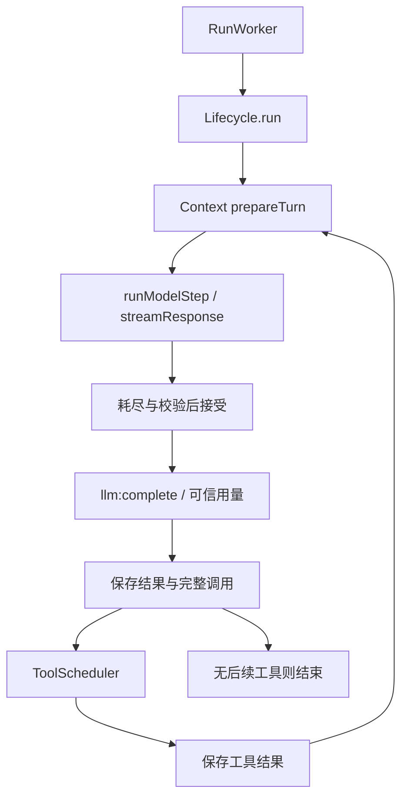

# Lifecycle 架构

当前实现由 `lifecycle.ts` 的 `Lifecycle.run` 管理多步循环，私有 `runModelStep` 消费一次模型请求。旧文档中的独立 TurnProcessor/processor.ts 已不存在；本文件按当前源码描述。

## 职责与依赖

| 组件                      | 职责                                               |
| ------------------------- | -------------------------------------------------- |
| RunWorker / RunManager    | 运行调度、取消、持久运行状态与事件分发             |
| Lifecycle                 | 每步准备、接受模型结果、保存、工具执行和下一步判断 |
| ContextManager            | 冻结并计量实际请求；沿用压缩与 overflow 恢复政策   |
| LLMClient / adapter / SDK | 协议转换、流累积、最终解析校验与既有重试           |
| MessageManager            | 原始消息和 Parts 持久化；原生模型步骤原子提交      |
| ToolScheduler             | 权限、调度与工具结果；普通业务错误回传模型         |

## 三个不同边界

1. **模型请求完成**：可靠 provider 终态、流耗尽、解析校验成功，只发布一次事件。
2. **结果保存成功**：原生步骤沿用 commitModelStep 原子事务；普通步骤保持既有保存路径。必要保存失败时工具零执行，运行失败，已接受 usage 保留。
3. **运行结束**：由 LifecycleResult 和取消信号决定 succeeded/failed/cancelled，不能以收到 llm:complete 推断成功。

length/filter 有可靠请求终态，但运行失败，不执行该输出中的工具、不自动续写。工具找不到文件等业务错误属于结果，模型可以接收后继续；协议解析、调度或存储错误不是普通工具业务失败。

## 状态与恢复约束

- 请求准备、校准和用量都配对同一步的 PreparedTurn。
- 接受前取消不形成可信 Step；接受后取消不抹掉已完成步骤和工具事实。
- overflow 由当前循环局部处理，最多一次 force prepare 后恢复；不把旧候选带入新请求。
- 切模型通过现有 connectModelInternal，禁止运行中切换，重建 runtime；不改变 session cache 累计账本。
- 不提前执行流中的工具，不新增自动续写、写工具崩溃重放或另一套历史存储。

## 文件与验证

`lifecycle.ts` 为循环和步骤实现；`types.ts` 定义事件/结果；`token-usage.ts` 管理完整/部分汇总。对外入口通过 `index.ts` 导出。测试覆盖完成竞态、过滤/截断、接受前后取消、持久化失败和工具继续；跨协议与实网限制见 improve-7/05。
