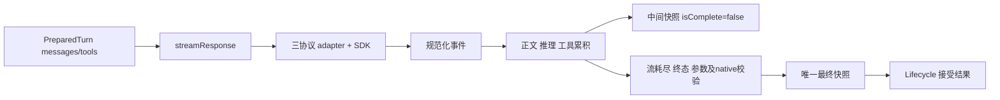

# llm-client 数据流与接口

## 数据流

共享层只处理自有消息和规范化事件；Chat 的 function/tool_calls 形状留在 Chat 适配器。三协议原生特殊数据保存在 modelState，不拼进普通正文。

## streamResponse

输入为 `LLMClientInstance`、`ModelMessage[]`，以及 signal、tools、purpose、sessionId、contextScopeId、reasoning、maxTokens 等请求选项。返回异步 `StreamingResponse` 序列。每次请求使用已准备的快照；请求级 maxTokens 不修改共享配置。

处理顺序：

1. adapter 调用 SDK，转换为规范化流事件。
2. 累积正文、推理、按 index 组织工具片段和最新 usage；展示增量不代表完成。
3. 正常耗尽后确认 provider 终态，再解析调用、校验 native 投影。
4. 发布唯一最终快照；Lifecycle 等生成器结束后发布模型完成。

晚到的网络/协议错误会使终态候选失效。EOF 没有 provider 终态时抛出中断，不假造 stop；provider abort 没有本地取消信号时也按失败处理。

## 取消、重试与统计

本地取消返回已有真实片段和 user_aborted，不能合成 `(Interrupted)` 当正文。消费者不能仅凭 isComplete 判断请求成功或执行工具。

SDK 重试保留，项目只在没有有效输出且错误属于既有名单时有限重试。llm:retrying 只报告外层尝试；SDK 内部次数需在测试 fetch 边界观测。SDK 退避的即时取消限制见 improve-7 验收记录。

Context overflow 保留由 Lifecycle 管理的一次强制压缩后重试；旧尝试的完成、usage/native 候选不进入恢复请求。摘要使用相同 streamResponse，但只接受正常耗尽、stop 且非空的正文。

## 主要文件

- `core/llm-client/streaming.ts`：流累积、最终校验、尝试边界。
- `core/llm-client/types.ts`：自有请求、快照与响应类型。
- `core/llm-client/retry.ts`：既有项目重试政策及中断来源。
- `services/interface-providers/`：三协议 wire 转换。
- `core/lifecycle/lifecycle.ts`：步骤接受、保存及工具执行。
