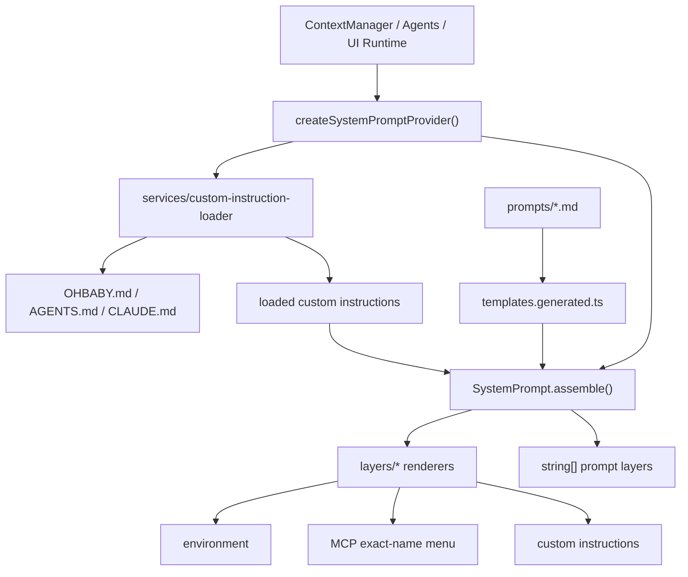

# system-prompt 模块 architecture.md

本文档描述 `system-prompt` 模块的内部结构与边界。

---

## 一、架构概览

`system-prompt` 采用分层组装架构。静态模板保存在 `.md` 文件中，运行时上下文由 layer renderer 注入，最终由 `SystemPrompt.assemble()` 组合为有序 `string[]`。



---

## 二、目录结构

```text
packages/ohbaby-agent/src/core/system-prompt/
  assembler.ts
  index.ts
  types.ts
  layers/
    base.ts
    custom.ts
    environment.ts
    index.ts
    mcp-tools.ts
  services/
    custom-instruction-loader.ts
  prompts/
    templates.generated.ts
    primary/
      base.md
      base.ts
      subagent-roles.md
      subagent-roles.ts
      tasks/
        agent.md
        plan.md
      tasks.ts
    subagents/
      base.md
      base.ts
      tasks/
        explore.md
        generic.md
        research.md
      tasks.ts
    agents/
      generic.ts
      index.ts
  security/
    index.ts
```

### 2.1 prompts

`prompts/` 存储静态模板。`.md` 是内容源，`templates.generated.ts` 是由脚本生成的 TS 快照，`.ts` wrapper 只负责导出稳定常量或 lookup 函数。

### 2.2 layers

`layers/` 只放运行时层 renderer：

- `base.ts`: 返回 primary base prompt（`generateBasePrompt`）。
- `environment.ts`: 渲染 cwd、platform、date、git 状态和可用工具名。
- `mcp-tools.ts`: 只渲染未加载 MCP 工具的精确本地名和固定使用说明；不接收 description 或 schema。
- `custom.ts`: 渲染 custom instructions，不做路径解析、文件 I/O 或安全扫描。

### 2.3 services

`services/` 放跨层运行时能力：

- `custom-instruction-loader.ts`: 读取项目/全局 custom instruction 文件，处理 fallback、截断、安全扫描和 warning/finding 上报。

### 2.4 assembler

`assembler.ts` 是组装入口。它负责：

- 校验 `agentName` 与 `isSubagent`。
- 解析 primary/subagent task kind。
- 包装 `agentPromptAddon` 为 `<agent_prompt_addon>`。
- 用运行时 role 列表替换 `subagent-roles.md` 中的 `{{ROLES}}` 占位符（函数式替换，避免 `$` 序列被解释）。
- 渲染当前 session/context scope 的未加载 MCP 工具公告。
- 按固定层顺序返回 `string[]`。

---

## 三、层顺序

primary prompt：

```text
base -> primary task -> agent addon -> subagent roles -> mcp tools -> environment -> custom
```

subagent prompt：

```text
subagent base -> subagent task -> agent addon -> mcp tools -> minimal environment
```

MCP tools 层是条件层。只有存在已准入且尚未在当前 session/context scope 加载的 MCP 工具时才会出现。它只含精确本地名和固定说明；动态工具的 description/schema 仅在 `select_tools` 成功后通过原生 tools schema 发送。subagent roles 层也是条件层，只有存在可用 role 时才出现。

---

## 四、设计模式

### Facade

`SystemPrompt` 是模块 facade，暴露 `assemble()`、`getAgentPrompt()`、`getSubagentBase()`、`getEnvironment()`、`getPrimaryBase()`、`loadCustomInstructions()`。

### Adapter

`createSystemPromptProvider()` 将 context manager 的 `SystemPromptProviderInput` 适配为 `AssembleOptions`。

### Layered Composition

每一层独立生成文本，assembler 只负责排序、过滤空层和拼装。

---

## 五、边界关系

| 模块 | 关系 | 边界 |
| --- | --- | --- |
| agents | 调用/提供 addon | agent runtime prompt 只能作为 addon，不替换默认 identity/task |
| context | 消费 provider | memory 与消息历史由 context 负责 |
| ui-runtime | 提供 task/tool/environment resolver | permission mode 与工具注册不属于 system-prompt |
| mcp integration | 对外部 MCP metadata 做准入并维护 loaded 集 | 失败、不可解析或不安全 metadata 不得进入公告或工具 schema |
| tool-scheduler | 提供工具名/工具描述 | system-prompt 不执行工具、不审批权限 |
| config/llm | 无直接依赖 | model/provider 选择不属于本模块 |

---

## 六、构建约束

- `scripts/generate-system-prompt-assets.mjs` 从 `.md` 生成 `prompts/templates.generated.ts`。
- `pnpm --filter ohbaby-agent prompt:check` 会校验 `.md` 与生成快照同步。
- `ohbaby-agent` 的 `build` 会先运行 `prompt:check`。
- 源码运行、Vitest、tsc 和 tsup 都只消费 TS 快照，不需要自定义 `.md` loader。
- 运行时 bundle 中已经包含模板文本，不读取源码目录下的 `.md` 文件。
