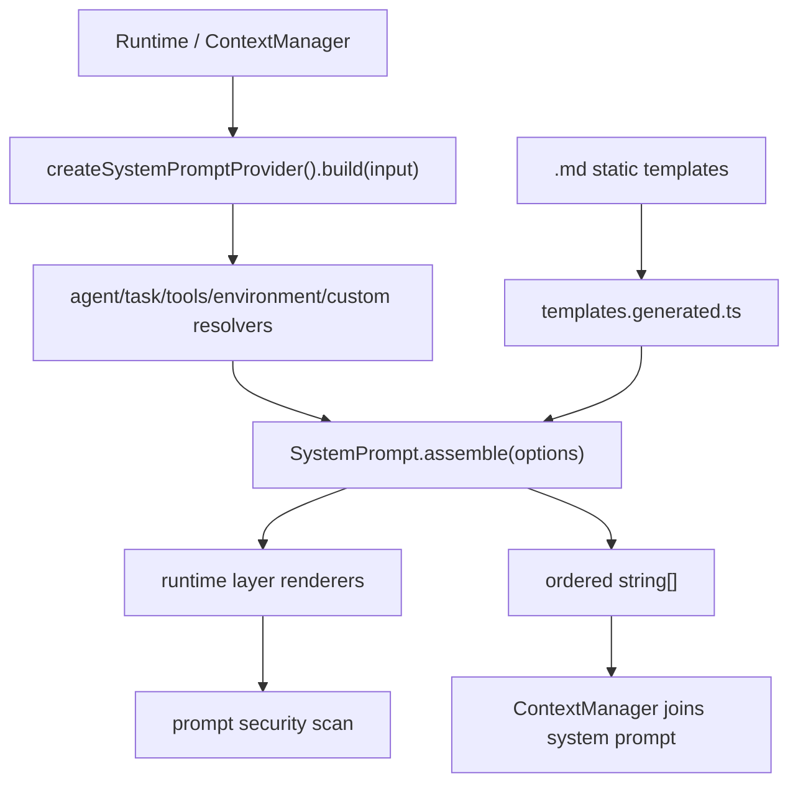

# system-prompt 模块 dfd-interface.md

本文档描述 `system-prompt` 模块的数据流与接口。

---

## 一、数据流概览



---

## 二、主要接口

### 2.1 SystemPrompt.assemble()

```ts
SystemPrompt.assemble(options: AssembleOptions): string[]
```

输入：

- `agentName`: 当前 agent 名称，不能为空。
- `isSubagent`: primary/subagent 边界，必须显式传入。
- `environment`: 当前运行环境。
- `taskKind`: 可选任务类型。
- `agentPromptAddon`: 可选代理附加提示。
- `tools`: 可用工具名。
- `toolSnippets`: 工具描述片段。
- `customInstructions`: custom instructions，仅 primary 使用。

输出：

- 有序、非空的 prompt layer 数组。

### 2.2 createSystemPromptProvider()

```ts
createSystemPromptProvider(options?: SystemPromptProviderOptions): SystemPromptProvider
```

数据流：

1. 解析 agent name。
2. 并发获取 environment、tools、taskKind、toolDetails。
3. 获取 agent prompt addon。
4. primary 分支加载 custom instructions。
5. 调用 `SystemPrompt.assemble()`。
6. 使用空行 join 为最终 system prompt 字符串。

### 2.3 loadCustomInstructions()

```ts
SystemPrompt.loadCustomInstructions(options): Promise<readonly string[]>
```

职责：

- 读取项目与全局 custom instruction 文件。
- 支持 `OHBABY.md`、`AGENTS.md`、`CLAUDE.md` fallback。
- 截断超长内容。
- 扫描 prompt-like 内容并上报 finding。

实现位于 `services/custom-instruction-loader.ts`。`layers/custom.ts` 只负责把已加载内容渲染为 `<custom_instructions>` prompt 片段。

---

## 三、primary 组装流

```text
input
  -> resolve primary task kind (default: agent)
  -> render identity from prompts/primary/base.md
  -> render primary task from prompts/primary/tasks/*.md
  -> wrap agent addon
  -> render tool guidance when snippets/guidelines exist
  -> render full environment
  -> render custom instructions
  -> compact empty layers
```

---

## 四、subagent 组装流

```text
input
  -> resolve subagent task kind (taskKind > agentName > generic)
  -> render subagent base from prompts/subagents/base.md
  -> render subagent task from prompts/subagents/tasks/*.md
  -> wrap agent addon
  -> render tool guidance when snippets/guidelines exist
  -> render minimal environment
  -> compact empty layers
```

subagent 不加载 primary custom instructions。

---

## 五、安全流

tool snippets 与 custom instructions 都可能来自外部配置或文件：

- `toolSnippets` 在 assembler 中通过 `scanPromptLikeContent()` 过滤。
- custom instructions 在 loader 中扫描、截断并上报 warning/finding。
- 可疑内容不会被直接注入为未标记的系统指令。

---

## 六、外部边界

| 输入来源 | 进入点 | 说明 |
| --- | --- | --- |
| agents | `agentNameResolver`, `agentPromptResolver` | 提供 agent 名称和 addon |
| ui-runtime | `taskKindResolver`, `toolsProvider`, `toolDetailsProvider` | 提供 mode/tool 上下文 |
| filesystem | `loadCustomInstructions()` | 读取 custom instruction 文件 |
| environment | `detectEnvironment()` | 读取 cwd、platform、date、git 状态 |

| 输出去向 | 输出 | 说明 |
| --- | --- | --- |
| context manager | joined system prompt | 作为模型请求 system message |
| tests/debug | `string[]` layer array | 便于断言层顺序 |
