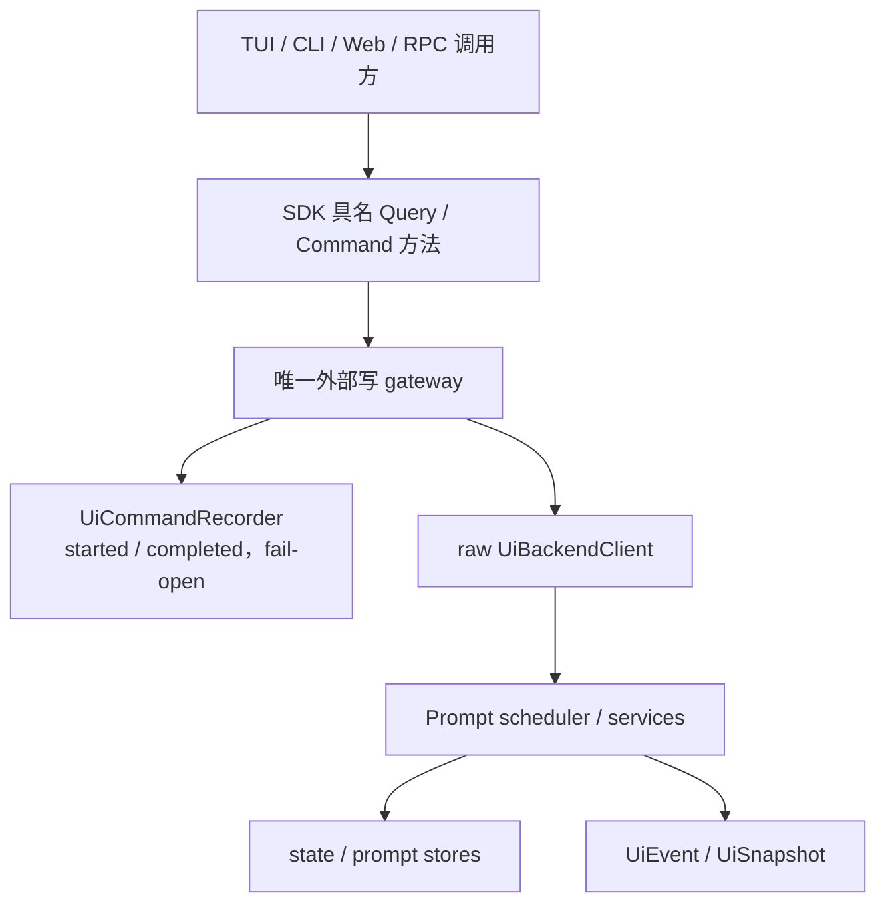

# 2. 优化方案与改动面

> 本文是 improve-1 后续实施会话的执行契约。本规划会话不据此修改应用代码。

## 2.1 方案总览



核心原则：

1. Prompt 的接单与完成是两个基础时间点；便利方法只做组合。
2. Query/Command 是能力边界，不是引入 CQRS 框架。
3. 每个领域 ID 保持原义；新增 `operationId` 只标识一次后端原子写。
4. 记录在外部写入口拥有唯一所有权，raw backend 不自记。
5. 命令记录是观测事实，不是新执行协议，也不是业务事件。

## 2.2 设计决策表

| 决策 | 选择 | 理由 | 放弃的选项 | 代价 |
|------|------|------|--------------|------|
| Prompt API | accepted / wait / andWait 三种能力 | 时间点清晰，满足 Web 与 CLI 不同场景 | 继续含糊 `submitPrompt`；只改返回类型 | 全仓需要分阶段迁移 |
| Completion | 终态 discriminated union | 类型即合同，失败不靠普通异常传递 | 继续复用宽泛 submission | 类型和 mapper 需要同步修改 |
| 业务失败 | 四种终态 resolve | 保留结构化错误和取消语义 | failed/interrupted reject | CLI 需显式映射退出码 |
| 接口拆分 | Query + Command，Prompt/Queue 子能力 | 让只读依赖和记录边界真实可用 | REST CRUD；单一胖接口 | 增加少量类型名 |
| 队列能力 | 生产 backend 必选 | 当前生产实现均支持，消除粗粒度 fallback | 长期 Partial / feature detect | 旧测试桩必须升级 |
| ID | 新增 operationId，保留领域 ID | 各层身份不可互换 | 全部统一 clientRequestId | 记录中需要 correlation 对象 |
| 记录类型 | `UiCommandRecord` | 明确是记录而非运输信封 | `UiCommandEnvelope` | 需定义 phase/outcome 语义 |
| 记录策略 | append started/completed，fail-open | 能看未完成操作，不阻断产品 | 单条完成日志；fail-closed | 可能丢记录，需诊断指标 |
| 记录所有权 | Server gateway 或 Agent host gateway | 从结构上防重复 | backend 自记；每层都记 | gateway 必须完整覆盖所有写方法 |
| details | 方法级白名单与脱敏 | 默认安全 | 通用 raw params | 新命令需显式添加 detail builder |
| `submitPromptAndWait` 记录 | 只记录内部 accepted 原子写 | 避免组合与原子动作双记 | 两层各记 | 便利方法实现必须复用同一 primitive |

## 2.3 目标 SDK 数据模型

### 2.3.1 Prompt completion

目标语义（具体声明可按项目格式调整）：

```ts
export type UiPromptTerminalStatus =
  | "succeeded"
  | "failed"
  | "cancelled"
  | "interrupted";

type UiCompletedPromptBase = Omit<
  UiPromptSubmission,
  "status" | "endedAt" | "error"
> & {
  readonly endedAt: string;
};

export type UiCompletedPromptSubmission =
  | (UiCompletedPromptBase & {
      readonly status: "succeeded";
      readonly error?: never;
    })
  | (UiCompletedPromptBase & {
      readonly status: "failed";
      readonly error: UiPromptError;
    })
  | (UiCompletedPromptBase & {
      readonly status: "cancelled";
      readonly error?: never;
    })
  | (UiCompletedPromptBase & {
      readonly status: "interrupted";
      readonly error: UiPromptError;
    });

export interface UiPromptCompletion {
  readonly prompt: UiCompletedPromptSubmission;
}
```

若当前取消路径已有稳定的用户原因，可后续增加显式 `cancelReason`；本轮不把取消伪装成 `UiPromptError`。

### 2.3.2 Client 能力

```ts
export interface UiQueryClient {
  getSnapshot(): Promise<UiSnapshot>;
  getContextWindowUsage(input: ...): Promise<...>;
  getCurrentModel(): Promise<UiCurrentModelConfig | null>;
  probeModelContextWindow(input: ...): Promise<...>;
  listCommands(query: UiListCommandsQuery): Promise<UiSlashCommandCatalog>;
  subscribeEvents(handler: UiEventHandler): UiUnsubscribe;
  waitForPrompt(
    promptId: string,
    options?: UiWaitForPromptOptions,
  ): Promise<UiPromptCompletion>;
}

export interface UiPromptCommandClient {
  submitPromptAccepted(
    text: string,
    options?: SubmitPromptOptions,
  ): Promise<UiPromptReceipt>;
  submitPromptAndWait(
    text: string,
    options?: UiSubmitPromptAndWaitOptions,
  ): Promise<UiPromptCompletion>;
}

export interface UiPromptQueueCommandClient {
  editQueuedPrompt(input: UiEditQueuedPromptInput): Promise<UiPromptSubmission>;
  cancelQueuedPrompt(input: UiCancelQueuedPromptInput): Promise<UiPromptSubmission>;
  acquirePromptEditLease(input: UiAcquirePromptEditLeaseInput): Promise<UiPromptEditLease>;
  renewPromptEditLease(input: UiRenewPromptEditLeaseInput): Promise<UiPromptEditLease>;
  releasePromptEditLease(input: UiReleasePromptEditLeaseInput): Promise<UiPromptSubmission>;
}

export interface UiCommandClient
  extends UiPromptCommandClient,
    UiPromptQueueCommandClient {
  // compact/archive/connect/search/permission/command/interaction/abort...
}

export interface UiBackendClient
  extends UiQueryClient,
    UiCommandClient {}
```

`UiWaitForPromptOptions.signal?: AbortSignal` 只中止等待。`UiSubmitPromptAndWaitOptions` 在 `SubmitPromptOptions` 基础上增加同一 `signal`，helper 必须把提交字段和等待字段分别投影。若 wire transport 无法直接序列化 `AbortSignal`，remote client 在本地竞速/终止请求；不得把 signal 放入 JSON payload。

`submitPromptAndWait` 的唯一语义实现：

```ts
const { signal, ...submitOptions } = options ?? {};
const receipt = await submitPromptAccepted(text, submitOptions);
return waitForPrompt(receipt.promptId, { signal });
```

可由 SDK 提供共享 helper；每个 client 的具名方法只委托该 helper，禁止复制执行逻辑。

队列租约的 `ownerClientId` 是信任上下文，不应由业务调用方在 command input 自报。目标将公开的 acquire/renew input 收紧为 promptId/editLeaseId；每个外部 gateway 从自身可信上下文注入 client identity：本地 Agent host 使用创建 client 时的稳定 identity，REST/RPC 使用已认证且已注册的 request clientId。raw backend 若需要 owner 参数，使用不导出的窄 `UiPromptQueueExecutionPort`（名称可调）承接 `{ command, trustedOwnerClientId }`，而不是再定义第二份完整 client。现有带 `ownerClientId` 的公开 input 在本轮随新接口迁移，不进入最终 SDK surface。

## 2.4 目标命令记录合同

### 2.4.1 原子命令集合

`UiCommandMethod` 只包含直接改变后端状态的 primitive gateway 方法：

- `submitPromptAccepted`；
- queue edit/cancel/lease acquire/renew/release；
- `compactSession`、`archiveSession`；
- `connectModel`、`setSearchApiKey`、`setPermission`；
- `executeCommand`、`respondPermission`、`respondInteraction`；
- `abortRun`。

不包含 query、transport connect/close、workspace picker，也不包含组合方法 `submitPromptAndWait`。

这里“原子”指**一个 operationId 对应一次不可再拆分记录的外部 gateway 调用单元**，不是数据库事务，也不承诺该方法内部只写一张表。`executeCommand` 在 SDK 边界是 primitive command，因此整体记一次；它内部触发的 session/prompt workflow 不再作为第二个外部写意图重复记录，并通过 `clientInvocationId`、`commandRunId`、`promptId` 等事件/记录 correlation 追踪。`submitPromptAndWait` 则明确是两个公开 primitives 的便利组合，所以不属于该集合。

本合同覆盖 `UiBackendClient` 的上述 gateway 写。Server 控制面的 `openWorkspace`、`hideWorkspace`、目录选择等不属于 SDK backend 方法，本议题不把它们硬塞入 `UiCommandMethod`；若未来需要控制面审计，应使用独立的 Server 运维/访问日志议题。Web 的新建/选择会话当前通过 `executeCommand` 落到 backend，因此记录为该 `executeCommand`，不再额外记一条 façade 方法。

### 2.4.2 Record

```ts
export type UiCommandEntryPoint =
  | "agent-host"
  | "server-rest"
  | "server-rpc";

export interface UiCommandCorrelation {
  readonly transportRequestId?: string;
  readonly clientId?: string;
  readonly clientRequestId?: string;
  readonly clientInvocationId?: string;
  readonly sessionId?: string;
  readonly promptId?: string;
  readonly runId?: string;
  readonly commandRunId?: string;
  readonly permissionRequestId?: string;
  readonly interactionId?: string;
}

export type UiCommandRecord =
  | {
      readonly operationId: string;
      readonly method: UiCommandMethod;
      readonly phase: "started";
      readonly occurredAt: string;
      readonly entryPoint: UiCommandEntryPoint;
      readonly correlation: UiCommandCorrelation;
      readonly details?: UiCommandDetails;
    }
  | {
      readonly operationId: string;
      readonly method: UiCommandMethod;
      readonly phase: "completed";
      readonly occurredAt: string;
      readonly entryPoint: UiCommandEntryPoint;
      readonly correlation: UiCommandCorrelation;
      readonly outcome:
        | { readonly kind: "returned" }
        | { readonly kind: "threw"; readonly error: UiCommandErrorSummary };
      readonly details?: UiCommandDetails;
    };
```

`UiCommandDetails` 必须由 SDK 的方法级白名单 builder 产生。默认是无 details，而不是把 params spread 进去。错误摘要不得包含 stack、响应正文或 secret；code/name 可以记录，message 需经过安全归一化。

### 2.4.3 Recorder 与 best-effort helper

```ts
export interface UiCommandRecorder {
  record(entry: UiCommandRecord): void;
}
```

`record()` 表示 recorder **同步接收**一条记录，不表示已经持久化。真实 recorder 若异步落盘/发送，必须在自身内部使用有界、保持接收顺序的 sink；队列满或无法接收时同步失败，由 helper 吞掉并报告诊断。业务路径不 await recorder，因此慢或永不完成的下游 I/O 不能阻塞命令。started/completed 的保证是按调用顺序交给同一 recorder；fail-open 明确不承诺零丢失的合规审计。

SDK helper 负责：

1. 生成一次 `operationId`；
2. best-effort 写 started；
3. 执行原子写；
4. returned 或 threw 后写 completed；
5. recorder、details builder、clock/ID provider 或诊断回调自身异常都被 observation boundary 隔离；诊断回调最多调用一次且其异常继续吞掉；
6. 永不因 recorder 改变业务返回/异常。

不提供默认无界缓冲、不自动无限重试、不让 recorder 记录自身诊断以免递归。no-op recorder 只允许测试或显式关闭记录的模式；正常 Agent/Server composition root 必须注入真实、有界 recorder。

## 2.5 分阶段实施

### Phase 1：收紧 Prompt 终态模型

**目标**：先让类型表达真实完成语义。

修改：

- `packages/ohbaby-sdk/src/prompt.ts`
- `packages/ohbaby-sdk/src/index.ts`
- 新增/扩充 SDK prompt contract tests

动作：

1. 新增 terminal status 和 completed submission union。
2. 让 `UiPromptCompletion.prompt` 使用完成子类型。
3. 提供从宽泛 submission 到 completion 的运行时断言/mapper；遇到非终态、缺失 endedAt、终态字段矛盾时明确失败。

DoD：类型测试无法构造非终态 completion；四种合法终态可序列化并通过 contract tests。

### Phase 2：对齐 scheduler、adapter 与 Client 能力

**目标**：运行时不再靠普通异常传递业务终态。

修改：

- `packages/ohbaby-sdk/src/client.ts`
- `packages/ohbaby-sdk/src/rpc/types.ts`
- `packages/ohbaby-sdk/src/rpc/proxy.ts`
- `packages/ohbaby-agent/src/runtime/prompt-scheduler/{types,scheduler,in-memory-store,database-store}.ts`
- `packages/ohbaby-agent/src/adapters/ui-inprocess.ts`
- `packages/ohbaby-agent/src/adapters/ui-persistent.ts`
- `packages/ohbaby-server/src/protocols/jsonrpc/{protocol,client,rpc-route}.ts`
- `packages/ohbaby-server/src/coordination/prompt-backend.ts`

动作：

1. 建立 Query/Command/Prompt/Queue 类型关系，队列管理进入完整 backend 必选面。
2. 新增公开 `submitPromptAndWait`；保留旧 `submitPrompt` 兼容委托并标记 deprecated。
3. 让 `waitForPrompt` 返回严格 completion，业务终态全部 resolve。
4. 保留 RunCompletion 的 failed/cancelled/interrupted 映射，禁止一律 catch 成 failed。
5. 分开 executor 业务结果与 `store.finish()` 技术失败的错误边界：终态持久化失败不得再伪造业务 failed；应 reject 该 prompt 的当前 waiter，并进入有界技术诊断/恢复路径。
6. 终态持久化失败后 scheduler 进入 faulted/closed 状态，拒绝全部当前 waiter，后续 wait/accept 立即以存储技术错误 reject，停止 drain；由 host/daemon restart 走现有 recoverInterrupted 恢复，避免同进程中留下永远 running 的孤儿记录。
7. scheduler close 主动 reject 当前等待者，close 后新 wait 立即 reject；支持 signal 清理单个 waiter。
8. 收紧内部 `PromptExecutionResult` / `FinishPromptSubmissionInput` union，使 failed/interrupted 的 error 要求与 SDK 一致，避免 adapter 重新制造非法终态。
9. 调度器重启恢复后，同一 promptId 再 wait 能得到 interrupted completion。
10. 将 `CoreAPI` / `SDKAPI` 改为从权威能力 `Pick/Omit` 派生，不再手抄签名；名称作为 fake-RPC 正向调用面/反向 callback seam 暂留，improve-2 只有在明确替代 seam 后才决定是否删名。
11. fake-RPC 对 `waitForPrompt(id, { signal })` 和 `submitPromptAndWait(..., { signal })` 做 method-aware signal 提取：signal 不参与 JSON clone，通过 out-of-band cancellation 使调用方和 backend waiter 同时清理。不得使用任意深度递归寻找 signal，以免把普通业务对象误判为控制信号。

DoD：in-process、persistent、remote driver 的 Prompt contract 一致；不存在 `Partial<UiPromptQueueClient>` 新用法。

### Phase 3：建立安全的命令记录合同

**目标**：先有可测试的数据结构与 fail-open 执行器，再接生产入口。

新增/修改：

- 建议新增 `packages/ohbaby-sdk/src/command-record.ts`
- `packages/ohbaby-sdk/src/index.ts`
- SDK unit/contract tests

动作：

1. 定义 method、record、correlation、entryPoint、outcome、recorder。
2. 定义每个 method 的安全 details builder；敏感参数永不出现在返回对象。
3. 实现 `executeRecordedUiCommand`（名称可调整但语义固定）。
4. 支持注入 `createOperationId`、clock 和诊断回调，保证测试确定性。

DoD：returned/threw、recorder 接收失败、下游慢/不完成、details/clock/diagnostic 异常与顺序均通过测试；业务结果完全不变。

### Phase 4：接入唯一记录 gateway

**目标**：三种外部入口各记录一次，raw backend 不记录。

修改：

- `packages/ohbaby-agent/src/host/core-api-factory.ts`
- 可新增 `packages/ohbaby-agent/src/host/ui-command-gateway.ts`
- `packages/ohbaby-server/src/app/create-app.ts`
- `packages/ohbaby-server/src/protocols/jsonrpc/rpc-route.ts`
- 可新增 Server 共用 `ui-command-gateway.ts`
- composition root 注入 recorder 的相关 options/types

动作：

1. Agent host 对直接 in-process 原子写使用 `entryPoint=agent-host`。
2. REST route 使用 `server-rest`，RPC route 使用 `server-rpc` 并关联 request.id。
3. Web `submitPromptAccepted` 的 command `completed` phase 根据 receipt 补充 promptId/sessionId/clientRequestId correlation。
4. raw in-process/persistent backend、scheduler、Browser client 禁止自记。
5. `submitPromptAndWait` 在 gateway 只记录 accepted primitive，wait 不记录。
5a. **内部再写不得穿过已包装的 gateway。** `executeCommand` → `commands/service.ts` 的 skill 路径会调用注入的 `submitPrompt`，当前注入实现是同一 in-process client 上的 `submitPromptAndWait`（再进 `submitPromptAcceptedInternal`）。gateway 只能包对外入口；skill/commandService 必须注入 **raw backend** 的接单函数。否则一次用户 `executeCommand` 会再记一条 `submitPromptAccepted`（04 T35 必须覆盖这条真实路径，不能只用 mock）。
6. 在 Server 共享 coordination 层建立 `interactionId → clientId` ownership 与带 claim token 的状态机：`owned → claimed → consumed`。由 `interaction.requested` 的 clientInvocationId/commandRunId 建 owner；RPC `respondInteraction` 必须原子 claim 后才记录/调用 backend，未知/越权/重复响应不执行 backend、不写 started。
7. claim 规则固定为：输入验证失败或 backend 明确报告“尚未消费、interaction 仍 pending”时，使用原 claim token 条件回滚到 owned；只有 token 仍匹配且没有 resolved/abort/timeout 获胜才能回滚。backend 已接受响应、已发布 resolved，或失败的消费状态未知时不得盲目释放 claim，应保持 consumed/terminal 并诊断，避免第二次回答。resolved/abort/timeout/client 真正移除/Server shutdown 清理 owner/claim；短暂 transport 重连不清理仍注册 client 的 owner。
8. 生产正常模式使用真实、有界的结构化日志 sink；若仓库无现成 logger，增加最小有界 recorder 适配器，不在本轮新建数据库。no-op 仅用于测试或显式关闭记录模式。

DoD：每种入口的一次写严格产生同 operationId 的两条记录；真实 backend 链路没有第三条。

### Phase 5：兼容收口与权威文档同步

**目标**：为 improve-2 提供明确迁移面，不提前删除调用方。

修改：

- `docs/ohbaby-sdk/{goals-duty,architecture,data-model,dfd-interface,test}.md`
- `docs/ohbaby-server/test.md` 等直接冲突文档
- 相关 export 和 deprecation 注释

动作：

1. 文档明确“状态真相走事件；Prompt 终态可结构化等待；部分命令有直接业务结果”。
2. 列出旧 `submitPrompt`、旧 RPC method、`supportsPromptQueue`、手抄 client 的 improve-2 删除清单。
3. 不在 improve-1 删除尚有调用方的符号。

DoD：权威文档不再声称所有写方法只返回 void；improve-2 能仅凭删除清单开展迁移。

## 2.6 按包/目录的改动面

| 包/目录 | 新增 | 修改 | 本轮删除 |
|---------|------|------|----------|
| `packages/ohbaby-sdk/src/` | completion 子类型、command record/recorder/helper | client、prompt、rpc 派生类型、exports | 不删除旧 submit 符号 |
| `packages/ohbaby-agent/src/runtime/prompt-scheduler/` | 可选 waiter abort/closed error | 状态映射、close 清理 | 无 |
| `packages/ohbaby-agent/src/adapters/` | 共享 andWait helper 接入 | 新接口、终态投影 | 无 |
| `packages/ohbaby-agent/src/host/` | command gateway | recorder 注入、CoreAPI 派生 | 无 |
| `packages/ohbaby-server/src/coordination/` | 可拆基本/队列 capability helper | fallback 迁移 | improve-2 再删旧 helper |
| `packages/ohbaby-server/src/protocols/jsonrpc/` | 新方法/记录接入 | method/client/route | 旧 method 暂留 |
| `packages/ohbaby-server/src/app/` | REST command gateway | 写 route 接入 | 无 |
| `docs/ohbaby-sdk/` | 无新模块文档 | 语义同步 | 无 |

## 2.7 API、协议与兼容策略

1. improve-1 是 additive + deprecated 迁移：新 API 可用，旧 `submitPrompt` 暂时复用同一 accepted + wait primitives，再把 completion 映射回旧的 `Promise<void>` 行为。
2. 为避免在迁移轮次静默改变现有 CLI/TUI，兼容方法保持旧的 failed/interrupted reject 行为；新 `submitPromptAndWait` 才执行“四种终态都 resolve”的新合同。两者共享基础执行逻辑，差异只在最外层兼容映射；improve-2 删除旧方法后结束差异。
3. 新 JSON-RPC method 增加 `submitPromptAndWait`（若 remote client 需要具名 method）或由 remote client 两次 RPC 组合。推荐后者：协议只暴露 accepted + wait 两个 primitive；旧 `submitPrompt` method 暂留兼容。
4. `AbortSignal` 不进入 wire DTO。
5. `UiCommandRecord` 是 SDK 数据合同，但不是 Web/JSON-RPC request body；不得改变现有运输协议来承载它。
6. SDK 处于 0.x 仍不等于可静默破坏语义；删除统一放 improve-2 并在 changelog 标明 breaking change。

## 2.8 风险与回滚

| 风险 | 防御 | 回滚点 |
|------|------|--------|
| completion 类型收紧暴露历史脏数据 | mapper 在边界验证；数据库恢复测试 | 回滚 SDK 类型+mapper commit |
| scheduler close 与完成同时发生竞态 | waiter 集合原子清理、幂等 remove、竞态单测 | 回滚 waiter cancellation slice |
| fail-open 吞掉 recorder 大面积故障 | 有界诊断回调与测试指标，不递归记录 | 将生产 recorder 切 no-op，不回滚业务合同 |
| Server/Agent 双记 | 所有权矩阵 + 真实链路计数断言 | 关闭下游 recorder 注入 |
| details 泄密 | typed whitelist builder + adversarial tests | details 全部降为 undefined |
| `CoreAPI` 派生破坏测试 fake | typecheck 提前暴露，分 commit 迁移 | 保留表达 RPC 正/反向 seam 的 derived alias |
| old/new Prompt 语义混用 | deprecation、方法名显式、测试分类 | 保留旧路径直到 improve-2 |

不可逆性说明：SDK 公开类型和方法语义属于昂贵对外合同。本轮通过 additive 迁移、明确 deprecated 和下一轮统一删除控制风险；审计存储技术保持可逆，不引入数据库 schema。

## 2.9 与 00 边界对齐

- 保留具名方法，不引入 `submit(op)`。
- Query/Command 只做能力和记录边界，不引入 CQRS 基础设施。
- 保留领域 ID，operationId 不进入全部事件。
- recorder fail-open、details 默认安全、记录点唯一。
- Completion 不携带完整消息内容。
- TUI/CLI/Web 采用和最终删除留 improve-2。

## 2.10 不在本轮

1. Web runtime / client / store 结构改造。
2. SSE 单一逻辑订阅与统一 dispatch。
3. TUI event alias 清理。
4. 所有 UI 调用点改名。
5. 删除旧 `submitPrompt`、旧 RPC method 和兼容 branch。
6. 审计持久化、检索、回放和合规保证。
7. 为 Query 请求建立同规格审计；访问日志属于另一问题。
