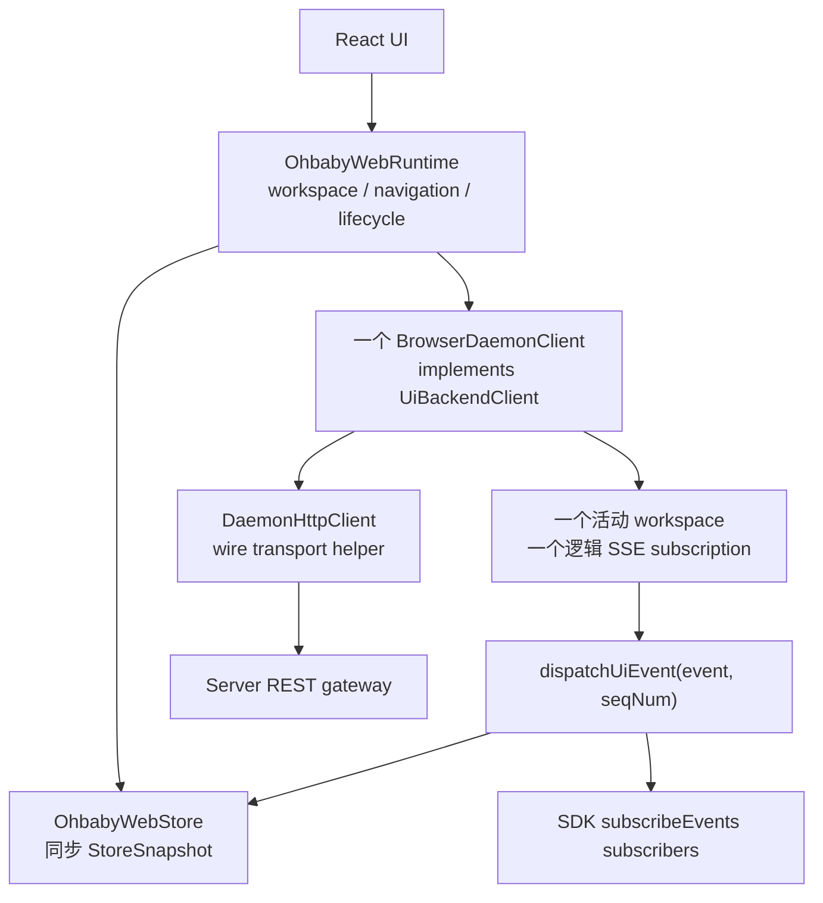

# 2. 优化方案与改动面

> 本文是 improve-2 后续实施会话的执行契约。开始前必须先保留 improve-1 的通过证据；本规划会话不修改应用代码。

## 2.1 目标结构



CLI/TUI 不经过这套浏览器 runtime：它们直接使用同一 SDK 能力，由 Agent host 适配本地 backend。共享的是合同，不是强制共享网络拓扑。

## 2.2 不变量

1. `UiBackendClient` 是业务能力的唯一权威类型。
2. 一个活动 workspace 同时只有一个 `BrowserDaemonClient` 和一个逻辑 SSE 订阅。
3. `DaemonHttpClient` 不保存业务状态，不暴露成 UI client。
4. SDK `getSnapshot` 始终异步返回 `UiSnapshot`；同步 `StoreSnapshot` 只从 `runtime.store` 读取。
5. transport 控制消息不进入 `UiEvent`；业务事件只解包、校验、分发一次。
6. `dispatchUiEvent` 先更新 store，再通知 subscriber；sequence 无效、重复或过期时二者都不接收。
7. snapshot 初装与 resync 使用同一个 `snapshot.replaced` 事件分发点。
8. Web façade 可以组合具名方法，但不能形成第二份平行业务合同。
9. `submitPromptAndWait` 仍只组合 accepted + wait；Server 不建设第三条执行路径。
10. 记录所有权在外部 gateway，Browser client 与 raw backend 不记录。

## 2.3 Web 目标接口

### 2.3.1 SDK client 与 runtime façade

```ts
export interface OhbabyWebRuntime {
  readonly client: UiBackendClient | null;
  readonly ready: Promise<void>;
  readonly store: OhbabyWebStore;

  getWorkspaceSnapshot(): WorkspaceSnapshot;
  subscribeWorkspaces(listener: () => void): UiUnsubscribe;
  refreshWorkspaces(): Promise<void>;
  openWorkspace(directory: string): Promise<void>;
  switchWorkspace(directory: string): Promise<void>;
  hideWorkspace(directory: string): Promise<void>;
  getDirectoryPickerRoots(): Promise<DirectoryPickerRootsResponse>;
  listDirectoryPicker(directory: string): Promise<DirectoryPickerListResponse>;

  // 少量 Web 应用编排：不是第二套 backend API
  createSession(): Promise<void>;
  selectSession(sessionId: string): Promise<void>;
  abortSession(sessionId: string, runId?: string): Promise<void>;
  executeSlashCommand(input: WebSlashCommandInput): Promise<void>;
}
```

具体是否把最后四个动作放在 runtime 本体或同目录 helper，可以按 UI 调用便利性决定。硬约束是：`OhbabyWebClient` 的整套手写接口删除，`runtime.client` 的静态类型直接来自 SDK。

`client=null` 明确表示尚未选择 workspace 或最后一个 workspace 已被隐藏；UI 必须先走 workspace empty state，不能靠 getter 临时抛错伪装成类型上永远存在。`BrowserDaemonClient` 可以有 runtime 内部使用的 `connect()` / `close()` 生命周期方法，但非空时公开给 UI 的 `client` 视图只承诺 `UiBackendClient`。不为两个额外生命周期方法再导出一份逐方法接口。

### 2.3.2 方法映射

| SDK 方法 | Web transport/adaptation |
|----------|--------------------------|
| `getSnapshot()` | GET snapshot，丢弃 wire `ok/seqNum` 后返回 `UiSnapshot`；seqNum 仅供连接同步内部使用 |
| `subscribeEvents(handler)` | 注册 BrowserDaemonClient 本地 subscriber，不新建 SSE |
| `submitPromptAccepted(text, options)` | POST prompts，返回 `UiPromptReceipt` |
| `waitForPrompt(promptId, { signal })` | 新增长等待 GET/POST；signal 终止 fetch，不取消 prompt |
| `submitPromptAndWait(text, options)` | SDK helper 组合前两项，不新增专用 route |
| queue edit/cancel/lease | 公开输入不含 owner；Browser client/Server 用已注册 client identity，映射 REST path/body 后返回 SDK prompt/lease |
| `respondInteraction` | 新增 Web REST route 与 HTTP helper |
| `abortRun(runId)` | 具名 run command；`abortSession` façade 负责先解析 runId |
| `executeCommand(invocation)` | transport 直接收 SDK invocation；斜杠文本解析留 Web helper |
| model/search/permission/session methods | Browser client 使用 SDK input/result，wire wrapper 仅内部存在 |

如果 REST 为 client ownership 需要额外 route context，应从 header/注册态取得，不向 SDK DTO 增加浏览器专用字段。

## 2.4 统一 UiEvent 分发

### 2.4.1 单一入口

建议在 BrowserDaemonClient 内建立一个私有入口（名称可调整）：

```ts
private dispatchUiEvent(
  event: UiEvent,
  seqNum: number,
  source: "incremental" | "snapshot-barrier",
): void {
  if (!this.store.applyEvent(event, seqNum, source)) return;
  for (const handler of this.eventHandlers) handler(event);
}
```

若现有 `store.applyEvent` 不返回是否实际应用，可先比较 lastAppliedSeqNum 或改为返回 boolean；不得在 client 复制 reducer/sequence 判断。

subscriber 异常必须隔离，不能阻止其他 subscriber，也不能回滚已经应用的 store。采用项目现有事件订阅错误策略；若没有策略，最小实现为逐 handler try/catch + 有界诊断。

store 自己的 listener 也属于 observation boundary：一个 React/store listener 抛错不能阻断其他 store listener、SDK subscriber 或 SSE callback。store publish 与 SDK handler 两层都需逐 listener 隔离并走有界诊断。

### 2.4.2 snapshot、buffer 与 resync

```text
connect:
  start SSE(buffering)
  → HTTP snapshot
  → dispatch snapshot.replaced(snapshot, seqNum, snapshot-barrier)
  → replay buffered events with seqNum > snapshot seq
  → live

resync:
  enter buffering
  → HTTP snapshot
  → dispatch snapshot.replaced(snapshot, seqNum, snapshot-barrier)
  → replay newer buffered events
  → advance Last-Event-ID
  → live
```

`snapshot.replaced` 已是 SDK `UiEvent`，无需新事件类型。`seqNum` 属于 Web transport/reducer 顺序元数据，不强塞进全局 `UiEvent`。

sequence 规则需按**来源**区分 snapshot barrier 与增量事件，而不能只看 `event.type`：所有 SSE `ui.event`（即使 type 是 `snapshot.replaced`）都标记 `incremental`，只接受 `seqNum > lastAppliedSeqNum`；只有 BrowserDaemonClient 在 connect/resync/显式 HTTP refresh 后本地构造的权威 snapshot 才标记 `snapshot-barrier`，允许 `seqNum >= lastAppliedSeqNum`，以支持全新 daemon 的初始 seq=0，以及 create/select session 后“投影变化但全局 seq 未增加”的 same-seq refresh。每次 connect/resync 只 dispatch 一次 barrier；generation 校验负责阻止旧 client 的 same-seq snapshot 覆盖新 workspace。

workspace 切换使用 client generation/identity 防迟到：旧 client close 后，旧 snapshot response、resync continuation 和 SSE callback 即使晚到也不得分发到共享 store。只依赖 fetch 能否及时 abort 不足以保证这一点。

## 2.5 分阶段实施

### Phase 0：冻结 improve-1 基线

**目标**：避免在采用过程中同时修改底层语义。

动作：

1. 保存 improve-1 的 typecheck、unit、contract、integration、build 与去重/脱敏证据。
2. 建立可被 in-process、remote 和 Browser client 共用的 `UiBackendClient` contract driver/fake builder。
3. 若 improve-1 尚有兼容测试失败，停止，不在 improve-2 绕过。

DoD：新 SDK API 与终态合同全绿；旧 API 仅作为明确 deprecated 迁移桥存在。

### Phase 1：迁移 CLI 与 TUI

**目标**：先移除最依赖旧 Promise 时机的调用方。

修改重点：

- `packages/ohbaby-cli/src/cli/commands/run.ts` 及测试；
- `packages/ohbaby-cli/src/tui/components/prompt/index.tsx`；
- `packages/ohbaby-cli/src/tui/store/{snapshot,events}.ts`；
- TUI dialogs/components 的 client 类型与 contract fake。

动作：

1. run 命令调用 `submitPromptAndWait`，succeeded 走现有成功路径；failed/interrupted/cancelled 进入现有 CLI 非成功/信号退出策略并输出结构化安全摘要。
2. TUI 调用 `submitPromptAccepted`；只对 accepted 的技术 reject 立即报错。
3. 最终 Prompt 失败/中断/取消由 `UiEvent` 更新 store 与 UI；不额外为每次提交 wait。
4. `TerminalClient` 依赖 SDK 权威 Query/Command 能力；移除 `Partial<UiPromptQueueClient>`。
5. 删除 `TuiEvent` 对 SDK event 的重复声明，统一使用 `UiEvent`；纯 UI action 保持本地 action 类型，不冒充 SDK event。

DoD：CLI 不提前 dispose；TUI 接单不等待模型；四种终态在两端可解释且没有普通异常双重通道。

### Phase 2：补齐并收紧 Server transport

**目标**：让 remote 和 Browser client 都能满足完整 backend 合同。

修改重点：

- `packages/ohbaby-server/src/app/create-app.ts`；
- `packages/ohbaby-server/src/protocols/jsonrpc/{protocol,client,rpc-route}.ts`；
- `packages/ohbaby-server/src/coordination/prompt-backend.ts`；
- `apps/ohbaby-web/src/api/daemon/{http,wire}.ts`。

动作：

1. REST 新增按 promptId 等待 completion 与 respondInteraction route；wait 沿用 auth、registration、workspace 与 prompt ownership；interaction 复用 improve-1 已建立的共享 `interactionId → clientId` 原子 authorize-and-claim。
2. wait request 的 client abort 只取消 HTTP 等待；Server/backend prompt 继续执行。
3. REST queue route 直接依赖必选能力，删除 `supportsPromptQueue` 与旧 submit fallback。
4. JSON-RPC 删除旧 `submitPrompt` method；accepted + wait 保持原子协议，remote `submitPromptAndWait` 在 client 组合。
5. transport wire response 在 helper/client 边界投影为 SDK DTO，不让 `{ ok: true }` 或 Web wrapper 成为 SDK 公共合同。
6. REST 对未知、无 owner、越权和重复 interaction response 使用与 RPC 一致的拒绝语义，不泄露实体存在性。若 backend 技术失败且 interaction 仍 pending，按 improve-1 broker/claim 合同安全恢复，禁止两个 response 并发通过。
7. 保持 Server REST/RPC command gateway 唯一记录；在 auth/ownership/claim 通过、primitive gateway 写执行前才写 started。

DoD：remote 与 Web contract driver 覆盖完整 UiBackendClient；旧 fallback 不可达且已删除。

### Phase 3：Web 采用唯一 SDK client

**目标**：消除 Web 手抄合同而不造第二个 client。

修改重点：

- `apps/ohbaby-web/src/api/daemon/client.ts`；
- `apps/ohbaby-web/src/api/daemon/http.ts` 与 wire mapper；
- `apps/ohbaby-web/src/store/store.ts`；
- `apps/ohbaby-web/src/ui/App.tsx` 及 tests。

动作：

1. 删除完整 `OhbabyWebClient` 接口；`BrowserDaemonClient implements UiBackendClient`。
2. `runtime.client` 暴露 SDK 类型；连接生命周期仍由 runtime 管理。
3. 实现 SDK 参数/返回形状，包括 Prompt/queue/model/command/interaction。
4. client 的 `getSnapshot` 改为后端异步查询；所有同步 render state 读取改用 `runtime.store.getSnapshot()`；所有调用点显式处理 runtime 没有 active client 的状态。
5. `createSession`、`selectSession`、workspace/directory、斜杠文本解析和 session abort 编排移到 runtime façade/helper。
6. UI fake 改为 SDK client fake + 独立 runtime/store fake，不为测试复活手写完整接口。

DoD：任一时刻最多一个活动 BrowserDaemonClient；TypeScript 可直接证明非空 client 满足 UiBackendClient；无 workspace 状态类型诚实；全仓不存在冲突的 client getter。

### Phase 4：统一 Web 事件数据流

**目标**：store 和 SDK subscriber 观察同一事件顺序。

动作：

1. 增加本地 `subscribeEvents` handler 集合，不创建额外 EventSource/fetch stream。
2. `ui.event` 解包、sequence 校验后只进入 `dispatchUiEvent`。
3. initial/resync snapshot 转为 `snapshot.replaced` 并进入同一入口。
4. store 先应用，subscriber 后通知；重复/旧 sequence 不通知。
5. 保留 hello/error/resync-required 在 transport 层。
6. workspace switch 关闭旧逻辑订阅并隔离迟到 generation。
7. `command.catalog.updated` 的 cache invalidation 作为该事件的投影处理，不建立平行 event bus。

DoD：每个有效 UiEvent 对 reducer 和每个 subscriber 各发生一次；重连/resync/切换测试无重复、倒序和串 workspace。

### Phase 5：删除兼容层并同步权威文档

**目标**：完成一次真正的收口，不留下“新旧都能用”。

删除/修改：

1. SDK `submitPrompt` 与混合 `UiPromptQueueClient`；
2. JSON-RPC `submitPrompt` method、route/client case；
3. `supportsPromptQueue` 与 legacy coordination fallback；
4. `CoreAPI` / `SDKAPI` 的手抄方法列表和无价值逐方法 wrapper；保留确有 RPC 正/反向 seam 价值的 derived alias；
5. Web `OhbabyWebClient`、旧 `SubmitPromptRequest`/response 公共暴露和同步 client `getSnapshot`；
6. TUI `TuiEvent` 重复 union、`Partial<UiPromptQueueClient>`；
7. 只为旧 API 存在的 test fake、注释和文档。

同步：

- `docs/ohbaby-sdk/{goals-duty,architecture,data-model,dfd-interface,test}.md`；
- `docs/ohbaby-web/{architecture,test}.md`；
- `docs/ohbaby-server/{architecture,test}.md`；
- CLI/TUI 直接描述旧方法的文档与 changelog。

DoD：源码和权威文档 grep 无旧符号/旧语义；所有 package 构建和测试通过。

## 2.6 建议 commit 切片

improve-2 是一轮，但可拆为少量职责单一 commit：

1. `refactor(cli): adopt explicit prompt completion semantics`
2. `refactor(tui): submit on acceptance and consume sdk events`
3. `feat(server): complete sdk prompt and interaction transport`
4. `refactor(web): implement the sdk backend client contract`
5. `refactor(web): unify snapshot and sse event dispatch`
6. `refactor(sdk): remove legacy client contracts and fallbacks`
7. `docs: align sdk server and web surface contracts`

测试随对应 commit 一起提交，不集中到最后补。实际可合并相邻切片，但不要把整轮压成一个难审查 commit，也不要为每个文件制造 commit。

## 2.7 按包改动面

| 包/目录 | 主要修改 | 删除重点 |
|---------|----------|----------|
| `packages/ohbaby-sdk/src/` | 最终导出面、shared composition helper、必要的 derived RPC seam | 旧 submit、UiPromptQueueClient、RPC 手抄方法列表 |
| `packages/ohbaby-cli/src/cli/` | completion 驱动的 run 生命周期 | 旧 submit 调用 |
| `packages/ohbaby-cli/src/tui/` | accepted + UiEvent、权威 client 类型 | TuiEvent 重复联合、Partial queue |
| `packages/ohbaby-server/src/app/` | wait/interaction REST、必选 queue、记录验证 | legacy fallback |
| `packages/ohbaby-server/src/protocols/jsonrpc/` | 权威类型与 primitive composition | 旧 submit method/wrapper |
| `packages/ohbaby-server/src/coordination/` | 直接依赖必选 queue | supportsPromptQueue |
| `apps/ohbaby-web/src/api/daemon/` | 唯一 SDK client、wire mapper、统一 dispatch | OhbabyWebClient、冲突 getter |
| `apps/ohbaby-web/src/store/` | apply 结果/sequence 契约（若需要） | 平行 snapshot 入口 |
| `apps/ohbaby-web/src/ui/` | runtime façade 调用、SDK fake | 旧 Web client fake |
| `docs/` | 当前权威说明 | 旧双轨描述 |

## 2.8 兼容、发布与回滚

improve-2 是明确的 breaking cleanup，只应在同一目标版本内整体发布。不能部署“Server 已删除旧 method，但某客户端仍调用旧 method”的半迁移组合。

| 风险 | 防御 | 回滚点 |
|------|------|--------|
| CLI completion 映射错误 | 四终态 unit/integration，沿用现有 exit policy | 回滚 CLI 采用 commit，不回滚底层合同 |
| TUI 不再 catch 最终错误后漏提示 | prompt.updated UI contract tests | 临时恢复事件提示组件，不恢复旧 submit 语义 |
| 长轮询占用或断线 | AbortSignal、Server close、ownership 与 waiter tests | 禁用 Web wait UI 使用；accepted/SSE 仍可用 |
| Web 接口迁移引入巨量 fake 修改 | 先建 SDK contract fake/builder | 回滚 Web commit，保留 Server additive route |
| snapshot/event 重复 | 单一 dispatch + sequence/generation tests | 回滚 dispatch commit，不引入第二 event bus |
| Server/Agent 双记 | 三条真实链路记录计数 | composition root 将非所有者 recorder 切 no-op |
| 删除旧 RPC 影响外部 client | 版本说明、同版本客户端联测 | 回滚删除 commit并短期恢复 deprecation；需明确截止版本 |

回滚必须按 commit 切片进行，禁止回滚 improve-1 的 completion/ID/record 语义来掩盖采用问题。

## 2.9 SWE 约束复核

- **KISS**：保留现有 class、store、SSE buffer/resync；只建立缺失的单一 dispatch。
- **DRY**：SDK 类型是权威，wire DTO 只存在于 transport 边界，不复制业务接口。
- **SRP/高内聚**：runtime 管应用生命周期，client 管 backend 通信，HTTP helper 管 wire，store 管同步 view。
- **YAGNI**：不引入 OpenAPI 生成、CQRS、消息总线、审计数据库或第二 client。
- **可观测性**：命令记录所有权、连接状态和 subscriber 失败都可诊断，但不改变业务结果。
- **可回滚性**：按 surface/transport/event/cleanup 分 commit，先添加 route 再迁移再删除。

## 2.10 与 improve-1 的边界

本轮可以修复 improve-2 迁移暴露的实现 bug，但不得重新定义：

- Prompt 四种终态及 error/endedAt 规则；
- accepted/wait/andWait 的 Promise 语义；
- operationId 与领域 ID 的关系；
- command record started/completed、returned/threw；
- fail-open 与唯一记录所有权。

若实施发现这些底层合同本身无法满足，应停止 improve-2，回到规划讨论，而不是在某个前端创建例外类型。
