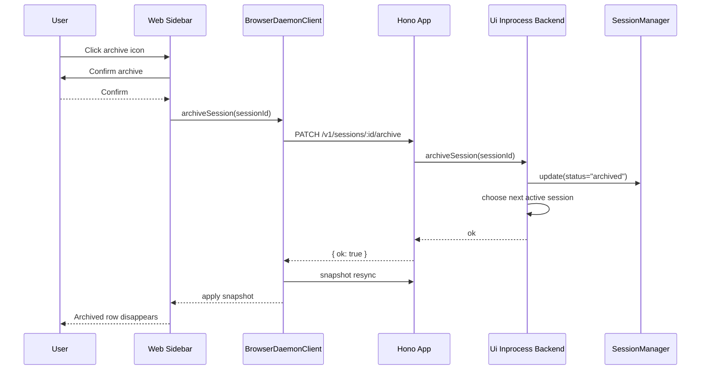

# Web Session Archive Design

## Goal

Add a reversible Web-only session archive action so users can hide stale sessions from the sidebar without destroying conversation data.

This feature answers the immediate Web UX problem: repeated empty or old sessions clutter `Recent sessions`. It intentionally does not add CLI/TUI controls or hard delete.

## Product Semantics

`archive` means "move out of the active working set".

- Archived sessions remain in the database.
- Archived sessions are not shown in the Web sidebar.
- Archived sessions are not shown by the current `/sessions` active-session picker.
- Archived sessions can be restored by a future feature because the underlying session row and associated data remain intact.
- Hard delete remains out of scope for this batch.

The existing core session model already has `status: "active" | "archived"`, so this feature should use that status instead of introducing a separate Web-only flag.

## Scope

In scope:

- Add a daemon REST endpoint to archive a session.
- Add a Web HTTP/client method for the endpoint.
- Add an archive icon button to each Web sidebar session row.
- Confirm before archiving.
- Hide archived sessions from the Web sidebar after success.
- If the active session is archived, move the active session to the newest remaining active session, or `null` if no active sessions remain.
- Cover backend and frontend behavior with focused unit tests.
- Verify the running browser UI with Playwright after implementation.

Out of scope:

- CLI/TUI UI changes.
- Slash command changes.
- Archived-session browser.
- Restore/unarchive UI.
- Hard delete.
- Batch archive.
- Search or filtering.

## User Experience

The sidebar keeps the existing list layout. The right-side message icon becomes an archive tray icon, following the OpenCode pattern the user referenced.

Interaction:

1. User clicks the archive icon in a session row.
2. The row itself is not selected by that click.
3. A lightweight browser confirmation asks whether to archive the session.
4. If confirmed, Web calls the archive endpoint.
5. The session disappears from `Recent sessions`.
6. If the archived session was active, the app switches to the newest remaining active session; if none remains, the empty state is shown.

The confirm text should be direct and low-drama:

```text
Archive this session?
```

No permanent deletion warning is needed because archive is reversible by design, even though restore UI is deferred.

## Backend API

Add:

```http
PATCH /v1/sessions/:id/archive
```

Response:

```json
{ "ok": true }
```

Behavior:

- Require the same authorization, client id, and registered Web client checks as other `/v1/sessions/:id/*` mutation endpoints.
- Validate that `:id` is a non-empty string.
- Archive by executing a backend command-capability method rather than writing Web-only state.
- Return `404` if the session does not exist.
- Return `400` for missing or empty session id.
- Return `409` for unregistered client, matching existing session mutation routes.

The server should not call `SessionManager.remove()`. It should update session status to `archived`.

## Backend Capability

Extend the SDK/CoreAPI backend contract:

```ts
archiveSession(input: { readonly sessionId: string }): Promise<void>;
```

The in-process implementation should:

- Require a valid primary session.
- Call `sessionManager.update(sessionId, { status: "archived" })` when a session manager is present.
- Keep UI state coherent by publishing a snapshot replacement.
- Set `activeSessionId` to the newest remaining active session when archiving the current active session.
- Set `activeSessionId` to `null` when no active sessions remain.

The daemon JSON-RPC adapter should forward the same method for remote clients. This keeps Web REST, Web client, remote daemon clients, and in-process backend behavior aligned without exposing the feature through CLI slash commands.

## Web Client

Add:

```ts
archiveSession(sessionId: string): Promise<void>
```

The browser client should:

- Call `PATCH /v1/sessions/:id/archive`.
- Refresh/resync the projected snapshot after success, like create/select session.
- Surface request errors through the existing action error banner.

The low-level HTTP request helper must allow `DELETE` eventually only if hard delete is introduced. This batch only needs `PATCH`.

## Sidebar UI

`SessionSidebar` receives a new callback:

```ts
onArchiveSession(sessionId: string): void;
```

Each session row contains:

- Main button area for selection.
- Archive icon button on the right.

The archive icon button:

- Uses a lucide archive/tray icon.
- Has `title="Archive session"` and an accessible label.
- Is disabled when the composer is disabled, matching existing row disable behavior.
- Calls `event.stopPropagation()` so archive clicks do not select the row.
- Uses the existing error path if the request fails.

Layout should keep row height stable and avoid nested-card styling.

## Data Flow



## Testing

Backend unit tests:

- OpenAPI doc includes `PATCH /v1/sessions/{id}/archive`.
- Unauthorized archive returns `401`.
- Missing client id returns `400`.
- Unregistered client returns `409`.
- Valid archive calls backend archive capability and returns `{ ok: true }`.
- Backend archive failures map to mutation error status.

Agent/backend contract tests:

- Archiving a session updates status to `archived`.
- Archiving the active session selects the newest remaining active session.
- Archiving the only active session clears active session.
- Archived sessions no longer appear in the Web projected snapshot/sidebar source.

Frontend unit tests:

- `DaemonHttpClient.archiveSession()` sends `PATCH /v1/sessions/:id/archive`.
- `BrowserDaemonClient.archiveSession()` refreshes the projected snapshot.
- Sidebar archive icon calls the archive callback without selecting the row.
- Cancelled confirmation does not call the archive callback.

E2E/browser verification:

- Run the local Web app in Chrome.
- Verify the sidebar shows archive icons.
- Archive a non-active session and confirm it disappears.
- Archive the active session and confirm the app switches or shows empty state.

## Development Self-Check

- Do not change CLI/TUI surfaces.
- Do not call `remove()` or delete database rows.
- Keep archived sessions queryable by backend code.
- Keep Web sidebar filtered through snapshot state, not direct DOM removal.
- Stage and commit only files changed for this feature.
