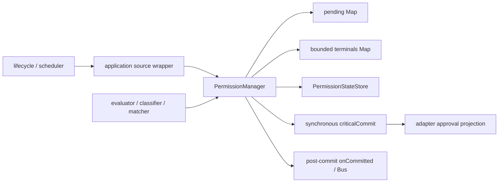

# permission 模块 architecture.md

本文档对应当前实现；职责见 [goals-duty.md](goals-duty.md)，字段与接口见 [data-model.md](data-model.md)、[dfd-interface.md](dfd-interface.md)。

## 一、总体结构

manager 内的 `pending` 是审批权威，按独立 permissionId 索引；每个条目持有请求、原始调用上下文、Promise 回调和 abort listener。没有 RequestQueue、current、processNext，也不以 UI 当前卡片决定哪个请求可以回答。近期终态 Map 保存最小身份与原因，默认限制 1024 条。root/runtime 健康状态独立保存，不从投影集合反推。

`PermissionStateStore` 保存 mode、level 和按真实 session 分组的规则；classifier/evaluator/matcher/rule 是分类、求值和规则处理函数。manager 不导入 server 或 session 数据库。

## 二、请求登记与一次结算

### 登记

`ask()` 先检查真实执行上下文、健康状态、撤销范围和 signal，再求值。明确 deny 拒绝；Full Access 返回 once；命中可用会话 allow 规则返回 always。这些直接路径没有 pending 转移或审批增量。调用方仍负责先进行通常的权限求值，只有需要显式确认的路径进入 ask。

需交互时，manager 生成独立 ID、冻结来源字段及祖先数组，检查与 pending/近期终态的 ID 冲突，再登记条目和 abort listener。在同一调用栈执行 `criticalCommit({ type: 'requested', info })`；成功后才调用 `onCommitted` 和普通 `PermissionEvent.Updated`。发通知期间再次检查 signal 和条目是否仍存在，允许同步观察者回答而不重复处理。

### 结算

respond 与 revoke 共用无 await 的 `settle`：

1. 校验响应、实际来源 session、健康、signal 和最新 deny；非法 choice 不认领条目。
2. 从 pending 认领移除并拆除 listener，阻止重复回答或观察者重入。
3. always 静默写入来源 session 规则，不提前发布 RuleAdded。
4. 同步提交 resolved 投影，保存近期终态。
5. 完成原 ask Promise。
6. 调用 `onCommitted`，发布 RuleAdded / Replied；always 再对其他匹配 pending 逐项结算。

后续重复返回 already-resolved、revoked 或 not-pending，不重建条目。已淘汰的终态按 not-pending 处理，不自动允许。普通通知抛错不会改变已提交决议。批准后 signal 仍由 scheduler/工具遵守。

### always

规则采用 `tool(pattern)` 格式，如 `edit(src/**)`、`bash(git push)`、`skill(code-review)`。仅匹配来源 session；不可记忆请求或当前策略不允许的请求不自动通过。已登记的每个匹配项独立提交 resolved；后续新调用命中既有规则不产生 requested/resolved。always 不切 mode 或 Full Access，也没有 SwitchModeRequested 事件。

## 三、撤销与故障

`revokeByRun(realRunId, reason)` 是正常 run 结束的清理入口，不扫描整个 session，避免旧 run 结束误伤新 run。`revokeBySession()` 匹配来源、root 和冻结祖先链，用于来源失效或会话删除；`clearSession()` 同时清除目标 session 的规则。`dispose()` 先禁止新准入，再撤销全部 pending。批量撤销期间设置临时范围保护，防止通知回调重入批准或重新登记同范围请求。

正常撤销使 ask 返回 cancel，这是执行控制结果，不是公开审批选项。取消先赢时迟到 always 不写规则；合法 always 先赢后执行取消不回滚规则。

关键提交或规则副作用抛错、内部 ID 冲突属于严重故障。manager 冻结可信 root，直接从 pending 拆 listener、记录 revoked 并用 `PermissionUnavailableError` 结束等待，不再次调用坏投影完成清理。`onUnavailable` 通知 adapter 使受影响查询/连接失效。只有共享设施损坏且不能划定 root 时使用 `freezeRuntime()`。普通非法输入、断线或页面查询失败不会冻结 manager。

## 四、投影端口

`PermissionManagerOptions` 注入三个窄端口：

| 端口                                        | 约束                                                                    |
| ------------------------------------------- | ----------------------------------------------------------------------- |
| `criticalCommit(event): void`               | 同步、无观察者；成功不抛错，失败抛错；适配器原子替换根集合与版本        |
| `onCommitted(event): void`                  | requested 已提交或 terminal 已记录且 Promise 已结算后调用；负责专用通知 |
| `onUnavailable(rootSessionId, error): void` | 独立健康故障通知；root 为 undefined 表示 runtime 范围                   |

adapter 的审批投影持有 runtime epoch 和每个 root 独立 revision。每次已登记请求的 requested/resolved 推进一次版本，聊天事件和单纯规则变化不推进。snapshot、集合和 revision 来自同一不可变对象。专用通知失败由传输隔离并重新同步，不能通过普通 Bus 吞异常来保证可靠投递。manager 自身不维护客户端订阅或恢复预算。

## 五、文件组织

| 文件                    | 职责                                         |
| ----------------------- | -------------------------------------------- |
| `manager.ts`            | pending/terminal、登记、一次结算、健康与撤销 |
| `types.ts`              | 身份、来源、请求/响应、状态、公开接口和错误  |
| `state.ts`              | mode/level 与会话规则；支持静默写入          |
| `evaluator.ts`          | deny 优先、Full Access 和默认权限求值        |
| `classifier.ts`         | 工具行为分类                                 |
| `matcher.ts`、`rule.ts` | Pattern 生成、解析与匹配                     |
| `events.ts`             | mode/level/rule 与 Updated/Replied 领域事件  |
| `index.ts`              | 公共导出                                     |
| `*.unit.test.ts`        | 与对应实现同目录的行为回归测试               |

## 六、约束

当前规则、pending 和终态只在内存中；不跨 runtime 共享审批。Full Access 保留明确 deny 和工具安全检查，切换不自动结算旧 pending。审批不新增墙钟超时；执行生命周期仍必须给出 signal 和终态兜底。UI 可按 createdAt/id 排序，但顺序没有授权语义。
