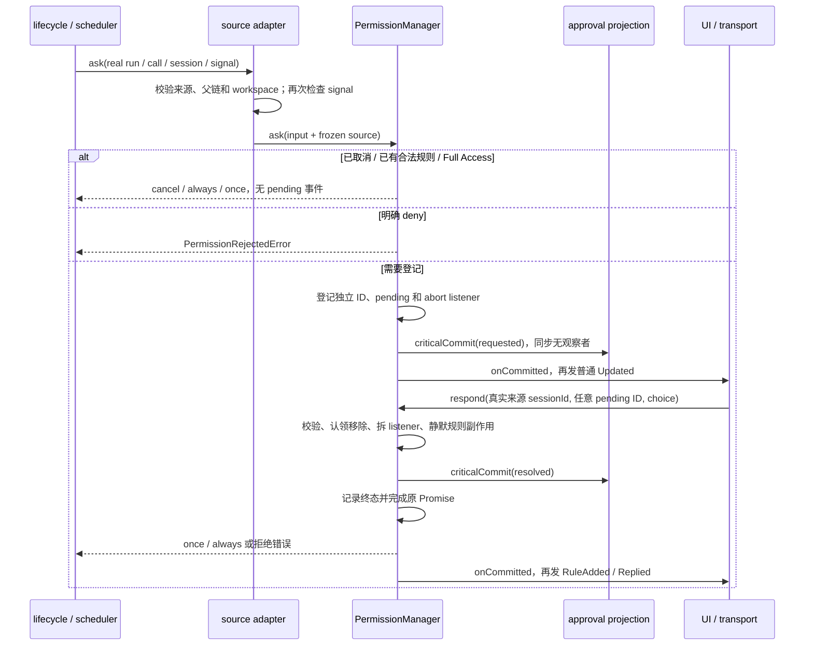

# permission 模块 dfd-interface.md

本文档定义当前 manager 的调用边界。具体类型见 [data-model.md](data-model.md)，提交约束见 [architecture.md](architecture.md)。

## 一、主数据流



来源解析失败结束该 ask，不伪造根、不广播到全局。UI 读独立审批快照及增量，不以整页聊天快照作为审批权威。普通显示、历史/model 查询或单连接失败不撤销后端请求。

## 二、manager API

通过 `createPermissionManager(options)` 创建实例。

| 方法                                                        | 输入与结果                                                                                                                                             |
| ----------------------------------------------------------- | ------------------------------------------------------------------------------------------------------------------------------------------------------ |
| `ask(input)`                                                | 必需真实 runId/source/signal/sessionId/messageId/callId/toolName/category/params；返回 `Promise<SchedulerPermissionResponse>`，拒绝或严重故障时 reject |
| `respond(sessionId, permissionId, response)`                | sessionId 必须是实际来源会话；同步返回 accepted / already-resolved / revoked / not-pending，可抛非法 choice 或 unavailable                             |
| `listPending()`                                             | 返回当前全部 PermissionInfo，不包含 Promise 回调，不限制应答顺序                                                                                       |
| `getPending(id)`                                            | 返回单条 pending info 或 undefined                                                                                                                     |
| `getTerminal(id)`                                           | 返回有界近期终态身份或 undefined，供 adapter 做范围校验                                                                                                |
| `revoke(id, reason)`                                        | 通过同一结算入口撤销单条请求，返回 PermissionRespondResult                                                                                             |
| `revokeByRun(runId, reason)`                                | 精确撤销该真实 run 的所有请求；正常 run 终态使用此入口                                                                                                 |
| `revokeBySession(sessionId, reason)`                        | 匹配实际来源、root 或冻结祖先链，用于来源失效/会话删除                                                                                                 |
| `clearSession(sessionId)`                                   | 清除该 session 的规则，并按来源链撤销相关请求                                                                                                          |
| `cancelPending(sessionId)`                                  | 保留的兼容入口，只撤销该实际来源 session；不能替代正常 run 精确清理                                                                                    |
| `isHealthy(rootSessionId)`                                  | 查询 manager 独立健康状态                                                                                                                              |
| `freezeRoot(rootSessionId, error)` / `freezeRuntime(error)` | 严重内部故障隔离；结束受影响等待，不依赖坏投影                                                                                                         |
| `dispose()`                                                 | 禁止新准入并撤销当前 manager 的全部 pending                                                                                                            |
| `state`                                                     | mode/level/会话规则状态接口                                                                                                                            |

`PermissionManagerOptions` 必需 bus；可注入 generateId、now、state、terminalLimit，以及 `criticalCommit`、`onCommitted`、`onUnavailable`。关键提交为同步 void，失败通过抛错表达；专用通知在关键提交之后，不能在 criticalCommit 内执行 UI/Bus 观察者。

## 三、响应和范围校验

manager 接受 once、合法 always、reject、非空 suggest。未知 choice、cancel、不可记忆请求的 always、试图扩大 pattern 的 always 均返回非法 choice 错误而保留 pending。signal 已取消时迟到批准不能写规则；最新规则已 deny 时批准转为拒绝。多个回答或回答/撤销竞争只有一次有效终态。

UI SDK 使用 `respondPermission(requestId, response, context?)`，response 的公开 choice 为 allow_once、请求提供时的 allow_always、reject。根页面可以回答其树下请求，但 adapter 必须从可信记录取实际 sessionId 传给 manager。always 因此落到实际子会话而非 root。服务器验证认证、workspace、epoch/root/bindingGeneration；本地 adapter 验证选中根及选择代次。近期终态也必须先做范围校验，才能将安全重复视为成功。

内部 cancel 只用于生命周期撤销，不是 UI 的 Cancel run。not-pending 由 adapter 映射为 `PERMISSION_NOT_PENDING` 并让客户端重新同步；严重健康故障为 `PERMISSION_UNAVAILABLE`，不能返回正常空集合。

## 四、事件边界

| 事件/端口                   | 内容与使用者                                                                      |
| --------------------------- | --------------------------------------------------------------------------------- |
| PermissionCommit requested  | info；同步投影新增请求                                                            |
| PermissionCommit resolved   | terminal identity 和 response；同步投影删除请求并推进版本                         |
| `onCommitted`               | 关键提交后的专用投递，adapter 负责隔离失败订阅                                    |
| `PermissionEvent.Updated`   | `{ info }`，兼容领域观察者                                                        |
| `PermissionEvent.Replied`   | sessionId/permissionId/runId/rootSessionId/reason/callId/response，兼容领域观察者 |
| `PermissionEvent.RuleAdded` | sessionId/rule；always 完成关键提交后才发布                                       |
| ModeChanged / LevelChanged  | previous/current，更新普通权限设置视图                                            |
| `onUnavailable`             | 可信 root 或 runtime 故障，adapter 阻止正常查询并使受影响连接失效                 |

新版审批消费者通过 SDK 的 `getPermissionSnapshot()` 和 `subscribePermissionEvents()` 获取 epoch/root/revision 请求集合。全量 getSnapshot 保留兼容形状，但其 permissions 副本不能覆盖独立审批状态。普通 Bus 事件不承担关键提交或可靠传输的职责。

## 五、调用示例

下面展示 application wrapper 已验证来源后，显式审批入口的核心调用。身份和 signal 来自本次实际执行，不在 permission 内生成替代值。

```typescript
const result = await permission.ask({
  runId: execution.runId,
  sessionId: execution.sessionId,
  messageId: execution.messageId,
  callId: call.id,
  contextScopeId: execution.contextScopeId,
  source: validatedSource,
  signal: call.signal,
  toolName: call.name,
  category: call.category,
  params: call.params,
  reason: "Confirm this operation",
  rememberable: true,
});

if (result === "cancel" || call.signal.aborted) {
  return;
}
// scheduler 随后遵循自己的执行和安全检查，不把批准视作工具已完成。
```

```typescript
// adapter 已校验 root/workspace/传输绑定后，使用可信的实际来源。
const request = permission.getPending(permissionId);
if (request) {
  permission.respond(request.sessionId, request.id, { type: "once" });
}

// lifecycle 在真实 run 终态出口兜底，不能换成按 session 清理。
permission.revokeByRun(execution.runId, "run_completed");
```
