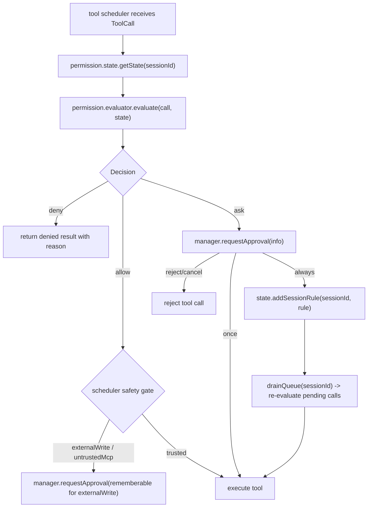

# Permission / Policy 重构问题分析（已决策版）

本文档说明为什么本轮必须把 `policy` 模块删除，并把判定、审批、会话规则、UI 状态统一收敛到 `permission` 模块。本文使用 UTF-8 编码。

---

## 一、分析对象

| 对象 | 当前路径 |
|------|----------|
| 旧 policy 模块 | [packages/ohbaby-agent/src/policy/](../../../packages/ohbaby-agent/src/policy/) |
| 旧 permission 模块 | [packages/ohbaby-agent/src/permission/](../../../packages/ohbaby-agent/src/permission/) |
| 调用入口 | [packages/ohbaby-agent/src/core/tool-scheduler/scheduler.ts](../../../packages/ohbaby-agent/src/core/tool-scheduler/scheduler.ts) |
| 工具注册与过滤 | [packages/ohbaby-agent/src/core/tool-scheduler/registry.ts](../../../packages/ohbaby-agent/src/core/tool-scheduler/registry.ts) |
| Shell 运行前检查 | [packages/ohbaby-agent/src/shell/preflight.ts](../../../packages/ohbaby-agent/src/shell/preflight.ts) |
| Shell 命令分类 | [packages/ohbaby-agent/src/shell/command-classifier.ts](../../../packages/ohbaby-agent/src/shell/command-classifier.ts) |
| UI / SDK 快照 | [packages/ohbaby-sdk/src/snapshot.ts](../../../packages/ohbaby-sdk/src/snapshot.ts) |
| 命令面 | [packages/ohbaby-agent/src/commands/catalog.ts](../../../packages/ohbaby-agent/src/commands/catalog.ts) |

参考项目：

| 项目 | 借鉴点 |
|------|--------|
| kimi-code | 类型化 rule、pattern DSL、permission selector、manager 与判定逻辑分层 |
| DeepSeek-TUI / Codex | capability 与 approval 分层、安全闸不被 full-access 绕过 |
| opencode | per-tool pattern rule 的用户语义 |
| pi | tool call 前置拦截思想 |

---

## 二、当前真实问题

### P1：两个模块同时在做“是否允许运行”的判定

当前链路是：

```text
tool scheduler
  -> policy.check(input)
      -> allow / deny / ask
  -> permission.ask(info)  // 仅 ask 时进入
      -> once / always / reject / cancel
```

`policy.check()` 根据 `mode + agentState + category` 判定；`permission.manager` 又维护 `approvals: Map<string, Set<string>>`，并用 pattern 命中结果自动 resolve。结果是同一个问题有两个真相源：

| 判定来源 | 当前职责 | 问题 |
|----------|----------|------|
| `policy` | 依据全局 mode / agentState / category 返回 allow/deny/ask | 只知道 category，不知道用户点 always 形成的 pattern |
| `permission.manager` | 依据 `approvals` pattern 自动通过或继续弹窗 | 持有审批状态，但不是真正的全局判定入口 |

这违反 Single Source of Truth。排查一次工具调用为什么被放行，需要同时查 `policy` 状态、`permission` 内部 Set、scheduler 安全闸。

**已确认方向**：新增 `permission/evaluator.ts` 作为唯一判定入口；manager 不再持有 approval 真相，只负责 ask 队列和 UI 响应。

### P2：`always` 会隐式诱导全局 auto-edit

当前 `permission.manager` 在用户点 always 后可能发布 `PermissionEvent.AutoEditRequested`，外层再把 `policy.agentState` 切到 `edit-automatically`。这会造成明显的用户语义偏差：

```text
用户以为：总是允许当前 pattern
实际结果：全局写操作都可能不再询问
```

这是低层 approval 流程反向改变高层 policy 状态，违反依赖反转，也违反最小惊讶原则。

**已确认方向**：删除 `AutoEditRequested`、`approvedFor`、`findMatchingPermissionPattern` 驱动的 manager 内部自动 resolve 状态。用户点 always 只写入当前 session 的 `sessionRules`，不切 `mode`，不切 `level`。

### P3：`mode` 与 `agentState` 形成难解释矩阵

当前模型：

```ts
type Mode = "ask" | "plan" | "agent";
type AgentState = "ask-before-edit" | "edit-automatically";
```

理论上是 3x2，实际又有非法组合；`agentState` 只在 `agent` 下有效。用户在 TUI 中看到的却是混合状态，例如 `mode: agent/ask-before-edit`。

直接后果：

| 用户操作 | 当前副作用 |
|----------|------------|
| Shift+Tab 三态循环 | mode 切换时可能重置 agentState |
| `/mode auto-edit` | 命令名像 mode，实际同时影响 agentState |
| `/permission` | 与 `/mode` 边界重叠 |

**已确认方向**：只保留两条正交轴：

```ts
mode: "plan" | "auto";
level: "default" | "full-access";
```

`mode` 表示交互意图，`level` 表示审批层，二者不互相修改。

### P4：工具列表按 mode 过滤会让 LLM 失去稳定上下文

当前 registry 有 mode-based allowed categories。Plan 模式下如果工具列表被过滤，LLM 会在不同 mode 下看到不同工具集合，带来两个问题：

- prompt/tool schema 缓存不稳定；
- 从 plan 切回 auto 后，LLM 对可用工具的认知需要重新恢复。

**已确认方向**：工具注册表不按 mode 过滤。Plan 模式下 LLM 仍看到完整工具列表；真正调用时与 auto 模式共用当前 `default/full-access` 审批矩阵。

### P5：`policy` 字段已经渗透到 SDK / UI 契约

当前 `UiSnapshot` 暴露 `policy` 字段，TUI 订阅 `PolicyEvent`，命令和状态栏也引用 policy 术语。若只改 backend 内部而不一次性改契约，会形成“代码里没有 policy，但 SDK/UI 还叫 policy”的断裂。

**已确认方向**：契约层一次性切换：

```ts
UiSnapshot.policy      // 删除
UiSnapshot.permission  // 新增
```

内部 `PermissionState.sessionRules` 用 `Map<string, readonly PermissionRule[]>`；SDK / UI snapshot 不暴露 JS `Map`，改序列化为稳定 JSON 结构。

### P6：full-access 不能绕过 scheduler 的运行环境安全闸

`level=full-access` 只代表用户对权限审批的偏好，不代表当前运行环境一定可信。scheduler 中已有两类强制 ask：

```ts
if (decision.type === "allow" && context.externalWrite) -> ask
if (decision.type === "allow" && context.untrustedMcp) -> ask
```

**已确认方向**：这两道闸继续留在 scheduler。evaluator 只管 `mode / level / sessionRules`；scheduler 管运行环境信任。即使 full-access 或 sessionRule 命中 allow，外部 workspace 写入和不可信 MCP 工具仍强制 ask。

---

## 三、根因归纳

当前问题不是单个 if 条件写错，而是职责边界划错：

```text
旧边界：
  policy      = mode/agentState 决策
  permission  = ask UI + 局部 approval 状态

新边界：
  permission/evaluator = 唯一判定入口
  permission/manager   = ask UI 队列与用户响应
  permission/state     = mode / level / sessionRules 真相源
  scheduler            = 工具执行编排 + 运行环境安全闸
```

也就是说，删除 policy 不是“搬文件”，而是把“判定权威”收敛到一个领域模型。

---

## 四、目标数据流



关键点：

- evaluator 是唯一判定入口；
- manager 不保存 approval 真相；
- `always` 只产生 session rule；
- `clearSession(sessionId)` 删除该 session 的所有 rules；
- scheduler 的 external write / untrusted MCP 闸不属于 evaluator。

---

## 五、必须消除的旧概念

| 旧概念 | 处理方式 | 替代 |
|--------|----------|------|
| `packages/ohbaby-agent/src/policy/` | 删除整个目录 | `permission/state + evaluator` |
| `PolicyEvent.*` | 删除或迁移 | `PermissionEvent.ModeChanged / LevelChanged / RuleAdded` |
| `agentState` | 删除 | `level` |
| `ask` / `agent` mode | 删除 | `plan` / `auto` |
| `AutoEditRequested` | 删除 | `state.addSessionRule(sessionId, rule)` |
| manager 内部 approval Set | 删除 | `PermissionState.sessionRules` |
| registry 按 mode 过滤工具 | 删除 | evaluator 调用时 deny |
| `/mode` | 删除 | `Shift+Tab` 切 mode |

---

## 六、与软件工程原则的对应

| 原则 | 本轮落点 |
|------|----------|
| KISS | 两轴模型替代旧 3x2 矩阵；命令面只保留 `Shift+Tab` 与 `/permission` |
| YAGNI | 不做持久化 rule、不做 agent profile merge、不做 OS sandbox |
| DRY | 判定矩阵只实现于 evaluator，不在 scheduler/manager/UI 重复 |
| SOLID - SRP | state 管状态，evaluator 管判定，manager 管 ask UI，scheduler 管执行与环境安全 |
| SOLID - DIP | manager 不再反向改变 policy；上层只依赖 permission 抽象 |

---

## 七、进入实施前的核对项

本分析已与 10 条决策对齐。实施前只需要用户确认修订后的文档可以作为基线；确认后新建临时分支并按 [implementation-plan.md](./implementation-plan.md) 执行。
