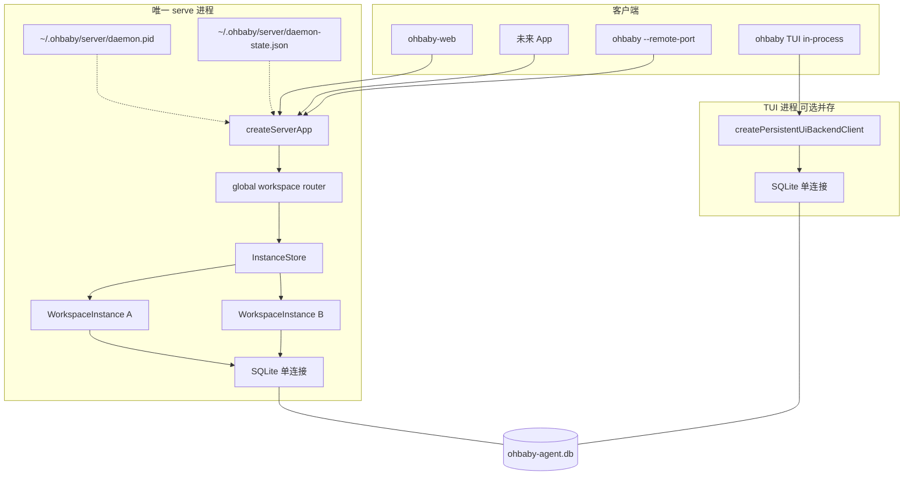

# 2. 优化方案与改动面

> 状态口径：Phase 1a 与 Phase 1b 已完成；各节保留实施拆分与代码锚点，Phase 2/3 仍是后续范围。

## 2.1 总体策略

分三阶段，本议题聚焦 **Phase 1（全局单 serve）**；Phase 1a 与 Phase 1b 均已完成。Phase 2 是 App/长期资源治理，Phase 3 是 `/loop` Scheduler。

```
Phase 1a（已落地）            Phase 1b（已落地）         Phase 2/3（后续）
  用户级 pid/state             known/loaded/switch UI    App CORS/鉴权
  InstanceStore                TUI+serve 双写集成测      per-scope dispose
  fail-closed workspace route  serve-awareness          session 级 Scheduler
  directory/header/selected    serve ps / connections   /loop + scheduler_job
  版本/legacy/无 idle-exit
```

**原则**

- 默认 `ohbaby` / TUI 的运行依赖路径 **零改动**；serve-awareness 若实现，只能使用 CLI 轻量发现层，不得 import `ohbaby-server`。
- `ohbaby serve` 语义从 per-scope 多实例改为 **全局唯一**。
- 不恢复全局 `persistentUiBackendLease`。
- 显式 foreground serve 不 idle-exit；本批不添加 Scheduler 空钩子。
- 本批不做单 workspace 自动回收。

---

## 2.2 Phase 1 架构设计

### 2.2.1 目标拓扑



### 2.2.2 InstanceStore 职责

| 方法 | 行为 |
|------|------|
| `load(scopeKey)` | 命中缓存则返回；否则 `createPersistentUiBackendClient({ workdir: scopeKey })` + 创建 per-scope coordination |
| `get(scopeKey)` | 只读，不触发 load |
| `disposeAll()` | serve 停止时调用 |

`load()` 必须缓存**启动 Promise**而不是只缓存已完成实例：同 scope 的并发首请求只能创建一个 runtime；启动失败时删除缓存 entry，后续请求可重试。本批刻意不提供自动 `dispose(scopeKey)`，避免 MCP、watcher、SSE 等资源所有权尚未闭合时产生伪回收。

**每个 WorkspaceInstance 包含**

- `backend: PersistentUiBackendClient`
- `promptQueue: DaemonPromptQueue`（队列已属于 scope，不必再依赖进程级全局 lane）
- `permissionRouter: PermissionRouter`
- `eventBus: EventBus`（**per-scope**，replay 缓冲隔离）
- `clientViewCoordinator` 或等价 per-scope 状态

**进程级单例（不进 Instance）**

- 用户级 PID lock + state registry
- SQLite：由 **第一个** backend 初始化 `initDatabase()`；serve 进程内 **共享一个** `getDatabase()`（各 backend 复用同一连接，不 per-scope 开库）
- 未来：全局 `Scheduler`（仅负责时间与 durable job）；触发时通过 InstanceStore 路由到目标 workspace/session，不持有一个全机业务 Heartbeat 状态

**注意**：今天每个 `createPersistentUiBackendClient` 会调 `getDatabase()`；InstanceStore 应保证 **serve 进程内只 init/close 一次 DB**，与 `main.ts` 的 `activeLocalDaemonDatabases` 计数逻辑对齐并简化为进程级。

### 2.2.3 用户级 PID 锁与状态发现（沿用现有实现）

不新增 `instance/lock.ts`，复用并迁移现有 `FilePidFile`、`JsonDaemonStateFile`、`Supervisor`：

1. 路径：`~/.ohbaby/server/daemon.pid` 与 `~/.ohbaby/server/daemon-state.json`。生产代码以用户 home 为根；测试通过显式 `homeDirectory` dependency 注入隔离目录，不宣称尚不存在的 `OHBABY_HOME` 环境变量契约。
2. `daemon.pid`：`O_EXCL`，记录 `{ pid, startedAt, token }`，只负责互斥与 ownership。
3. `daemon-state.json`：server listen 成功后原子写入 `{ status, pid, pidToken, host, port, authToken, packageVersion, startedAt, updatedAt }`，是发现真实端口/token/版本的真相源。
4. 第二启动者发现 live pid + ready state + health OK + **packageVersion 精确一致**时复用。
5. PID 已锁但 state 尚未 ready 时，第二启动者在有限超时内等待 winner ready，不得把启动中的进程误判 stale。
6. PID 存活但版本不一致，或旧 state 缺少 `packageVersion` 时，均拒绝复用，提示用户显式 `serve stop` / `serve`；禁止自动 kill。
7. 仅 PID 已死亡时允许 stale takeover；stop 继续校验 state.pidToken 与 pid record token。
8. `stop`：SIGTERM → `disposeAll` → 释放 pid lock → `closeDatabase()`（进程级）。

**端口策略（2026-07-11 确认）**

- 默认尝试 `127.0.0.1:4096`。
- 若 **未显式** `--port` 且 4096 被占用 → 使用 `port:0`（OS 分配可用端口），与 v0.1.6 `main.ts` 避让逻辑一致。
- **显式** `--port` 被占用 → 失败并说明（脚本契约不被静默改写）。
- `daemon-state.json` 必须写入 **最终 listen 的 port**；`serve status`、`ohbaby web ready:` 输出、App 发现均读 state，**禁止假设恒为 4096**。

**与 per-scope state 迁移**

- v0.1.6 的 `<scopeRoot>/.ohbaby/server/` 不再是新版本发现源，但保留一个版本的兼容检测。
- `serve start` 检查当前 cwd 的 legacy state；发现 live legacy daemon 时拒绝启动并提示先停止。
- `serve status/stop` 找不到全局 state 时，可回退当前 cwd 的 legacy state。
- 不扫描全盘、不自动批量 kill；ownership 不可证明时宁可提示人工处理。

### 2.2.4 workspace 路由（`runtime/workspace-scope.ts` + global server dispatcher）

```typescript
const directory = c.req.header("x-ohbaby-directory");
if (!directory) throw new WorkspaceRequiredError();

const scopeKey = await resolveScopeKey(directory); // realpath + getProjectRoot
const instance = await instanceStore.load(scopeKey);
c.set("instance", instance);
```

**挂载范围**：workspace 相关的 `/api/rpc`、`/api/events`、`/v1/*`（含 SSE）。缺失 header、路径不存在/不可读/不是目录时返回结构化 400。`/api/health`、`/api/shutdown`、`/doc` 与静态资源属于全局路由，不经过 workspace dispatcher。生产环境禁止 query/cwd fallback；测试若需默认 scope，应通过显式 dependency 注入，不能复用生产解析路径。

### 2.2.5 per-scope app runtime 组合（已落地）

| 边界 | 当前实现 |
|------|----------|
| global server | `runtime/daemon/server.ts` 持有 Hono router + `InstanceStore<WorkspaceAppInstance>` |
| per-scope app | 每个 scope 调用一次 `createDaemonServerApp({ backend })`，天然获得独立 clientViews / promptQueue / permissionRouter / EventBus / SSE replay |
| request dispatch | global router 解析并 canonicalize `x-ohbaby-directory`，再把原请求交给目标 app handle |
| web assets | 由初始 app 提供全局静态资源；workspace 选择由前端显式 header 决定 |

该组合刻意保留 `create-app.ts` 的单 workspace 高内聚边界，没有把 InstanceStore 直接注入所有 handler。这样既实现 scope 隔离，又避免把路由、实例生命周期和 workspace 协调塞进同一个 app runtime。

`runtime/daemon/main.ts` 改造：

- 删除「per-scope 独立 listen」为主路径；改为用户级 pid acquire → `createServerApp` → listen → 写用户级 state。
- 将“server registry path”与“workspace scope resolver”拆成两个职责；不再让 `resolveDaemonScope` 同时决定进程发现路径和项目根。
- 显式 foreground serve 禁用现有 15 分钟 idle self-exit。

### 2.2.6 双写预防（机制清单）

#### A. 结构层（消灭多写 serve）

- 用户级 PID 锁：**至多一个** serve 进程；这不意味着全机只有一个 SQLite 写进程，TUI 仍可合法并存。

#### B. 数据层（同 session 互斥）

- `claimPendingRun`：`BEGIN IMMEDIATE` 检查 `session_id` 下 `pending|running` 行。
- 失败抛 `SessionRunBusyError`（含 `sessionId`、可选 `activeRunIds`）。
- 写入 `owner_id`（`createBackendOwnerId()`）与 `owner_pid`（`process.pid`）。

#### C. 恢复层（僵尸 run）

- `recoverOrphanedRuns()`：`owner_pid` 不存活 → `interrupted`。
- 两端 backend 启动时均执行（TUI 与 serve 各自进程一次）。

#### D. 感知层（提示，非唯一手段）

- TUI 启动：若用户级 pid/state 存活、health OK 且版本可识别，stderr 输出一次：

  ```text
  Note: ohbaby serve is running at <URL from daemon-state.json>.
  This terminal uses a separate in-process backend.
  Avoid prompting the same session in both the web UI and this terminal.
  ```

- Web：对 `SessionRunBusyError` 映射为可理解文案（session 正在其他客户端执行）。

#### E. 错误强化（本批建议）

- `SessionRunBusyError` 增加可选字段 `ownerPid` / `ownerKind: "local-cli" | "serve"`（若可从 active run 行读出）。
- `submitPrompt` 路径：**禁止**在 claim 失败后静默重试插入 message（已有 ghost message 修复，保持）。

#### F. 明确禁止

- 不恢复 `persistentUiBackendLease`。
- 不为 TUI 实现「检测 serve 则拒绝启动」（kimi 未禁止）。

### 2.2.7 TUI / CLI 改动面（极小）

| 文件 | 变更 |
|------|------|
| `packages/ohbaby-cli/src/bin.ts` | 可选：`detectRunningServe()` 打印提示；**不**改 `createCoreHost` 默认路径 |
| `packages/ohbaby-cli/src/cli/commands/terminal.ts` | 无必改 |
| 新增 `packages/ohbaby-cli/src/cli/serve-awareness.ts` | 读用户级 pid/state + health（可选小模块） |

### 2.2.8 ohbaby-server 改动面

| 文件/目录 | 变更类型 | 说明 |
|-----------|----------|------|
| `src/runtime/instance-store.ts` | 新增 | Promise 去重 load/get/disposeAll 缓存 |
| `src/runtime/workspace-scope.ts` | 新增 | fail-closed scope 解析；由 global server dispatcher 调用 |
| `src/runtime/daemon/server.ts` | 修改 | 全局 router + InstanceStore；按 scope 创建独立 app runtime（已落地） |
| `src/app/create-app.ts` | 保持单 scope 边界 | 每个 app runtime 持有一套 backend/coordination；bootstrap 注入 initial directory |
| `src/runtime/daemon/main.ts` | 修改 | 用户级 pid/state 主路径；版本校验；禁用 foreground idle-exit；DB 进程级生命周期 |
| `src/runtime/daemon/scope.ts` | 修改/拆分 | workspace root 解析与 server registry path 分责 |
| `src/runtime/daemon/pid-file.ts` / `state-file.ts` | 复用并扩展 | 用户级路径、启动中等待、精确版本复用 |
| `src/protocols/jsonrpc/client.ts` | 修改 | 支持 `directory` / header |
| `src/protocols/jsonrpc/rpc-route.ts` | 无结构性改动 | 请求先由 global router 分发到目标 per-scope app |
| `src/coordination/*` | 无需改公共契约 | 每个 per-scope app 各自实例化 coordination |
| `serve status/stop` CLI 对接 | 已落地 | 读用户级 state；一个版本 legacy fallback |
| `serve ps` / connections | 已落地 | 全局 `GET /v1/connections` + CLI `ohbaby serve ps` |

### 2.2.9 ohbaby-sdk 改动面

| 项 | 说明 |
|----|------|
| `UiBackendClient` | **不改**方法签名 |
| 新增类型（可选） | `RemoteConnectOptions { baseUrl, token, directory? }` 放在 server 或 sdk types |
| 文档 | 说明 remote 必须带 workspace directory |

### 2.2.10 ohbaby-web 改动面

| 文件 | 变更 |
|------|------|
| `src/api/daemon/http.ts` | 所有 workspace 请求与 SSE 加 `x-ohbaby-directory`，由当前 selected project 注入 |
| `src/bootstrap.ts` | 读取全局面板启动提示并建立 selected scope；不得把 web asset directory 当 workspace |
| CLI `serve` 打开 URL | 当前 canonical cwd 作为初始选中项目提示；所有 cwd 仍打开同一 origin/global panel |
| UI | known/loaded/selected 列表与切换器已落地；切换时重建 client/snapshot/SSE，并隔离旧 generation |

known projects 由共享 DB 中的 `project_root` 与当前 InstanceStore 已加载 scopes 聚合，不扫描整个磁盘。必须区分 `known`、`loaded`、`selected` 三种状态。

### 2.2.11 ohbaby-agent 改动面

| 文件 | 变更 |
|------|------|
| `runtime/run-ledger/errors.ts` | 可选：丰富 `SessionRunBusyError` |
| `adapters/ui-persistent.ts` | 确保 owner 始终写入 claim |
| 默认 TUI 路径 | **无结构性修改** |

### 2.2.12 `/loop` 铺垫（本批不做 migration）

**不**在本批恢复 `scheduler_job` migration（见 `00-discussion.md` §9）。理由：无 Scheduler 消费方，YAGNI；表结构与 `SchedulerStore` 应在 loop 批次同 PR 落地。

本批不添加 `hasActiveSchedulerJobs()` 或空 Scheduler/Heartbeat。未来 loop 批次再实现：

1. 全局 Scheduler 只管理时间和 durable job，运行于 serve 进程。
2. 每个 job 必须绑定 `scopeKey + sessionId`。
3. 到期后经 `InstanceStore.load(scopeKey)` 路由到目标 WorkspaceRuntime / session RunManager。
4. 同一 job 在 session 忙碌时最多合并一个 pending trigger，避免无限补偿风暴。
5. session archive 时暂停 job，session delete 时取消 job；目录缺失时标 blocked，不高频重试。
6. Heartbeat 如保留，状态必须按 workspace/session lane 隔离，不得用一个机器级状态暂停所有项目。

---

## 2.3 Phase 2 / 3 预览（非本批）

| 阶段 | 内容 |
|------|------|
| Phase 2 | 全局面板高级体验、per-scope dispose、App 鉴权与长期资源治理；Phase 1 最小 known/selected/switch、connections/`serve ps` 已完成 |
| Phase 3 | session 级 `/loop`、全局 Scheduler、workspace/session dispatcher、scheduler_job 运行时代码 |

---

## 2.4 实施顺序与当前状态

1. ✅ 用户级 pid/state、readiness、精确版本匹配、legacy fallback。
2. ✅ `runtime/instance-store.ts`：并发 Promise 去重、失败重试、`disposeAll()`。
3. ✅ `runtime/workspace-scope.ts` + global dispatcher：fail-closed、canonical scope、结构化 400。
4. ✅ server 按 scope 创建独立 app runtime，隔离 backend/coordination/SSE。
5. ✅ foreground global serve、无 idle-exit、跨 repo 复用同 origin。
6. ✅ remote/Web directory、fragment→selected、known/loaded 列表与切换重绑。
7. ✅ 版本/legacy 与不耦合 server 包的 TUI serve-awareness。
8. ✅ InstanceStore、fail-closed、版本/legacy、双写同 session、global-panel switch 与真实双进程发布门。

---

## 2.5 不回退的决策

| 决策 | 放弃的方案 |
|------|------------|
| 单 serve + InstanceStore | 继续 Option A 多端口 |
| TUI in-process | TUI attach serve |
| per-session claim | 全局 backend lease |
| 共享 SQLite | 本批改为 per-scope db 文件 |
| gateway + worker 子进程 | 每项目独立 Node worker |
| 沿用双文件 pid/state | 新造 `~/.ohbaby/server/lock` 单文件 |
| workspace header fail-closed | query/cwd 隐式 fallback |
| foreground serve 显式生命周期 | 15 分钟无客户端自动退出 |
| 本批仅 disposeAll | 资源边界未闭合前自动 per-scope 回收 |
| packageVersion 精确匹配 | 自动杀旧 server 或静默跨版本复用 |

---

## 2.6 与父文档对齐

- 更新 `docs/ohbaby-server/hono-app/00-scope-and-deltas.md`：Δ7 实施状态指向本文。
- `docs/ohbaby-server/migration-sequence.md` 增加「v0.1.7 全局单 serve」指针。
- `docs/problem-lists/server/README.md` 与 `hono-app/08` 标为历史基线并指向本文。
