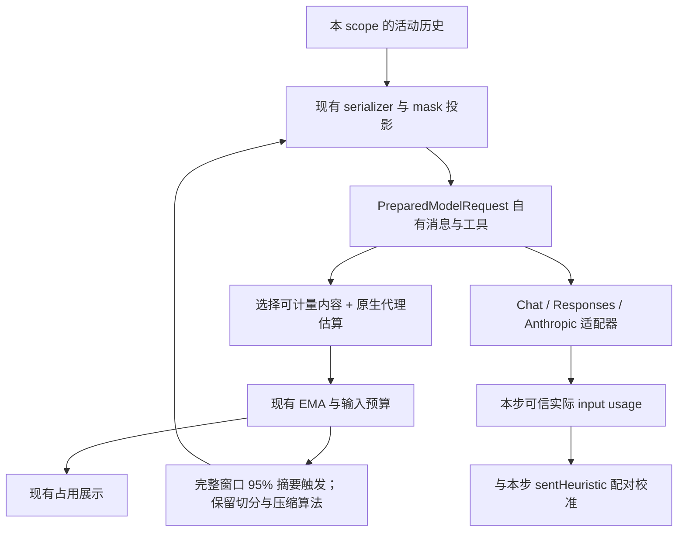

# 02 · 实施方案与文件级范围

状态：**供用户审核的实施契约，尚未实施**。用户确认与推荐选择见 00，历史依据和问题 P1～P6 见 01。

## 1. 推荐方案

**在已有自有消息结构上完成迁移，删除 Context 的旧 Chat 估算转换；保持压缩算法，只补统计与完成状态缺口。**

| 路径                                                         | 判断                                                       |
| ------------------------------------------------------------ | ---------------------------------------------------------- |
| 保留旧 Chat 估算转换                                         | 继续保留已获准删除的中间层，无法完成本轮目标               |
| 从现有自有请求选择计量材料，以三协议生产请求测试验证语义对应 | 推荐；一个 estimator，复用已有 native 处理与校准，改动集中 |
| 提取三个 provider 的发送投影并分别提供 meter                 | 将来若协议包装差异造成持续、可测的误差再考虑；本轮暂不引入 |

推荐方案中的“对应”指模型可见的正文、调用、结果和原生续接数据没有意外丢失或重复。它不承诺自有结构的 JSON 字节等于三种协议的包装字节，更不承诺等于供应商 tokenizer。现有启发式和 EMA 继续承担估算误差。

## 2. 自有消息结构如何兼容三协议

### 2.1 复用已有结构

| 对象                   | 合同                                                                                                             |
| ---------------------- | ---------------------------------------------------------------------------------------------------------------- |
| `ModelMessage`         | 表达角色、支持的内容、assistant 工具调用、tool 结果关联；现有字段足够时保持名称                                  |
| `ModelToolCall`        | `callId`、`name`、`argumentsJson`；调用与结果按 ID 对应，参数原文保留，不能为了统一形状任意解析再序列化          |
| `ModelToolDefinition`  | `name`、`description`、`inputSchema`；provider 分别映射 Chat nested tools、Responses flat tools、Anthropic tools |
| `ModelState`           | 沿用版本、origin、按协议区分的 output、代理估算来源；保存当前已经支持的协议特殊项                                |
| `PreparedModelRequest` | messages/tools 是本步冻结快照，tail directives 已合并；供计量和发送共同使用                                      |

不再创建一套同义 `ContextMessage` 或 `ContextMeasurementPayload`。若检查发现确实缺少已支持协议所需字段，在原有类型及校验分支内最小补齐；不为尚未接入的能力设计通用插件扩展框架。

### 2.2 通用字段与协议特殊字段的关系

以 Responses 工具调用为例：通用 `toolCalls` 让调度器知道调用名称、ID 和参数；同一 response 的 `modelState` 保留有序 reasoning/message/function_call 项供同源续接。两者是同一事实的不同用途，发送与估算都不能把镜像内容当两份。

- 同源回放：使用已验证的原生序列；保留 item ID、call ID、顺序、phase 和支持的推理字段。
- 结构一致性：原生 item 与通用文本／调用相互矛盾时，沿用显式拒绝，不能挑一份悄悄发送。
- 跨源：已完成单元按现有规则转换为可移植内容，并从本次请求去掉不适用的原生数据；未完成工具单元仍按既有保护拒绝不兼容切换。
- 能力差异：三协议共同语义兼容不等于每种协议都支持每种内容。已支持的 Chat 媒体／其他少见字段要保留；Responses 不支持的内容继续明确失败。
- 特殊字段必须有协议判别、类型和运行时校验。保留 `encrypted_content`、`redacted_thinking.data`、`thinking.signature` 等原样值，不能塞进通用正文，也不能使用任意字典绕过校验。

## 3. 计量怎么改

### 3.1 数据流



回环受现有次数和防抖限制。最后一份准备完成的 request 才能发送，其未校准估算与本次 usage 配对。

### 3.2 自有结构中的计量材料

在 `token-estimation.ts` 内保留一个清晰的材料选择过程：通用字段按自有命名形成临时可读材料，必要时提取小型纯函数。临时材料不持久化，也不成为另一份公开请求 DTO。

- 计入实际准备的 system/memory、消息正文、summary 包装、工具名／schema、调用 ID／参数、结果、白名单 metadata、tail directives 和实际活动的可读推理。
- 工具和尾部指令来自同一 request；最终 step 没有 tools 时，不能算入上一步工具。
- 不直接 stringify 整个 `ModelState`：origin、估算元数据、密文和签名不是可读正文。沿用 `estimateNativeStateTokens` 的可读推理与不透明代理规则，不按密文长度计量。
- 通用 text/toolCalls 和原生 item 的镜像只计一次；由既有原生一致性校验及估算选材规则保证。多个不透明块仍共享每 response 一份代理额度。
- 只计这次 request 仍携带的原生状态；跨源已过滤的 state 不额外加 proxy。
- 保留现有媒体启发式限制，不能宣称本轮补齐多模态精确计数。

删除 `legacy-estimation.ts` 及全部生产引用；不留旧／新模式开关。旧测试中为了冻结 Chat JSON 得出的数值需要按新材料更新，更新时提供独立可读样例和前后数值依据。

### 3.3 占用总量与七类解释

保留 `ContextUsage` 和公开 UI DTO，不做全链路字段更名。用注释和模块文档解释现有字段：

```text
raw estimate       = 当前自有请求的未校准估算
currentTokens      = 按现行规则校准后的输入估算
usageRatio         = currentTokens / inputBudgetTokens（压缩判断）
UI 占用率          = currentTokens / contextWindow（完整窗口展示）
压缩节省比例       = (同口径 before - after) / before
```

七类 composition 是独立解释估算，来源未知则整体省略，不强制与校准总量求和一致，不参与压缩决策。

最小修复 P2/P3：

1. 原生消息中的 subagent_run/status/close 调用参数和结果计入 `subagent-exchanges`；同条普通文字、推理文本／代理计入 `conversation`。只拆计量贡献，绝不拆发送或持久化的原生单元。
2. 重建请求与实际 prepared request 的来源匹配包含有效原生数据及其估算信息；原生 state 不同不能因为通用镜像相同就判相等。
3. runtime 继续归 system-prompt，实际消息位置不变；Skills 仍指工具定义，读取后的 SKILL.md 正文归 conversation。
4. 只对最终 reduction 后的请求计算一次分类；manual/static total-only 更新继续清旧分类，两个 bridge 分支继续传递字段。

### 3.4 不把请求计量迁移变成选段算法迁移

- 自动触发、prune 后重测、候选完整请求防膨胀、最终占用：统一使用新请求 estimator 和同一倍率。
- 普通历史的 `estimateHistoryForCompaction` 可读评分、prune 的工具 output 评分、mask 保护／评分材料保持。
- native 历史中原本调用请求 estimator 的部分跟随新材料，保持原 native 单元保护和合法切点。
- 摘要输入继续走 `serialization.ts::serializeHistory`，排除 model-state/reasoning 和既有不进入摘要的 model-context。这个可读格式保留，不能因文件名相近而误删。

新计量数字可能让触发时点或 native 选段结果发生变化，但不改公式、阈值、优先级和保留规则，也不把整个算法的评分材料切换成协议 JSON。

## 4. 压缩流程与最小完成状态修复

实施授权后，用户明确自动摘要使用完整窗口的 95%。此项覆盖原输入预算 95%／4096 的历史触发规则；具体历史与实现选择见 00。计量材料变化也可能改变到达阈值的轮次，不要求旧 token 数字快照不变。

### 4.1 保留的机制

| 项目          | 保持当前实现                                                                                       |
| ------------- | -------------------------------------------------------------------------------------------------- |
| 估算／校准    | ASCII 0.25、非 ASCII 1.3 与现有取整；EMA alpha 0.5、ratio clamp [0.5,3]；校准只应用一次            |
| 触发          | mask 默认关闭；启用阈值 0.50；summary 完整窗口占用率 0.95；删除剩余 <4096 提前触发；保留阈值配置   |
| prune／保留   | protect 40k、minimum 20k、keep recent 20k、preserve ratio 0.3 及现有工具／native 边界              |
| 摘要          | normal 后按现有条件 aggressive；旧摘要继续活跃，新摘要只压未摘要历史；文件附录保持                 |
| 防抖／恢复    | per-turn cap=2、thrash window=2、最低节省 0.1、解锁增量 0.05；主请求 overflow 保留一次强制恢复路径 |
| 摘要 overflow | 现有最多 4 次 manager 逻辑调用；按完整旧 user round 缩小，最近 user round floor；不改变原退休范围  |
| 状态／持久化  | scope 内串行、事务内 expectedParts 比较；prune 与 summary 各自原子提交；成功后重新组装测量         |

数字依据 `core/context/constants.ts` 及相应 policy。这里只冻结现有行为，不新增 retry、force 档位或阈值调参。

### 4.2 P4：摘要必须正常完成

`isComplete` 表示流达到了某个终态，不能单独证明摘要完整。summary client 在流正常耗尽后检查：

- 没有取消、没有后续异常；
- 收到规范化的完成结果，`finishReason === "stop"`；
- 最终正文非空。

非空的 length、content_filter、tool_calls、无终态 EOF、完成帧后抛错均不能形成可提交候选。取消保留 AbortError；异常终态走现有失败通道，不引入新的重试策略。正常 stop 但空文本保留现有空摘要重试上限。

无需改变通用 llm-client 对 isComplete 的定义，只在摘要消费者校验它需要的成功语义。reasoning 配置仍继承所属代理。

### 4.3 P6：补齐摘要材料里的工具动作

仅在摘要生成使用的可读序列化路径中，补上工具名称、调用 ID、输入、执行状态、结果／错误；aborted 保留已有部分 output 并明确未完整完成。metadata 复用既有白名单，不直接暴露全部 raw metadata。既有脱敏继续作用于完整摘要输入。

在 `serialization.ts` 使用一个明确的摘要用途选项或小型独立 helper；默认评分路径保持原行为。`prompt-context.ts` 只在生成摘要时使用丰富后的材料，不重新引入 Chat wire 格式。通过相同 output、不同动作的 fixture 证明摘要输入能区分两者。

`estimateHistoryForCompaction`、prune/mask 评分、切点、normal/aggressive 判定、overflow 收缩规则和退休范围保持。`shrinkSummaryHistory.inputTokens` 与 `CompactionProgress.estimatedHistoryTokens` 继续使用原可读历史评分材料；在注释／文档中明确它们不等于丰富后的摘要请求输入量，更不等于 provider 实际 input usage。不新增一份计量状态。增加可读信息可能增加摘要请求长度、改变是否发生 overflow，沿用现有恢复规则，并测试这个交界。

### 4.4 信息怎么保留

```text
压缩前：旧摘要 + 本次选中的旧历史 + 保留的近期历史
成功后：旧摘要 + 新摘要 + 保留的近期历史
```

原始历史在存储层保留 compacted 标记，本次选段退出活动请求。native state/text/tool 作为整体退休；未完成单元仍受保护。

实现中可将局部 `historyToCompress` 改成 `retirementHistory`，将 `summaryHistory` 改成 `summaryInputHistory`，帮助区别“成功后退出上下文的范围”和“实际给摘要模型的材料”。不为此迁移整套结果 DTO。

overflow 时摘要输入可能小于退休范围，这是既有有损恢复；本轮不偷偷缩小退休范围或合并旧摘要。需要测试直接证明两者差异。

摘要失败／取消／膨胀时，其候选历史不退休；此前已经提交的 prune 保留。summary 与该次退休标记原子提交，stale 零候选写入；安全尾部追加保留。持续无收益或无法腾出空间时按原有有限路径结束。

## 5. 保留的生命周期与预算边界

- `PreparedTurn.sentHeuristic` 保留，表示最终发送请求的未校准估算；actual inclusive input 与该值配对，缓存输入不扣除。摘要／标题 usage 不进入 agent-step 校准或累计。
- session/scope 校准与清理继续；普通 connect 的 runtime reset／occupancy clear 通过回归验证，不增加 projectionVersion 或按多维 identity 保存倍率的 map。
- 预算计算、requested output 的当前接线和半窗口 reserve 策略不变。本轮不承诺 reserve 精确等于每次发送的 maxTokens；这项预算调整留后续。
- tracker 命中保持最近 prepare/compact 快照；未命中主代理静态 tools-aware 总量估算。manual compact 后发布 usageAfter。不增加 dirty/generation 和每次历史变更自动重算。
- 子代理实例 scope 隔离保持；父窗口只计自身包含的子代理调用／结果，子代理私有历史不相加。
- cache 累计、SDK 字段和 UI 分母保持。只读查询不触发压缩、写库或更新校准。

## 6. 实施阶段与文件级范围

全部 Stage 属于本轮，由后续实施按 04 验收。文件路径前缀为 `packages/ohbaby-agent/src/`。

| Stage                | 交付与主要文件                                                                                                                                                                                                                    | 完成标准                                                                                   |
| -------------------- | --------------------------------------------------------------------------------------------------------------------------------------------------------------------------------------------------------------------------------- | ------------------------------------------------------------------------------------------ |
| A · 固定自有结构合同 | `services/interface-providers/{types,native-state}.ts` 及 model-contract/native-state 测试；`core/context/prepared-request.contract.test.ts`                                                                                      | 通用消息、工具、特殊数据、拒绝路径和旧字段负向类型测试明确；已有字段足够则无需修改生产类型 |
| B · 删除旧估算转换   | `core/context/{token-estimation,legacy-estimation,native-context}.ts` 及估算／native 测试；必要的 serializer 接线                                                                                                                 | 生产无 legacy 引用；普通／原生材料去重、来源核对与七类修复通过；新数字有独立依据           |
| C · 压缩消费与回归   | `adapters/ui-runtime/prompt-context.ts`、`core/context/serialization.ts` 的摘要专用材料；`summary-overflow.ts`／`events.ts` 的评分语义注释；按需 `core/context/{context-manager,compaction-policy}.ts` 的局部接线／命名及相应测试 | 摘要正常终态门和工具语义补齐生效；算法、候选与提交边界、prune 部分成功、重启回放保持       |
| D · 跨协议验收与文档 | 三个 provider 的真实转换测试；context/lifecycle/scope/bridge 存量回归；实网验证复用现有 harness；同步当前模块文档                                                                                                                 | 04 本地门、实网分项证据和独立实施验收齐备，未执行项明确列出                                |

三个 provider 的生产映射默认保留；只有测试证明存在本轮语义缺口时最小修正。`services/llm-model` 的计数／预算实现、UI tracker 和持久化 schema 不作为默认生产改动对象。

实施后同步 `docs/core/context/{goals-duty,architecture,data-model,dfd-interface,test}.md` 及实际受影响的 provider／tokenCounting 文档；把旧 Chat 类型描述改为自有契约。历史 improve 文档及其验收不回写。

## 7. 删除、兼容、风险与回退

安全删除门：生产调用迁完 → 三协议转换与 native 回放测试通过 → 类型／依赖搜索证明没有内部旧格式依赖 → 删除 legacy 文件与过时测试假设 → 编译和回归门通过。不得靠 any、双重断言或保留未调用旧副本绕过。

保留以下内容：Chat SDK 在 adapter 边界的合法使用、规范化 finishReason 的 tool_calls 值、协议原生字段名、旧库存量 usage 读取、摘要可读 serialization。不能把这些合法内容按字符串匹配一起删掉。

本轮不要求 Message/Part schema、ModelState version 或数据库迁移，不改变公共 SDK/UI DTO。新的计量数值可能影响何时触发压缩，验收要展示前后样例，不承诺误差必然下降。

代码可按本轮提交回退，runtime 重建恢复内存校准初值。回退不能自动撤销已经生成的有损摘要；原始记录仍由原持久化机制保留。这个风险要求先通过受控测试再运行真实长会话。

## 8. 后续候选

旧摘要长期累计、overflow 的有损退休、输出预留与每次 maxTokens 的统一、协议计量误差进一步校准。以后结合参考项目和实际问题再讨论，不在本轮实施，也不提前建立下一轮文档。

本轮不新增 tokenizer／网络计数、usage anchor、滚动摘要、远端 Responses compact、自动窗口学习、previous_response_id、插件框架、持久 revision、多维计量缓存或 UI 重做。
