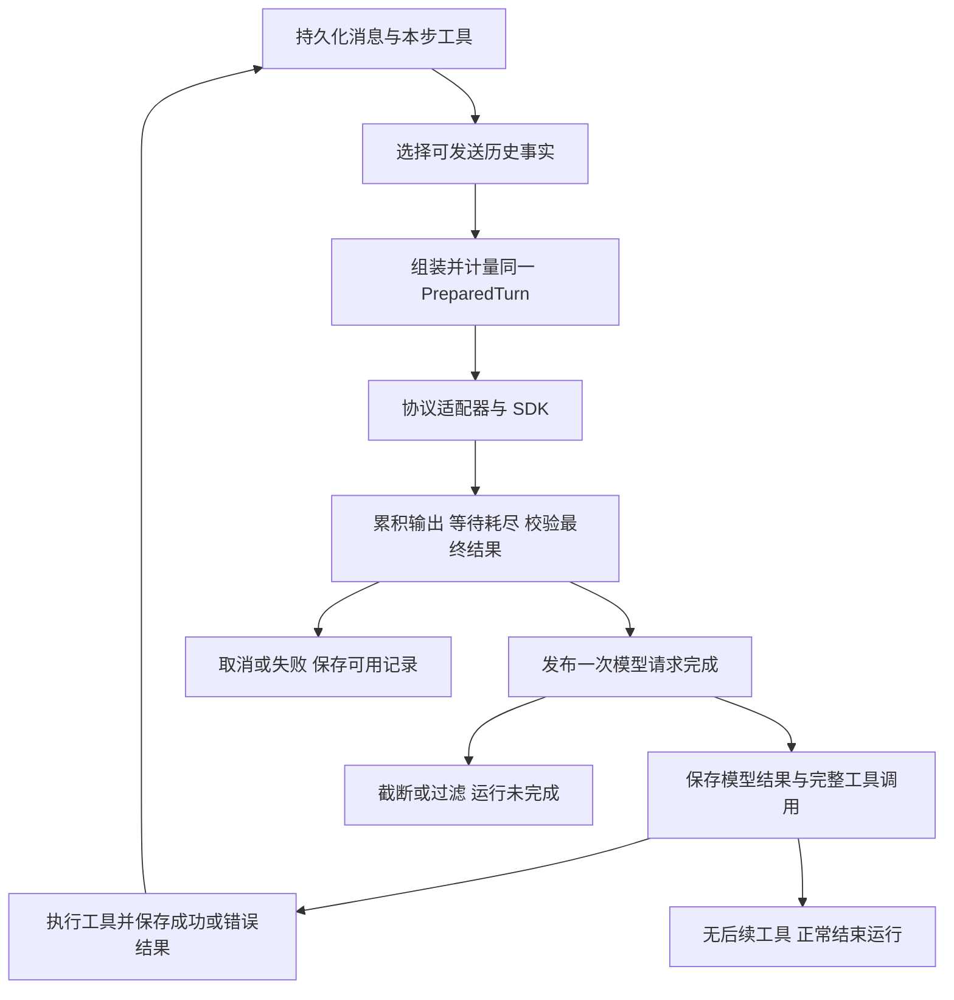

# 02：实施合同与文件级范围

目标基线：`8409a863`。状态：用户已授权按批次实施，本文不记录实施进度。用户决定以 00 为准；Q1 两层处理已获确认，Stage C 的断流正文分支按该决策执行。

## 2.1 方案总览

沿用一个 Lifecycle、一个自有消息模型和三个协议适配器。修复完成事件与过滤结果，统一普通请求/摘要对失败历史的选择规则；保留 SDK 与项目重试配置、工具调度和压缩策略。

图中的“完成”不是持久化成功；F 后 G 失败必须结束运行且不执行工具。正常工具错误走 H 回到 A。断流/取消不得沿 F 假装取得正常模型终态。

## 2.2 决策与代价

| 项       | 选择                                                                           | 代价/明确不采用                                                             |
| -------- | ------------------------------------------------------------------------------ | --------------------------------------------------------------------------- |
| 工具累积 | 以 callId、name、argumentsJson 等自有语义替换 function 嵌套，继续按 index 累积 | 三协议顺序和参数必须回归；不新建 IR                                         |
| 完成     | 最终快照唯一、模型完成事件唯一，运行终态独立                                   | 调整依赖旧重复事件的测试和消费者                                            |
| 错误分类 | 复用 MessageError 的判别联合；分类在失败发生点保存                             | 少量新错误分支需要同步事件 schema；不增加 isPartial/shouldReplay 等并行开关 |
| 失败正文 | 原始记录不变，仅在发送/摘要入口派生有限文本，见 §2.4                           | 请求内容与估算可能变化；不复活失效 native                                   |
| SDK 重试 | 保留 SDK 默认和项目现有配置，观测分层，见 §2.5                                 | 次数叠加继续存在，本轮不声称已解决总预算                                    |
| Context  | 沿用已有快照、工具配对、runtime reset、thrash，见 §2.6                         | 不实现“相同历史永不摘要”的新策略                                            |

## 2.3 完成、失败和用量合同

### 字段职责

- `isComplete`：本次流的最后一份结果快照；正常终态及 abort 部分快照可以保留该表示，不能据此判定运行成功。非最终快照为 false；一次尝试至多一份最终快照。
- `finishReason`：provider 给出的结束原因，不用本地取消或无终态 EOF 伪造 stop。
- `streamStopReason`：沿用已有本地停止事实，Lifecycle 必须消费它。源头仅在确有本地取消 signal 时设置 user_aborted；provider 自报 abort 但本地 signal 未取消，按请求中断失败处理，不伪称用户取消，也不据此放入断流正文白名单。必要时仅在内部 StepResult 透传同一字段，Worker 保持本地 signal 优先判取消。
- `llm:complete`：生成器正常耗尽、取得合法 provider 终态、所需工具/native 校验完成之后，发布一次。length/filter 也是可靠请求终态，但运行未完成。
- 运行仍使用既有 succeeded/failed/cancelled 等状态和 terminalReason；不新增独立 incomplete 状态机。`content_filter` 补明确运行原因和 UI 错误映射，不能落入默认 retryable=true。

Lifecycle 在 for-await 内保留最终候选，耗尽后再对外发布；晚到错误/overflow 丢弃候选。底层累积器也应只发布一份最终快照，不能只在 UI 去重掩盖生产重复。

必须同步处理纯文本早退、空流、仅 usage、reasoning-only、abort 等路径：空流或无终态 EOF 不得伪造完成；stop 空正文与无终态不同。模型摘要仍要求 stop、非空、正常耗尽，不能因为 length/filter 正文可进历史而接受截断摘要。

### 接受与保存顺序

1. 正文增量可按现有方式保存并展示。
2. 完整消费、解析、校验 provider 结果；在此之前不接受原生续接状态，不执行工具。
3. 发布模型请求完成并处理该接受结果的 usage；同一步只观察/聚合一次，配对该次 PreparedTurn。
4. 原生步骤沿用既有 commitModelStep 原子保存；其它路径保持现有保存顺序。工具执行前必须成功保存相应模型结果和完整调用；保存失败结束运行，该步工具零执行。不扩大为全协议持久化事务重构。
5. 工具返回成功或业务错误后保存对应结果，再决定下一步。工具失败不是自动结束 Agent 的条件。

取消与用量按以下时序处理，不再用“已有 usage 就已完成”判断：

- **接受前主动取消**：即使先看到 stop+usage 候选，也不发 llm:complete，不调用 onStepUsage，不做校准，不纳入可信 Step/cache 账本。已观测 token 数可以进入 Run 的部分汇总，但 usageComplete=false、清除不再完整的 inputBreakdown；此前已接受步骤的数值保留。沿用现有 aggregateTokenUsage 的未知/下界语义，不新增字段或补零。
- **接受后取消**：已发布的完成和可信步骤用量不撤销，运行仍可 cancelled；后续未完成步骤按上一条处理。
- **旧 overflow 尝试**：候选完成和 usage 不进入接受步骤统计；恢复请求使用自己的 PreparedTurn。协议校验失败也不成为可信 Step。

基线有“stop+usage 后、耗尽前取消仍 usageComplete=true 并校准”的测试；必须拆开接受前/后的断言。这是本轮收紧接受时机的变化，不能声称旧行为已经符合新合同。

## 2.4 失败历史与正文投影合同

### 可靠分类先于投影

复用 `AssistantMessage.finish/error`，从发生点写结构化分类，禁止恢复时匹配英文错误文案或按整个 Run 状态猜测每条消息。

- length 复用 `MessageOutputLengthError`；主动取消复用 `MessageAbortedError`。
- filter 与明确的 transport/无终态 EOF 中断，各补必要的错误判别分支（建议 `MessageContentFilterError`、`MessageStreamInterruptedError`）。保留既有 APIError/Unknown 兼容，不回填猜测旧记录。
- `ProviderStreamInterruptedError` 当前会包装协议/native 校验失败，不能全部进入断流白名单。若需要保留 transport/EOF 来源，应在产生处做最小类型区分；这只用于历史政策，不扩展自动重试名单。
- 旧 Unknown/APIError 或来源不明的失败继续按旧规则过滤；空错误记录不产生空 assistant。

### 原始记录、发送材料和摘要材料

| 结果                                        | 原记录                              | 下一次用户主动请求的材料                            | 工具/native                                        |
| ------------------------------------------- | ----------------------------------- | --------------------------------------------------- | -------------------------------------------------- |
| 正常 stop/tool_calls、校验并保存成功        | 保留                                | 既有正常历史                                        | 继续按原生合法性及配对规则发送                     |
| 正常耗尽的 length/content_filter            | 保留正文、usage、明确原因，运行失败 | 已保存可见正文 + 未完成原因；无正文则只保留必要事实 | 不发送该失败输出中的工具/native                    |
| 明确 transport/EOF 中断（Q1 已确认）        | 保留正文及结构化错误                | 从可见正文派生中断片段；无正文仅必要中断事实        | 原失败协议消息过滤，不回放未完成参数/原生状态      |
| 主动取消                                    | 保留记录                            | 只保留取消事实，不带该取消请求的部分正文            | 此前已接受的完整工具事实保留；未知结果不能写成成功 |
| 协议校验、JSON 参数损坏、存储故障、未知错误 | 保留可保存的事实                    | 原失败消息不回放；不据文案恢复正文                  | 不执行不可信调用，不复活 native                    |

“可见正文”必须同时满足：来自已保存 TextPart、active、未 compacted、非 ignored、非 synthetic、非 isModelContextPart。不得从异常文案、内存暂存、ReasoningPart、ModelState 或工具参数拼造正文。

派生材料建议沿用 **assistant 角色的纯文本历史**，固定说明其为应用生成的未完成记录，正文维持原顺序；不提升为 system 指令，不伪造用户新命令。工具配对继续走正常工具路径，不揉进正文；通知文案由实现固定，不增加用户配置。

投影在原消息所在位置产生，不覆盖原文、不创建新的“成功 assistant”持久记录、不逐轮累加说明。只在用户实际发起后续请求时发送，不新增“继续”关键词识别或自动续写。主动取消发生在工具阶段时，不得为写取消事实而把已接受的工具消息改为 error；在该已接受 assistant 上追加一次固定的 synthetic 说明 Part；该说明须在完整调用/结果之后单独投影为普通 assistant 文本，不得混入原生正文或提升指令权限。

普通请求与**真实摘要请求**必须复用同一套历史事实选择规则。摘要仍保留工具名、输入、结果、状态；取消正文不能经摘要绕回模型。只调整摘要输入的语义投影，不改变选段、剪枝、摘要生成/重试、退休算法；默认 readable scoring 不因顺手共用 helper 而改变。

**固定说明与保存位置**：默认保持原 assistant + 结构化错误，只在发送时从 active 可见正文派生历史。没有可用正文，或主动取消需要事实说明时，在该 assistant 上追加一次现有 TextPart（synthetic=true、metadata.kind="lifecycle-interruption"），通过现有 Part 存活期参与摘要与退休。已有该 Part 不追加第二份；不新建消息类型、消息版本或 SystemMessage.abort 管线。SystemMessage 类型虽支持 abort/info，基线没有生产 abort 写入流程。

固定文案在代码中定义，不做配置：

- length：`[Response incomplete: output limit reached.]`
- content_filter：`[Response incomplete: content was filtered.]`
- 明确断流：`[Response interrupted: the saved text below may be incomplete.]`
- 主动取消：`[Response cancelled by the user.]`

有正文时，发送材料为固定说明、换行、已保存正文；说明跟随所选正文的存活期。无正文的说明 Part 单独发送一次，退休后不再出现。工具阶段取消用上一段的独立说明投影，保持原生 assistant 正文及调用/结果一致。`streaming.ts` 当前无正文 abort 生成的 `(Interrupted)` 是本地合成占位，必须移除，不能持久化成模型正文或作为断流投影材料；不按字符串判断真实模型输出是否可用。首次模型请求尚未开始就取消，没有 assistant 时只保留既有运行取消状态，不为此新建消息流水线。

普通请求、实际摘要与计量复用一个小的事实选择函数，读取相同 Part 状态；不从 Message.error 为每个 bucket 无条件再生说明，不创建第二套历史管理系统。

新的正文/说明计入实际 PreparedTurn；composition 将每份派生文本只归属一次（会话历史或所属子代理范围），不能因多个 bucket 分别序列化而重复注入。已经退休的正文/说明不可因错误分支复活。

### 兼容与最小实现限制

现有 JSON Message 存储可承载错误分支，不新增 SQL 列/迁移。不建立独立重放日志、消息版本树或回放布尔字段组。新版本读取旧数据保守过滤；旧程序的 Zod schema 未必认识新增 variant，回退时不能宣称旧事件订阅完全兼容。正式实施需验证 SQLite 重开后政策一致。

## 2.5 重试合同（保留行为）

- SDK 当前默认 2 次额外重试；项目每模型步骤默认 5 次额外重试。对双方均可重试、始终无有效输出且未取消的同类错误，一个不含 overflow 恢复的步骤通道理论上最多 18 次 HTTP 尝试；这不是整 Run/摘要/overflow 的全局上限。
- `llm:retrying` 表示项目层重试，不等于所有 HTTP 尝试。测试同时记录 provider 调用次数、SDK fetch 次数、外层重试事件，生产不为补数字引入全局 fetch monkey patch。
- 保留次数、退避、Retry-After、错误名单；既有 SDK 错误包装和内层重试不可见限制如实记录。测试暴露取消等待延迟也要记录，不能偷改 SDK 策略后称“配置不变”。
- 有正文、推理或工具参数后不再由项目重试同一步；过滤/截断不自动续写。UI 的 retryable 错误提示不是自动重试策略。
- overflow 保留一次 force prepare 后重试；旧尝试的完成候选、usage、native 不能泄漏到新请求或新模型。

## 2.6 截图管理规则的落实

| ID  | 本轮可验收的承诺                                                                                                                        | 保持的边界                                                                  |
| --- | --------------------------------------------------------------------------------------------------------------------------------------- | --------------------------------------------------------------------------- |
| M1  | 每步按当前历史与工具组装、计量并发送同一个不可变 PreparedTurn；改变投影或压缩后重算                                                     | 已冻结请求不会随数据库并发修改而即时变化；估算不是服务端 token 真值         |
| M2  | 过滤、压缩、重开后，已接受工具调用与结果仍合法配对；失败结果如实回传                                                                    | 保留既有按消息切分/native 原子保护，不承诺有损摘要逐字保留工具输出          |
| M3  | 仅通过现有 ui-inprocess.connectModelInternal 入口验证禁止运行中切换，重建 runtime 后使用新窗口/校准状态；旧 overflow 不触发新模型 force | 不给所有 session maps 新增 model 维度；session cache 累计账本按既有合同保留 |
| M4  | 压缩后按新历史重新计量；遵守既有每 run 压缩上限与连续低收益锁，force 保留例外                                                           | 不新增历史指纹去重，不承诺同一历史一次后绝不再次摘要                        |

基线 M4 是最近 2 次节省均不足 10% 后锁定、input-budget 使用比例增加 0.05 可解锁、每 run 自动压缩上限 2；这些是现状，不是本轮新阈值。完整窗口 95% 只用于自动摘要触发，不能将其它策略的 usageRatio 一并改分母。

## 2.7 批次、文件范围与完成定义

下表各 Stage 均属于 improve-7。先建立失败断言，再做小范围改动；文件级范围不等于要求每个文件必须修改。

| Stage                | 文件级范围（packages/ohbaby-agent/src 下）                                                                                                                                                                                        | 完成定义/04 对应                                                                       |
| -------------------- | --------------------------------------------------------------------------------------------------------------------------------------------------------------------------------------------------------------------------------- | -------------------------------------------------------------------------------------- |
| A 工具累积           | core/llm-client/streaming.ts、types.ts 及原有测试                                                                                                                                                                                 | 自有字段累积；分片/多调用/顺序/三协议映射不变；T01、定向协议集成；另做轻量真实工具循环 |
| B 完成与终态         | core/llm-client/streaming.ts、types.ts；core/lifecycle/lifecycle.ts、types.ts；runtime/run-manager/error-detail.ts；必要的 worker/现有 UI bridge 消费者                                                                           | 模型完成唯一；EOF/abort不伪成功；filter失败且usage保留；T02–T08、T15、E2               |
| C 历史事实交接       | core/message/types.ts、events.ts；lifecycle.ts；必要的 llm-client/provider 错误来源；core/context/serializer.ts、serialization.ts、token-estimation.ts；adapters/ui-runtime/prompt-context.ts；可用一个小的共享纯函数承载选择规则 | 按已确认 Q1；普通请求、摘要、计量、SQLite一致；T09–T14、T18、E3                        |
| D 管理规则与最终集成 | 现有 context/lifecycle/runtime/controller 与协议集成测试；tests/smoke/formal-cache-session.ts 及独立 loop E2E；只在复现后最小修复相关生产入口                                                                                     | M1–M4、重试保留、主子隔离及全链路验证；T16–T22、E4；不得把新压缩策略塞入修复           |

Stage A 的核心完成条件为 T01 与定向三协议 fixture；按用户每批真实 E2E 要求另做轻量三协议工具循环，不将整条 E1 绑定为 A 的出门条件。每批都完成适用单元/集成与真实 E2E，独立审查后按已有授权本地分批提交；最终执行 preflight。失败不得靠换模型、删除断言或降低阈值掩盖。依赖阶段可累积验证，但记录每个证据对应的 commit/工作区状态。

实施必须同步相关权威模块说明：`docs/core/llm-client/{data-model,dfd-interface}.md`、`docs/core/lifecycle/{architecture,data-model,dfd-interface}.md`、`docs/core/message/data-model.md`、`docs/core/context/{data-model,dfd-interface}.md` 的受影响章节。只说明当前实现和新合同，不改历史轮次验收，不将未实现目标提前写成事实。

## 2.8 风险、回滚与范围外

- 先保存缺陷复现；Stage A 可独立回退，Stage B/C 回退需一起检查新增错误 variant 与事件 schema。纯文档没有数据库变更；实现后回滚不删除会话记录。
- 新增投影导致 token 数变化属于可解释变化；对照实际发送内容验收，不回调估算去贴旧快照。
- 对证据不足的新问题先复现并确定根因；超出普通计量/语义交接的压缩策略改动，登记后续候选并另行讨论，不默默扩范围。
- 不在本轮：压缩/prune 算法优化、SDK 重试统一预算、自动续写、崩溃后自动重放写工具、流式提前执行工具、服务端会话链、默认协议切换、重做 UI/权限/缓存控制。
- 本规划不授权 merge/push；实施结果和未测边界写 05，不用回写本文件充当进度表。
