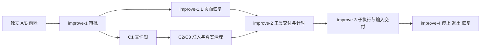

# 执行可靠性改造路线

> 开启日期：2026-09-19。首轮基线：`93d4482c` / v0.1.13。improve-1 文档于 2026-09-21 按讨论及审核反馈修订，尚未实施；improve-2、improve-3 于 2026-09-20、improve-4 于 2026-09-21 按用户明确要求提前规划，调查基线为 `039dca95`。四轮按职责主动切割；后续实施仍须等前轮验收通过，再按实际代码修订接线。第三、四轮文档均待用户审查，不代表已实施或验收。

## 目标与固定边界

先解决“任务等待用户批准，用户却找不到入口”，再补齐执行过程、子代理可见性和停止恢复。默认 TUI 永久 in-process；serve 为 Web 提供共享运行后端；两者可共享 SQLite，但不共享实时协调、审批或 prompt queue。不得借此改成 TUI 自动 attach daemon。

参考既有取舍：[全局 serve 讨论](../2026-07-11-global-single-daemon/00-discussion.md)、[路线 C](../server/07-route-c-cli-inprocess-explicit-server.md)。本议题覆盖已有已确认取舍的部分修订，不将早期已废弃的默认 daemon 方案重新启用。

## 四轮 goals-duty 与路线

| 轮次 | Goal | Duties / 大致方案 | Non-Duties | 交付依赖与状态 |
|---|---|---|---|---|
| improve-1 | 待审批请求找得到、答得了，执行结束后不会留下可批准请求 | 独立 pending registry；真实 run/session/call 身份；根主会话汇总；Web 多页共享；断连恢复；回答/撤销一次生效；最小 Web/TUI 适配 | 完整工具阶段展示、子代理只读面板、全树停止重写、跨进程审批恢复 | 2026-09-19 开启，本文档集为规划契约 |
| improve-1.1 | 页面快照与事件续传正确衔接 | 真实消息身份、按会话版本与当前完整输出、思考结束保存、历史分页、独立控制条件；附加读取局部失败 | 不重做第一轮审批保证，不承担第四轮冷恢复 | 2026-09-21 登记、09-22 完整规划；未实施；第一轮验收后、第二轮实施前；[文档集](improve-1.1/README.md) |
| improve-2 | 让工具等待与执行过程可解释 | 消费前置并发/清理接口；独立审批；逐项保存展示、整批交付；状态、计时和保存失败中断 | 子代理生命周期重写；通用文件隔离/跨进程锁 | 2026-09-20 开启；09-21 已确认职责与残留 Bash 范围；实施前验收 improve-1、1.1 和并发与资源保护前置 C |
| improve-3 | 子代理可见，结果可靠交给主代理，当前任务可调整方向 | 后台终态自动交付；正常结束前有期限等待，任意终态/Steer或60/120秒到期唤醒；有限执行事实与status增强；普通消息排队；队列项 Steer；SQLite 结果与应用目录 .output、内部只读授权和清理；子树只读、根审批 | 模型 wait/read_result/read_history 工具、运行中 A2A、自动扩大权限、跨进程接管 | 2026-09-20 按用户要求提前规划；实施依赖前两轮验收及独立前置实际接口，分 Stage 仍属同一轮 |
| improve-4 | 统一停止、中断、服务退出和记录恢复 | Stop整树后自动推进普通队列；旧资源保持保护；实例复用但旧待办退队；有限关闭和实际退出确认；冷恢复旧消息保留手动发送；失败隔离 | 默认TUI daemon化；副作用重放；跨重启进程接管/自动杀进程；全盘垃圾回收；继续队列按钮 | 2026-09-21 用户确认范围后提前规划；待审查；实施依赖前三轮实际验收，详见本轮02/04 |

用户不能单独停止某个子代理，子代理生命周期由主代理通过既有工具管理，不将独立用户控制入口列为后续候选。主会话 Stop 的目标是中断该任务树当前活动执行；主代理和子代理执行采用 interrupted，保留历史及实例。工具/job/request 可以有自己的 cancelled 等终态，不能机械统一枚举。已完成任务不改写。**这是目标，不是现有实现已覆盖整树的声明。**

## 文档地图与阅读顺序

第一轮：审批入口与恢复。

1. [00 已确认决策](improve-1/00-discussion.md)
2. [01 现状与问题](improve-1/01-problem-analysis-and-current-state.md)
3. [02 实施契约](improve-1/02-optimization-plan-and-change-scope.md)
4. [03 六个项目借鉴](improve-1/03-reference-projects.md)
5. [04 测试与验收](improve-1/04-test-and-acceptance.md)

第一轮后的会话恢复改造：[improve-1.1 页面快照与事件续传一致性](improve-1.1/README.md)。用户已确认排在 improve-1 后、improve-2 前；2026-09-22 已按讨论形成 00–04 规划，未实施；不改变其余四轮编号。

第二轮：工具交付、状态、计时和清理事实接线。入口见 [improve-2 README](improve-2/README.md)。

1. [00 已确认决策](improve-2/00-discussion.md)
2. [01 现状与问题](improve-2/01-problem-analysis-and-current-state.md)
3. [02 实施契约](improve-2/02-optimization-plan-and-change-scope.md)
4. [03 六个项目借鉴](improve-2/03-reference-projects.md)
5. [04 测试与验收](improve-2/04-test-and-acceptance.md)

第三轮：子代理交付、有期限自动等待、有限执行事实和当前任务输入。入口见 [improve-3 README](improve-3/README.md)。

1. [00 已确认决策](improve-3/00-discussion.md)
2. [01 现状与问题](improve-3/01-problem-analysis-and-current-state.md)
3. [02 实施契约草案](improve-3/02-optimization-plan-and-change-scope.md)
4. [03 参考项目及 ZCode 补查](improve-3/03-reference-projects.md)
5. [04 测试与验收](improve-3/04-test-and-acceptance.md)

独立前置工作见 [最终结果提取、文件工具增强与并发资源保护](pre/prerequisite-follow-ups.md)。A/B 保持原先安排；2026-09-24 用户明确 C 在 improve-1 完成后、improve-2 开始前实施：C1 文件锁正确性独立验收 → C2/C3 访问范围、跨会话准入、Bash 批次内调度与真实清理组合验收。已知文件按资源保护；未知残留 Bash 限制来源主会话及其子代理，其他独立主会话继续。C 与 improve-1、improve-1.1 均实际验收后进入 improve-2；第二轮消费基础接口，不重复实现锁和清理。全部仍为规划。

2026-09-24 实施状态更新：A 及验收补修已包含在开发分支 `b2e1c23b`；B 已从该点在本地 `codex/execution-reliability-pre-b` 完成实施、测试与子代理/Pi 审查，尚未合并或推送，详见 [B 的实施与验收记录](pre/b-file-tools.md#2026-09-24-本地实施与验收记录)。本页早期“仍为规划/待细化”保留讨论时点；C 和后续轮次不因 B 完成而视为已实施。

第四轮：停止、退出和冷恢复。入口见 [improve-4 README](improve-4/README.md)。

1. [00 已确认决策与用户原话](improve-4/00-discussion.md)
2. [01 现状与历史设计差异](improve-4/01-problem-analysis-and-current-state.md)
3. [02 实施契约草案](improve-4/02-optimization-plan-and-change-scope.md)
4. [03 六个项目借鉴及边界](improve-4/03-reference-projects.md)
5. [04 测试与验收](improve-4/04-test-and-acceptance.md)

第四轮对前文的窄修订：冷恢复消息不自动调度；手动重新发送使用本次接受时间计时/排序；恢复遗留工具结果明确未知；第三轮产物恢复只核对已登记事实，不承诺全盘垃圾回收。前三轮保留原阶段职责，第四轮实施时按其实际05衔接。

每轮的 `05-implementation-acceptance.md` 预留给该轮实施后的独立验收，规划不创建，也不把文档审查写成实施通过。

## 顺序实施与跨轮交付检查

实施顺序保留：独立A/B按原先整项前置安排完成；improve-1 → improve-1.1 → improve-2 → improve-3 → improve-4。C在improve-1完成后按C1 → C2/C3推进，在improve-2前验收；与improve-1.1的相对顺序未进一步固定。A/B目前尚有待细化方案，已确认内容随讨论记录到pre；1.1已展开规划但未实施，不因为四轮文档齐全就视为完成；本次对齐不代替这些独立讨论，也不改轮次编号。

2026-09-24 全面审核后的推荐线性安排：A → B → improve-1 → improve-1.1 → C1 → C2/C3 → improve-2 → improve-3 → improve-4。用户已确认 C 的特殊合并门：C1 与 C2/C3 各用本地临时分支，后者从前者提交继续；组合验收通过后再依次合回开发分支，避免只有 C1 时旧 scheduler 的全局写槽长期阻挡其他调用。C1 独立锁层验收不代表整项 C 可用，详见 [C.2](pre/c-concurrency-and-resource-protection.md#c2-三阶段实施及最小交付)。本安排不新增 C 与 1.1 的技术依赖。



下表定义责任交接，详细字段以各轮02为准。后一轮缺接口时先回到负责方补齐并复验，不能降级为猜测身份或在前端另写状态机。

| 提供方 → 消费方 | 必须交付的事实/能力 | 第四轮组合验收 |
|---|---|---|
| improve-1 → 2/3/4 | 权威pending、真实身份、根审批、撤销一次生效、独立健康状态；执行恢复不能解除审批故障 | T07/T39，回归第一轮撤销与冻结 |
| improve-1.1 → 2/3/4 | 按会话当前值与事件衔接、分页和扩展事实通路；协议见本轮02，实际能力以05为准 | T32/T39/T41，快照不覆盖新状态 |
| C → 2 → 4 | 执行准入、跨Run资源保护、工具/job所属、清理观察与有限预算；2负责可靠保存和投影 | C14/C15 → 第二轮相关测试 → T10/T11/T36/T37 |
| improve-2 → 3/4 | 逐项可靠结果、整批模型交付、保存fatal、独立工具/模型计时；保留失败原执行事实 | T09/T21/T35～T40，不恢复失败的A |
| improve-3 → 4 | 排队/创建即有execution/root归属，基本终止传播、结果/产物保留、输入请求证据、旧唤醒关闭 | 第三轮T21/T46～T56 → T03～T08/T25/T41 |
| improve-4 → 全链路 | 原环境补登记后推进有效queued；冷恢复retained；实际进程退出确认；TUI/Web一致操作 | 第四轮全部测试与前轮对应回归，产出本轮05 |

2026-09-22对齐：正常Stop/清理静默，异常实际阻塞工具走普通工具错误；停止关键登记失败由后端有限重试和共享恢复检查处理；确切未发送Steer仅在queued区域上方显示英文提示，不暂停队列。产品共识见[第四轮D9～D12](improve-4/00-discussion.md)，不是对前三轮新增反向实施依赖。

## 模块文档入口与权威关系

模块侧路线说明分别位于：[permission](../../permission/improve-2/README.md)、[scheduler](../../core/tool-scheduler/improve-2/README.md)、[lifecycle](../../core/lifecycle/improve-3/README.md)、[agents](../../agents/improve-3/README.md)、[session](../../services/session/improve-1/README.md)、[SDK](../../ohbaby-sdk/improve-1/README.md)、[server](../../ohbaby-server/improve-1/README.md)、[Web](../../ohbaby-web/improve-1/README.md)。

职责和模块衔接在模块路线中解释；**各轮跨模块协议、阶段和验收以该轮 02/04 为唯一实施契约**，模块页不复制第二套字段和测试矩阵。原模块 architecture/goals-duty/test 完全不修改；改造路线写在各模块新建 improve-x/README.md，与此处双向链接。模块编号独立递增：permission/scheduler 为 improve-2，lifecycle/agents 为 improve-3，其余为 improve-1；它们都服务于本议题 improve-1，不代表四轮进度。后续修改原权威文档需另行确定，本批不进行。

improve-1.1 的模块新增路线：[lifecycle improve-4](../../core/lifecycle/improve-4/README.md)、[message improve-1](../../core/message/improve-1/README.md)、[session improve-2](../../services/session/improve-2/README.md)、[SDK improve-2](../../ohbaby-sdk/improve-2/README.md)、[server improve-2](../../ohbaby-server/improve-2/README.md)、[Web improve-2](../../ohbaby-web/improve-2/README.md)。各含模块现状、职责与测试入口，并回链中央文档；不修改原模块设计或覆盖第一轮模块记录。

## 证据与范围切割

[前次真实诊断](evidence/2026-09-19-serve-stalled-tools.md)包括真实 serve、两种模型和浏览器复现。两个权限恢复缺陷最迟 v0.1.12 已存在；工具状态弱化的明确提交为 `53fae946`。本轮不把所有历史长等待都归因于权限。

后续轮次是用户主动按职责切开的议题，不是把一个实现分多次会话就创建多轮。每轮独立规划、实施、验收；下一轮研究仍逐一查看六个参考项目当时的相关实现。

## 本地分支与合并路线

用户确认采用“整项开发分支 + 每轮实施分支”，所有分支先保持本地：

```text
main
 └─ codex/execution-reliability            整项开发分支，规划与各轮验收汇总
     ├─ codex/execution-reliability-pre-a     A 最终结果返回链
     ├─ codex/execution-reliability-pre-b     B 文件工具
     ├─ codex/execution-reliability-improve-1  第一轮实施、测试、验收后合回
     ├─ codex/execution-reliability-improve-1.1  第一轮之后完善整页恢复
     ├─ codex/execution-reliability-pre-c1    C1 锁层验收后暂不合回
     │   └─ codex/execution-reliability-pre-c2-c3  从 C1 继续，组合通过后两支依次合回
     ├─ codex/execution-reliability-improve-2  从已验收第一轮、1.1 及其独立前置的开发分支创建
     ├─ codex/execution-reliability-improve-3  从最新开发分支创建
     └─ codex/execution-reliability-improve-4  从最新开发分支创建
```

当前已建立 `codex/execution-reliability`；第一版 improve-1 规划已提交为 `039dca95`，2026-09-24 本次全面审核基线为 `4956e0e9`，审核开始时工作区干净，既有 improve-1.1 规划修订已提交。本次仅调整规划，没有创建实施分支或执行合并。实施开始前先将已确认规划形成可追踪提交，再从最新开发分支创建对应临时分支；C2/C3 按上述约定从 C1 提交创建。全部使用当前 checkout 的本地分支，不使用 worktree，不带着未提交规划切换多个阶段分支。

每轮按自己的 02/04 实施，独立审查后产出 05，解决阻断项并完成检查再合回开发分支。合回后验证跨轮组合，下一轮以实际代码和 05 为基线修订规划。四轮全部验收后，在开发分支完成综合回归与最终审查，再整体合入 main；阶段完成不直接合 main。分支合并本身不等于测试通过，也不自动发布或推送远端。

C1/C2/C3 的例外只在合并时点：C1 先留独立锁层验收证据，C2/C3 连同 C1 通过整项组合门后，先合 C1、再合 C2/C3，最后验证开发分支上的组合结果。轮内 Stage 仍用小提交和内部验收推进，不将半套 SDK/server/client 协议视为整轮完成。包括 improve-1 在内，每批动手前都先核对前置合入后的真实接口，尤其 A 与第一轮共同涉及的 completion/runner 返回链。

诊断报告集中在本议题 evidence 下，后续复现材料注明版本与证据类型，不能把最初诊断结论当作当前实现验收。
