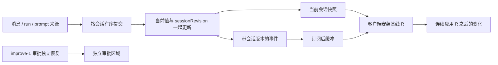

# 02 方案与改动范围

> 2026-09-22 建立、09-23 修订的规划契约，未实施。产品边界来自本轮 00，含 D8–D12；展示思考保存失败不停止 run，超限明确降级。以下为落实这些边界的工程选择，实施前须依据 improve-1 实际代码和 05 校正接线。字段名可按仓库惯例调整，身份、顺序、独立性及错误语义不可削弱。

## 2.1 总体方案

在 agent 的应用适配层维护按会话分区的**恢复读模型**：它负责“页面现在应该看到什么”，不成为任务、消息、审批的第二个业务权威。正文和工具历史仍由 message store 保存，run/输入队列仍由 runtime/scheduler 管理。server 只传输，不另养一份状态。

全局 seqNum 仍作为 SSE 传输游标，**不作为会话快照的业务版本**。不等待全局事件安静，不把全页数据塞进一个大事务，不新增持久事件日志或跨进程协调服务。

### 必需范围与复杂度上限

- 正确性基础：真实消息身份、当前累计值、与版本一起提交、基线和事件衔接、读取不触发执行、独立操作条件。先以 S1 的真实来源集成验证这些内容。
- 已确认的配套：当前会话优先和 SQL 分页、思考结束保存、旧消费者迁移。它们同属本轮，不把用户已确认的按需历史改成全项目扫描，也不将这轮描述为轻量补丁。
- 有限保障：receipt 复用现有提交去重记录，只查询未知结果；投影修复只重建当前会话视图，自动与显式重试共用同一入口及预算。没有持久事件回放服务、后台修复调度平台、自动重发或逐组件状态机。
- 复用分层：源端维护事实，应用层维护一份会话视图，SDK 复用纯版本比较与合并逻辑；Web/TUI 只保留必要交互差异。server 不再建立第二份业务视图。以下编号是各自机制所需的身份，不是八套恢复框架。

## 2.2 源端、版本与一致性边界

### 来源身份先统一

- 正文、思考、工具 part 从执行源头携带真实 sessionId/runId/messageId/partId；多次模型调用各用自己的真实消息归属。沿 lifecycle、worker/bridge、run-stream-adapter、SDK 传递，取消将多条真实 assistant 合并进单个展示替身 ID 的路径。
- 不用文本匹配、当前 active message 猜归属，也不把 callId 当 runId。历史读取与 live 更新复用同一 projector，保留已有可选 metadata；第二轮扩展阶段和计时无需另写恢复算法。
- 正文/工具等执行事实先保存，再提交相应展示事实；展示思考按 D8/D10 先提交来源累计值及 pending，再独立保存，结果回来后提交 saved/failed，不要求每个增量写库。事件中有完整 content 时按当前值替换；只有 delta 时必须由连续版本保证追加恰好一次。

### 初始化不能靠打开页面

每个会话在接受本 runtime 的首次写入前完成一次初始化，包括 prompt 接受、goal 驱动、消息写入与首个 run，而不只是“模型即将开始”时初始化。初始化先读取已保存基线，再开放该会话的写入和事件提交；已有活动会话直接使用持续维护的读模型。

该屏障只覆盖对应会话的有限数据库读取和内存建模，不覆盖模型请求、工具执行、审批等待、整个项目或全量历史。历史仍分页，运行所需的初始化保持原生命周期语义。不能边读较新的数据库状态，边把读前积压的无版本 streaming 事件重放上去，导致终态退回 running。

将 promptScheduler.init/drain、goal rebuild/修复安排到 runtime 明确的初始化/恢复入口；页面 snapshot、history、control 查询必须纯读。此调整不重写第四轮冷恢复策略，也不改变队列原有业务推进规则。

具体沿用现有 owner 接线，不建立通用初始化框架：

| 入口 / owner | 本轮接线与顺序 |
|---|---|
| `adapters/ui-persistent.ts` 的 `startupRecovery → startupReady` | 保留现有孤立 run 处理和初始会话选择；完成后显式启动 backend/workspace 的一次就绪过程，再开放 prompt 接受和已有队列推进。`withStartupRecovery` 等待已启动的过程，GET 不负责启动它。内存 backend 使用同义的明确就绪入口 |
| `WorkspacePromptScheduler.init()` / `drain` | 当前 init 会直接 requestDrain；将这次启动从 snapshot 移到上述就绪阶段。在 accept、drain 实际执行、goal 驱动及其他消息生产入口共用按会话 seed 屏障；屏障内部不能调用会反过来等待自己的 drain/init。后台没有页面时照常推进 |
| `GoalService.storeFor` / `GoalStore.rebuild` | 轻量 goal owner 在应用 composition 共享，先脱离昂贵模型 runtime 的创建；显式首次选择/创建/执行会话时初始化一次，恢复既有 active→paused 等规则，再开放该会话写入。查询只读已初始化值；非必要 goal 正文未就绪可 unavailable，控制归属未核实不可猜 idle。删除 snapshot 中反复直接 rebuild 的 fallback |
| `InProcessRuntimeController.getRuntime` | 仍由实际执行懒加载；不能为读历史或控制而调用它。模型 runtime 复用上述 goal owner，不能再次 normalize 活跃 goal；composition 中既有子代理恢复不因浏览器 GET 而触发 |
| 会话视图 seed | 由应用层负责；首次显式选择/创建/执行先读有限基线，后接该会话写入。查询可等待已启动的 seed，不创建执行副作用。迟到 seed 不覆盖更新后的视图；同会话共享初始化 Promise，失败明确返回，不让其他会话等待 |

默认 TUI 和 serve 通过同一 backend composition 执行以上初始化，各自在自己的进程里；不是 TUI 连接 serve。第四轮以后可以改变冷恢复政策，本轮仅迁移原政策的触发位置，不新增自动续跑旧任务。

### 按会话提交，快照取同一个版本

读模型作用域为 backend runtime 实例＋workspace＋session。`runtimeEpoch` 与 improve-1 的 `permissionEpoch` 使用**同一个 owner 生成的同一个实例 token**，仅为兼容既有协议保留不同字段名；不各自生成或递增。局部读模型重建用 `viewGeneration` 区分代际（详见 §2.6）；`sessionRevision` 在该会话的同一代际内单调连续递增；不与 permissionRevision 或全局 seqNum 混用。

### 编号职责表（唯一解释）

| 编号 | 谁生成 / 何时改变 | 谁使用 / 比什么 | 明确不做什么 |
|---|---|---|---|
| `sessionId/runId/messageId/partId` | 各业务 owner 在实体创建时生成；沿真实来源传递 | 判断变化归属及同一实体；Stop 校验确切 run | 不比较大小推断新旧，不用 callId 兜底 |
| `runtimeEpoch` / `permissionEpoch` | backend runtime 的同一实例 token；替换该实例时更换，刷新/断连不变 | 只比较相等；校验响应/事件是否属于同一后端生命周期 | 两个名称不是两套代际；局部聊天重建不改审批 epoch |
| `viewGeneration` | 应用会话视图 owner；初始 seed 建立，故障重建成功时换新不透明 token | 只比较相等；不同代不能直接拼接，旧请求不能安装另一代响应 | 不代表 run，不因每次 GET 或浏览器重连而换代 |
| `sessionRevision` | 同一会话视图 owner；每次已提交变化加一，换 viewGeneration 才重置 | 同 epoch/session/viewGeneration 内比较新旧与连续性 | 不跨会话或代际比较数字；查询不推进它 |
| `permissionRevision` | improve-1 根审批投影 owner；requested/resolved 提交递增 | 仅按第一轮 epoch/root 规则恢复审批 | 不与聊天 revision 互相等待或互相推进 |
| `bindingGeneration` | serve 的客户端视图绑定 owner；已验证的范围选择改变时递增 | remote 请求/响应与当前 workspace/root 绑定相等才有效 | 不证明内容新旧；默认 in-process 不引入 server binding |
| 客户端请求 generation / 发起顺序 | SDK/消费者本地；切范围、重新恢复时换批次，同批次查询记录发起顺序 | 先排除旧批次，再排除同批次迟到的旧响应 | 不发给后端充当业务版本；不新增持久计数器 |
| 全局 `seqNum` | 现有 server event bus；传输事件分配序号 | SSE 传输续接及环形缓冲缺口判断 | 不给异步快照贴版本，不先过滤掉会话/审批恢复所需事件 |
| `clientRequestId` | 提交提示词前由客户端生成，整个未决提交保持不变 | 原提交去重/receipt 查询 | 不参与正文同步，不因网络失败生成新 ID 自动重发 |

SDK 用一个具名结构表达聊天版本 `(runtimeEpoch, sessionId, viewGeneration, sessionRevision)`；范围校验、聊天版本比较、审批版本比较分别复用小函数，不让每个组件手写一组混合条件。代际 token 只判等，不做字典序大小比较。

| 通路 | 需要携带的内容 |
|---|---|
| 会话 view/history 及会话变更事件 | 完整聊天版本；有变更实体时带真实实体 ID；remote 外层附绑定，in-process 不伪造网络字段 |
| 审批 | improve-1 原 epoch/root/revision 及 remote 绑定；不带聊天 viewGeneration |
| control / receipt | runtimeEpoch、确切目标或 clientRequestId，remote 外层绑定；请求先后由客户端本地管理；不冒用聊天 revision |
| SSE 外层 | 原传输 cursor 与连接/范围信息；payload 各按自身协议分派，不统一成一把全局内容水位 |

恢复顺序固定为：先校验范围和请求批次 → 校验 backend/视图代际 → 安装 R 的完整值 → 去掉 ≤R 的重复 → 连续应用 R+1 起的变化。代际不符或缺号就重取基线，不能拿更大的全局 seq 作为跳过检查的理由。

1. 会影响核心恢复事实的写入先经过同一会话的短提交顺序：必要 DB 写入 → 构造下一份不可变视图及事件 → 同步替换视图和 revision → 发通知。正文/工具等执行事实的 DB 写入与对应投影提交之间不允许另一个同会话的基线初始化或历史页读跨过去。展示思考 I/O 是下文明确的例外：只把 pending 和保存结果放进短提交，不在该队列 await 展示写入。
2. 该顺序覆盖所有相关来源：消息创建/part 更新、run 起止、prompt 接受/排队/状态、执行驱动归属。业务步骤间的已提交中间状态可以存在，但每个切点必须自洽；不得让 run 引用尚未登记的消息或把未知归属当 idle。
3. 使用应用层明确的提交接口，不把关键提交挂到现有会吞异常的普通 eventRouter/Bus listener。构造失败不得发布“成功”的新版本。业务结果与展示健康分开返回，显示提交错误不能被当作工具失败触发重试，也不能令已接受 prompt 丢失 receipt；已提交事实保留，按 §2.6 隔离展示。通知发生在提交之后，重复通知不重做业务副作用。
4. `getSessionView` 只捕获已提交视图与 revision 的同一个不可变引用；捕获阶段无 await。序列化和网络送达可以滞后，客户端按版本处理。不得在异步 DB 读取结束后随手贴最新 revision。
5. 各会话不互相等候。短提交队列不跨模型/工具/审批等待持锁；原数据 owner 保持职责，应用 composition 注入协调能力，不让 core 反向依赖 server/Web。

当前读模型持有近期热窗口、当前活动 run（无活动时为最近一次 run）的完整展示窗口及控制必需事实；该 run 已完成的早期步骤也在窗口内，不能因超过近期条数而淘汰。换到后续 run 后，旧 run 超出近期窗口的已保存内容才转为按需历史，不让所有历史常驻内存。D12 允许的保存失败缺失以标记占位，不伪造完整文本。所有本会话变更仍消耗一个会话 revision；窗口外历史修改发送有身份的 invalidation，不得因未渲染就吞掉版本。只读查询不推进 revision。附加字段成功变化可同批发布，失败时独立表达 unavailable，不能破坏核心视图。

### 当前完整输出和保留策略

- 基线含当前活动 run；若当前无活动 run，则含最近一次 run 的全部输出。包括此前工具步骤的 assistant、尚未完成正文和思考，不能被“最近 N 条”截掉；run 刚结束不能令基线突然缺失刚才的前半段输出。不把整个 run 合并成一段输出。
- 生成中的思考由来源端按真实 messageId/partId 维护当前累计值，再进入可失败的展示投影/通知；展示 unhealthy 时来源记录仍更新。不能只把累计值挂在会中断的 adapter handler 或会吞错的 worker publish 上。只有仍在生成或尚未保存的内容需要此临时来源，不再为全部历史思考维护常驻内存。
- 思考段正常结束、转入正文或工具，以及 Stop、模型报错、断流等可处理结束路径，统一保存已收到的思考；没有思考则不造空 Part。本轮复用独立 ReasoningPart 作为用户可查询的历史，不拼进 text 正文。为真实结束状态补类型化可选元数据，区分正常完成、中断与失败；已有旧记录无该信息时保持未知，不猜成正常。具体字段接线由后续实施按 schema 惯例完成。
- 保存按真实 partId 幂等更新；同一段多条收尾路径不能重复插入。部分内容被保存不代表模型响应成功，更不授权执行不完整工具调用；如果思考段已正常结束、后续正文失败，保留段自身结束事实与整个消息/run 的失败事实，不相互覆盖。并发到达的结束/取消按现有真实执行顺序收口，不能用最后一次 UI 通知覆盖业务结果。
- 正常交接顺序：捕获最终累计值和结束原因，提交同身份 pending 及版本 → 会话推进队列外独立保存 → 成功回调进入短提交，切换同身份为 saved 并更新版本 → 允许释放对应展示热缓存。失败回调同样提交 failed，不能在模型步骤收尾里 await 全部保存。DB 已成功但展示提交失败时，数据仍可从 DB 重建，不能重复执行模型/工具。除 D12 明确允许的失败超限降级外，不得先释放未保存的唯一副本。快照遇到正常交接只能看到一个有效来源，同一段不重复出现、不瞬间消失。
- 用于模型协议回传的 activeReasoningByMessageId 仍按原执行生命周期保留，不因为展示已保存就提前清空；也不从全部历史 ReasoningPart 自动重建回传集合。context serializer、摘要、token 估计、converter 维持展示思考不自动入模的边界，provider 原生 model-state 的合法保存/回传策略保持独立。
- 已保存思考与历史消息一起读取，可分页，可释放热缓存；不再要求历史页长期叠加 runtime 保存的全部思考。DB 体积会增长，需要测量实际存储和写入量，不能宣称落盘消除了所有资源成本。无思考模型保持原行为。
- 本轮不要求逐增量落盘，不增加周期刷盘机制。runtimeEpoch 改变后从 DB 恢复已保存思考，未保存尾部不能承诺恢复；不自动继续或重新执行旧任务。正常保存与跨重启重新执行是两件事，后者仍属第四轮职责。
- 展示思考写入失败按 §2.6 隔离：run 继续，显示保存失败，不重跑模型/工具；结束状态和保存状态分开。成功交接规则不变，不能用失败路径冒充已保存。

### 核心数据与附加数据

| 分组 | 内容 | 失败行为 |
|---|---|---|
| 当前对话核心 | 近期消息、当前 run 完整输出、思考、活动 run/归属、活动 prompt 队列、当前窗口消息相关的 prompt 关联 | 不安装半份基线；保留旧画面标记恢复中/失败，停接无基线增量，暂缓发送 |
| 控制事实 | 确切 root/session/run、执行驱动归属、可用的控制通路 | 可通过轻量 control 纯读独立核实 Stop 目标；不以聊天正文读取成功为前提 |
| 附加读取 | 更早历史、模型说明、todo 展示、goal 卡片正文、上下文统计 | 标记 unavailable/保留旧值并局部重试，不关闭 SSE，不锁住已就绪对话或审批 |
| 审批 | 根会话及后代 pending、权限版本/健康 | 完全使用 improve-1 协议与 readiness，本轮基线不覆盖它 |

缺字段、读取失败、确认为空必须区分。D12 已明确丢失的展示历史应以缺失标记返回，不能伪造空文本或无限保持恢复中；其当前可用状态仍可完成同步并允许发送，页面保留缺失提示。todo 仍携带 session/context/workScope；goal 的驱动归属属于核心控制，卡片正文可独立读取。各组可在一个响应中用 ready/unavailable 表达，不要求每个组件拆接口。

## 2.3 客户端恢复与操作条件

### 基线与后续事件

1. 轻量注册、绑定当前主会话，沿用 improve-1 的 workspace/root/client bindingGeneration；另有客户端本地请求 generation，覆盖 A→B→A。
2. 订阅安装后收到 hello，再启动本会话恢复；SSE reader 持续读取并缓冲，不能 await snapshot 阻塞读流。每次重新 hello 都需校验/恢复，而非只处理首次连接。
3. 取得核心基线 `{runtimeEpoch, sessionId, viewGeneration, sessionRevision: R, ...}`。安装前再检查绑定、generation、请求顺序；旧范围/旧请求响应丢弃。相同范围也不允许旧响应覆盖已经安装的更新版本。
4. 丢弃缓冲中同 epoch/version ≤R 的重复事件；只连续应用 R+1、R+2……。缺号、乱序不能跳过后继续追加，重新取基线。其他会话和审批事件不参与本会话连续性判断。
5. 必须绕过旧的全局 reducer 水位过滤，直到事件按各自协议分发。全局传输 cursor 有效不证明页面就绪；环形日志过期直接走新基线。持续输出期间依然可以取一个有效切点，不做“前后 seq 不变”的重试。
6. 切换范围、runtimeEpoch 改变或 dispose，终止旧请求/重试，释放 buffer/listener。服务端在异步鉴权、加载后及响应封装前复核原绑定，不把旧数据标为新 bindingGeneration。

每个会话被订阅的核心事件 revision 连续；不可按字段过滤事件却保留原连续性要求。由读模型提供的附加字段携带同切点会话版本，晚到时不能替换较新值。模型说明等不属于会话投影的独立查询按目标身份、范围及请求 generation/发起顺序防迟到覆盖，不冒贴 sessionRevision，也不推进核心 ready。

### 有限恢复预算

沿用第一轮的机制及注入式时钟：每次查询超时 10 秒，一个恢复周期最多 4 次查询（首次＋3 次，退避 100/250/500ms）。重复 hello/gap/overflow 不重置同一连接/范围周期；真实新连接、切范围或显式重试可开启新周期。停止自动重试后保留旧画面和明确重试入口，后台任务不受影响。

会话事件缓冲最多 1024 条、8 MiB，任一达到上限即废弃该次增量拼接并重新取基线；单条超限同样处理，不拆坏事件或静默截正文。当前值快照不套用事件缓冲上限；持续超限或过大响应不能完成时明确恢复失败，不能无限重试或假装已同步。实施验收记录实际字节/峰值，允许基于证据调参并记入 05，语义不变。

### 小而明确的操作条件

| 操作 | 条件 |
|---|---|
| 写草稿 | 不因恢复禁用；保留原只读会话/既有输入权限限制 |
| 发送 | 当前范围核心同步完成、控制通路可用，且既有业务准入允许；恢复完成不自动发送草稿 |
| Stop | 已核实当前 root/session 和确切 runId，控制通路可用；不等待完整聊天或 todo |
| 回答审批 | 只看 improve-1 当前根会话审批同步/健康；不看本轮核心历史读取是否成功 |

control 纯读可直接捕获 runtime 权威 active-run/归属，不依赖不健康的聊天读模型。回复绑定范围、runtimeEpoch、请求 generation；不同请求按客户端发起次序防止倒退。该结果仅提供确切目标，不把旧聊天标记为 ready。Stop 请求带确切 runId，后端核对当前归属；A 已结束且 B 已开始时，A 的 Stop 应报告已结束/目标过期，绝不改成停止 B。控制目标不可信就禁用该操作，保留审批和草稿。

提交提示词前，消费者生成并保留 clientRequestId 及原 workspace、原提交范围、runtimeEpoch；使用现有客户端持久存储保存最小未决提交标识，使本页刷新后仍可只读查询，不保存模型凭证。新建会话首条 prompt 的原范围可以没有 sessionId，receipt 查找按已鉴权 workspace＋原 clientRequestId 关联原提交后返回其实际 root，不能要求尚未收到的 sessionId。服务端核实查到的提交属于原授权范围，不能把任意传入 ID 当授权。

响应丢失时只查询原提交，不能产生新 ID 自动重发。查到接受则恢复 receipt/队列；当前选择已切换时只更新该未决提交记录，不自动切回或覆盖新页面。未查到/查询失败保持“结果未知”，允许重新查询；runtimeEpoch 改变后不得据旧记录自动发送或恢复旧控制目标。确认结果后清理未决查询标识。队列编辑等既有动作同样按其所需核心控制事实开放，不因 todo 成功就放行。

## 2.4 模块改动面

| 包 / 主要位置 | 职责及新增模块路线 |
|---|---|
| agent core lifecycle、worker 事件及 `adapters/ui-runtime/run-stream-adapter.ts` | 真实消息/part 归属、同源 live/history、思考累计与结束保存；[lifecycle improve-4](../../../core/lifecycle/improve-4/README.md) |
| `core/message/database-store.ts`、manager/store 接口 | reasoning 历史及结束元数据、真正 DB 分页、稳定排序、短读写切点；[message improve-1](../../../core/message/improve-1/README.md) |
| `adapters/ui-inprocess.ts`、ui-state、runtime controller/prompt scheduler、services/session | 共享应用读模型、初始化与读取解耦、控制纯读及 prompt 范围查询；[session improve-2](../../../services/session/improve-2/README.md) |
| `packages/ohbaby-sdk/src/{client,snapshot,events}.ts` 与 schema/contracts | 查询和版本契约，in-process/remote 同义；[SDK improve-2](../../../ohbaby-sdk/improve-2/README.md) |
| server `app/create-app.ts`、coordination、REST/RPC/SSE | 范围验证、订阅就绪、透传来源版本、兼容检查；[server improve-2](../../../ohbaby-server/improve-2/README.md) |
| `apps/ohbaby-web/src/api/daemon/{client,eventReducer}.ts`、ui/selectors、会话/历史 store | 恢复流程、独立能力条件、保留历史与视口；[Web improve-2](../../../ohbaby-web/improve-2/README.md) |
| CLI TUI store/query 消费者、既有 RemoteDaemonClient | 适配共享查询及真实消息身份，保留默认 in-process，不复制恢复权威 |

模块编号独立递增，lifecycle 的 improve-4 是该模块第四份改造记录，**不表示本议题 improve-4**。原模块设计保持不动；本轮完成后需要同步的职责、数据模型、接口与测试差异记录在新增目录，中央 05 汇总实际验收。

## 2.5 API、分页与兼容

### 查询与事件契约

在 SDK、in-process、现有 remote RPC 和 Web REST 同批提供下列语义；具体路由按现有 schema 生成惯例命名，REST/RPC 不各自发明字段：

| 接口语义 | 必须返回/遵守 |
|---|---|
| getSessionIndex（复用 improve-1） | 主会话摘要、树归属元数据、可选已知粗状态；无消息历史读取。摘要不可用于推断 Stop 目标或完整核心就绪 |
| getSessionView(sessionId) | 完整聊天版本元组、近期窗口边界、完整活动输出、控制/队列及相关 prompt 记录；附加字段可独立 unavailable；不复制 pending 审批权威 |
| getSessionControl(sessionId) | 从 runtime 核实确切 active run 与归属，可在核心恢复失败时单独成功；无副作用，不返回整段聊天 |
| getSessionHistory(sessionId,before,limit) | 稳定游标页、hasMore、覆盖区间、读取切点的完整聊天版本元组、关联 prompt 元数据；不可用不能伪装为空 |
| 查询原提交 receipt | 复用去重存储，按原 workspace/提交范围＋clientRequestId 只读定位；允许首条新建提交未持有 sessionId，不开启执行 |
| 会话事件 | 完整聊天版本元组、实体真实 ID 与变更/失效通知；源头生成版本，传输层不补造 |

scope/鉴权沿用注册 workspace 和主会话约束；接口参数不是授权。未注册、错误项目、子会话冒充主会话一律拒绝。第三轮再扩展授权只读子会话查询，不能借本轮查询提前绕过限制。空项目返回合法空选择和可新建状态，不读取全项目历史，不制造伪 sessionId。

### 历史分页

初始近期窗口默认 50 条消息，历史页默认 50、上限 200；当前 run（无活动时为最近一次 run）的输出额外完整带回，不受 50 截断。具体内部常量可据实测调整。分页在 SQL 执行，沿用稳定 created_at＋唯一 tie-breaker 排序并编码不透明游标，不能 offset 扫整库再 slice；相同时间戳也不得重/漏。

历史页读与该会话短 DB写入/投影提交通过同一有限顺序取切点：页查询在一致读事务中完成，再返回其对应版本；禁止先读旧页再贴最新 revision。核心恢复读走内存视图，不被早期历史分页拖住。事务/串行范围只含短数据库操作，不含网络或执行等待。

已加载较早区间按 ID 合并，保留滚动锚点；新基线只替换声明覆盖的近期/活动区间，不能清掉未覆盖历史。旧页不能覆盖已收到的新实体版本。未加载区间更新可以仅记失效；已加载旧区间收到修改/删除/invalidation 则按对应页重取，并在完成前标为旧数据，不能假设历史永不修改（压缩、工具结果和清理均可能修改）。重连时无法证明旧页未变，则保留画面但标旧并按需重取；不因保留缓存就谎称旧页已同步。

来源累计值、结束 pending、保存结果与展示提交共享同会话短提交顺序，展示保存 I/O 本身不占该队列等待。DB 可能已写入而 saved 回调尚未提交，此时 view/history 都以来源 owner 的同身份 pending/failed（或超限缺失标记）覆盖或筛除尚未接纳的 DB part，不能提前报 saved 或给新 DB 内容贴旧 revision；保存结果接纳后再按正常历史读取。初始化/重建也核对现存来源 owner，不绕过交接。当前基线合并仍在生成/待保存的累计值，历史页读取已接纳的 ReasoningPart；若窗口包含当前临时段，也必须按真实 ID 与同切点版本合并。不能拿尚未投影的新思考贴旧 revision；unhealthy 时先重建再返回核心/历史基线。已保存旧历史不再依赖长期内存思考集合，旧页与新事件仍执行同身份去重和版本校验。

终态 prompt 记录随对应历史窗口按消息/请求关联查询，保留已有排队/执行时间及身份，为 improve-2 恢复计时留好通路；不全量读取 workspace prompt 记录。运行/消息数据源和版本保证不能被“分页优化”裁掉。

### 迁移与兼容

保留 `getSnapshot` / `/v1/snapshot` 旧公开形状作为兼容读取，不宣称它拥有本轮会话版本保证。新 Web、默认 TUI、RemoteDaemonClient 的恢复路径同批迁移至新契约；不能失败时静默退回旧全量恢复。新能力缺失时返回明确不支持/提示版本不匹配，禁止无限重连。

兼容范围只保留**主动调用旧查询的返回形状**，不保留仓内生产者的整页 `snapshot.replaced` 广播。旧查询也从已初始化 owner 读取，不运行 scheduler.init 或 goal rebuild；旧调用方可能仍付出全量查询成本，但不参与新页面恢复。旧流式客户端缺新能力时明确版本不支持，不偷偷维护第二套全量广播。

| 当前生产者 / 消费者 | 本轮替换方式与防漏项 |
|---|---|
| `ui-inprocess.ts` 的 `publishSnapshotReplacement`：`/new` 复用空会话、新建、archive、`/session` select | 移除这些整页发布；保留会话索引/选择语义，以命令返回及范围明确的索引失效通知刷新摘要。选择成功后启动该会话恢复；其他页面只更新索引，不跟随切换自己的选择。归档当前会话时按既有选择规则处理，不遗失通知 |
| 同文件模型 metadata discovery、模型配置保存、context window discovery | 更新对应模型/统计读取及失效通知，不触发聊天整页替换。异步返回校验原模型/配置身份，不能把旧模型说明塞给新选择 |
| Web `api/daemon/client.ts` 初始/重连时自行构造 replacement | 改走会话恢复入口；`eventReducer.ts` 先按协议分派，旧全局 seq 和 replacement 不得覆盖新核心/审批 |
| `ohbaby-server/src/protocols/jsonrpc/client.ts` 的 resync-required | 重新建立订阅与获取当前会话基线，移除 getSnapshot→自造 replacement；不改变为自动重发 prompt |
| CLI TUI `app.tsx` 初始化/切会话与 `store/events.ts` replacement 分支 | 本地 SDK 先订阅并缓冲，再读取当前会话完整值，用真实 ID 合并后续事件；移除全替换和无条件清空 reasoning。失效仅刷新对应读取 |

共享恢复 helper 只负责身份、代际、版本和合并；不让默认 TUI 模拟 SSE hello、HTTP 连接或 localStorage。TUI 必须验证初始打开、切会话、多步消息、思考显示与保存失败提示、历史按需读取、模型切换、归档和 Stop 确切 runId；它是本轮必要消费者，不是“Web 改好以后不报错即可”。显式 remote CLI 另验网络重连，保持默认 in-process。

仓内生产者和消费者一起切换后，旧事件类型可在解码 schema 中暂留 deprecated 以明确忽略旧输入，但不保留旧 publisher/全替换 reducer 的执行分支；没有新能力的服务端走明确不支持路径。旧审批兼容字段仍按 improve-1 忽略。schema、生成产物、mock/fixtures 与 REST/RPC 同批更新；验收检查每个上述触发者，不能只删统一函数后漏掉模型/索引刷新。

## 2.6 故障、资源和回滚

- 普通网络、序列化、单 socket 写失败：只使相应消费者重同步，已提交业务继续，不撤销审批、不重跑工具。
- 显示投影提交失败：该会话核心视图标记 unhealthy，查询明确不可用；隔离其后续拼接并触发有限重建。可从持久事实和保留的累计值重建时，产生新的会话基线代际（见下条），不可恢复时保持失败。不能让普通 Bus 吞异常后还报健康。
- 会话视图重建采用 `viewGeneration`：同 runtime 内该会话每次重建更换代际，sessionRevision 从 0 开始；快照/事件都携带，客户端收到变化必须取新基线。它与 runtimeEpoch 区分局部重建和进程重启，不是新的业务 run。旧代际响应/事件不得合并。
- 投影故障本身不停止后台任务；正文/工具等执行事实的持久化失败仍由原业务错误处理负责，第二轮再强化工具保存 fatal。展示思考单独保存失败按下节继续 run，不套用执行事实 fatal。已接受 prompt 不因投影通知失败返回“未接受”，receipt 仍可查；可靠保存不能被读模型提交锁吞错或无限挂起。
- 失效通知也可能失败：关键出口须有独立健康标记和最后手段的订阅失效/关闭，不能仅日志告警后继续让消费者显示 live。其他会话、独立审批和可核实控制继续可用。
- 保留策略分三类：事件 buffer 有界；DB 可重建历史缓存可淘汰；当前生成思考保留，已结束待保存思考按下节有限保留，保存后的思考随普通历史缓存管理；模型同轮协议内存另按原生命周期管理，不静默丢失。取消查询、切换、dispose 都释放请求/计时器/订阅，不清除后台任务。
- 复用既有 ReasoningPart 存储，结束状态采用可选元数据并更新 schema/fixtures，旧记录按未知处理；默认无破坏性 schema 迁移。若稳定游标需要索引，可追加可回滚索引，不删历史/重写主键。整轮回滚需同批回退 producer/SDK/server/consumer，不将新客户端搭配旧事件源。回滚意味着不再具备本轮保证，不能保留“已验收恢复”的声明。

`viewGeneration` 是最终版本元组的一部分：全文 epoch/revision 均指 `(runtimeEpoch, sessionId, viewGeneration, sessionRevision)`；scope/bindingGeneration 另负责客户端范围。会话视图、历史、由读模型提供的附加字段及对应事件/缓冲/合并按完整元组比较，不能只比数字大小。独立 control/receipt 不冒用聊天视图版本：它们按 runtimeEpoch、scope/bindingGeneration、客户端请求 generation/发起顺序校验，并由后端校验确切 runId 或 clientRequestId；成功不推进聊天 revision/readiness。

### 展示思考保存失败（本轮 D10）

保存由来源 owner 以真实 partId 隔离处理，失败不能抛回模型/工具重试链。run 照常继续，审批及其他会话不受该展示错误影响；数据库整体不可用而使正文/工具保存也失败时，各事实仍走自身错误语义，不能承诺所有存储故障都继续。

展示 part 使用最小保存状态 `pending/saved/failed`，与段的正常/中断/失败结束状态分开；这些是恢复 DTO 的展示元数据，不是新 run 状态，不写入模型上下文。失败项标明“思考未保存”，复用现有 notice/part 展示，不新建错误面板或逐 token 状态。刷新时仍持有的未保存来源值与失败标记一起返回；进程退出后不承诺恢复它。

每 backend 只允许一个展示保存 I/O 在途，待写条目复用来源 owner 已有的有限 pending 集合，不另造文本副本或持久队列；只在空槽时选择待写条目。某次写入悬挂时，其余条目仍可按预算淘汰，run 及非展示保存推进不等待这个槽。实际同步 SQLite 若阻塞整个进程，属于整体存储故障，不声称 Promise 隔离能解决。

默认自动尝试首次写入加 2 次重试，退避 250ms/1000ms，复用现有存储超时；可注入时钟测试。重试只处理同一最终值/partId，复用待保存条目，不复制新文本、不占住会话提交队列等退避。恢复读或浏览器重连不重置预算；终态收尾不等待全部重试。底层若有无法取消的在途写入，不假超时并发起第二次写入；保留 pending 并释放执行推进，不能假报 saved。需要人工再次保存时复用同条目同写入口，不能重跑模型/工具。

按 D12，已结束且未保存的展示思考使用每 backend runtime 共用的有限保留预算：初始工程值为文本 UTF-8 总量 16 MiB 或 256 段，任一达到即从最旧已结束段释放到预算内；单个已结束段超限也适用。按 partId 计量，重试不重复占条目。具体值可依据 S4 实测调整并记录 05，不新增用户配置面板。

淘汰时取消该条目尚未开始的保存重试，清除来源待存区及服务端展示缓存中对应文本，提交缺失事实和新版本；新快照、已连接页面及较早历史读取均保留“部分思考未保存，无法恢复”的提示，不把缺失解释成没有思考。缺失标记由来源 owner 按会话合并保留，局部投影重建不能清掉；不为每个丢失 token 保存记录。已在途写入持有的引用不能假装已释放，不复制新的文本；其成功仍以真实 DB 结果为准，晚到成功通过新一次短提交及必要的历史失效通知接纳，不因晚到回调重新制造一个未保存副本；只有能证明缺失已全部补齐时才清除相应提示。提示保存情况，不改变消息/run 实际结束原因。

预算只约束已结束未保存展示缓存，不截断正在生成的累计值、正文、工具结果或 activeReasoning 等协议状态；这些仍按原生命周期计量，不能宣称整个进程恒定内存。在途写入和当前长段造成的实际峰值须单列测量。runtime 退出后的未保存内容及仅内存缺失标记不保证恢复；新实例只承诺已落盘历史，不把上次失败补造为成功。此处不新增第二套磁盘队列或跨重启补写。工具结果保存 fatal 仍归 improve-2。

## 2.7 分阶段交付与验收

| Stage | 改动与完成定义 | 04 对应 |
|---|---|---|
| S0 核实前置 | improve-1 实际验收、注册/权限协议、各真实消息生产者及全部读写入口；确认默认 TUI 拓扑 | T01、T20 |
| S1 来源与读模型 | 真实消息/part 身份、初始化屏障、短有序提交、纯读快照、完整累计输出、思考结束保存及上下文隔离；先证明源端切点 | T02–T07、T14、T26–T29 |
| S2 公共协议与传输 | SDK/in-process/REST/RPC 一致、订阅顺序、范围验证、分页和控制纯读；故障能隔离 | T08–T10、T15–T18、T30 |
| S3 消费者恢复 | Web/remote/TUI 接线，独立审批不退化，草稿/Stop/发送分开，保留历史视口 | T11–T13、T19–T22、T28、T29、T31 |
| S4 组合验收 | 确定性竞态、实际构建浏览器+真实模型、前轮回归和后轮兼容 fixture | T01–T31 全部 |

S1 必须先展示“持续输出中取基线→晚到响应→后续增量→终态”的真实来源集成证据，再进入 S2/S3；不能只有 reducer mock 通过。各 Stage 属同一轮，只有一份实施后的 05。对照本轮 D1–D6、D8–D12，分别由独立权限、完整输出、数据分组、操作条件、分页、编号分工及保存降级落实。

## 2.8 不在本轮

工具阶段/计时（improve-2）、子树只读 UI/Steer/结果交付（improve-3）、整树停止/退出/冷恢复治理（improve-4）、跨 runtime 实时接管、持久事件日志、全项目历史一次恢复、每增量/周期思考刷盘、未落盘尾部的崩溃恢复、按 token 重播、复杂逐组件错误系统。独立前置 C 的资源锁与清理不在本轮重做。

后轮新增字段沿本轮提交与 projector 扩展；保存事实但发布失败时只能恢复展示，不能重做业务。第二轮所有 tool/model metadata 及第四轮 retained 等状态需要专门组合回归，不能把本轮文档当作这些能力已完成。

返回：[README](README.md) · [参考取舍](03-reference-projects.md) · [验收](04-test-and-acceptance.md)。
