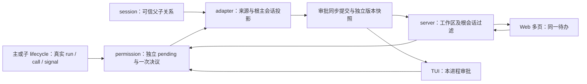
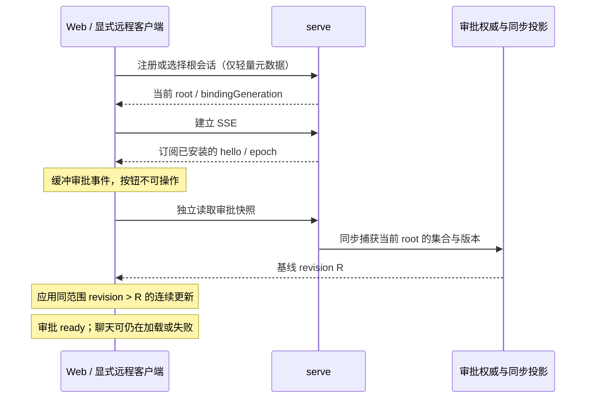

# 02 improve-1 实施契约

> 规划目标，尚未实施。按 [00](00-discussion.md) 的已确认行为执行；用 [04](04-test-and-acceptance.md) 验收。实现者不得把本篇改成进度日志，实施结果另写 05。

> 讨论后修订：本轮建立审批独立恢复保证；整页聊天/run/todo 快照与全局事件续传一致性留给 [improve-1.1](../improve-1.1/README.md)。审批恢复不等待全局 seqNum 静止，也不等待完整聊天快照。D1–D22 是用户确认的产品边界；以下接口、提交顺序和测试接线是满足这些边界的工程方案，尚未实施。

## 2.1 总体职责与数据流

permission 是运行时待审批的权威来源，UI store/server event buffer 都是派生视图。server 负责连接、认证和范围，不另建第二份有业务决策权的 broker。会话树解析放在 adapter/application 边界；permission 不依赖 server/clientId，scheduler 不依赖 session 数据库。

## 2.2 身份契约

生产执行链以 run coordinator 最终建立的 `RunContext.runId` 为真实身份，把它传过 lifecycle、scheduler 的 request/call，再进入 PermissionAskInput、PermissionInfo 和 UI 投影。主会话在提交运行前生成预期编号，子代理在认领自己的执行时生成预期编号；两者都要与最终建立的 run 编号核对，不能把预期值或父 runId 当成未经核实的实际身份。子代理使用的 `waitForCompletion` 路径也必须核对；若返回编号异常，由于现有 coordinator 在返回前可能已启动 run，立即取消实际 run、按其真实 runId 撤销已出现的审批并结束等待，不能只在 stream 路径抛错后留下后台执行。同步更新 PermissionPort 和 Bus schema；不能只给 UI 类型补字段。

具体接线断点在 `RunWorker.lifecycleSessionParams()`：目前 `RunContext` 已有 `runId`，core 的 agent runner 也已认识 runId，但 `LifecycleSessionParams`、`ModelStepParams`、`ToolCallRequest`、scheduler 内部 `ToolCall` 和 PermissionAskInput 尚未逐级携带它。实施时从实际 RunContext 开始连续传递，每层保留同一编号；不能在最终 UI 投影处再反查 `getActiveRunId(sessionId)`，也不能用 `callId` 冒充 runId。`sessionId` 属于哪棵会话树，仍由 application wrapper 核实；它不负责猜测本次调用属于哪一轮执行。

按 D13，scheduler 只携带、记录和转交上游给定的 runId，不查询数据库、不自行生成或推断执行身份。传一个不透明字符串不等于让 scheduler 依赖 run ledger 或 session 数据库；core 的 runner 已经处理 runId，这次补的是后半段遗漏的身份链。显式传递与现有 sessionId/messageId/signal 上下文同类。借鉴的是 Codex ToolInvocation 显式携带执行上下文、call_id 与取消令牌的原则，不照搬其完整 Session/TurnContext 对象，见 [03 §3.4](03-reference-projects.md#34-codex请求与连接分离一次消费)。

| 字段 | 语义与来源 |
|---|---|
| id / permissionId | 独立审批标识；一次工具可能经历多个审批阶段，不能用 callId 代替 |
| sessionId | 实际发起请求的会话；始终允许写规则时唯一使用这个 session |
| runId | 实际执行轮次；不能用 callId 或“当前 primary activeRun”兜底 |
| callId | 本轮执行中的一次工具调用；不能替代 sessionId、runId 或独立审批 id |
| messageId | 发起工具调用的真实消息，用于展示、诊断与精确定位 |
| contextScopeId（可选） | 原执行 scope，保持 primary 可无 scope 的既有语义 |
| rootSessionId | adapter 根据可信 Session.parentId 链解析出的根主会话，用于聚合和路由；不是前端提交的授权依据 |
| sourceLabel | 可选展示名称，缺失时退回真实 sessionId；名称不参与权限判定 |
| createdAt | 稳定排序依据；并列时用 id，排序不限制 respond |

UiPermissionRequest 显式携带以上所需来源字段；resolved 事件至少保留 requestId、sessionId、rootSessionId、终态原因，不能删除 pending 后才丢掉路由依据。root 必须与 source 在同一 workspace 实例内。解析检测不存在父节点、跨项目关系和循环；失败时结束该审批为明确的来源错误并返回工具错误，不广播到全局、不伪造 root、不留下无限等待。

具体接线放在 composition 注入 scheduler 的 PermissionPort application wrapper：先根据真实 source session 异步解析并验证 root，将不可变来源传给 manager，再由 manager 注册请求。wrapper 等待解析期间持续响应原 call signal，解析返回后再次检查 signal；已取消则不注册，解析失败则 reject ask 为明确来源错误，scheduler 返回工具错误。manager 不自行查询 session 数据库；投影只消费已冻结来源，不在事件发布后再异步猜 root。

来源关系为本次请求冻结，包括从实际 source 到 root 经过的祖先会话 ID，仅供校验和清理，不新增第三套独立父子表。source、root 或其中任一祖先的会话记录被删除、可信父链校验失败时，都撤销经过该节点的待批请求，不把旧请求重新挂到另一棵树；页面切换或断连不属于这种失效。现有 Session.parentId 为关系依据，subagent record.parentSessionId 用于一致性核查。第一轮不要求把所有子会话消息暴露在 UiSnapshot.sessions。

所有实际运行入口补足 runId；测试 harness 使用显式真实测试 runId。无 run 的底层独立工具执行若仍需保留，必须明确禁止进入交互式 ask 并返回可诊断错误，不可为兼容而伪造执行身份。call signal 仍从该工具调用自己的 controller 传给 ask；runId 解决归属和终态清理，signal 解决及时撤销，两者各有职责。

## 2.3 请求生命周期与单次决议

将 manager 的 current/queue 换成 `Map<permissionId, PendingRequest>`；每条请求注册后均可枚举、均发布 requested、均可直接回答。前端可以一张一张展示，但不得把队首条件留在 manager。

建议内部能力：`listPending`、`getPending`、`respond`、`revoke`、`revokeByRun`。保留需要的 session 清理入口用于会话销毁，但正常 run 结束不用 session 扫描。

- ask 显式接收调用 controller.signal。signal 只属于调用/执行，不属于浏览器连接；不进入序列化事件。
- 真正注册前再检查 signal，覆盖 scheduler 微任务开始前已经取消的窗口；注册 pending 和 abort listener 后再发事件，并再次核对取消状态。
- 命中既有 allow 规则而直接放行的调用没有登记 pending：先检查 signal，再按策略放行；不得为其发审批 requested/resolved 或推进审批 revision。若仍保留 `auto_approved` 领域审计事件，投影须凭明确的“未登记”语义跳过审批终态，不能把它当作卡片已解决。相反，always 自动通过**已登记**的其他待批请求时，每条仍走一次正常 resolved 与 revision 提交。
- respond/revoke 共用无 await 的一次决议入口：验证请求、当前 signal、choice、实际会话 → 从 pending 认领移除 → 移除 listener → 合法规则副作用 → 同步提交关键投影终态 → 完成原 Promise；之后才发普通通知。关键提交前先认领移除，防同步订阅者重入。
- 认领移除后，规则更新或关键内部终态提交即使抛错，也必须拆 listener 并完成原等待 Promise，以明确运行时错误结束，不重新插回 pending；已成功写入的合法规则不重复执行副作用。普通页面通知失败不改变已经生效的合法决议，也不撤销其他请求。投影错误按下文 D19 分类处理，不以通知失败无限挂起工具。
- 两个回答、回答与撤销竞争时，只有首个合法转移生效；非法 choice 不得抢占请求。撤销已发生或 signal 已 aborted 时，迟到 always 不写规则。
- 规则副作用先静默更新并收集 RuleAdded 通知；不得复用现有 addSessionRule 写完立即 publish 的路径，让观察者在关键提交前重入。关键投影提交与近期终态记录完成后，再统一发普通通知。always 对其他匹配 pending 的逐项决议也在原请求关键提交完成后开始，每项再次检查当前 signal、策略和健康状态。
- 合法 always 先赢、随后执行被中断，不回滚此前已合法记住的规则；取消不是撤回用户先前的授权。仍仅限真实来源 session。
- reject 只终结该请求。always 保留现有“同真实 session 中已 pending 且匹配规则、可记忆、最新策略允许的请求自动通过”行为；每个匹配请求也走统一决议。不可记忆请求仍需逐项批准，不跨 session。
- 按 D21，子代理请求同样可选择可记忆的 always，规则仍写入实际子会话；这不是切换 `full-access`。`full-access` 是运行时 permission level，主/子代理按同一档位求值。按后续 D22，该档位的敏感路径、显式 MCP/工具批准及外部目录请求不再发人工 ask；现有明确 deny、禁止路径/命令、参数校验和资源保护仍生效。仅在有权设置的真实 Full Access 范围内自动放行，不伪造用户选择的 always 或跨子会话写入持久授权规则。当前代码中 `evaluateInvariantDecision` 的敏感路径 ask 及 scheduler 的 `requireExplicitApproval` 独立 ask 需要一起调整；不能只改权限 fallback，亦不能由 improve-2 的数量调度绕过这两处。
- 不新增审批墙钟期限；既有执行期限仍有效。页面全部关闭也不触发撤销。后端 dispose 撤销自身 pending 并完成等待；不持久化 Promise，不恢复旧 ID。
- 用有界近期终态记录区分重复回答和已撤销，保存必要身份及原因，不保存完整参数/正文；超过界限只返回 not-pending，不重建请求。不要以未找到 ID 为理由自动批准。

### 精确结束清理

scheduler 将该 call controller.signal 传给每次 ask；所有权限入口（普通、显式 MCP、外部目录读写、skill）均走同一绑定，不能只修 bash。批准返回后保留 scheduler 的取消再检查，防止批准与执行之间被停止。

signal 及时撤销之外，在主/子 run 权威终态出口调用 `revokeByRun(realRunId, reason)` 兜底。覆盖 completed/failed/interrupted/timed_out，以及提前退出/抛错；结束 A 不影响同 session 后续 B。来源应是执行上下文/run manager，不是 snapshot 反查。`clearPendingPermissionsForRun` 改为精确调用核心清理，不再转成 `cancelPending(sessionId)`。

本轮只保证已有取消/结束信号到达时，请求不可再被放行；不声称解决所有不合作工具强杀、任意深度 Stop 或后台 shell job 清理。

## 2.4 投影、快照和客户端恢复

### 审批关键提交与通知分离

manager 的 pending 是业务权威，只有它的注册、回答或撤销路径能改变待批状态；投影只反映这些变化，不能独自生成或解决审批。composition 注入窄的同步 `criticalCommit` 端口，将已冻结来源的 requested/resolved 提交到审批内存投影；permission 不引用 server、数据库或客户端。此端口必须显式返回成功或抛错，不能通过现有会吞订阅者异常的普通 Bus/event-router 调用。

一次关键提交在无 await 的临界段内完成：校验来源和请求身份 → 构造新的不可变根会话请求集合、版本和事件记录 → 一次替换该根投影。候选构造失败不得提交半份集合或只推进版本。manager 的注册/决议与该提交在同一同步调用栈内完成，提交期间禁止普通观察者重入；成功后才发布展示通知、执行 reconcile 或调用外部观察者。内部事件和审批快照保留 epoch/root/revision；server 投递时再附该连接当前的 bindingGeneration，客户端不能只看请求 ID 判定所属范围。resolved 的投影提交与 Promise 收口使用 §2.3 的一次决议入口，普通通知失败不得逆转已经生效的决议。

每个 backend runtime 生成一个不复用的 `permissionEpoch`；每个 root 在该 epoch 内有连续递增的 `permissionRevision`，每次**已登记审批**的 requested/resolved 提交递增一次。空集合不重置版本，其他 root 和聊天 delta 不增加本 root 的版本。既有规则直接放行调用没有 pending 转移，不发审批增量；规则更新本身也不推进 pending 版本，若因此放行多个已登记 pending，则各自提交 resolved。同步读出的请求集合、epoch、revision 来自同一份已提交对象，不需等总线安静或读数据库。

审批通知使用有错误回传的专用投递路径，再兼容发布普通领域/UI 通知；不能仅依赖会吞异常的普通订阅器来完成可靠传输。关键提交成功后，检测到单 SSE 写入失败时立即关闭该连接；客户端观察断流后取消 ready 并重连同步，其他连接继续。若 server 的审批转发器失败，则关闭受影响订阅并重新建立同步。即使失败的是最后一条 resolved、之后不再有事件，也不能指望未来版本缺口才发现；成功写入传输缓冲本身不等于浏览器已收到，不能据此虚称解决不可检测的静默丢包。TUI 本地投递失败同样标记未同步、重新读取审批。不能只打日志后让客户端永久保持 ready，也不能为了网络送达失败撤销后端 pending。事件续传缓存不是审批权威记录，丢失可由独立快照恢复。

### 独立查询与必需接线

新增 `UiBackendClient.getPermissionSnapshot({ rootSessionId })`，返回 `{ permissionEpoch, rootSessionId, permissionRevision, requests }`。读取前校验健康状态和根范围，校验可能异步，但实际捕获上述四项不得 await。in-process、REST `GET /v1/permissions` 与 JSON-RPC 同名方法共用此读取逻辑。REST/RPC 外层再带当前客户端的 `bindingGeneration`，服务器以认证后的 workspace/client-view 决定范围，不能凭查询中的 root 自行扩权。没有选中根会话时返回明确的空选择状态，不发全局请求列表。Web/显式远程的审批查询和回答在传输上下文中均携带客户端预期 epoch/root/bindingGeneration（本地 in-process 不引入 server 绑定）；服务器在异步验证后、捕获快照或决议前再次核对当前绑定，过期绑定返回范围已变更错误，不代答当前页面之外的请求。

| 接线位置 | 本轮必要改动 |
|---|---|
| SDK / in-process | 新增审批独立查询及版本化事件；新增只读 `getSessionIndex()`，只返回现有主会话元数据（id/title/projectRoot/父子判别所需字段），不读取 messages/runs/todos/model。具体 active root 由当前客户端选择决定，不能从共享 backend 的 activeSessionId 猜测 |
| server 初始化 / 客户端注册 | 初始化调度器等必需运行服务从整页读取中拆出并继续完成；REST 注册和 RPC initializeClient 统一已认证的 client-view 初始化，使用轻量元数据保留原 new/continue/resume 语义。注册不等待完整聊天快照。未指定/未选定根时不擅自选择最新会话 |
| 会话选择 | 复用现有 `PATCH /v1/sessions/:id/select` 及 RPC/本地选择入口，抽出不读聊天历史的校验和选择步骤。验证主会话、workspace 后再更新该客户端路由，返回 root 和递增 bindingGeneration；不得先改路由再验证，也不能以全量 snapshot 成功作为选择完成条件。尝试将子会话选为主会话须明确报错并保留原绑定，不得把空审批列表当作成功；若旧客户端状态异常地指向子会话，审批保持未就绪并提示返回主会话，不向子页开放审批。并发选择需检查原 bindingGeneration，过期选择不得覆盖新选择。所有会改变 active root 的入口（new/resume/首条 prompt 建会话等）共用该绑定更新规则，不能只修 select 路由 |
| SSE | 保留“先安装订阅，再发送 hello”的确认顺序；hello 带 runtime epoch、已确认 root/bindingGeneration。每次自动重连的 hello 都触发审批恢复，不能沿用当前忽略后续 hello 的行为。选择成功后新范围同样开始恢复 |
| Web | transport、审批同步、聊天/model 加载分开管理；聊天/model 失败不能关闭健康 SSE。审批入口从轻量根元数据即可挂载，不再要求完整 snapshot 非空或 composer 可用；全量 snapshot 的 permission 副本不能覆盖独立审批状态 |
| TUI / 显式 RemoteDaemonClient | 默认 TUI 直接使用本进程的同一审批查询/事件契约。既有 RemoteDaemonClient 接入独立审批查询与恢复，RPC 注册后可按同一认证/注册规则读取审批，保持 respondPermission 返回 void。没有新增 remote 默认入口 |

全量 `getSnapshot()` / `/v1/snapshot` 的公开形状保留。本轮不为聊天/run/todo 修全局水位、不让 RemoteDaemonClient 的整页 resync 升级成为审批前置；这些归 improve-1.1。兼容字段可以继续返回，但新消费者只以独立审批快照和事件维护待批及就绪状态。既有全量 reducer、全局 seq 过滤和 bufferedEvents 都必须绕开审批事件，不能在进入审批处理器前就把它过滤掉。

### 恢复顺序与就绪条件

1. 客户端用连接 generation、workspace、root、bindingGeneration 和 epoch 标识当前恢复范围。断线立即撤销 ready；同根可保留不可操作的旧卡片，切 root/workspace 则移除旧范围卡片。旧快照、旧重试、旧应答回调均不得更新新范围，覆盖 A→B→A 的情况。
2. 订阅确认后发起独立审批查询，同时继续消费 SSE、缓冲本范围审批事件。SSE handler 只同步入缓冲/调度恢复，不 await HTTP 快照；现有 reader 会 await handler，直接等待会阻止读取后续事件。无须等聊天 snapshot 或模型查询完成。
3. 安装同 epoch/root/bindingGeneration 的基线 R；丢弃缓冲中 revision ≤ R 的重复项，按到达顺序应用 R+1、R+2 等连续事件；去重按审批 revision/requestId，不按全局 seqNum。发现缺口或收到 resync-required 时重新读审批基线，不放行不完整视图。其他 root 的事件不得被误当成自己的版本缺口。
4. 当前基线和已收到的连续缓冲事件应用完毕即可设置独立 `permissionSync=ready`；以后按同一版本规则实时处理。ready 不是承诺永无网络延迟，服务端仍对每次响应执行原子校验。epoch 改变表示旧 runtime 失效，清旧请求并重新同步，不能复用旧批准。
5. 初连、每次自动重连、显式 resync、切范围均走同一恢复器；并发触发合并，不堆叠无限 HTTP。审批读取的暂时失败只令该客户端未同步，其他客户端仍能回答；重试耗尽保留明确错误和重新同步入口，不以全局 live 自动启用。严重故障按下文不可用响应处理，不自动反复重试。

资源边界：审批查询设 10 秒传输超时，临时失败最多退避重试 3 次（100/250/500ms）；一个恢复周期包括缺口/缓冲溢出重取，累计最多 4 次查询，耗尽后等待显式重试或新的连接/范围。同一连接/范围内重复的 hello、resync、gap 触发只合并请求，不重置预算；只有实际新连接/新范围或用户显式重试开启新周期。缓冲上限 1024 条或 2 MiB（以先达到者为准），溢出丢弃候选并重新取基线，不静默截断后标 ready。切 generation/dispose 取消查询与计时器并释放缓冲/listener。以上是传输资源边界，不是审批等待期限，不撤销运行时请求；数值为实现默认值，测试用小值注入，不新增用户设置。

### 错误分类与影响范围（D19）

| 故障 | 处理与范围 |
|---|---|
| 聊天/model/reconcile 读取、普通展示、单连接投递失败 | 不撤销审批；展示单独报错或该连接重新同步。运行状态读取失败不等于 run 结束 |
| 单请求来源解析失败、无效 choice、过期 ID、客户端范围错误 | 来源失败结束该 ask；无效回答不认领 pending；过期回答同步收口。其余请求不受影响 |
| 快照传输失败、正常重复/旧事件、丢事件、buffer 溢出、epoch 改变 | 当前客户端重新同步或报恢复失败，不能判为后端权威损坏，更不能清空 manager |
| 关键提交无法完成、同一 requestId 的权威来源发生冲突、内部提交后集合与 revision 不匹配 | 属严重一致性故障，按可信内部身份冻结受影响 root 的审批；只有共享关键设施损坏、无法可信划定 root 时才升级到本 runtime。外部非法输入本身不能触发全局冻结 |

严重故障的健康标记独立于投影集合存储。先冻结范围，manager 的 ask/respond 都检查该标记，再直接从权威 pending 撤销该范围请求、拆 listener 并以明确错误完成等待；这条清理路径不能再次依赖已经坏掉的投影/事件发布才能结束。健康查询和回答返回 `PERMISSION_UNAVAILABLE`，不返回正常空集合冒充已恢复；受影响客户端停用审批并显示恢复失败。其他 root（包括同一 runtime 内）继续可用。若故障时已登记合法规则，不回滚；已批准后工具仍遵循自己的 signal。

无法投递故障通知时使对应连接失效，让新查询读取独立健康标记，不能留下可操作旧卡。本轮不做自动重建权威审批的后台系统；重启新 runtime 后旧 ID 无效。审批冻结不直接调用整树 Stop，不自动改所有 run 状态；工具等待得到错误后沿既有执行失败路径处理。正常执行取消、失败、到期仍按 §2.3 撤销，不因展示容错保留失效请求。

### 范围与状态

- 同 workspace 内按 `request.rootSessionId === client.activeSessionId` 判断审批可见/可回答；入口必须是根主会话。未来子页只读，不通过“选择子页再归一化 root”偷偷获得操作入口。
- 按 D18，保留现有禁止将子会话作为主会话使用的限制；只有根主会话页面显示审批。第三轮的子代理只读页面不展示审批卡片、按钮或其他审批渠道。UI 隐藏不能替代后端范围校验；本轮补测子会话不能作为审批入口，不提前建设子页。
- pending snapshot、requested、resolved、REST/RPC respond 使用同一范围规则。resolved 自带 root，避免已删除记录无法路由。
- 删除 permission 专用发起客户端 owner 约束；保留 client 注册、认证、workspace canonicalization、其他 command/interaction ownership。旧连接 5 秒保留不再影响审批可见性，不全局删除连接管理。
- TUI 使用同样的来源和根汇总投影，但仅本 runtime，无跨进程同步。独立 runtime 的会话忙碌保护继续由 run ledger claim 承担。
- 当前根会话有 pending 时显示 waiting-for-permission，即使没有正在运行的 primary，或者 primary 正忙于其他工具；这只是用户注意状态，不将无关 primary run ledger 状态改成等待。卡片标明实际来源。
- 切项目/会话保持各客户端独立选择，丢弃旧 generation 的事件，重拉新范围 pending；不跨会话弹审批。后台其他会话全局提醒本轮不新增。

## 2.5 应答接口与最小客户端改动

按 D16，审批卡片只简短标明实际来源/授权作用的代理对象，例如“北大子代理”；主代理请求对应主代理。保留请求标题及必要操作内容，不增加长篇作用范围说明、联动放行数量或二次确认弹窗。名称仅用于展示，实际授权仍使用 sessionId，遵守 D7。

按 D17，同一 callId 可依工具预检查顺序先后产生多次审批，例如外部目录确认后才产生 bash 确认；尚未产生的下一次请求不能提前回答。复用现有 reason → title 和操作内容区分每次请求的实际目的，不新增步骤计数或进度条。每次 ask 独立生成 permissionId；客户端按该 id 处理和撤下请求，不按 callId 合并，也不把上次 allow_once 当成本次回答。后一步拒绝使该工具调用停止，不撤销前一步已合法保存的、仅限真实来源 session 的 always 规则。

按 D20，审批使用独立的同步就绪判断，不继续直接复用 composer.disabled 或仅凭全局 connectionState === live 启用按钮。当前连接、workspace 和根会话范围的审批基线及缓冲更新应用完成后，才允许回答；断连、切范围、审批同步失败或严重审批一致性故障时不可操作旧请求。聊天历史、todo 或附带运行状态读取失败不清除已正确建立的审批就绪状态，也不能让审批恢复等待这些无关查询成功。旧连接/范围的响应不得恢复新范围按钮。此就绪状态只是客户端交互条件，后端仍按真实来源、根会话、请求终态和 signal 校验每次回答。

保留公开 `UiBackendClient.respondPermission(): Promise<void>`，不借本轮更换整个返回协议。核心内部返回 accepted / already-resolved / revoked / not-pending；adapter 对已验证同范围的 accepted/安全重复正常完成，前端以终态事件或刷新 snapshot 收口，不能把 HTTP 200 当作工具已执行。

同范围已撤销返回 `PERMISSION_NOT_PENDING` 并触发同步，已由其他入口合法回答可幂等成功。未知 ID/已淘汰终态同样返回 `PERMISSION_NOT_PENDING`；错误 workspace/root：拒绝且不泄漏请求详情；非法 choice：INVALID_PERMISSION_CHOICE。REST/RPC 映射一致的业务 code（HTTP 状态可以不同），客户端对 not-pending 正常重新同步，不能无限显示发送失败。近期终态也需范围检查后才作幂等成功。

choice 只接受请求公开提供的选项：allow_once、可记忆时的 allow_always、reject。移除卡片 Cancel run；旧客户端发送 cancel 明确拒绝，不能退化为 reject 或取消任意 run。`remember:true` 不得把 reject/未知 choice 改成 always；如保留旧 allow_once+remember 用法，只允许在请求可记忆时明确等价 allow_always，其他冲突组合拒绝。内部 suggest 保留既有用途，不随便暴露成新 Web 选项。

Web/TUI 最小接线：来源文案、独立 pending 列表消费、取消按钮移除、等待审批提示、他处已处理/撤销后收口。后端全部请求可独立回答，不要求本轮制作复杂审批中心；客户端现有单卡可采用稳定顺序，但须有最小的上一条/下一条或请求选择入口，让用户实际能够处理非首项；不要求复杂审批中心，不能重复覆盖未回答请求。未来只读子页和禁止用户 prompt 的完整入口校验在第三轮落实，本轮不创建子页。

## 2.6 分阶段及改动面

| Stage | 改动与文件/包 | 完成定义（04） |
|---|---|---|
| S1 身份与独立 pending | agent `core/lifecycle/lifecycle.ts`、scheduler `types.ts/scheduler.ts`、permission `types.ts/events.ts/manager.ts` | T01–T06：真实身份、非队首回答、单次决议、规则范围；所有 ask 调用点编译通过 |
| S2 生命周期连接 | scheduler signal；agent run 终态接线；`adapters/ui-inprocess.ts`、`ui-inprocess/runtime-controller.ts`、`ui-runtime/composition.ts`、agents host | T07–T10：撤销精确、不漏新 run、不留超时审批；不扩大到全树强杀 |
| S3 投影和传输 | SDK `snapshot.ts/events.ts`；`adapters/app-events/permission-projection.ts`、ui-state store；server `client-view.ts/permission-router.ts/create-app.ts`、`jsonrpc/rpc-route.ts/client.ts` | T11–T18：关键提交、独立版本恢复、轻量注册/选择、根范围、双页、REST/RPC 对齐 |
| S4 客户端与完整验收 | Web daemon API/store/App/PermissionModal；CLI permission-dialog/store；相关协议 mock、agent 实际浏览器验收、CI 定向测试步骤和模块文档 | T19–T24：真实浏览器、in-process TUI、共存保护、权限矩阵及构建产物通过；按 D15，不以固定 E2E 脚本代替实际操作 |

S1–S4 属同一轮同一发布门，不能发布只改 DTO、旧路由仍存在的中间状态。UI 真正消费新来源字段、移除 Cancel run 是本轮必要接线，不以“后端优先”为由延期到第三轮。

按 D14，S1＋S2 完成后设置进入 S3 的内部验收点：真实 scheduler、permission manager 和主/子执行生命周期配合可控 provider，验证身份传递、独立回答、一次决议、按 run 精确撤销及等待可结束。通过后再进入 S3；具体检查范围见 [04 §4.3](04-test-and-acceptance.md#43-执行命令与发布门)。T01–T10 中跨 server/REST/RPC 的断言仍需 S3 验证，不能在此标记全部完成。此检查不新增 improve 编号，不构成独立发布或合入 main 的依据。

## 2.7 兼容、风险及回滚

- 无数据库 schema 迁移，无持久化 pending 表。协议来源字段变化需 SDK/agent/server/Web/CLI 同批构建；明确停止旧 serve、启动同版本新产物，不依赖旧 dist 或热切换继续旧 pending。
- 默认 TUI 启动路径不 import server；显式 remote 能力不删除，但不把它变成本轮新产品承诺。
- 旧 UI 取消按钮测试有意修订；旧 fallback 与全局队首测试替换为新契约；保留其余权限决策、路径安全和版本检查。
- 回滚按整批包和静态资源回滚，重启后端使旧 pending 失效；不做半套 schema 回滚。用户需重新发起已中断任务，不自动重放有副作用命令。
- 审批快照/增量交错、旧范围回调、异步关系解析失败、取消与 always 竞争是承重风险，必须由 04 确定性测试覆盖；不依赖模型偶然复现。

## 2.8 本轮之外

完整 scheduler 阶段、逐项工具结果、批次预检查优化 → improve-2。子代理只读树、输入输出流、禁止用户对子页发 prompt 及结果交付 → improve-3。2026-09-20 后续讨论明确：用户不能单独停止子代理，其生命周期由主代理管理；此前“子代理单独停止”的用户入口设想撤回，不转入第四轮。所有后代与后台 job Stop、重启状态一致、跨 owner 恢复 → improve-4。跨 runtime 审批共享、TUI 自动 daemon、项目级 always 规则均不在本路线已确认范围。

## 第四轮恢复的后继约束

[第四轮](../improve-4/README.md)复用本轮撤销与根会话审批事实；执行记录恢复ready不清除本轮独立审批健康故障，也不重建已结束requestId/Promise。审批独立同步仍由本轮负责，整页快照/续传由[improve-1.1](../improve-1.1/README.md)负责。第四轮不能因为页面重连或关键登记成功就重新开放旧审批；本轮验收不依赖第四轮实现。
