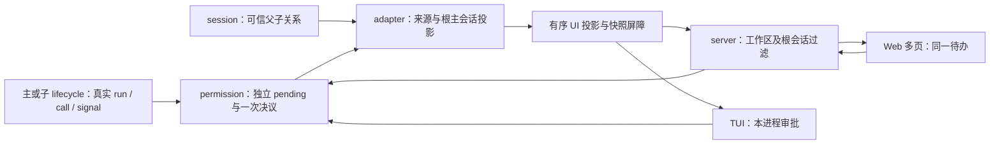

# 02 improve-1 实施契约

> 规划目标，尚未实施。按 [00](00-discussion.md) 的已确认行为执行；用 [04](04-test-and-acceptance.md) 验收。实现者不得把本篇改成进度日志，实施结果另写 05。

## 2.1 总体职责与数据流

permission 是运行时待审批的权威来源，UI store/server event buffer 都是派生视图。server 负责连接、认证和范围，不另建第二份有业务决策权的 broker。会话树解析放在 adapter/application 边界；permission 不依赖 server/clientId，scheduler 不依赖 session 数据库。

## 2.2 身份契约

生产执行链必须把真实 `runId` 从 agent turn/lifecycle 传到 scheduler 的 request/call，再进入 PermissionAskInput、PermissionInfo 和 UI 投影。同步更新 PermissionPort 和 Bus schema；不能只给 UI 类型补字段。

| 字段 | 语义与来源 |
|---|---|
| id / permissionId | 独立审批标识；一次工具可能经历多个审批阶段，不能用 callId 代替 |
| sessionId | 实际发起请求的会话；始终允许写规则时唯一使用这个 session |
| runId | 实际执行轮次；不能用 callId 或“当前 primary activeRun”兜底 |
| messageId / callId | 真实工具来源，用于展示、诊断与精确定位 |
| contextScopeId（可选） | 原执行 scope，保持 primary 可无 scope 的既有语义 |
| rootSessionId | adapter 根据可信 Session.parentId 链解析出的根主会话，用于聚合和路由；不是前端提交的授权依据 |
| sourceLabel | 可选展示名称，缺失时退回真实 sessionId；名称不参与权限判定 |
| createdAt | 稳定排序依据；并列时用 id，排序不限制 respond |

UiPermissionRequest 显式携带以上所需来源字段；resolved 事件至少保留 requestId、sessionId、rootSessionId、终态原因，不能删除 pending 后才丢掉路由依据。root 必须与 source 在同一 workspace 实例内。解析检测不存在父节点、跨项目关系和循环；失败时结束该审批为明确的来源错误并返回工具错误，不广播到全局、不伪造 root、不留下无限等待。

具体接线放在 composition 注入 scheduler 的 PermissionPort application wrapper：先根据真实 source session 异步解析并验证 root，将不可变来源传给 manager，再由 manager 注册请求。wrapper 等待解析期间持续响应原 call signal，解析返回后再次检查 signal；已取消则不注册，解析失败则 reject ask 为明确来源错误，scheduler 返回工具错误。manager 不自行查询 session 数据库；投影只消费已冻结来源，不在事件发布后再异步猜 root。

来源关系为本次请求冻结；会话删除/失效应撤销其请求，不把旧请求重新挂到另一棵树。现有 Session.parentId 为关系依据，subagent record.parentSessionId 用于一致性核查，不新增第三套独立父子表。第一轮不要求把所有子会话消息暴露在 UiSnapshot.sessions。

所有实际运行入口补足 runId；测试 harness 使用显式真实测试 runId。无 run 的底层独立工具执行若仍需保留，必须明确禁止进入交互式 ask 并返回可诊断错误，不可为兼容而伪造执行身份。

## 2.3 请求生命周期与单次决议

将 manager 的 current/queue 换成 `Map<permissionId, PendingRequest>`；每条请求注册后均可枚举、均发布 requested、均可直接回答。前端可以一张一张展示，但不得把队首条件留在 manager。

建议内部能力：`listPending`、`getPending`、`respond`、`revoke`、`revokeByRun`。保留需要的 session 清理入口用于会话销毁，但正常 run 结束不用 session 扫描。

- ask 显式接收调用 controller.signal。signal 只属于调用/执行，不属于浏览器连接；不进入序列化事件。
- 真正注册前再检查 signal，覆盖 scheduler 微任务开始前已经取消的窗口；注册 pending 和 abort listener 后再发事件，并再次核对取消状态。
- respond/revoke 共用无 await 的一次决议入口：验证请求、当前 signal、choice、实际会话 → 从 pending 认领移除 → 移除 listener → 合法规则副作用 → 发终态 → 完成原 Promise。发布事件前先移除，防同步订阅者重入。
- 认领移除后，规则更新或通知即使抛错，也必须拆 listener 并完成原等待 Promise，以明确运行时错误结束，不重新插回 pending；已成功写入的合法规则不重复执行副作用。投影故障进入下文明确的不健康处理，不以通知失败无限挂起工具。
- 两个回答、回答与撤销竞争时，只有首个合法转移生效；非法 choice 不得抢占请求。撤销已发生或 signal 已 aborted 时，迟到 always 不写规则。
- 合法 always 先赢、随后执行被中断，不回滚此前已合法记住的规则；取消不是撤回用户先前的授权。仍仅限真实来源 session。
- reject 只终结该请求。always 保留现有“同真实 session 中已 pending 且匹配规则、可记忆、最新策略允许的请求自动通过”行为；每个匹配请求也走统一决议。不可记忆请求仍需逐项批准，不跨 session。
- 不新增审批墙钟期限；既有执行期限仍有效。页面全部关闭也不触发撤销。后端 dispose 撤销自身 pending 并完成等待；不持久化 Promise，不恢复旧 ID。
- 用有界近期终态记录区分重复回答和已撤销，保存必要身份及原因，不保存完整参数/正文；超过界限只返回 not-pending，不重建请求。不要以未找到 ID 为理由自动批准。

### 精确结束清理

scheduler 将该 call controller.signal 传给每次 ask；所有权限入口（普通、显式 MCP、外部目录读写、skill）均走同一绑定，不能只修 bash。批准返回后保留 scheduler 的取消再检查，防止批准与执行之间被停止。

signal 及时撤销之外，在主/子 run 权威终态出口调用 `revokeByRun(realRunId, reason)` 兜底。覆盖 completed/failed/interrupted/timed_out，以及提前退出/抛错；结束 A 不影响同 session 后续 B。来源应是执行上下文/run manager，不是 snapshot 反查。`clearPendingPermissionsForRun` 改为精确调用核心清理，不再转成 `cancelPending(sessionId)`。

本轮只保证已有取消/结束信号到达时，请求不可再被放行；不声称解决所有不合作工具强杀、任意深度 Stop 或后台 shell job 清理。

## 2.4 投影、快照和客户端恢复

### 有序投影

permission requested/resolved 进入同一串行投影队列，按领域发生顺序执行 store 更新和事件发布。每次必须成对完成“更新投影 → 发布对应事件”，再处理下一项。状态 reconcile 不得让 requested 越过 resolved；投影异常必须使快照屏障失败并记录错误，不能吞错后返回正常基线。首版进入显式 projection-unhealthy 状态，拒绝新的交互式 ask 并精确撤销现存 pending，错误送回执行侧；snapshot 返回可诊断错误，客户端停止操作并提示重启后端。健康状态不能仅因 Promise catch 而自动恢复；本轮选择重启恢复，不新增后台重建机制。队列应完成清理且不挂死等待，测试注入写投影失败验证该行为。

暴露内部 flush/fence：快照读取等待已接收权限事件的投影结束。只 flush 一次不能解决读 snapshot 期间又发生事件的窗口，因此还需下述水位校验。

### 一致快照及水位

沿既有 snapshot+SSE 协议采用可测试的稳定读取：

1. 等待权限投影 fence，读取事件序号 `before`。
2. 获取 backend snapshot，再等待权限投影 fence。
3. 同步读取 `after`；仅 `before === after` 时返回该 snapshot 和 `after`。
4. 不相等则丢弃本次候选并重试；不允许返回旧权限集合配较新的水位。

重试必须有界（首版上限 3 次）；持续事件下返回结构化 `SNAPSHOT_RETRY_REQUIRED`，Web 新增统一的可取消 `readConsistentSnapshotWithRetry` 帮助函数，初连和显式 resync 都调用；仅该临时错误进入有界退避（例如 100/250/500ms 三次），请求/计时器绑定连接 generation，切项目或 dispose 后停止，耗尽时明确进入恢复失败/断开状态供重试。不能依赖目前 connect/doResync 的 catch 自动重试，它们没有该行为；不清空已展示数据、不紧循环。REST /v1/snapshot 返回 snapshot+seq；RPC getSnapshot 调用同一个服务端稳定读取 helper，但保留原 UiSnapshot 返回形状，丢弃内部水位。既有 RemoteDaemonClient 的 resync-required 分支当前先推进 cursor 再 RPC getSnapshot，必须窄修为内部读取 REST /v1/snapshot 的 {snapshot,seqNum}（保留相同 auth/client/workspace headers），同时将 REST 客户端注册判定与经过认证的 RPC initializeClient 统一为同一 workspace 的已初始化客户端判定；不绕过注册、不仅靠 headers、不在每次 resync 重置客户端选中会话。恢复期间缓冲 UI 事件，成功应用 snapshot 后才提交 cursor 并应用 seq>baseline 的事件；失败保留旧 cursor，按有界退避重试。公开 RPC getSnapshot 形状不变，不新增 remote 产品入口，也不改变默认 TUI in-process。T12 同时验证 Web 和 RemoteDaemonClient 的恢复水位，后者仅是既有传输路径维护。

这不是只把 latestSeqNum 移到 await 前：权限投影 fence、事件序列和稳定读必须一起成立。序号检查成功后到返回之间不得再有会改变快照内容的异步拼装。网络送达延迟由先开 SSE 并缓冲 seq>baseline 的既有机制处理。所有投影增删按 requestId 幂等。

### 范围与状态

- 同 workspace 内按 `request.rootSessionId === client.activeSessionId` 判断审批可见/可回答；入口必须是根主会话。未来子页只读，不通过“选择子页再归一化 root”偷偷获得操作入口。
- pending snapshot、requested、resolved、REST/RPC respond 使用同一范围规则。resolved 自带 root，避免已删除记录无法路由。
- 删除 permission 专用发起客户端 owner 约束；保留 client 注册、认证、workspace canonicalization、其他 command/interaction ownership。旧连接 5 秒保留不再影响审批可见性，不全局删除连接管理。
- TUI 使用同样的来源和根汇总投影，但仅本 runtime，无跨进程同步。独立 runtime 的会话忙碌保护继续由 run ledger claim 承担。
- 当前根会话有 pending 时显示 waiting-for-permission，即使没有正在运行的 primary，或者 primary 正忙于其他工具；这只是用户注意状态，不将无关 primary run ledger 状态改成等待。卡片标明实际来源。
- 切项目/会话保持各客户端独立选择，丢弃旧 generation 的事件，重拉新范围 pending；不跨会话弹审批。后台其他会话全局提醒本轮不新增。

## 2.5 应答接口与最小客户端改动

保留公开 `UiBackendClient.respondPermission(): Promise<void>`，不借本轮更换整个返回协议。核心内部返回 accepted / already-resolved / revoked / not-pending；adapter 对已验证同范围的 accepted/安全重复正常完成，前端以终态事件或刷新 snapshot 收口，不能把 HTTP 200 当作工具已执行。

同范围已撤销返回 `PERMISSION_NOT_PENDING` 并触发同步，已由其他入口合法回答可幂等成功。未知 ID/已淘汰终态同样返回 `PERMISSION_NOT_PENDING`；错误 workspace/root：拒绝且不泄漏请求详情；非法 choice：INVALID_PERMISSION_CHOICE。REST/RPC 映射一致的业务 code（HTTP 状态可以不同），客户端对 not-pending 正常重新同步，不能无限显示发送失败。近期终态也需范围检查后才作幂等成功。

choice 只接受请求公开提供的选项：allow_once、可记忆时的 allow_always、reject。移除卡片 Cancel run；旧客户端发送 cancel 明确拒绝，不能退化为 reject 或取消任意 run。`remember:true` 不得把 reject/未知 choice 改成 always；如保留旧 allow_once+remember 用法，只允许在请求可记忆时明确等价 allow_always，其他冲突组合拒绝。内部 suggest 保留既有用途，不随便暴露成新 Web 选项。

Web/TUI 最小接线：来源文案、独立 pending 列表消费、取消按钮移除、等待审批提示、他处已处理/撤销后收口。后端全部请求可独立回答，不要求本轮制作复杂审批中心；客户端现有单卡可采用稳定顺序，但须有最小的上一条/下一条或请求选择入口，让用户实际能够处理非首项；不要求复杂审批中心，不能重复覆盖未回答请求。未来只读子页和禁止用户 prompt 的完整入口校验在第三轮落实，本轮不创建子页。

## 2.6 分阶段及改动面

| Stage | 改动与文件/包 | 完成定义（04） |
|---|---|---|
| S1 身份与独立 pending | agent `core/lifecycle/lifecycle.ts`、scheduler `types.ts/scheduler.ts`、permission `types.ts/events.ts/manager.ts` | T01–T06：真实身份、非队首回答、单次决议、规则范围；所有 ask 调用点编译通过 |
| S2 生命周期连接 | scheduler signal；agent run 终态接线；`adapters/ui-inprocess.ts`、`ui-inprocess/runtime-controller.ts`、`ui-runtime/composition.ts`、agents host | T07–T10：撤销精确、不漏新 run、不留超时审批；不扩大到全树强杀 |
| S3 投影和传输 | SDK `snapshot.ts/events.ts`；`adapters/app-events/permission-projection.ts`、ui-state store；server `client-view.ts/permission-router.ts/create-app.ts`、`jsonrpc/rpc-route.ts/client.ts` | T11–T18：顺序、稳定水位、根范围、双页、REST/RPC 对齐 |
| S4 客户端与完整验收 | Web daemon API/store/App/PermissionModal；CLI permission-dialog/store；相关协议 mock、compiled Web 有人值守 runner、CI 定向测试步骤和模块文档 | T19–T24：真实浏览器、in-process TUI、共存保护、权限矩阵及构建产物通过 |

S1–S4 属同一轮同一发布门，不能发布只改 DTO、旧路由仍存在的中间状态。UI 真正消费新来源字段、移除 Cancel run 是本轮必要接线，不以“后端优先”为由延期到第三轮。

## 2.7 兼容、风险及回滚

- 无数据库 schema 迁移，无持久化 pending 表。协议来源字段变化需 SDK/agent/server/Web/CLI 同批构建；明确停止旧 serve、启动同版本新产物，不依赖旧 dist 或热切换继续旧 pending。
- 默认 TUI 启动路径不 import server；显式 remote 能力不删除，但不把它变成本轮新产品承诺。
- 旧 UI 取消按钮测试有意修订；旧 fallback 与全局队首测试替换为新契约；保留其余权限决策、路径安全和版本检查。
- 回滚按整批包和静态资源回滚，重启后端使旧 pending 失效；不做半套 schema 回滚。用户需重新发起已中断任务，不自动重放有副作用命令。
- 持续事件导致 snapshot 重试、异步关系解析失败、取消与 always 竞争是承重风险，必须由 04 确定性测试覆盖；不依赖模型偶然复现。

## 2.8 本轮之外

完整 scheduler 阶段、逐项工具结果、批次预检查优化 → improve-2。子代理只读树、输入输出流、禁止用户对子页发 prompt、子代理单独停止及结果交付 → improve-3。所有后代与后台 job Stop、重启状态一致、跨 owner 恢复 → improve-4。跨 runtime 审批共享、TUI 自动 daemon、项目级 always 规则均不在本路线已确认范围。
