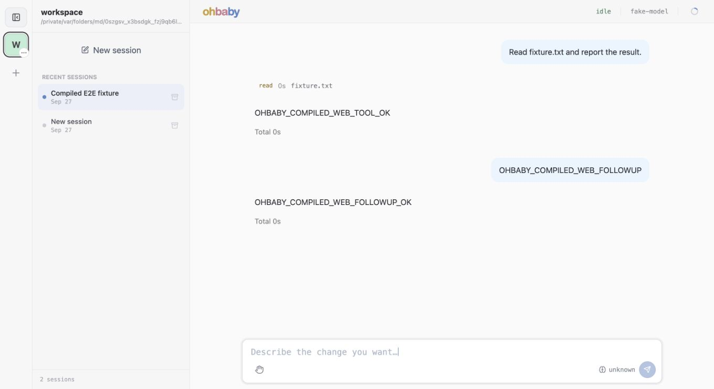
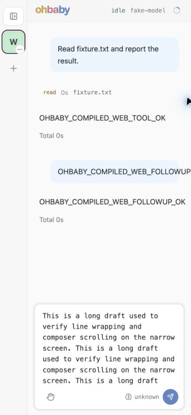
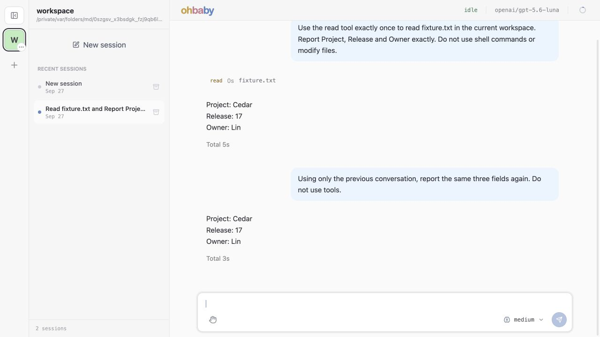

# improve-2.2 实施与验收记录

## 范围与结论

2026-09-27，在本地分支 `codex/improve-2.2` 实施。规划路径按约定保留在本目录 improve-2.1 和 [Web improve-3](../../../ohbaby-web/improve-3/README.md)，不另复制方案。基线为 `3ac9a6b3880e1228b3d80f0ef63b379acf789650`，接续原分支 `codex/improve-2-execution-progress`，同时收纳开始时已有的 31 个修改/未跟踪文件。初始文件、patch 和校验清单位于本机 `/tmp/ohbaby-improve22-baseline/`。

**代码实施、完整自动化测试、编译 Web 和默认 TUI 验收已完成，保留本地分支等待用户审查；未 merge、未 push。** T14 的 reduced-motion 真机仿真受锁屏限制未完成，不能把这一项记作浏览器实测通过。其他验证结果和既有样式限制分别记录如下。

最终产品代码及 runner 检查点为 `b5bf2794`。其后的提交仅补本文、索引与证据。环境：macOS arm64，Node `26.3.1`，pnpm `9.15.0`。验收依据为本轮 [02 阶段方案](02-optimization-plan-and-change-scope.md)、[04 唯一验收矩阵](04-test-and-acceptance.md)和 [Web 拆分规格](../../../ohbaby-web/improve-3/02-change-spec.md)。

## 分批交付

| 提交 | 结果 |
| --- | --- |
| `e9fdff57` | 收纳规划并补齐经审查确认的行为、准入、状态归属和验收合同 |
| `a5f679af` | 完整 New session 复用链路：权威空判断、客户端占用与保留期分离、创建/选择/提交保护、REST/RPC/in-process 接线及同步恢复 |
| `957dccc5` | 按功能提取 App 和 runtime，保持组件挂载位置与原实现；App 从 4864 行降至 137 行 |
| `42814ff5` | 收窄功能接口；草稿、租约、slash 状态归 Composer，异步结果校验 scope、generation、revision 和当前租约身份 |
| `06c411e2` | 修复 Tab 补全绕过草稿持久化和 edit revision 的遗漏 |
| `51f75c49` | 按原顺序归位样式、迁移 8 个测试、更新权威 Web 文档，并扩展编译 runner 的数据库判据 |
| `b5bf2794` | 补齐 `/new` 参数在真实命令 catalog 中的准入；修正 runner 对 macOS 实际项目路径的比较 |

New session 的“空”不再由标题或消息计数猜测，而是核对持久消息、run、全部 prompt 状态和会话关系。最后一条 SSE 断开时立即释放候选占用，路由清理仍保留原宽限；在途操作用 pin 保护。并发同策略请求共享操作，返回窗口冲突有界失败/重选，fresh-create 冲突不会再创建一条。`created` 只属于创建结果，不进入 session index 持久态。

Web 保留既有 store、client 和事件流。SessionScreen 负责组合，Composer 持有输入状态；TodoDock 和权限控件通过 slot 接入。没有新增状态库、通用 controller、事件总线或第二份草稿镜像。SessionScreen 与 Composer 仍保留各自连贯的交互流程，不为减少行数继续切成大量小文件。计时 hook 归入 `conversation/use-execution-duration.ts`，同步提示和 Stop 归入 `session/`。

## 自动化、审查与失败反馈

最终在 `b5bf2794` 的干净代码树上顺序执行测试和构建：

| 检查 | 实际结果 |
| --- | --- |
| `pnpm test` | **429 文件通过、6 文件跳过；4691 测试通过、17 跳过**，总计 435 文件 / 4708 项，184.72s |
| `pnpm build` | 成功；Web JS `index-ByVil5jG.js`，CSS `index-S1g-45RD.css` |
| `pnpm run lint`、`pnpm run typecheck` | 最后代码提交的 pre-commit 均通过，未跳过 hook |
| Web UI 回归 | 原 App 138 项全部保留，新增 10 项；Composer 3 项覆盖 prefill 身份/revision 和 Tab 补全，UI 共 253 项纳入全套 |
| 原测试迁移 | 8 个测试仅调整 import 路径，映射见 [Web test](../../../ohbaby-web/test.md#5-功能拆分后的测试归属)；App 跨功能流程继续留在根测试 |
| 机械提取检查 | S2 阶段 App 100 个顶层声明 AST 对照；runtime 类、factory 和 helper 保持原实现；45 个 Web 源码的本地 import 图（含 type import）无循环 |
| 样式顺序检查 | 源 CSS 482 rules / 1841 declarations / 19 at-rules 相同；编译 CSS 480 / 1834 / 19 相同，包含媒体条件和声明顺序；17 个原样式断言保留 |

17 个跳过项是已有的可选真实模型/外部服务用例和 2 个平台迁移用例。完整日志在本机 `/tmp/ohbaby-improve22-accepted-tests.log` 与 `accepted-build.log`（同前缀）；日志是本机留档，不承诺跨机器存在。本轮未改变 LLM 协议，按 04 使用受控 provider 验证接线，没有额外发起付费模型请求。

关键反馈均先复现再修复：

- 刷新旧 SSE 仍占用空 B 时，原用例实际返回另一 ID；保留[失败记录](evidence/2026-09-27/refresh-before-fix.txt)，最终同一判据通过。
- 原始异步 scope 用例 5 项失败、用户主动清空后的迟到恢复 1 项失败、租约 ABA/取消竞态 4 项失败，修复后全部进入 App 回归。独立审查提出的两处租约身份遗漏均限定复核关闭。
- Tab 补全先复现 `/sta` 在界面变成 `/status`、存储仍是 `/sta`，改走正常 `updateDraft` 后，持久化、revision 和旧回填拒绝均通过。
- 真实 TUI 暴露 `/new --no-reuse-empty-session` 被解析器拒绝。后端支持早已存在，catalog 漏了 `acceptsArguments`；新增真实 catalog + resolver 的三个 surface 用例先失败后通过，不再仅测试手工构造的 invocation。
- 首次并行启动全套测试与 build 争用了 `dist`；后续按顺序完整重跑成功。首次新 runner 的数据库比较误把 macOS `/var` 和 `/private/var` 当不同目录，真实路径规范化后从全新隔离环境复验成功，没有放宽会话数量或内容断言。

Pi 使用 `opencode/claude-opus-5-5`、`medium` 在 S3 边界只读给出建议，原文已在会话展示，未让 Pi 实施。采纳“保持局部 owner、避免新增 capture-handle 管理层”等建议；具体正确性由回归和原生子代理审查确认。S1、S2、S3、最终模块/样式和 TUI catalog 修复分别独立复核，最终无未关闭的 P1/P2。

## 浏览器与 TUI 实测

使用原生 Chrome 控制和本次编译的 `serve`，隔离 profile、workspace、SQLite、provider 和进程。runner 命令为：

```sh
node --no-warnings scripts/run-compiled-web-e2e.mjs --new-session-regression
```

最终 A 为 `session_1790484399036_awidpu1`，B 为 `session_1790484408960_itd3yk1`。初始 DB 为 0；从已使用 A 创建 B 后，六次顺序 New、切 A 后 New、三次刷新后切 A/New 均保持 B。三次刷新到复用完成为 **787 / 783 / 679ms**，都在 5s 保留窗口内。每次 ID 与时间保留在[浏览器观察](evidence/2026-09-27/new-session.json)，精确双 SSE、pin、timer 和 client 生命周期由真实网络集成覆盖；未把最终数据库快照冒充这些竞态的全部证据。

runner 直接只读 SQLite：最终只有两个 active root、没有 child；A 为 5 messages / 2 runs / 2 prompts，B 三者均 0。没有归档/删除来掩盖多建会话。两条用户输入与两次最终响应刷新前后各出现一次，工具 read 的实际结果进入下一次模型请求，标题不含内部 runtime 标记。受控 provider 收到 3 次主请求和 1 次独立标题请求。见[完整 runner 结果](evidence/2026-09-27/compiled-web.txt)。runner 退出 0，服务 PID/端口已释放，诊断检查通过。

浏览器另实测 Tab 补全刷新保存、Compact 弹窗、权限确认 Tab 焦点循环及 Escape 回焦、Open project 目录选择器打开/关闭。未点击授予 full-access。1360px 桌面下 App/Composer/textarea 的 display、position、font、color、padding、radius 与旧页面计算样式相同；阶段性同视口 1360×691 检查通过，最终截图视口为 1360×742。390×843 窄屏下长草稿可换行并内部滚动，输入框宽 277px、scrollWidth 277px，高 154px、scrollHeight 814px；临时视口已恢复。最终控制台错误为 0。

默认编译 TUI 使用独立 PTY 和另一隔离配置，未指定远程连接，也未启动 daemon：初始 0 → `/new` 后 1 → 再次 `/new` 仍为同一 ID → force-new 后 2 个不同 ID。消息/run/prompt 全为 0，空画布正常，Ctrl-C 退出 0。见 [TUI SQLite 证据](evidence/2026-09-27/tui.json)。

| 合同 ID | 验收落点 |
| --- | --- |
| T01 | 初始 manifest/patch、原测试基线 36 文件 / 510 项、分支及分批提交 |
| T02–T04 | `new-session-regression.integration.test.ts`、`tests/integration/web/new-session-lifecycle.integration.test.ts`；浏览器与 SQLite 复验 |
| T05–T07 | SDK/adapter/command/coordinator/REST/RPC 回归、权威 store、受控准入竞争；默认 TUI 参数入口 |
| T08、T13 | 同 scope 恢复、workspace/client/session/permission integration；SSE reader 取消/解锁回归 |
| T09–T12 | 原 App 接线及新增异步回归、Composer、conversation、permissions 与 Stop 用例；浏览器操作抽查 |
| T14 | CSS 源/产物、桌面计算样式、窄屏/焦点通过；reduced-motion 真机仿真未完成 |
| T15、T17 | 迁移映射、断言/AST/import 检查、完整测试/构建/lint/typecheck、独立审查 |
| T16 | 最终 compiled Web runner 退出 0，默认 compiled TUI PTY 复验通过 |

## 剩余限制与交接

- 锁屏阻止 Chrome 原生菜单控制，无法开启 reduced-motion 媒体仿真。既有 media 规则和 Typewriter reduced-motion 单测保留并通过，但不能替代该项真机检查。当前实际浏览器媒体值为 `false`。
- 窄屏下很长的连续无空格标记仍可能横向裁切，这是保留下来的原样式行为。本轮 CSS 源/编译序列完全不变，未混入视觉重设计；截图保留现状以便后续单独处理。
- 准入保护限于本进程 backend/server；不是多进程共享 SQLite 的分布式独占锁。首次验收记录的全局 admission revision 保守冲突已在下文 Pi 复审后的修复中关闭；返回候选自身发生准入变化时仍会重验或有界失败，未增加逐会话事务协调层。
- 一次未隔离的 CLI `--help` 触发既有启动迁移检查并更新用户目录的迁移标记；只核对文件元数据，`model.json` 及已有冲突备份均未变化，未读取/输出配置正文。之后的 Web/TUI 验收全部隔离，未清理或回滚用户配置。

本轮的架构收益是让变化集中到所属功能，而不是文件数本身：输入状态、消息展示、命令表单、权限交互各有实际 owner；接口只传需要的数据/能力；异步保护与状态放在同一处；CSS 迁移尊重级联语义。后续中央 improve-3 可基于这些边界继续接线，不应重新把整份 runtime/ViewModel 注入叶组件。

桌面与窄屏证据：





## 2026-09-27 追加验收：真实 API 与独立复审

应用户追加要求，本轮在 `codex/improve-2.2`、生产代码 `b9937845` 上重新验收，使用根 `.env` 的 `ZENMUX_API_KEY`，按照 [models-4-tests](../../../../tests/models-4-tests.md) 选择模型。凭据只传入测试进程，未写入证据。所有 profile、workspace、SQLite 和 Web 服务均隔离；没有 merge 或 push。

### 真实请求结果

| 入口 | 模型 / 协议 | 最终实际结果 |
| --- | --- | --- |
| 公开 REST + 持久 backend | `openai/gpt-5.6-luna` / Chat Completions | 通过；5 次模型请求（含独立标题），7 次上游 HTTP 尝试 |
| 公开 REST + 持久 backend | `openai/gpt-5.6-luna` / Responses | 通过；5 次模型请求（含独立标题），7 次上游 HTTP 尝试 |
| 公开 REST + 持久 backend | `anthropic/claude-sonnet-5` / Anthropic | 通过；4 次模型请求（含独立标题），6 次上游 HTTP 尝试 |
| 真实 TerminalApp stdin `/connect` | `openai/gpt-5.6-luna` / Responses | 通过；3 次模型请求、4 次上游 HTTP，空配置接入后完成工具读取 |
| 编译 CLI `serve` + 原生浏览器 | `openai/gpt-5.6-luna` / Responses | 输入框发送两轮真实请求；read 成功、续聊正确、刷新恢复、New session 复用均通过 |

前三项使用 `createDaemonServerApp.app.request` 进入实际 REST 路由和 SQLite backend，上游是真实 HTTP；不把这个进程内 REST 入口称为 socket 测试。编译 Web 则通过浏览器连接实际监听端口，并使用真实上游。TUI 本轮是 TerminalApp 的 stdin 驱动测试，前一轮的编译 PTY 证据独立保留。

三协议均检查受控文件的 Project/Release/Owner、完成的 read、SQLite 关闭重开、第二轮无工具续聊、原生 replay 哈希、工具调用身份、可见快照与模型状态隔离。最终所有 generation 请求 HTTP 200。每条协议最初的后台 metadata 请求未取得 HTTP 状态，observer 记录 `captureError=transport`；显式 probe 随后 HTTP 200。代码中显式 probe 会取消旧后台 discovery，和本次顺序一致，但 observer 没有独立记录取消原因，因此不把首项宣称为 200。[协议证据](evidence/2026-09-27/real-api/protocols.json)与[TUI 证据](evidence/2026-09-27/real-api/tui.json)保留这些区别。

### 两次失败与测试修正

首次三协议都完成两轮模型请求，却在重开后拿公开初次 connect 的 128000 回退值断言窗口。现行 [compact 契约](../../compact/04-testing-criteria.md#22-connect-context-window-metadata-probe)定义 detected > user > default，不能把回退值视为永久值。

第一次修正错误地把 reasoning=`identified` 当成 metadata 完成条件，第二次测试执行仍在重开窗口检查失败，尚未发送续聊请求。原因是已知/预置的推理能力可以在后台发现未结束时就显示 identified；原先使用预先探测初始化的局部测试没有覆盖这个条件。这两次均保留[初次失败](evidence/2026-09-27/real-api/initial-failures.json)和[错误屏障失败](evidence/2026-09-27/real-api/metadata-barrier-failures.json)，不改写成一次通过。

该测试修正阶段只修改两份测试：真实用例等待公开 `POST /v1/model/context-window-probe` 返回 detected，再检查当前配置、首轮快照和重开后快照与探测值精确一致；另在既有 `formal-cache-live-context.unit.test.ts` 增加与真实用例相同的 GPT 预置配置和 REST 路径，阻塞 metadata 确认 identified 与 128000 共存，随后 probe、首轮、重开均为 1050000。原预先探测测试保留。局部红绿回归为 3 文件 37 项通过，没有修改生产代码或放宽原工具、续聊、replay 断言。API 最终探测值为 GPT 1050000、Sonnet 1000000。

### 本轮编译 Web 证据

实际 A=`session_1790486453260_j6ci531`，B=`session_1790486517938_1gvr0o1`。两轮回答都包含 Cedar / 17 / Lin，read 工具卡展开可见实际文件内容。连续六次 New、切 A 后 New、刷新后展开侧栏/切 A/New 均返回 B，最后一条刷新序列耗时 913ms（小于 5s）。一次脚本尝试未先展开刷新后折叠的侧栏，定位失败；补上实际 UI 步骤后重新执行并计时，不计失败尝试为通过。

SQLite 核对：恰好两个 active root、无 child；A 有 5 messages / 2 runs / 2 prompts，两个 prompt 均 succeeded；B 三项均为 0。没有归档或删除会话来压低数量。控制台 error 为 0；服务退出、stderr 为 0 字节，监听端口已释放。见[数据库结果](evidence/2026-09-27/real-api/compiled-web.json)与[浏览器时序](evidence/2026-09-27/real-api/browser-observations.json)。本次桌面 1280×720；没有重新宣称完成 reduced-motion 真机仿真，前述限制仍保留。


Pi 复审修复前，包含上述测试修正的完整工作树再次执行 `pnpm test`：**429 文件通过 / 6 跳过，4692 项通过 / 17 跳过，208.94s**。此前同一生产代码的 `pnpm build`、`pnpm lint`、`pnpm typecheck` 均通过，Web 产物仍为 `index-ByVil5jG.js` / `index-S1g-45RD.css`；新增一项确定性回归没有改动生产构建输入。根 lint/typecheck 按仓库原配置覆盖 packages/apps，不能冒称它们直接类型检查了 `tests/smoke`；测试文件由 Vitest 实际执行并通过。提交前额外检查本轮报告与证据，未包含 `.env` 中四个已配置密钥的字面值。

另用临时确定性测试复查自然后台发现，未使用显式 probe 或重启，两个场景均通过：后台在首轮前完成时，两轮都采用 1050000；后台在首轮中完成时，公开配置已为 1050000，但已运行的首轮保留 128000，第二轮自动采用 1050000。每场景只发一次 metadata 请求。[记录](evidence/2026-09-27/real-api/natural-background.json)支持已有的按轮配置冻结行为，没有发现必须重启才能更新的问题。初始真实记录缺少精确接纳时序，不能仅凭 metadata HTTP 200 就认定首轮应该使用新值。临时测试源码与完整日志保留在本机 `/tmp/improve22-background-natural.*`，没有新增生产文件。

### Qwen 复审与逐项处置

按用户指定调用 Pi `opencode-go/qwen3.8-max`（high），会话 `codex-ohbaby-improve22-live-qwen-20260927`，项目根目录启动；只读审查生产差分和测试，未让 Pi 实施。完整原文已在对话交付。它独立通过 4 文件 53 项协调测试，并把 CSS 按 import 顺序拼接、去注释/空白后与基线逐字符比较相同。Pi 的审查取的是期间快照，其“三协议无通过证据”的结论滞后于本轮实际结果；本报告按实际日志记录，不沿用该状态。

| Pi 条目 | 核实与处置 |
| --- | --- |
| P2-1 全局准入 revision 误冲突 | 复现：其他会话 pin 开始/结束会使本次 fresh 结果被拒绝。已用每次 backend 等待期间的临时 ID 集合，仅核查返回候选；finally 释放，不引入永久逐会话表。候选自身已结束的 pin 仍可发现，fresh 冲突仍不二次创建。原记录的保守限制在本批关闭。 |
| P2-2 到期客户端不得恢复占用 | 不采纳该判断：基线就保留 client view 注册，既有测试明确允许同 ID 在宽限后无需再注册即可 SSE 恢复，knownClientIds 是路由覆盖集合。强改门槛会破坏合同。另发现并修复相邻真实缺陷：已 abort 的 RPC 仍刷新活性；现加与 REST 相同的 signal 检查。4 项 REST/RPC 回归覆盖合法恢复、不抢在线客户端空会话及取消请求不复活占用。长期保留注册视图仍是既有边界，本轮未改变注册清理政策。 |
| P2-3 浏览器 createSession 丢弃参数 | 两项 SQLite 回归先红。现公开 client 透传 SDK options，HTTP 支持 options/旧 reuseEmpty 二选一，低层无参明确创建，runtime New 明确复用。操作返回携带实际 created，索引仍不持久化该字段。额外覆盖同 root preferred、异 root 拒绝、非法和歧义参数在创建前400。 |
| P2-4 `/new` 静默忽略拼错参数 | 6 项本地/真实 socket 远程回归先红。现有 builtin 中使用一个共享小校验函数，RPC 复用；未知或拼错参数返回 INVALID_ARGS，不创建或切换会话。默认和准确 force flag 行为保留，不新增别名或通用解析器。 |

Pi 建议进一步切 SessionScreen、统一 harness helper，均未机械采纳：协调层持有 backend 是有意的组装边界，当前没有实际复用需求支持继续拆文件；元数据等待已经使用明确的公开探测操作。它提出的自然后台更新覆盖缺口已由上文两项确定性检查核实，现有按轮冻结符合运行时生命周期，不能将旧首轮分母直接认定为失效。

上述修复分别完成红绿回归，并由另一原生子代理交叉复审；创建选项/取消 RPC、候选准入检查均未发现未关闭的 P1/P2。主代理另核对共享命令校验、本地与远程失败事件和正确 flag 行为。Pi 审查的是修复前快照，不冒称它已复审最终补丁。

修复后的完整测试：**429 文件通过 / 6 跳过，4712 项通过 / 17 跳过，211.65s**，新增20项回归。一次根 lint 报告新测试使用非空断言，已改为显式 ready-client 检查；对应33项回归再执行通过，根 lint 通过。并行 typecheck 曾与全套中的打包测试争用声明产物，出现 TS6305，不将该结果算作类型验收；后续按全套结束 → build → typecheck 顺序验证。

修复后又从全新隔离环境执行三协议真实测试和真实 TUI，全部通过，模型请求/HTTP尝试数仍分别为5/7、5/7、4/6、3/4。证据独立保存在 [post-review/protocols.json](evidence/2026-09-27/real-api/post-review/protocols.json) 和 [post-review/tui.json](evidence/2026-09-27/real-api/post-review/tui.json)，保留复审前后结果，不覆盖前面的失败或首次通过记录。

最后在生产提交 `fff639b9` 对应源码顺序 build/typecheck 成功，提交钩子的 lint/typecheck 也通过。Web JS 为 `index-D4rq3Gtq.js`，CSS 仍为 `index-S1g-45RD.css`。新编译产物重新启动隔离服务，浏览器实际发送两轮 GPT Responses 请求，read 完成，回答均含 Cedar /17 /Lin，最终为 idle。六次 New 均保持空 B，刷新后展开侧栏/切 A/New 在511ms内返回B；服务端响应后会话视图随后同步至idle。最终 A=`session_1790488604182_1s24nw1`，B=`session_1790488663382_zzb6mo1`，SQLite仍精确两条active root：A 5 messages /2 runs /2 succeeded prompts，B三项全0；控制台error0，进程退出、stderr0字节、端口释放。

浏览器额外输入 `/new --no-reuse` 时被既有前端命令路由拒绝为 Unknown command，未新增prompt或会话；这不是后端 INVALID_ARGS 校验的浏览器证明。后端新校验以本地命令服务和真实socket远程回归为准。该限制如实记入[最终浏览器记录](evidence/2026-09-27/real-api/post-review/browser-observations.json)。[最终数据库证据](evidence/2026-09-27/real-api/post-review/compiled-web.json)与此前证据分开保存。

本轮新增本地提交：`dd892a21`（真实协议测试屏障及确定性回归）、`fff639b9`（创建选项、候选准入、取消RPC与命令参数修复）；验收文档及证据单独提交。无merge/push。reduced-motion真机仿真限制仍未关闭，不把其静态/单元检查冒称真机通过。


