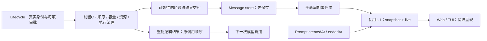

# 02 实施契约

> 2026-09-21 已合并讨论决定。仅规划，未实施。前置是 improve-1、improve-1.1 和独立任务 C 的实际验收；不是仅存在文档。内部字段和接口名称可按仓库惯例调整，但不能削弱语义。本文不再冻结原类别 wave 或整个 backend 的读写大锁。

2026-09-23 按 D34–D35 收束：本轮补齐可靠行为及可验证的接线，不再为每种等待建立新机制。默认10、固定执行期限和200ms/1000ms清理观察沿已确认规则；D33的1秒是指定本地锁竞争场景的取消响应目标；按钮何时换提示、扫光强弱属于可逆显示细节，在S4验证。三类数字不相互替代，也不新增自动调参、第二套清理服务或单独的Stop持久状态表。

## 2.1 职责、依赖与主数据流

| 负责方 | 必须交付 | improve-2 如何使用 |
|---|---|---|
| improve-1 | 真实身份、独立审批registry、回答/撤销与审批恢复 | 每项独立等待和回答，不重定授权归属 |
| improve-1.1 | 页面snapshot与live续传正确衔接 | 扩展工具/模型事实，验证刷新恢复，不另造水位协议 |
| 前置C | 文件锁正确性、访问准入、跨会话保护、Bash批次调度、固定期限与真实清理 | 调用准入/取消接口，保存和展示阶段、结果与清理事实 |
| improve-2 | 独立审批编排、逐项可靠交付、工具详情、模型/整轮计时、保存失败中断 | 本文实施主体 |



scheduler不读会话DB、不调用前端；lifecycle持有真实run/session/message/call身份并承担保存。沿第一轮传递真实身份，不用callId冒充runId。TUI保持in-process，serve/Web复用相同事实；子代理记录不混入父模型阶段。

单项交付不触发模型续轮，整批逻辑结果收齐才继续。资源保护按C的真实操作/清理事实释放，不延长到浏览器消费或历史写入完成；释放资源不代表结果已可靠交付，也不绕过同批必要顺序或已置位的fatal准入限制。清理和资源限制可以活得比逻辑结果更久；本轮消费[前置 C](../pre/c-concurrency-and-resource-protection.md)的规则，不实现第二套锁或工作区冻结。

## 2.2 独立审批与前置准入的接线

数量准入采用前置C/D28：每个会话独立计数，默认10、后台可调整；子代理子会话独立，不共用工作区或根任务树数量池。文件保护仍跨会话共享，批次顺序仍局部处理。Full Access按[第一轮 D22](../improve-1/00-discussion.md)免人工审批，包括显式 MCP 与敏感路径；已配置的明确 deny、禁止路径/命令和必要资源检查继续生效。第一轮 permission 实施并验收此策略，不能由本轮数量调度擅自绕过或再引入人工 ask。

2026-09-24 已确认覆盖 Read/Edit/Write/Grep、网络、Bash 和普通 MCP/扩展工具，共用该会话的 10 个普通名额；受信的执行状态查询/取消入口保持可用，子代理派遣与等待汇报沿独立限制。当前未接入长期用户记忆工具，不增加相关设计；内部旧 category=memory 不作为普通操作免计数的依据。具体映射及混合工具容量验收由前置 C.4/C06 负责，本轮消费其接口。

名额归还消费前置C.4.1/D29：正常调用结算归还；显式后台Bash登记job并形成派遣结果后归还；超时/取消在清理负责人和必要保护已登记后，逻辑结算归还。10计数已开始、未逻辑结束的普通调用，不计已派遣后台job和已接管残留，不能当作物理操作总量保证。归还不等前端或数据库消费，不等整批收齐；文件保护/来源限制仍按真实事实解除，批次模型续轮仍等待全部逻辑结果可靠交付。保存fatal或Stop已置位时，即使有空槽也不得启动本轮新调用。迟到完成不再次归还名额、不产生第二个结果；本轮不实现第二套计数或清理管理器。

```text
纯身份 / 参数 / 受信访问计划
  → 满足前置C规定的前序依赖后，进行当前项的状态相关预检查
  → 当前项按权限策略自动放行或独立审批，不等全批审批收齐
  → 前置C：重新校验准入、取得所需资源和执行容量
  → 实际执行 → 唯一settle保存交付
所有逻辑结果收齐 → 按原index给模型
```

1. 无冲突、无必要依赖的A/B中，A等审批不阻止B获准后执行。不得先await全部preflight或Promise.all(preflight)才启动任何工具。
2. 同文件的read→write→read、未知Bash构成的批次顺序等由C决定。后项依赖的文件检查不得提前读取旧状态；也不因为A待批/拒绝就删除其顺序关系、把前后冲突操作错误并起来。拒绝/失败完成后按C的规则推进，模型最终审视结果，不新增自动依赖推理。
3. 不同文件的写操作不再仅因类别write被全局串行；第二轮必须使用C的访问准入，不能为了方便仍按旧splitIntoWaves冻结所有写波次。
4. 子代理派遣及已有可独立准备的内置操作分别preflight→准入→执行；待批Bash不能阻止本可派遣的子代理开始。独立准备不代表免数量限制，具体按C的计数范围；子代理自身工具遵守C的资源及来源限制，控制面操作保留可用。不以旧memory类别推导已接入长期用户记忆工具。
5. 全批准备只做不依赖可变文件状态的工作。当前prepareCall里的权限context、Bash preflight及相关路径检查需进入适当的顺序位置；所有准备放进cleanup保护区。仅移动preflightCall不够。
6. 审批、资源及来源限制等待不占实际执行槽，不计执行期限。获批后、等待结束后、execute前复查取消和C的准入；fatal置位后不能开始新副作用。预检查后目标改变需按C/permission规则重新校验，不能持锁等批准。

体验边界：需要人工审批时，同批两条未知Bash通常仍按“A审批→A完成→B审批→B执行”；独立审批不是承诺一次批完所有未来操作。原批次中的必要顺序保留，已知无冲突文件可并行。

## 2.3 逐项交付、持久化和批次收口

### 可等待接口

为 `BatchToolCallRequest` 增加内部可选 observer（生产 lifecycle 必须提供，底层无 UI 测试可省略）：

- `onCallState(request, state): Promise<void>`：可靠保存非终态阶段及时间。
- `onCallSettled(request, index, result): Promise<void>`：可靠保存单项终态。

执行任务中的阶段交付改为可等待调用链，明确覆盖scheduler所有状态路径；可等待的是可靠保存，不能在真正执行前提前发布executing。完成此前必要准备和保存后，重新检查取消/fatal及C的准入；同步采集executionStartedAt、启动执行期限并实际调用execute，中间不await数据库。立即接收原操作的resolve/reject、保留取消及清理责任，再按序可靠保存开始事实；只有保存成功才能发布该事实。操作可能先于开始保存完成，终态提交必须排在开始提交后面；开始保存失败照常fatal并取消已启动操作。同步cancel/cancelAll和AbortSignal listener先立即置取消标记、abort controller并取消排队资格，不能被阶段保存队列挡住。未曾调用execute的项没有executionStartedAt。现有bus可继续提供诊断通知，但不承担必须成功的数据库提交。

所有调用终态集中走唯一 `settle(index,result)`，覆盖参数错误、工具不可用、访问拒绝、审批拒绝、取消、成功、失败、超时；去重以真实 runId+callId/index 为准。phase=ended、outcome、endedAt 和结果正文由 settle 一次 updatePart 原子保存，再加入生命周期输出队列；onCallState 不另写无结果的终态。内部可先认领终态防重入，但 observer 成功后才算交付完成并对外发布。终态之后的迟到进度不得让调用重新 executing；清理状态可继续独立更新。

“逻辑结果已确定”和“结果已可靠交付”是两个完成点，不新增两套终态。前者完成必要清理交接后按C归还一次数量名额；后者还要等待保存和发布。不得把数量归还放到await onCallSettled之后。保存仍在等待时，符合准入的独立调用可以利用空槽；一旦保存失败并置位fatal，立即阻止本轮新调用并取消在途执行，不追溯声称故障被发现之前其他项从未执行。

### 实时输出与模型结果分离

lifecycle 驱动 batch 时同步消费一个**本轮内存事件队列**，把已保存的 tool 状态/结果及时 yield 给既有 worker/stream bridge。队列只服务本次批次的阶段/终态交付，不接纳stdout或token流水。每call未消费的非终态通知可合并为最新状态，终态与结果保留一次，队列规模随本批调用数增长；fatal有独立结束通道，不等待全部清理后才通知。observer等待可靠保存，不等待浏览器接收。通知合并只减少保存之后的待消费通知，不减少已约定的阶段写库次数；不把它宣传成数据库批量写优化。终态可覆盖该call尚未消费的旧阶段通知，迟到旧通知不能覆盖终态。复用小范围队列能力，不引入持久队列。不能先 await batch 再 drain；普通回调也不能直接 yield。

浏览器订阅使用既有独立缓冲和gap/重同步机制，不能把SSE消费者背压传回工具执行；内部生成器/投影失败则明确走系统错误路径，不无限囤积。

`tool:result` 沿现有 worker → run.tool.result → adapter 链路。原批次尾部的重复 updatePart/yield 移除。`step:complete`、模型 toolResults 仍在整批结束后按原 index 组织，不因 B 比 A 快而重排消息供模型使用。

保持 `beforeToolCall` 现有调用时点；它不是实际执行开始。`afterToolCall` 保持整批后原调用顺序的既有 hook 语义，本轮只把可靠保存和 UI 结果提前，不顺带改变插件 hook 的完成顺序。每项 hook 最多执行一次；fatal 批次不继续执行正常完成 hooks 或下一模型步。

### 状态持久化与刷新

ToolPart 增加有类型的可选 `metadata.execution`，由 lifecycle 写入：真实 runId、当前 phase、phaseStartedAt、createdAt、executionStartedAt?、endedAt?、waitReason?、outcome?、cleanup?。原有粗状态和结果正文继续保留，用一个共享 projector 推导 SDK 状态。metadata 是观测事实，不作为模型额外正文。

等待原因消费前置 C 的真实准入事实，至少区分执行容量、前序冲突、文件资源冲突、来源主会话残留清理。可定位来源时内部关联真实调用；客户端只接收当前授权范围内的名称/身份，否则只显示通用原因。不得猜测占用者。

内部 phase 至少区分 preparing / awaiting-approval / waiting-predecessor / queued / executing / ended。queued 表示等待既有并发控制；只有能够确定的原因才填 waitReason，不能把所有 queued 都标成容量不足。outcome 区分 success/error/rejected/cancelled/timed-out；cleanup 是独立清理信息，不把超时改写成成功。

同call的阶段、结果和cleanup共用同一顺序提交链，末态不可倒退；每个阶段转换保存一次，不每秒写库。提交时从最新权威记录合并本次变化，不能缓存整份旧metadata稍后覆盖新cleanup。终态保存保留已知最新清理事实；后续cleanup更新不改phase/outcome/结果正文，也不再次交付模型结果。批次结束后的cleanup继续由原清理owner提交，经既有投影通路更新，不能依赖已关闭的批次通知队列。开始时间采集与真正invoke相邻，等待阶段不得预填。若不能创建/更新该part，则按§2.7系统错误处理，不静默跳过。

SDK 在 UiToolCall/Result 上提供相应可选观测信息；live 与 persistent-store 复用同一 projector。先保存、更新 UI store、再发事件；沿 improve-1.1 实际验收的页面快照与续传机制扩展到这些新状态，不能让 snapshot 配新水位却漏已发布的工具状态。旧消息缺字段时显示已知粗状态，详情注明缺少历史阶段数据，不猜测。

## 2.4 模型请求计时与整轮计时

### 每次模型请求

统一在 llm-client 的 provider adapter 调用边界记录 attempt 开始，stream 正常结束、失败和取消均记录结束。它不是精确 TCP 发包时刻，也不是 provider 内部隐藏重试次数；本轮可观测的每次 adapter 调用有独立 requestId。不要用现有 llm:start 直接代替，它在建消息前且在重试外。

新增最小 request-started / first-text / request-ended 事实，经 lifecycle → worker → stream bridge → UI adapter 贯通。正文是首条非空 text；reasoning、工具参数、空 delta 均不算正文。正文出现只隐藏等待提示，不结束后台计时。

本轮必须持久计时的范围是 purpose=agent-step 且有明确 assistant message owner 的调用；其他 purpose 可复用观测接口，但不为计时额外创建空白对话消息。

在 AssistantMessage 增加可选、有类型的 `modelRequests` 记录，保存在既有 message JSON：requestId、runId、step、attempt、purpose、startedAt、firstTextAt?、endedAt?、outcome。用 message 自身的真实 session/scope 归属；不新建表，不把观测字段送进模型上下文。同步更新 Create/UpdateMessagePatch、事件 schema、内存/DB store 和模型消息转换，保证字段可更新且不会污染 provider 输入。

lifecycle在provider调用前准备好所属assistant message；统一observation回调可等待保存，仅保存开始/首正文/结束三类转折，不按token写入。与工具相同，开始事实在实际adapter调用边界采集，中间不等待其自身的开始记录落盘；惰性async iterator以真正开始驱动请求为边界，不能只在创建iterator时计时。请求立即纳入取消和异常接收，事实按序保存后发布；firstTextAt/endedAt也取事实发生时间，不用保存完成时间。回调抛出的持久化错误必须绕过provider retry，进入§2.7。requestId要覆盖同step多次attempt、重试及压缩后重新请求，不能仅用step去重。

请求结束必须覆盖 error/abort/finally，run 终态幂等封口当前未结束请求；迟到 first-text 不复活终态。显式 retry backoff 计入整轮耗时，不计入已结束 attempt；新 attempt 从零开始。退避阶段隐藏本次模型等待提示；本轮不增加持久化退避状态或新重试提示，细节沿用既有错误信息，不新增状态区或工具自动重试。

SDK 为当前 UiRun 提供可选模型活动投影，历史最小请求记录挂对应 UiMessage，仅供恢复和诊断；由真实 session/run/message 关联计算，snapshot 和事件同源。不要求子代理出现在 primary run ledger 中，不能用父 runId 替代其身份。子代理正文不隐藏父请求的提示。压缩/启动等阶段不标 Thinking；后台压缩请求若复用 LLM 通道，通过 purpose 排除默认等待提示。

### 整轮总耗时

复用 prompt 的 `createdAt → endedAt`，包含排队、启动、审批、工具、模型和 backoff；并行耗时不累加。createdAt 为后端接受提交的时间，不等于浏览器点击时间；endedAt 必须在最终回复持久化及本轮完成收口之后，不承诺客户端网络已送达最后一个字。

后继边界：第四轮新增“冷恢复后保留、用户重新发送”的消息时，原 createdAt 保留审计，该次重新提交按 acceptedAt 计时；冷恢复封口时间也不能冒充实际结束时刻。仅该恢复场景按[第四轮 02 §2.6～2.7](../improve-4/02-optimization-plan-and-change-scope.md)扩展，不改变本轮正常首次提交口径，也不表示第四轮已实施。

后台保留失败/取消/中断的 endedAt；不拿 updatedAt 代替。核对 terminal prompt 的 snapshot 查询范围：当前会话已展示的每轮历史都能通过持久 promptId/userMessageId 与最终回复关联恢复总耗时，不能只给 active prompts；沿已有消息分页按需查询关联记录，不一次加载整个数据库。

自动 goal 续跑或没有 prompt submission 的历史 run 不伪造用户提交时间；本轮默认总耗时展示针对可关联的 prompt。旧记录缺时间则不显示数字。未来 goal 总计时另议。

前端不累加 interval 次数，只根据服务端起止事实计算。在 SDK snapshot 增加可选 serverNow（快照生成时采样）；live 优先复用既有服务端事件时间，缺少时补同口径时间戳。收到状态时以 max(0, 服务端采样时间 - startedAt) 为显示基数，再用 monotonic elapsed 推进；重连重新校准，不能以组件挂载时间重置。接受传输延迟误差，不实现完整时钟同步；旧数据没有服务端时间基准时只显示等待提示，不猜活跃秒数。终态用保存的起止差固定显示。异常时钟差应夹到非负且记录诊断，不能承诺跨系统时钟修改仍绝对精确。

统一一个纯函数格式化整秒：0s、59s、1m 0s、1m 40s、2h 40m 5s、1d 2h 3m 4s；省略最高非零单位之前的单位，其后的单位保留（1h 0m 5s），不混用 m/min。Web/TUI 复用，内部保留毫秒精度。

## 2.5 最小展示合同

| 情况 | 默认界面 | 展开详情/后台 |
|---|---|---|
| 模型 attempt 活跃且无正文 | 消息流末尾等待提示及本次时长 | 后台最小请求起止及结果，不新建请求历史查看器 |
| 正文已开始 | 隐藏额外 Thinking，正文正常流式 | 计时继续到请求结束；不因短暂停顿恢复提示 |
| 工具 executing | TUI 仅此阶段转动并显示独立运行计时；Web 沿原工具卡结构，对运行中文字施加轻量 shimmer 扫光及独立计时，与 Thinking 分开 | 准确阶段、执行开始、等待原因 |
| 准备/等待前序/排队 | 不新增文字标签，不伪装执行动画 | 可读阶段及原因 |
| 工具成功 | 停止动效，保持简洁 | 保存结果与时长 |
| 失败/拒绝/取消/超时 | 静态异常标记，不仅靠颜色 | 区分实际 outcome、错误、部分输出和清理状态 |
| 审批等待 | 现有 permission 入口，无重复按钮 | 工具详情可显示等待审批 |
| prompt 终态 | 最终回复或结束提示下淡色显示一次总耗时 | 后台模型计时记录；工具详情沿原展开入口 |
| 用户点击 Stop | 现有按钮原位转圈，暂时禁重复点击；提示为正在停止，等待较久可改为仍在停止 | 绑定原session/run；可靠停止事实与残留清理分别处理 |

不新增底部工具数量汇总、计时面板或任务面板。按D32，Web保留`ToolCard`原有结构、配色和展开入口，只在真实executing时对工具名称文字加低调的shimmer，不扫整张卡，也不把等待阶段当运行；终态立即停止。TUI当前`message-row.tsx`把pending和running共用spinner，须改为以真实执行阶段控制转动与运行计时，等待仍可在详情看原因。计时和动效由同一后端阶段驱动，不能各自猜测；支持aria名称、键盘展开及`prefers-reduced-motion`/TUI已有禁用动效设置。网络断开只改变连接提示，不把任务标成cancelled或把时间归零。工具/模型状态只能来自后台，不用“多久没token”猜卡死。

子代理自身阶段按真实子身份记录；本轮父 subagent_run 工具行可以仍显示 executing，审批沿第一轮根入口可见。将父调用关联到子代理当前工具/审批及只读进展归第三轮，本轮不悄悄增加子代理面板。

2026-09-23 D34细化此前“正常Stop/清理静默”：现有Stop控件有操作反馈，正常后台清理不新增文字提示、弹窗、底部汇总或面板。清理与阻塞事实仍在后端保存；若清理异常实际挡住新调用，按前置C.5返回该调用的普通错误，通过现有工具行/结果展示，主代理收到相同错误。不新增全局清理通知，也不把取消后的旧工具持续显示为running。既有按需详情/诊断保留真实原因与授权过滤，不主动弹出。

Stop等待绑定点击时的sessionId/runId，复用现有操作状态；主任务停止且必要终态登记成功，经同源事件或恢复快照可靠确认后结束。RPC的已接受/成功回复本身不等于已停止；可靠终态若先于RPC到达，也立即结束对应等待。Stop与自然完成竞争时保留先确定的真实终态，不将成功改为中断。A的迟到回复/失败/终态不能清除B的等待或改动另一个会话按钮；可靠终态已确认后，迟到传输错误不得把它倒退为停止失败。没有可靠终态而请求失败时，清除本地请求等待并使用现有错误入口；连接不可用时显示连接/状态待确认，按1.1恢复后再决定控件可用性，不假报已停止、不自动反复发送Stop。等待期间允许编辑草稿，其他操作沿既有能力条件。

不为按钮新增硬超时或前端轮询。长等待只调整原按钮提示/可访问名称，具体阈值在S4确定，无需配置面板；reduced-motion下以静态等待标记保留含义。TUI沿现有取消入口和反馈，不增加Web式按钮。D33的1秒只验收后端取消受理及信号发出，RPC返回、关键登记和按钮等待可以更久；不等待残留Bash退出。完整整树Stop及A→B交接仍归第四轮，本轮只把既有停止入口、可靠终态和显示接好，不提前复制第四轮协调器。

工具执行计时从 executionStartedAt 开始，逻辑 endedAt 后固定；审批、容量/资源等待不启动 running 计时，取消后物理清理不继续累计。刷新按 §2.4 的服务端时间基准恢复，不按组件挂载重置。未执行的资源准入错误没有 executionStartedAt，不伪造执行时长。后台 Bash 派遣调用返回 jobId 即结束自身计时，后台 job 若展示时长使用自身起止事实，不让派遣行一直计时。

## 2.6 超时、清理和来源限制的结果接线

固定执行期限、TERM→KILL、真实清理和资源保留由[前置 C.5–C.6](../pre/c-concurrency-and-resource-protection.md)实现。本轮沿用既有默认期限，不新增续期或idle timeout。用户确认的处理表保留在00，第二轮不重复实现进程管理。

2026-09-24 用户确认补充：文件锁只负责互斥，执行超时交给现有调度器；C1 移除文件锁内部独立执行计时器，超时结果不释放尚未结束的文件操作保护。普通工具的 byTool 覆盖继续有效，B 已确认 Grep 默认 30 秒，不将普通默认 120 秒误解为禁止工具覆盖。

- 已知文件按资源保留冲突保护；未知残留Bash限制来源主会话及其子代理新的文件访问和 Shell 执行（含可能触及本地文件的未知扩展），独立主会话继续。批次/run结束、切页或重新发送消息不能清除仍有效限制。
- 前台调用超时/取消时，第二轮保存一次 timed_out/cancelled 结果及当时 cleanup 事实；随后只更新清理观测字段，不重发模型 tool result，不把原终态改 success。后台派遣已经成功返回 jobId 的，保持该调用结果，后续超时/取消更新 job 的 outcome/cleanup；可关联原工具行展示，不把派遣 success 改为 timed_out。
- 来源限制建立与真实执行准入由C保证；第二轮不能先发布“已停止”再异步登记保护。检查失败、cleanup Promise拒绝都不是confirmed；输出流结束也不是进程组消失的证明。
- 正常后台job派遣返回jobId不触发来源限制，不改为全程占派遣槽；后台超时/取消的停止未确认由C同样处理。本轮仅接其结果和观测事实。
- 不合作旧操作仍保持资源保护；正常清理期间后续冲突调用等待。观察预算采用前置C.6/D30：Bash退出宽限200ms，强杀后最多观察1000ms；其他工具取消后最多观察1000ms。该预算不延长原执行期限，也不延迟D29名额归还。前置 C 判定清理失败/有限观察后未确认且实际阻塞新调用时，该尚未执行调用以普通资源错误结束：明确新调用未执行，不推断旧操作结果。沿普通工具结果一次可靠提交，整批收齐后交给模型，不自动重试、不因该普通错误取消独立兄弟调用。已有等待者与新调用都覆盖；清理确认后不重放已返回错误的调用。持久化这一错误失败仍按 §2.7 fatal 处理。
- 逻辑run结束时解除自己的消息监听不能丢弃C的清理owner；迟到清理写回原身份，不能更新新run或解除另一个残留的限制。跨重启恢复归第四轮。

### 资源阻塞结果的最小提示（D31）

沿既有普通工具错误正文说明三件事：本次调用没有执行；先前操作停止尚未确认、相关保护仍在；先做不冲突工作，无法继续则向用户说明原因，不自行循环重试、轮询或反复kill。不要把普通锁等待误报为该异常，也不要求模型换用Bash绕过同一资源限制。

只有存在当前调用者有权查询的真实后台job时，才在模型可见正文附真实job_id和按需task_output指引；不能仅放在不进入模型上下文的metadata里，也不使用callId冒充。无查询能力或跨会话无权限时只返回授权范围内的原因，不提供无法执行的控制指令。任务已在清理时不默认建议重复task_kill，不假设对逻辑终态再次kill会重启清理；本轮不扩控制权限。用户后来明确要求检查时，可按最新事实重新查询，实际工具调用仍受C准入限制。

不新增重试管理器、轮询服务或模型行为专用状态机；这是工具结果中的行为指引，不能代替后端保护，也不能保证模型永不重复请求。批次仍收齐结果后才由主代理作下一步判断；普通阻塞错误不自动停止其他独立工作，不新增专门清理提示。

## 2.7 持久化失败与取消

可靠交付失败使用独立 fatal 错误类型，不能被 runTool 的普通异常映射、executeToolCalls 的批次 catch 或 llm retry 吞掉。首个 fatal 设置 turn/batch 取消标记，停止 admission，取消在途 controller 和 pending approvals，沿第一轮撤销语义收口。取消信号与清理不以取消状态保存成功为前提。已经写入的结果保留；不把所有项改成同一错误，不自动重放工具。

给本轮事件队列发明确错误/结束，向用户尽力报告系统错误；若数据库连终态也写不进，内存及可用连接报告失败，记录最小诊断，不宣称已持久化。第二轮不恢复失败的原 turn、不重放其工具，不新增补偿数据库；保留尚未完成的关键登记事实与明确故障。第四轮接入[原 owner 重试与冷恢复](../improve-4/02-optimization-plan-and-change-scope.md#26-冷启动恢复和错误隔离)：原环境可靠补登记后由原 prompt scheduler 推进有效 queued，冷恢复则 retained 手动发送。第二轮可独立验收 fatal 及取消，不以第四轮恢复协调器为前置。

`Promise.all` 提前拒绝不会取消其他 promise：先发取消，已启动任务都要有异常接收与清理 owner，准备阶段也在 try/finally 内。不等待不合作任务无限结束才通知系统错误；但它们的资源保护不能因 run 结束而消失，后台保持 settling 跟踪。失败的原 turn 不再启动新工具或模型续步；这不禁止第四轮登记修复成功后按准入规则启动下一独立 Run。

前端/SSE断线不是保存错误，后台仍正常执行。已保存、投影发布失败也不能重跑工具；按 improve-1.1 投影不健康/重同步边界明确处理，不能静默丢弃并继续显示健康状态。

SQLite短暂忙由存储层处理：现有database初始化使用WAL和busy_timeout=5000，message store事务入口以runWithBusyRetry有限重试BEGIN IMMEDIATE。耗尽后按保存失败中断；observer/scheduler不叠加重试，不重新执行工具，也不假定每一种SQL错误都可安全重放事务。当前connection使用node:sqlite DatabaseSync，busy-retry还包含Atomics.wait；Promise接口不代表这些调用在后台线程执行。相同连接上的run-ledger、prompt-scheduler、session store及直接BEGIN的snapshot/workspace-registry路径也可能遇锁，且现有重试范围不一致；修复与测试不能只覆盖消息库。2026-09-23隔离两连接探针在1000ms忙等待下测得原100ms计时器延至约1057ms；随后[真实serve诊断](../evidence/2026-09-23-sqlite-stop-contention.md)表明，前置写入同步等锁时Stop取消观察点约随2.5秒持锁延迟到2.6秒；仅持锁且模型流稳定时取消观察点约10ms但RPC回复约2.54秒。由此分别治理“处理Stop前事件循环被占”和“取消后RPC仍等数据库”，不推导用户历史卡住的唯一根因。

T08须用真实独立连接/进程持写事务，记录事件循环心跳、**本地客户端发出 Stop**、服务端 handler 进入、Stop 受理及取消信号发出、deadline和清理回调的时间；按D33，从客户端发出到受理并发出取消须在1秒内，不只记录最终DatabaseBusyError。现有诊断已对该目标形成一个会变红的真实场景，但假模型流关闭只是取消信号的外部代理观察点，不能替代实施时的后端准确时间戳。若现有路径不达标，先在全局连接层评估缩短单次同步busy_timeout及现有有限重试总阻塞时长，并跑完所有关键写入路径和争用失败率；这是最小改动候选，不预设调整一个数值就已解决。若短等待使正常短暂争用频繁失败，再针对**事务开始前**的等待引入非阻塞、有总预算的重试；可撤销的待写请求响应取消，关键结果/停止登记不能因 Stop 信号被静默丢弃。同一连接的关键写入仍按原顺序进入事务，不让等待中的结果被后来的提交越过。保留原结果“先持久化再发布”与最终失败fatal语义；已进入事务后不能盲目重放副作用。重新实测仍不达标才评估把数据库操作放入专用数据库worker；不能直接复制Kimi的内存先入队做法，亦不能把OpenCode的Effect包装或DeepSeek的write-behind当成SQLite已脱离事件线程的证明。1秒不包括关键登记落盘或物理清理完成；候选修复的具体实现仍须经完整T08及相关保存回归验收。

## 2.8 实施阶段、改动面与非职责

| Stage | 改动面 | 完成定义（04） |
|---|---|---|
| S0 前置核对 | improve-1、1.1、C实际代码/验收，真实身份、准入与观察接口 | 三项通过；不拿规划当能力，不符则先修订接口接线 |
| S1 审批与可靠交付 | agent scheduler/types观察接线、lifecycle/message types/store/events | T01–T08：独立审批、遵守C、逐项保存、fatal与hook顺序 |
| S2 阶段与计时事实 | llm-client/streaming及types、message stores、worker/bridge、prompt、adapter；SDK | T09–T15：真实attempt、归属、刷新与prompt时间 |
| S3 清理事实与故障组合 | C取消/清理接口到lifecycle、持久化及SDK的接线 | T16–T21：期限与显示一致、清理不伪报、来源限制无串扰；不是重写Shell/锁 |
| S4 客户端与综合验收 | Web App/tool-card/store、CLI展示、SDK共享格式函数、compiled runners | T22–T28及前置回归：最小界面、计时、真实E2E |

前置C已经负责文件准入与Shell清理基础。第二轮不重定义资源身份、锁共享范围、Bash批次保守策略或来源限制；如实际接口不足，回到C补齐并复验，不在lifecycle/前端临时补另一套规则。

不在本轮：完整子代理只读树及后台结果交付（第三轮）、整树Stop/重启恢复（第四轮）；跨进程锁、通用隔离执行器、自动跳过受阻工具、工具实时日志平台、新超时设置面板、请求历史监控页面、闲置超时和视觉风格重设计。

## 2.9 兼容、风险与回滚

message/part采用可选JSON字段，无新表/SQL迁移；所有store/schema/更新白名单和投影都要验证。旧记录缺字段不补造时间，新观测字段不进入provider输入或prompt正文。同批构建agent/SDK/server/Web/CLI，不混用旧dist。

回滚代码及静态资源整批回退；新增JSON字段被旧路径忽略的行为须测试，严格schema不接受时明确兼容处理。热替换不能丢C的未清理owner或来源限制；重启不保证旧副作用已停，不自动重跑工具。原模块architecture不在本批改写，各轮接口以实际验收为基础。

主要风险：observer失败被吞、终态与正文分开保存、旧波次重新限制不同文件、子请求污染父计时、清理事实伪装已停、页面重建漏阶段。04以确定性交错和真实接线验证，不用类型检查代替。

## 2.10 任务交接与后续边界

前置C按C1→C2/C3独立验收，第一轮与1.1完成各自验收后进入本轮S0。C的运行时共享范围及C01–C15测试见[前置文档](../pre/c-concurrency-and-resource-protection.md)，本轮T16–T21是组合回归，不替代C的独立验收。

第三轮消费本轮真实工具阶段，负责父子进展关联与可靠结果交付；第四轮在同一资源规则上完成Stop、热交接及冷恢复。来源限制不是新增的用户子代理控制入口，不改变子代理只能由主代理管理的决定。

**2026-09-24 已确认的跨轮时序：**保留本篇 §2.3/本轮 04 的实际 invoke 时采集开始事实、随后按序保存。不额外增加执行前必须落盘的标记；第四轮对缺少可靠终态且无法证明未执行的旧调用标为结果未知，不凭缺失开始记录或最后保存的等待阶段断言从未执行，不自动重跑。已有调用及必要准备记录仍先保存，结果可靠交付和保存失败 fatal 不变。具体边界见前置 C.7 与第四轮 02 §2.6/04 T21；第二轮不提前实现恢复协调器。
