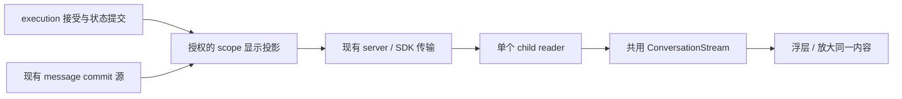

# 总体方案与关键改动范围

状态：规划已确认，供实施使用。以 [00](00-discussion.md) 为用户约束，[frontend 03](frontend/03-ui-layout-and-style.md) 和 [04](frontend/04-interaction-and-states.md) 为建议交互细则。TUI 已确认保留现有 Ctrl+G 内部详情。

## 1. 范围与原则

本轮实现 Web 轻量委派行、单个只读浮层、放大阅读、连续子历史、逐步输出、准确定位和 Queued 气泡。允许为这些能力增加最小持久身份、授权读取和增量投影。

执行队列、超时、根审批、结果交付、模型上下文压缩、实例复用、Steer、停止和冷恢复继续遵守 improve-3 与既有实现；不提前实施 improve-4。不增加用户对子代理发消息、单独 Stop、并排多窗口、通用窗口管理器或新状态/动画库。

## 2. 身份和显示顺序

| 对象 | 权威身份与用途 |
| --- | --- |
| 主会话绑定 | workspace/runtime epoch/binding generation + rootSessionId；负责授权和迟到响应隔离 |
| 连续查看器 | 该 root 下已核验的逻辑 subagentId，服务端解析其 childSessionId + contextScopeId；客户端不可自行放宽 scope |
| 一次委派 | executionId；主历史的每条任务行仍各自对应一次 execution |
| 工具调用关联 | requester session/scope/run + requestId（真实 call ID）；服务端投影 execution 链接，前台运行时也可用 |
| 父消息锚点 | 新增持久 `childUserMessageId`，与正式 user message 的 ID 相同 |
| 阅读局部状态 | 查看器身份 + message/part/toolCall ID；不按数组下标或物理 childSession 单独索引 |

同一子代理再次委派进入同一查看器。多逻辑子代理共享 childSession 时，文字、工具和分页始终按 scope 隔离。历史 execution 保持原本状态，不能用子代理最新状态覆盖旧卡片。

### 2.1 从 Queued 到正式父消息

接受 execution 的事务预留 `childUserMessageId`，幂等接受返回原 ID。此时仅 execution ledger 及 UI 投影有 prompt；**不提前写入模型读取的 message history**。turn 真正开始时，通过已有 `initialUserMessageId` 创建正式 user message。execution 标为 running 可能早于 message 创建，期间仍由同 ID 的启动中投影承接。

父消息始终使用该 ID 作为渲染身份。快照/事件合并只替换其状态和来源，不新增第二个蓝色气泡。接受时间与实际开始时间分开保留，不改写模型历史时间来迁就 UI。

显示顺序以委派为连续段：父消息在前，属于该 execution/run 的过程随后；已接受后续委派立即显示在当前段之后，当前 run 新到的内容继续更新当前段。各段按同一子实例的接受顺序排列，Queued 转运行不换段。段仅是显示排序边界，**不新增嵌套卡片或每轮大标题**。取页时附上该窗口所需的委派映射和顺序，不要求全量加载所有 execution。未启动即终止的父消息保留在原段，标注真实终态，不写进模型上下文。

为保证这个顺序可分页，在既有接受事务内为同一逻辑子实例记录严格递增的 `delegationSequence`，与实际串行准入次序一致；幂等重试复用原值。这只是显示顺序事实，不另设调度队列。总顺序为 `(delegationSequence, 父消息/过程位置, 原消息顺序键)`，段内过程继续用持久 `(createdAt,id)`，part 沿用原顺序；父消息恒在段首。接受、启动、正式消息替换和终态不改变委派或父消息排序键。页面、anchor、增量都使用同一总顺序，禁止先按原消息时间截页再只在客户端重排。

旧消息没有映射时按其原有持久顺序展示，不推测归属；以明确 legacy 区段和新委派区段边界保留两者顺序。旧 cursor 与新显示 cursor 不混用；旧数据不能精确定位时明确降级，不能悄悄重排旧历史。迁移不全量扫描、重写旧消息。

### 2.2 卡片关联和历史锚点

工具卡片依据服务端的 call → execution 显式关联打开查看器；不等待最终 tool result 才允许打开。关联尚未建立时显示当前工具状态，接受确认后成为可打开的任务行。失败于接受之前仍用原工具失败卡表达，不制造不存在的子会话。

点击历史委派通过 executionId 定位 `childUserMessageId`。服务端验证归属后直接查询目标附近的有界窗口，返回前后 cursor、目标命中情况和版本；客户端不逐页扫描整个历史。Queued 目标可来自 ledger 投影。cursor 绑定 root、scope、窗口/排序版本，换 scope 不得复用。

显式锚点优先于保存的阅读位置；定位时先禁用贴底，再展示目标，避免闪到最新消息后跳回。缺少精确锚点时打开已核验的连续历史并说明 `Exact delegation position unavailable`；已知 childRun 可作为明确标注的次级位置。不得用相似 prompt 或临近时间猜测。

## 3. 连续 scope 读取与流式同步

扩展 SDK/server 的子代理只读域，保留旧 execution 详情接口兼容现有消费者，新增连续 scope 的 snapshot、双向 history/anchor window 与订阅能力。接口命名可依项目规范确定，以下语义为必须实现的契约：

- snapshot/变更携带查看器身份、投影 generation/revision、消息/父消息显示行、相关 execution 状态、运行中和思考状态、历史边界、缺失标记；只传显示必要字段。
- **每个 scope 拥有独立投影版本**。消费既有提交源，串行发布 ledger 显示变化、正式消息替换、文字/思考 delta、工具状态和终态。不得过滤全局事件后仍要求全局 revision 恰好 +1。
- epoch/revision 缺口按根会话已有的 resync 原则处理。订阅与快照并发时先缓冲，安装权威版本后只应用后继变化；旧 Queued 事件不能覆盖已正式创建的消息。
- 根读取器一直工作；只为当前选中的 child 维持详细订阅。其他子代理只更新轻量任务行。继续共享 workspace SSE，不为每个浮层新建连接。
- 原根投影的 `contextScopeId === undefined` 过滤保持不变；不把 child 原始消息混入根历史，也不切换主会话绑定。
- 查询、订阅、续传、历史 cursor 均执行根绑定与 scope 归属检查，等待期间绑定改变则拒绝/丢弃；切 root/workspace 清空对应 UI 读取状态、取消旧请求和订阅。
- 打开历史锚点时，显示窗口与实时基线分开维护：同一版本快照同时提供有界 anchor window 和当前运行所需的 live tail；相同消息去重。新增 message/part 必须先由完整建立事件或基线安装，随后才能应用 offset append。活动 part 的基线在订阅期不能被缓存淘汰；超出预算时受控重建 live tail，不重新取同一个旧窗口形成恢复循环。阅读位置不因维护 live tail 被移到最新。
- 历史窗口和最新窗口不相邻时保留明确缺口，在窗口下边缘按需自动加载后续页，提供 ↓ 跳至最新图标；不把两端消息无提示拼成完整历史。新历史响应不能覆盖更新的 live part。
- 不以全量一秒轮询或逐 token 重取历史实现“流式”；旧接口轮询可仅作为兼容退路，不能据此通过本轮流式验收。

关闭浮层释放详细订阅，保留小型阅读/展开状态；下次打开读取新快照再恢复。刷新页面从服务端重建权威历史与 Queued，不要求永久保存浏览器阅读位置。进程重启后的执行终态以 improve-3 既有事实为准，不复活队列。

## 4. Web 组合与操作边界

删除独立 Subagents header。`subagent_run` 特化成轻量任务行；普通工具继续原展开/折叠样式。任务行显示简短说明、真实状态及已有耗时，不堆放 execution/delivery/processed 等内部字段。详情没有重复的“工具输出最终结果”正文：有完整过程时最终 assistant 自然保留；只有旧存储结果时显示明确的 `Stored result` 降级块。

主阅读器、草稿状态保持挂载。child 浮层与放大共用一个消息树，仅切换容器样式。一次只渲染一个 child，切换时保存 message+viewport offset、贴底意图、工具展开状态。执行继续到终态不自动切换或弹窗；阅读旧内容时新输出不强制滚到底部。

浮层显示期间保留主输入框外壳并禁用发送相关操作；关闭后恢复草稿。审批状态仍被根 store 接收，子窗口仅显示短提示，关闭或点击根面包屑即可返回，不增加重复返回按钮。阅读 child 时不渲染根权限条及审批弹窗，也不改变审批策略。Stop、Steer 同样回主会话处理。主会话等待子任务时，将原顶部等待提示并入原有主运行状态区域，不能随删除 header 丢失事实。

## 5. 关键代码范围

| 范围 | 重点改动 |
| --- | --- |
| Web `ui/session/`、`ui/conversation/`、`ui/composer/`、相关 store | 去顶部列表，任务行入口，浮层与放大，复用消息渲染，阅读状态和只读输入框；主要入口为 SessionScreen、SubagentView、ConversationStream、MessageRow/tool-card |
| SDK `subagent.ts`、`subagent-reader.ts` 与 session-view/session-sync | 连续 scope 读取契约、显式关联、增量恢复；复用合并原则，不改根语义 |
| Agent `adapters/ui-inprocess/subagent-views.ts`、`adapters/ui-state/` | 授权 scope 投影、窗口查询、commit 事件分发 |
| Agent `agents/subagent-host.ts`、`agents/subagents/`、`core/agents/`、数据库迁移 | 接受时稳定锚点、turn 使用同一消息 ID、窗口所需关联；不重写 scheduler |
| Server `coordination/session-access.ts`、`client-view.ts` 及子代理读取路由 | 验证根所有权，接入已有传输、订阅和重连边界 |
| TUI | 保留现有 Ctrl+G 内部详情；不因共享 SDK 变更引入 Web 交互或改变原操作 |
| 相关模块文档 | 实施时同步 Web 的 architecture/ui/states/components/test 及受影响 SDK/server 接口说明；本轮规划不把目标回写成当前能力 |

## 6. 实施阶段与验收点

| 阶段 | 交付与进入下一阶段的条件 |
| --- | --- |
| A 身份和历史 | 接受锚点、幂等、连续 scope、精确 anchor window、旧数据降级；通过真实 SQLite 集成及隔离契约审查 |
| B 实时投影 | 单一提交源到 SDK 的有序增量，快照竞态/断连恢复/Queued 替换；原生子代理检查不会污染模型历史或根投影 |
| C Web 阅读 | 紧凑入口、单浮层、放大、只读输入框、每 scope 阅读状态；完成关键浏览器场景与 CSS 视觉检查 |
| D 组合验收 | 根审批/停止回归、编译产物、真实 LLM、子代理审查；按 04 留证据后形成单份 05 |

这是同一轮中的验收点，可按阶段小提交，不另开 improve 编号。阶段 A/B 未达标时不能用 CSS 演示代替整轮验收。

## 7. 迁移、兼容和回退

新增锚点及委派顺序字段采用增量、可空迁移；新接受记录必须有稳定锚点和唯一序号，事务内保证同 scope 不重复。不得为旧已执行记录通过猜测回填；旧未执行记录如需补配，在受控事务中幂等预留并走同一启动入口。迁移和重复接受测试须覆盖重启读取。

旧客户端保留单 execution 接口；新能力通过明确 capability/接口可用性识别。新 Web 遇旧 server 显示旧能力或明确不可用，不假装已支持连续流。传输扩展须检查旧消费者对未知事件的处理，必要时仅向协商支持者发送新类型。

回退优先恢复旧 Web/只读协议，保留增量字段和既有 execution/消息数据，不删除历史或运行产物。生产回退不得因移除 UI 字段而阻塞 host 接受/执行。若投影故障只影响阅读，仍通过主会话操作；前端清晰显示重连/读取失败，不能把缓存伪装成最新。

## 8. 取舍与后续边界

选择共享渲染、单个 child store/视图和已有传输，是为避免两套消息行为与连接生命周期。scope 投影虽增加少量协议工作，但能正确处理共享 childSession、排队气泡和流式恢复；放宽根 API 或全量轮询不能满足这些约束。

不单独创建通用窗口系统、全量设计 token 工程或新的消息存储。像素与动画默认值可在浏览器验收时微调；身份、授权、无重复消息和只读边界不可用视觉调整绕过。TUI 按用户最终答复保持现有详情和交互。

## 用户验收补修：通知显示与统计恢复

本次在既有 improve-3.1 内完成三个小批次，不新建规划轮次：

1. UI 消息保留已有 runtimeInput.kind；Web 共用 ConversationStream 在组装时间线前排除 subagent-status/subagent-result。模型角色、内部消息持久化、结果交付以及 TUI 不变；用户 Steer、普通系统提示及 assistant 输出保留。
2. 上下文统计复用原 tracker 和 runtime.getContextUsage，查询/补算后更新现有 session view。合法主会话在重启后恢复原 getRuntime 按需初始化与静态估算路径；不发起 LLM 请求，不修改上下文组装、tools-aware 估算、校准、分母或压缩算法。不新增 Last request 或其他替代算法。
3. 缓存统计保持既有 /status 入口，不进入 Context Usage、顶栏圆环或会话 view。原进程内 tracker、主 scope 可信 Step、跨 Run 累计及不跨重启恢复均不变；本批不新增 cache 推送字段。

关键范围：SDK UI 消息/会话统计合同、agent 的 UI 统计投影、Web 共享消息流/会话 store/ContextUsage 组件。实施中记录具体取舍与证据，不维护逐行任务表。
