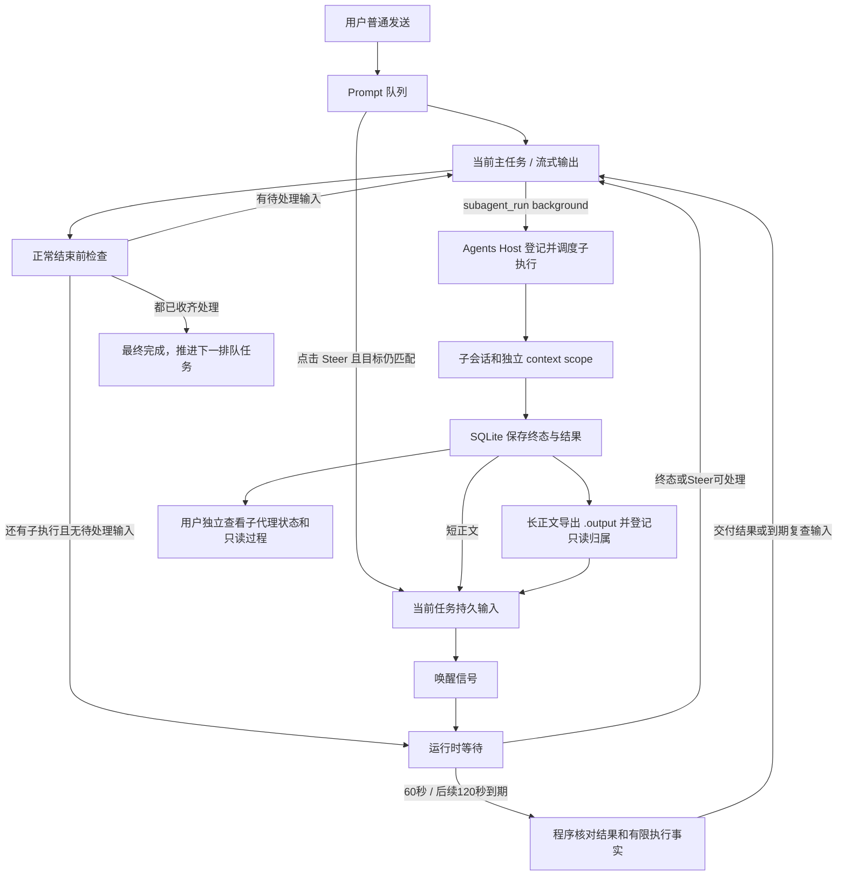
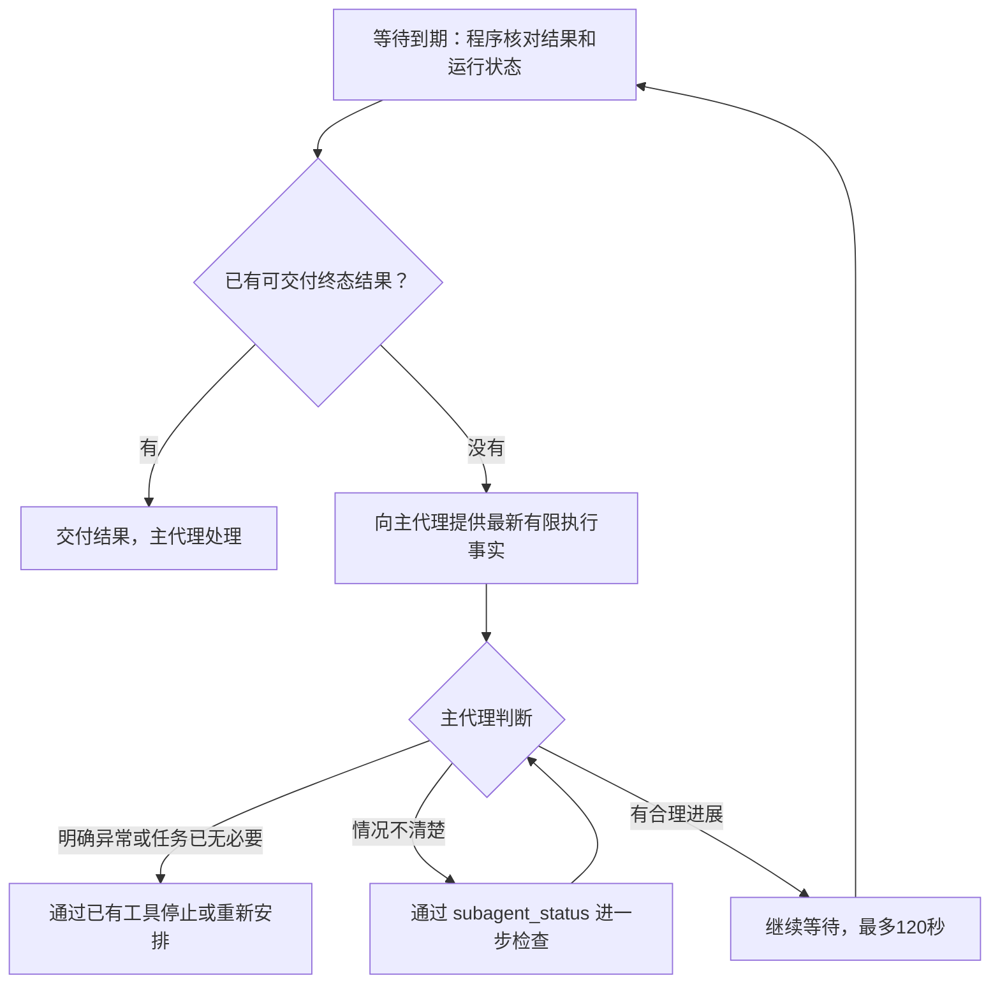
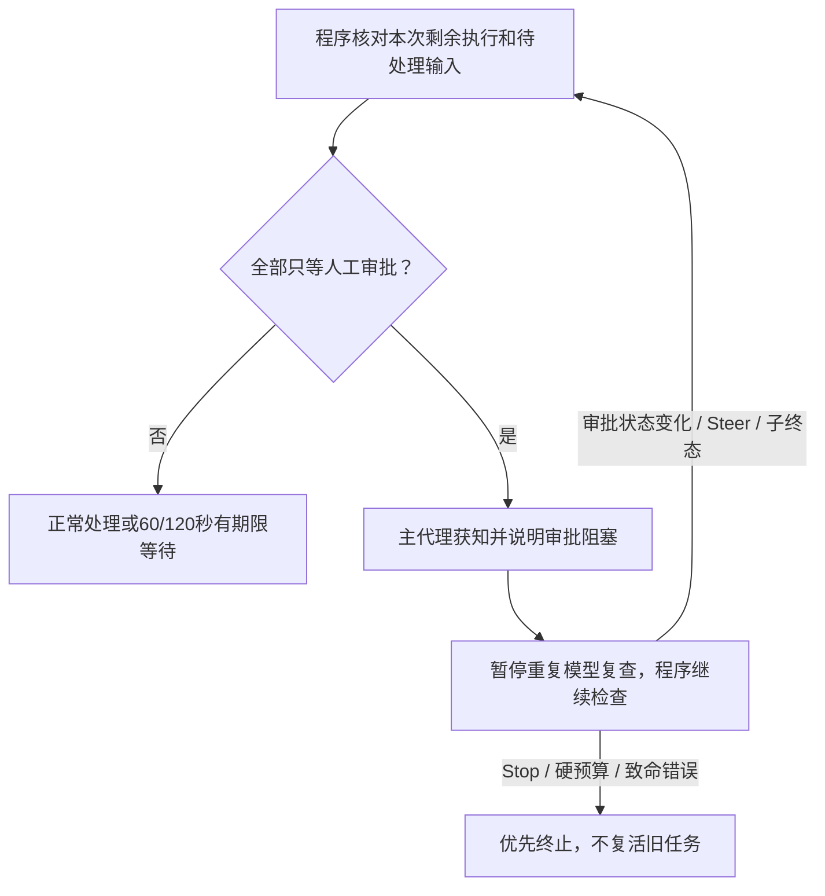

# 2. 优化方案与改动面

> 2026-09-28 后继实施：停止、owner 隔离、retained 与恢复以 [improve-4 验收](../improve-4/05-implementation-acceptance.md) 及其 02 契约为准；下文保留原阶段设计记录。

> 规划基线，未实施。产品约束来自 [00](00-discussion.md)，现状基线来自 [01](01-problem-analysis-and-current-state.md)。Stage 0 以独立前置修复及前两轮验收后的实际代码复核本契约。下文接口/状态名称为建议命名，不声称现有 API 已具备。

## 2.1 总体方案与责任分配

每次后台派遣先登记本次执行及归属，再启动。子代理终态由 host 保存结果并产生待交付记录；父执行在安全边界消费。模型准备正常结束时，通过 continuation 端口检查还有没有本任务待办：有输入则继续、有子执行则有期限等待、都没有才真正完成；纯审批阻塞按 §2.5 暂停重复模型复查。首次等待最多 60 秒，继续等待每次最多 120 秒；到期程序核对结果和状态，交还主代理判断，不取消子任务。整个过程不依赖模型主动调用 wait 或 status。

图中 D→F→I 为正常长结果路径，文件失败走 §2.4 异常路径，不能卡死终态通知。

| 层                                       | 职责                                                                          | 不承担                                          |
| ---------------------------------------- | ----------------------------------------------------------------------------- | ----------------------------------------------- |
| agents / SessionSubagentHost             | 子执行归属、排队、终态、结果导出、提供当前任务待办及有限执行事实              | 另造模型循环；直接操作 Web                      |
| core/lifecycle                           | 在已完成步骤/批次后消费输入；正常结束前调用 continuation 端口                 | import 具体 host/SQLite/store；自行推导父子归属 |
| runtime / prompt-scheduler / run-manager | 通用当前任务输入、唤醒与复查计时、单执行约束、队列与 Steer 接收、运行活动状态 | 直接依赖具体子代理服务；用事件代替持久事实      |
| composition/application                  | 将 host 的 continuation 实现注入运行；协调会话删除和结果文件                  | 复制一套任务/消息数据库                         |
| permission + sandbox                     | 已登记内部结果的只读访问判定与实际路径约束                                    | 整个应用目录无条件放行                          |
| SDK / adapters / Web / TUI               | 有序状态投影、只读子树、Steer 入口、流式进展                                  | 从界面猜测任务是否结束                          |

端口可命名 `RunContinuationPort`，表达 `continue(inputs)`、`wait(observedRevision)`、`finish`；错误/取消直接走现有终止路径。具体定义放 core 的稳定类型边界，通过 composition 注入。业务策略实现归 agents，上层组合普通输入；不创建 `runtime/subagent-*` 专属调度模块。

**控制流明确留在同一次 lifecycle 调用内。** 在原模型步骤循环的正常结束分支、发出最终 turn:end/return 之前等待 continuation。等待中的信号重查不推进 step；决定继续请求模型时才回到原循环下一步，沿用同一 run/prompt、usage、工具累计、promptSnapshot及终止资格。worker 不在 lifecycle 返回后重新调用 run 来“续一轮”。最后一步、取消、失败和硬预算仍按原出口收尾，不因通知到达追加赠送步骤。借鉴 Kimi 同一 runLoopTurn 内 await 结束钩子的结构，任一终态/Steer 唤醒按本方案另行实现。

## 2.2 工程建议与审查点

以下区分用户指定的后续验证基准与尚待确认的工程建议，不能记作全部已拍板。实施前在 Stage 0 定稿，并保留 00 的已确认边界。

| 项目           | 推荐                                                                                                               | 代价/边界                                                                                           |
| -------------- | ------------------------------------------------------------------------------------------------------------------ | --------------------------------------------------------------------------------------------------- |
| 单结果交付策略 | 固定 10,000 token 已撤下；用户指定借鉴 OpenCode/Pi 的 50 KiB（51,200字节）限制，先记录为单份结果交付的后续验证基准 | 按UTF-8字节测量，不等同token数；不截断持久原文、不增加截断预览；具体分流行为结合E2E定稿             |
| 通知批量预算   | 撤下整批 10,000 token 默认建议；复用现有模型窗口、输入占用、输出预留与安全余量口径；整批策略待实测定稿             | 用户本次使用 1M 上下文模型；实现仍读取实际配置，不能把 1M 当所有模型/时刻的剩余容量；不截断完整正文 |
| 结束前文字     | 继续流式显示为过程消息，任务状态保持运行/等待；最后可成功完成时才标记最终回复                                      | 不能撤回已经流出的措辞；prompt 必须避免提前宣称完成，UI 完成语义仍由代码控制                        |
| 接口/表名      | 采用独立子执行记录，当前基线推荐新增 subagent_execution 表；复用现有事务、run ledger和消息存储                     | 表名可调整；不能将逐次结果塞进实例最新output，也不复制通用run生命周期账本                           |

不引入远端 token 计数 API 或 provider 专属 tokenizer 作为本轮依赖。无需新增摘要模型。普通消息和子代理报告正文均按原文处理；通知的来源/归属是运行时可信元数据，正文不因此取得系统指令权限。

## 2.3 身份、每次执行与结果记录

### 区分三种范围

1. **会话子代理目录**：按持久 parentSessionId 查实例，可以包含昨天与今天。
2. **本次用户任务**：优先关联当前 promptId，并绑定当前主 runId。非用户 prompt 的执行使用明确 run 归属，不伪造用户 prompt。
3. **本次子执行**：每次 accepted 的 subagent_run 具有独立 executionId；即使等待容量或同实例前序执行，还没创建 run，也已属于待收齐集合。

推荐每次执行至少记录：executionId、subagentId、childSessionId、childContextScopeId、requesterSessionId/requesterContextScopeId、requesterRunId、rootSessionId、rootPromptId（可空）、rootRunId、mode、状态、childRunId（可空）、创建/开始/结束时间、最终正文或稳定正文引用、失败原因、结果交付状态、artifact 信息。

会话/实例提供长期身份；run/execution 提供本次身份。主 AgentInstance 对象可因新任务重建，不影响合法历史结果读取；也不能把新对象当成旧任务仍在运行的证据。

### 持久化原则

- 采用独立、持久的每次执行记录；当前基线新增 `subagent_execution`（建议表名），不把多次结果塞回 `subagent_instance.output` 或不断膨胀的实例JSON。实例最新 output 仅为兼容投影。
- 三种记录各司其职：instance保存可复用身份；execution在accepted时保存委托与父任务归属、最终结果和交付意图；run ledger保存实际运行生命周期。execution尚未启动时childRunId可空，启动后关联真实run；不能为了凑关联提前伪造子run。运行中状态由真实run/工具事实投影，终态与结果交付按本轮事务认领，不让两个表各自任意修改同一终态。
- 复用既有SQLite事务与消息存储；执行记录可关联结果正文和唯一notificationId，不为此扩建通用事件平台。当前run ledger只有run身份/生命周期，没有accepted委托、逐次报告及交付归属，不能直接替代。S0若上游已新增等价结构，核对唯一约束后复用，禁止重复建设两份执行事实。
- 输入队列中的每一项也带 executionId 与归属，不能等真正开始后才加入父任务集合。
- 同一 child session 不同 context scope 的结果、消息和 UI 明细必须分隔。
- 子代理继续运行生成新 execution，结果路径不同；不会覆盖旧报告或复活旧通知。
- 保持当前一层模型派遣：现有 SUBAGENT_DISABLED_TOOLS 禁止子代理调用 subagent_run/status/close，manager 与 scheduler 都执行限制。本轮不开放嵌套派遣或新增嵌套容量调度。root 归属可兼容历史/内部执行树的审计与终止收尾，不代表模型获得再派遣能力；S0 若发现基线改变，必须显式复核。
- 显式 foreground 返回也使用同一执行记录；正文通过对应工具结果可靠保存后视为已交付，不再后台重复注入。background 只返回 accepted/身份/当前状态，不能伪装完成。

## 2.4 自动交付协议

### 正常路径

1. host 接收终态，定位**该次执行**的正式正文/错误事实；依赖前置提取契约，不能扫描全历史找上次答案。
2. 事务保存执行终态与完整结果，并登记唯一交付意图。推荐唯一键为 executionId＋terminal-result，防止 completed/error/abort 回调重复交付。
3. 短正文形成带来源的待处理通知。长正文先导出 `.output`、记录 ready，再形成可引用文件的通知。数据库与文件不假装处于同一个原子事务。
4. 将待处理通知持久化，再发内存唤醒信号。信号只是提醒，不是结果唯一载体；父模型忙时记录仍在。
5. 父执行在安全边界将通知变为有明确 origin/source 的持久上下文输入，再标记交付。输入写入与交付认领须事务化或通过唯一 notificationId 实现可重试幂等，不能先标 delivered 后丢消息。
6. 在准备并冻结实际模型请求时，关联该请求真正包含的不可变 inputId/notificationId 集合（或能精确表达同一集合的水位）。仅该请求成功后，才为集合内输入登记“给过处理机会”。请求发出之后新到的输入仍待下次处理；不能按响应结束时的全部 delivered 记录统一确认。该账本属于内部执行上下文，不要求把 ID 清单作为 provider 的新增协议字段。
7. 首次处理机会之前，输入不能仅由生成式摘要替代。准备请求触发压缩时，应保护原输入或压缩后重新纳入，确保实际请求含完整短正文，或已准备好的确定性文件入口与来源/状态。若请求未纳入、失败或被取消，不提前确认；重试复用消息身份而不重复插入。成功请求的确认与正常结束判断按同一协调边界核对，不能把“入库”或“拿到路径”当成模型已经理解或读取正文。

推荐复用当前任务输入记录保护首次交付，将候选输入在历史压缩后纳入请求，并把它们的占用计入同一prepare/budget判断；若采用保护标记，其依据必须是输入账本，不能在消息表再维护一套可能失配的“已读”布尔值。禁止简单永久pin住全部未处理长正文：保护内容仍放不下时，按最终定稿的完整文件入口/批量策略处理，或返回明确上下文错误；不得反复压缩同一受保护输入、静默丢弃或无限请求。Kimi的beforeStep先压缩再flush Steer可借鉴顺序，但没有替代本方案的持久认领及整体预算核验。

通知内容：notificationId、原任务/派遣者、subagentId、child session/scope、executionId/runId、terminal status；正文或 artifactPath＋sizeBytes＋估算 token 数。失败/超时/中断用明确状态和简短错误事实；无最终正文时明确说明，不以截断预览冒充完整结果。

### 通知身份与模型消息投影（已确认）

内部保存有类型的运行时通知来源、父任务及子 execution 归属、唯一 notificationId；复用现有消息/输入存储扩展必要元数据，具体类型名在 S0 定稿。不要仅凭 `role=user`、XML 标签或正文内容判定来源与任务权限。

序列化给模型时使用 `user` 消息，并在正文中明确这是运行时交付的子代理结果，列明身份、状态及正文或完整结果入口。内部来源字段不假定 provider 会理解；固定 system prompt 解释通知语义，报告正文不作为系统指令。正文里的伪造标签不能覆盖运行时登记的身份。无需引入 Codex V2 的 provider 专用 `agent_message`，不伪造 tool call/result，也不补写已返回 accepted 的工具结果。

通知进入当前任务的持久输入，在安全边界消费；不走普通 prompt 提交/创建下一任务入口。父模型忙时保存并等待，父任务处于等待时唤醒同一 run；父已终止按原执行保存，不自动另开一轮。

UI、会话标题、任务边界及压缩/历史保留策略均识别真实来源，不能把通知当用户又提了一个要求。特别核查当前按 `info.role === "user"` 判断的最新用户消息保护和 summary 轮次切分；来源在保存、加载、投影与压缩后仍可追溯，待处理结果定位不丢失。只调整本轮新增通知涉及的分类与投影，不重写整个消息框架。未知旧记录沿既有语义读取，不从文本猜测新来源。

### 异常路径

- 结果保存失败：不发成功通知、不伪造完成；当前任务进入可见系统错误，按前两轮错误策略停止正常续跑。数据库全坏时不承诺错误也一定写入成功。
- 文件导出失败：SQLite 结果保留，登记 artifact error；通知准确说明“执行已结束，完整结果文件暂不可用”，带执行标识，不给假路径、不截短冒充全文。允许内部重试从 DB 导出，须有界、可取消；仍失败时给父任务可处理的交付错误，不永久卡在 waiting。正常“已收齐”不能包括未披露的丢失正文。
- 完成与 Stop 竞争：终态/结果可以保存，已停止的父任务不再自动调用模型；迟到交付不能进入下一用户任务。
- 重启：保留结果和未交付事实，不自动重放工具、不默认新开任务。按既有 owner/interrupted 规则处理并显示中断；第四轮扩展完整恢复策略。持久记录不等于本轮承诺跨崩溃无缝继续。
- 首次处理机会前的压缩严格遵守上述第7项；不得以模型摘要声称等价于首次原文交付。已有处理机会后的历史可按既有压缩规则保留结果定位与来源；沿原生协议构造消息，不伪造 tool_call/result。

### 父任务确定终止时的决策（已确认）

| 情况                                 | 行为                                     |
| ------------------------------------ | ---------------------------------------- |
| 主模型暂时失败，仍在允许的重试过程中 | 子任务继续，不提前中断                   |
| 主任务确定失败或预算耗尽，进入终态   | 本次任务尚未完成的子执行一并进入中断收尾 |
| 子结果已经保存                       | 保留，不因父任务失败而删除               |
| 中断过程中又收到迟到结果             | 归入原执行，不自动唤醒下一任务           |
| 同会话里的历史子代理                 | 不受影响；实例保留，后续仍可按需继续使用 |

“确定终止”由父运行控制器按重试、取消、硬预算和致命错误规则判定，不凭一次 provider 请求失败或一个子任务失败就推断父任务已失败。父任务保留真实原因（失败、预算耗尽或用户停止），不能统一伪装成用户 Stop。

终止时先关闭本次任务的新派遣、下一模型步骤和 continuation 入口，再向所属未完成子执行传播中断。范围依据本次 rootRunId/父 execution 关系，包括 foreground/background、已接受但尚未启动或创建中的委托、已存在的内部/历史执行树中归属本次任务的后代（不新增模型嵌套派遣）；不能按整个会话批量关闭实例。当前 `interruptByParent(parentSessionId)` 需收窄为本次rootRun/execution范围（名称由实施确定）；session只作归属验证或会话删除的明确广域操作。即使同会话仅一个活动主任务，旧任务的取消重试、创建回调及清理也可能晚于新任务启动，不能用“会话里正在跑的就是本次任务”替代执行资格。创建完成与终止竞争时须再次检查执行资格，旧 pending 委托退出可执行集合，不能等下次复用实例时偷偷执行。撤销相应审批等待、唤醒订阅和定时器；迟到批准、通知或旧回调不得恢复已终止任务。

中断当前 execution 与关闭可复用实例分开，不能以批量调用 `subagent_close` 代替。已经认领的完成终态和完整结果保持原样；已认领中断的执行随后收到输出，只保存为该执行的迟到事实，不改写成成功、不宣称主模型已经处理、不自动交付给下一任务。后续任务可按已有状态/结果定位方式明确查询历史结果。

程序负责收尾，不额外请求模型、不重置预算、不重放工具。逻辑中断不等于外部工具已经退出，残留资源仍按第二轮及并发前置的保护规则由原执行持有并清理。第三轮必须实现上述默认后台协作所需的基本终止传播；第四轮统一根 Stop、退出、重启恢复和下一任务安全交接，见 [第四轮 §2.3](../improve-4/02-optimization-plan-and-change-scope.md#23-根任务-stop-与下一任务交接)。

## 2.5 自动等待、正常结束与预算

### 安全边界

在开始下一个模型步骤前、已完成且保存的工具批次后、正常结束前检查待处理输入。普通工具批次仍遵守第二轮“逐项展示、整批交模型”，不因为有通知就打断在途写工具或启动第二条父循环。

等待不在 ToolScheduler 中创建工具调用，不占一个虚假的工具执行槽，不新建助手等待消息充当 tool result。保持主任务活动，run 的粗状态可仍为 running，新增有类型 activity=`waiting_for_subagents` 及开始时间/待办数用于 UI。

检查顺序：

1. 用户取消、硬预算/运行期限、模型/存储致命错误优先，按真实原因结束；正常收齐约束不得吞掉这些终止；确定终止时按 §2.4 中断本次未完成子执行。
2. 有已接受的 Steer 或可交付终态：按稳定序号消费并继续；到期复查输入同样只在安全边界处理。
3. 有本任务未终态执行或正在完成必要结果准备：进入有期限等待；到期重新核对事实后交还模型判断。
4. 核对并撤销已过期/被替代的状态观察后，无有效待处理输入、无未终态执行、最后一批结果已进入后续成功模型步骤：在相同协调边界内确认完成，然后释放普通 prompt 队列。

### 状态观察可过期，结果与Steer不能随意丢弃

终态结果和已接受Steer是必须处理的业务输入。到期复查则是某次等待的状态观察：携带rootRunId、等待代次、采集版本/时间和原因，发送前重新核对是否还适用。同一等待代次只保留一个待消费观察；新事实可替代旧快照，普通工具活动只能更新快照内容，不能撤销已经到期的复查资格或推迟60/120秒期限，保留被替代/撤销的审计事实，不把它们写成“模型已处理”。

- 若最后一个子执行已完成，优先交付它的终态；旧“仍在运行”观察撤销。终态已经获得处理机会后，不能只因还留着旧提醒而多请求模型或阻止完成。
- 若仍有相关子执行未完成、没有新的结果/Steer替代本次复查，正常到期观察仍需触发主模型判断，不能把所有状态观察一概排除，悄悄取消60/120秒规则。
- 输入已进入在途请求时不修改该请求；新事实留在后续安全边界。真实结果、Steer、审批变化及交付错误不能伪装成可随意撤销的普通进度快照。Stop令原等待代次失效，旧timer不能恢复输入资格。

是否还能正常结束仍以真实子执行与输入账本判断，不能凭模型说“可以结束了”删除未处理结果。

### 不丢唤醒

使用“先订阅/取得 revision，再检查持久待办，最后 await revision 变化”的模式；完成登记/Steer 入队先写事实再 signal。结束确认与 Steer 接收互斥，不能出现两边都认为成功但消息无人处理。

唤醒来源：任一子终态或结果准备变化、已接受 Steer、单次等待到期、纯审批阻塞期间审批状态变化、取消/硬期限。2026-09-21 的确认替代旧版“无新事件一直不请求模型”：在单次等待期限内没有事件时不请求模型；到期即使子任务没有结束，也应核对状态并交还主代理判断。状态检查不等于模型请求，准备状态变化也不需要每次都单独触发模型。纯审批阻塞说明后的暂停例外见下文。

### 三种机制分别负责什么（已确认）

| 机制                     | 到了时间做什么                                                                   | 是否请求主模型                                       |
| ------------------------ | -------------------------------------------------------------------------------- | ---------------------------------------------------- |
| 状态与交付检查           | 检查本次子执行、持久待交付记录、结果准备和订阅是否异常；补投已保存但未交付的结果 | 通常不需要；发现可交付结果或可处理错误时唤醒         |
| 主代理重新判断的等待期限 | 核对已等待多久、当前进展/阻塞，附有限执行事实，让主代理决定下一步                | 需要，计入原任务预算，不自动取消子执行               |
| 子任务执行期限           | 子执行超过自己的允许期限，进入超时和清理流程                                     | 程序先处理，再交付超时事实；不是父等待计时器代为取消 |

状态核对至少在进入等待和每次到期时执行，不能只有子回调能触发检查。内存信号丢失而结果已保存时，沿 §2.4 的幂等交付协议补投；不得重跑子任务来“重造”结果。程序 reconcile 必须有独立于60/120秒模型复查计时器的有界、可取消调度；即使纯审批暂停模型复查，仍按有限间隔核对 permission 权威版本、执行终态、结果准备及未交付记录。周期和失败重试间隔在S0定稿，不能只等信号，不能复用已经暂停的模型计时器。无事实变化不请求模型；检查无法进行时沿明确的可见错误出口处理。单次等待到期与结果/Steer 同时到达时合并为一次协调检查，优先消费真实输入，不额外制造空复查模型步骤。

### 等待节奏与计时起点（已确认）

| 情况                                           | 行为                                                      |
| ---------------------------------------------- | --------------------------------------------------------- |
| 第一次进入等待                                 | 最多等待 60 秒，再让主模型判断                            |
| 主模型判断继续等，尚未处理新的终态结果或 Steer | 下一次最多 120 秒，此后单次仍最多 120 秒，不延长到 300 秒 |
| 子代理完成、失败或中断                         | 保存并交付终态，提前唤醒，不等计时结束                    |
| 用户 Steer                                     | 接受追加输入后提前唤醒，不等计时结束                      |
| 子代理仍在输出日志、调用工具                   | 更新可见进展及执行事实，不重置、不推迟父等待期限          |
| 主模型处理了新终态结果或 Steer，随后再次等待   | 回到第一档 60 秒                                          |
| 用户 Stop、硬预算/硬期限或致命错误             | 优先结束，撤销等待计时和订阅，不因过期回调重新调用模型    |

单次时间从父执行实际进入等待起算；模型/工具工作时间不算下一段等待，也不按两分钟固定墙钟频率在忙碌期间积累提醒。到期只为该活动 run 的本次等待生成一次可去重的复查输入；主模型处理后再次进入等待，才开始下一段计时。手动 status 查询、普通子进度、状态读取本身均不能重置第一档。继续等待由正常结束前的待办检查驱动，不解析模型文字中的“等120秒”，也不新增 wait 工具或隐式工具结果。

所有期限保证都受调度器正常运行约束；不声称同进程计时器可以修复宿主事件循环整体阻塞。硬期限、取消和运行资格失效仍优先，不为了履行一次到期提醒复活已结束任务。

### 到期后主代理如何判断（用户确认图）

图展示无新终态时的重复复查路径。C 后仍有待办则按表回到 60 秒；H 后也重新检查真实执行终态和交付，不将模型一句“停止”当成取消成功。所有路径均服从取消/预算优先与工具批次完整性。合理进展支持继续等待，不构成必须等待的强制条件，也不构成任务正确性的证明。

| 用例                               | 程序与主代理的处理依据                                                |
| ---------------------------------- | --------------------------------------------------------------------- |
| 结果已落库但唤醒信号丢失           | 程序核对并幂等补投，主代理处理实际结果，不再等子代理通知一次          |
| 子代理持续有工具完成、任务尚未结束 | 不延后复查；到期提供新鲜执行事实，主代理可继续等 120 秒               |
| 同一操作不断失败/重试              | 如实提供有限失败记录，不能把“有活动”转换为“正常推进”                  |
| 长命令暂无输出                     | 标明当前工具及阶段耗时；缺少输出不直接判失败或自动停止                |
| 等待审批或容量/资源                | 给出真实阻塞阶段，不能写成模型正在思考；审批仍在根会话处理            |
| 状态来源缺失或过时                 | 显式未知/不可用及采集时间，不根据读取时刻伪造最近活动，不无限阻塞复查 |
| 存储/运行时发生致命错误            | 沿错误出口结束或向用户显示，不能伪装成正常等待或成功补投              |

### 纯审批阻塞例外（已确认）

当本次剩余相关子执行全部只在等待用户审批，且主代理已获知并说明阻塞后，暂停60/120秒到期触发的重复模型复查。暂停条件基于真实审批和执行阶段，不因看到一条 pending approval 就停止整个父任务监督；还有独立子工作可执行、独立容量/资源阻塞、结果待交付或其他待处理输入时，继续正常处理与复查。不能仅按阶段名字判定：例如同批 A 待批准、B 依第二轮顺序规则等 A，B 是因审批间接无法推进，可计入纯审批阻塞；若 B 是独立运行或等待其他资源，则不计入。只复用 scheduler 已知的必要前序/阻塞原因，不新增通用依赖图，不把未知阻塞猜成审批。

- 首次发现纯审批阻塞时，应先让主代理取得事实并向用户说明，再暂停重复请求；不新增高频审批通知或模型催促。审批入口仍在根会话。
- “已获知并说明”的程序判据复用请求纳入账本：当前rootRun相关的审批阻塞集合及其权威版本确实进入一次成功的父请求，随后在父工具批次已结束、无其他待处理输入的正常结束安全边界重新核对，阻塞仍成立，才记为已给说明机会并暂停复查。prompt要求说明，根会话状态区持续显示真实审批阻塞；程序不解析自然语言，也不因为模型省略说明文字而反复请求。请求失败不确认，沿原重试/终止规则处理；请求期间审批版本变化时旧确认不能覆盖新事实，先重新核对。无关会话/执行的审批变化、普通活动时间或快照采集时间变化不制造本次新的说明资格；不能直接用全局permission版本代替相关阻塞集合。此判据只控制重复复查，不宣称模型理解了审批，也不代替用户批准。
- 程序状态检查与交付补投继续。批准、拒绝、撤销等真实审批状态变化可唤醒协调器，按安全边界处理新的有限事实；重复相同审批快照不重复调用模型。
- Steer、子终态照常唤醒；Stop、硬预算/硬期限、致命错误仍优先。不能为了保持审批暂停而漏交结果，也不能通过这条例外让模型代替用户批准。
- 审批阻塞解除后恢复正常处理与等待；旧到期回调作废，不积累暂停期间的提醒。仅有审批变化不自动作为“新终态结果/Steer”重置第一档，重新等待沿既有档位；若同时处理新终态或Steer，仍按表回到60秒。
- 此处暂停的是主模型重复复查；子执行额度按下节单独计时，不自动延长父任务另有的硬期限。

### 子执行额度：默认与上限30分钟（已确认）

- 每次子执行默认额度与可配置上限统一为30分钟（1,800,000 ms），保留合法的更短自定义 `timeout_ms`。这是扣除纯审批等待后的执行时间额度，不是主代理单次60/120秒等待，也不保证墙钟总耗时不超过30分钟。
- 延续从实际开始子执行计时的边界；accepted但尚未启动的排队不消耗该额度。执行期间模型请求、工具执行及一般等待照常计时，只有真实人工审批导致该执行完全无法推进的区间暂停扣减，包括已知待批前序造成的派生阻塞；不能把独立资源等待、安静长命令或来源不明的停滞当作审批暂停。
- 同一子执行还有并行工具工作时，不因部分工具待审批而暂停整个子执行计时。依据前两轮真实审批/执行阶段识别纯审批阻塞，不由模型口头声明或读取快照触发暂停。
- 审批结束后继续原剩余额度，不重新获得30分钟。多次/重叠审批按纯阻塞区间去重计时，不能重复扣除相同等待时间；拒绝/撤销也必须结束对应暂停区间，并按实际工具结果继续或收尾，不等同于批准。
- 到期沿子执行超时与清理链路处理，保存真实终态再通知父任务；超时终态不可被迟到批准/回调复活。Stop、父运行资格失效与致命错误仍优先，审批暂停不使这些出口失效。
- 总 elapsed 继续包含审批等待；快照/UI分别给出已消耗执行额度、剩余额度和审批等待耗时，不能通过冻结页面总耗时实现暂停。父任务另有的总预算/硬期限不随之自动延长。

| 示例阶段（30分钟额度） | 已消耗执行额度 | 剩余额度 | 墙钟总耗时 |
| ---------------------- | -------------- | -------- | ---------- |
| 子执行工作10分钟       | 10分钟         | 20分钟   | 10分钟     |
| 随后纯等审批40分钟     | 10分钟         | 20分钟   | 50分钟     |
| 批准后又工作5分钟      | 15分钟         | 15分钟   | 55分钟     |

此规则适用于前台与后台子执行。实施时同步 host默认/最大值、`subagent_run` schema与参数校验、deadline额度保存/暂停恢复、SDK说明和system prompt，不能只修改一个常量。新请求高于上限应明确拒绝；旧实例保存的两小时配置在新执行入口需按新上限规范化并明确有效值，不能继续绕过30分钟上限。历史已完成执行的配置、耗时和结果保留真实记录。迁移及功能切换不追溯重算既有在途执行；按本轮停止旧协调器后切换的发布要求处理。

等待不计作模型请求时长，不每次唤醒重置任务总预算或 maxSteps；整轮 elapsed 包含等待。等待本身不消耗模型 step，唤醒后的真实模型请求正常计数。继续主任务保持同一根 run/prompt 身份，不能用重建 run 绕过 budget。

### 步数上限与触顶收尾（2026-09-22 已确认）

本轮保持现有 maxSteps 配置和计数机制，不调整内置主代理1,000步及各子代理原有限额，不新增预留步数、提前结束阶段或独立预算管理器。父子计数各自归属；程序状态检查、等待与信号本身不计模型step，真正请求父模型才进入原任务下一步骤，沿原模型重试/步骤计数规则，不因Steer或子结果重置。

真正触及现有限额时沿原最后一步/终止出口处理，接通 §2.4 对本次未完成子执行的中断与结果保存。现有最后一步禁用工具的规则不扩写为新的机制；不因为报告尚未读取就额外赠送工具或模型步骤。仍有必要报告未处理、子执行未完成时，保留已保存结果、报告定位及未完成事项，明确限制原因；`max_steps_finalized`/一次收尾生成成功不能直接投影为用户任务全部完成。程序不证明模型理解了报告，也不把收到文件路径视为已经读过正文。

触顶原因必须沿 lifecycle → run completion → core/agents 的 AgentRunResult → host 子执行记录 → 通知/status/UI 全链路保留。不能在中间只传 success 布尔值而丢掉 terminalReason，把子代理的 max_steps_finalized 再映射成“任务完整成功”。保留已生成的可用正文与结构化限制原因，不以正文生成成功证明工作全部完成，也不由此把所有最后一步答复一律判为失败。

硬预算已不允许请求或模型不可用时，由程序展示确定的停止事实，不为说明情况另开一次请求。该边界作为异常出口验收，用测试参数降低上限；不要求真实任务跑到1,000步，也不改变正常完成时按需使用报告的判断权。

需审计现有并发槽：等待不得持有下一步消费本来需要的锁；不释放仍保护在途写入/清理的租约。后台父等待与已有子执行容量调度必须能前进；不借此增加当前被禁用的子代理嵌套派遣。

## 2.6 普通排队消息转 Steer

### 服务端操作

新增统一 SDK/backend 操作，建议 `steerQueuedPrompt({promptId, expectedRunId, clientRequestId})`；Web REST/JSON-RPC 与 TUI in-process 共用领域逻辑。路由名可在 Stage 0 沿既有协议确定。

接受条件：排队项仍 queued、属于目标主会话和 scope、未被编辑租约占用/删除/认领；expectedRunId 仍是该会话可接受输入的活动任务；操作未重复接收。权限/控制归属沿第一轮，不用 UI 隐藏代替服务端校验。

第四轮后继约束：冷恢复保留、等待用户发送的 retained 项不属于可 Steer 的 queued，不能自动领取或因其他新消息而恢复执行。单条重新提交后才按正常规则处理，详见[第四轮 02 §2.7](../improve-4/02-optimization-plan-and-change-scope.md)。

一次原子状态转换同时完成：

- 原排队项离开可调度队列，保留原 promptId/userMessageId/text/创建时间；标明已转入目标任务及接收时间。
- 写入目标任务持久输入，source 为 user-steer，建立唯一关联，保证不会产生第二份用户消息或下一轮重复执行。
- 返回明确 receipt（acceptedTargetRunId 等），然后唤醒等待。界面收到确认才移除排队行，并在当前任务显示该条真实用户追加消息。

当前ui-inprocess路径在queued时预留userMessageId，真正execute时才创建core用户消息；Steer应复用该预留ID，在接受转换时首次创建/关联持久消息。兼容其他路径已持久化的同ID时，须复用并更新其可消费归属；不能早在普通队列期间就泄漏进当前任务上下文，也不能 Steer 后在历史模型投影里再出现一次。

### 请求输入证据与第四轮 Stop 衔接

accepted receipt 只证明 user-steer 已持久接受，不证明模型请求包含它。复用 §2.4 的 inputId 与实际请求关联，覆盖 Steer 的待消费、请求组装和发送尝试；不要只为子结果通知记录请求纳入集合。记录必须随输入归属持久保存/投影，不能靠 acceptedAt 与 Stop 时间先后猜测。

发送前在同一执行资格边界检查原 Run 仍可执行，并登记请求所含输入及发送尝试，再调用 provider；Stop 先关闭资格则不能再发。已经登记发送尝试后崩溃、实际网络结果不明确时，保守标为已尝试/未知，不声称未发送。原环境能确认尚未尝试的输入在 Stop 收口后才可提供确切未发送证据；不能用“请求未成功”倒推“未发送”。接受、组装、发送与Stop的竞态在本轮T56验收。

终止原 Run 的 Steer 待消费资格，同时保留原 prompt/userMessage/input 身份和内容。后续 B 加载历史时，未发送的 A 输入仍是审计记录，不能因 user 角色全量回放而成为 B 的新指令；不自动重新排队、重新接受或注入下一 Run。已发送输入按既有历史协议保留，不能把“给过处理机会”写成模型已理解。

第四轮使用这些事实展示用户已确认的英文提示 `Task stopped before your steer message was sent.`，位置在 queued 卡片上方，详见[第四轮 D12 与 §2.7](../improve-4/02-optimization-plan-and-change-scope.md#27-冷恢复消息与现有输入框)。本轮建立输入证据和终止隔离，第四轮组合用户 Stop、刷新/冷恢复及提示；不为此引入第二套输入队列或提前实现 retained 协议。

### 竞争和失败

- 重复请求：同一幂等键返回原 receipt，不重复追加。
- expectedRunId 过期：明确冲突，消息保持原队列或返回其真实已认领状态；不自动重试到服务端给出的新 run。
- Steer 与普通队列 claim、编辑、删除竞争：只有一个转换成功；另一方收到结构化冲突并刷新。
- 发送成功但响应丢失：客户端查询/重试幂等请求恢复，不能盲目重新排队。
- 已接受后父任务出错：保留追加事实和终止原因，不偷偷把 Steer 自动重新变成下一用户任务。
- 模型/普通工具执行中：先接收并保留，下一安全边界消费；不承诺立即终止在途调用。等待中则立即唤醒协调器。

普通发送保持现有 queued 语义，当前任务完成后自动推进下一条。Steer 不创建独立任务总耗时记录，不重置当前任务计时。排队项的 reasoning 配置不在 Steer 时动态切换活动模型配置，实际配置沿当前任务；此限制需在协议说明中明确。

## 2.7 `.output` 存储、只读权限与清理

路径建议：`<storageRoot>/subagent-results/<parentSessionId>/<subagentId>/<executionId>.output`。根目录沿现有配置解析，禁止硬编码用户路径。executionId 对尚无 childRunId 的 accepted 执行也稳定，避免队列与执行期换路径。

- UTF-8 纯文本，内容为最终答复原文；来源/大小等 metadata 放数据库和通知，不混进答复。
- 使用现有 Storage 原子写入；成功写入并登记 ready 后才发布可读入口。系统负责生成，模型没有该目录的写权。
- SQLite 原文/稳定正文引用为权威，导出可重建。长结果在首次交付时导出；短结果初次直接交付正文。当主代理通过 status 明确定位某次历史执行的结果时，系统可按该次数据库正文懒生成同规则 `.output`，返回路径，避免上下文压缩或新任务后短结果无法重读。普通列表不批量导出全部历史；不复制所有工具日志。
- 同一父会话的历史合法子结果仍可读；授权检查使用持久归属，不要求旧 requesterRun 仍活着。
- 在 scheduler 的 permission 判断和实际 sandbox path resolution 两处贯通“已登记内部结果只读”规则。校验规范真实路径、scope 与产物归属；拒绝路径伪装、跨会话 ID 和指向其他位置的链接。
- 不加入整个 app home 的通用 trusted write root。显式用户 deny/ask 沿现有优先级生效；拒绝返回可解释错误，不静默挂起。
- 系统生成文件也不代表正文可信到可覆盖 system prompt。主代理按子任务来源使用内容。

文件ready只证明产物已准备，不证明任何大小都可由当前read读取。S0验证前置Read的文件容量、分页/超长行、编码和取消行为；本轮另验产物授权与sandbox。已知超出当前读取能力时，保存完整DB结果并交付明确“完整结果已保存，但当前read不支持该大小/形式”的可处理错误与执行身份，不把路径标为正常可读入口，不自动截短或转用shell绕过权限。缺失、deny、ask和读取失败沿各自真实规则处理；不能把“超过1MB的报告可能少见”当作能力证明。

清理跟随所属会话删除，不因某个 run 结束或 UI 关闭立即删除。通过上层 deletion coordination 调 storage，保持 session store 的结构化职责。活动会话删除先遵守现有停止/删除策略，不扩展新的静默删除操作；删除与迟到导出之间用 tombstone/存在性检查和最终校验避免重建孤儿文件。子会话或根会话实际删除后，撤销对应产物授权，幂等清理目录；失败留可重试清理记录，不恢复运行。归档/切页不等于删除。

外部手动删文件后可从 DB 懒重建；重建由内部存储逻辑完成，不让模型用 write 修报告。清理后不存在的结果返回明确已删除。第四轮仅补已登记结果、未完成导出/删除意图的恢复核对，不承诺全盘孤儿文件垃圾回收或跨重启外部进程接管，详见[第四轮 02 §2.6](../improve-4/02-optimization-plan-and-change-scope.md)。本轮不宣称完整冷恢复已覆盖。

## 2.8 用户可见性与提示词

### Web/TUI/SDK

- 会话树可展开当前及历史子代理，列表先返回轻量身份/状态/最新活动时间；子过程按需分页，不把全树消息塞进根快照。
- 子代理状态直接来自 host/run/tool 事实，复用第二轮工具阶段；不要为了 UI 每步通知主模型。审批状态可展示来源并引导回根会话，批准入口只在根会话。
- 子会话只读，提供清晰返回根会话入口；用户不能单独停止、关闭或重启某个子代理。服务端用户 prompt/Steer/运行取消等入口统一校验目标归属，拒绝直接控制 child scope；不能只隐藏前端按钮。主代理通过 subagent_run/subagent_close 管理子代理生命周期，其内部授权与用户入口分开。用户 Stop 仍针对当前主任务，不以 child runId 绕过此边界。
- 子会话消息按 session＋context scope 过滤；事件不误投为父模型正文，不刷新父模型请求计时。
- 根任务等待时显示“等待子代理”及已完成/未完成概况，正常展示主代理此前的流式进展；不显示虚假的模型 Thinking。
- Steer 按钮位于队列消息行，英文标签 Steer；仅可接受时启用，pending/失败可见，键盘和可访问标签齐全。沿用户提供的 Codex 截图组织，不新增输入框发送模式开关。
- 默认 TUI 保持 in-process，通过共享 SDK/backend 语义接入输入与状态；具体视觉沿现有组件，不复制 Web 私有调度逻辑。
- snapshot/live 复用improve-1.1实际验收的按会话提交/快照/事件协议，审批另沿improve-1权威版本；重连恢复等待/队列/子代理结果，不能只靠曾收到的浏览器事件。

2026-09-24 用户明确：子代理可使用自身 todo，但其待办列表不向用户展示。子代理只读过程视图继续过滤 todo_read/todo_write 的参数和结果，不新增子代理 todo 面板；主代理待办只来自自身任务范围，不能被子代理更新覆盖或合并。该边界与前置 C 的 todo 范围隔离、improve-1.1 的实时/恢复投影联合验收。

结果面板区分子执行终态、结果已保存、已进入父请求/获得处理机会、父任务已经结束等事实。父终止时已保存但未获得处理机会的结果仍可定位，不能标成“主代理已阅读”或另起任务自动交付。Steer显示已接受与等待下一安全边界，不把accepted当成已发送；沿§2.6与第四轮既定提示处理停止。

### System prompt 与工具描述

必须同步明确：默认 background；派遣后可继续独立工作；无独立工作时回复进展并让本次模型输出结束，由运行时按 60/120 秒节奏等待；全部剩余子任务只等审批时，先说明阻塞再暂停重复模型复查，审批变化/Steer/终态恢复处理；不用 status 轮询完成；任意终态自动交付，到期则附有限执行事实供检查/继续等待/通过已有工具停止或重新安排；本次相关结果处理后才能给最终答复；Steer 属于原任务新输入；长结果用通知中的路径通过 read 按需分段获取；错误/中断如实说明；运行中不做 A2A 协调；子执行额度默认/上限30分钟，纯审批等待不扣额度，恢复不重新发放额度。

foreground的提示词定位：默认background，适合并行派遣，也可用于有依赖的任务；有依赖时必须等实际结果再行动。只有明确希望本次工具调用等待并直接返回结果时才显式选foreground，其工具调用及所在批次保持原等待语义。foreground的结果仅经真实工具结果交付，不能再投后台通知；“下一步依赖结果”本身不构成强制foreground的理由。

到期复查已有足够新鲜快照时，不为确认仍在运行反复调用status；只有缺少决策所需事实才补查。没有实质变化时回复最多简短一句，有结果、错误、审批或方向变化时正常说明。现有状态区更新阶段/耗时，不把每次程序检查变成聊天消息。本轮先通过prompt与有界状态展示控制噪音，不新增按文本相似度自动折叠/隐藏模型回复。真正模型请求仍计费/计步；约30分钟连续等待可能带来十几次复查，不能保证“每次只付新增快照token”，实际缓存和传输方式由provider决定，E2E记录请求/usage及重复status次数。

`subagent_run` 未填 mode 改为 background，显式 foreground 继续支持。`subagent_status` 返回轻量状态、执行标识和结果入口/大小，不反复附长正文；提供受限的历史执行定位（建议可选 execution_id 与有界分页），不能只存 lastRunId 却宣称历史报告可发现。指定历史短结果时按 §2.7 内部懒导出，仍不新增结果读取工具。现有 `subagent_close` 语义保留，终态交付统一去重。

### `subagent_status` 增强：有限执行事实（已确认）

到期复查自动附带本次相关执行的有限快照，主模型不必先调用 status 才取得判断依据；需要进一步检查时使用增强后的同一个 `subagent_status`。两者复用同一事实查询/投影，不各维护一套子代理状态。用户仍可按原权限查看完整只读子过程；主模型不因此获得全会话历史访问。

| 信息                                                        | 判断用途与来源边界                                                              |
| ----------------------------------------------------------- | ------------------------------------------------------------------------------- |
| 当前阶段：排队、请求模型、执行工具、等待审批/资源、准备结果 | 解释为什么没完成，沿 host/run 事实及前两轮真实阶段，不从正文猜测                |
| 当前工具名称、阶段开始时间/已持续多久、执行总耗时           | 区分长操作与耗时异常；无事件依据时标未知，不编造阶段                            |
| 最近实际活动时间、快照采集时间                              | 两个时间独立；读取快照或订阅心跳不能冒充子任务工作进展                          |
| 自上次复查已完成工具数量、有限的近期成功/失败记录           | 每次执行隔离；使用明确的观察基线/序号，基线不可用就说明，不拿其他执行的记录凑数 |
| 已知阻塞或错误事实                                          | 给出有界的原因/错误类型，不把整段工具输出藏在错误字段中                         |

快照携带既有 execution/run/session/scope 归属与采集信息；普通会话历史目录和当前任务自动复查集合保持区别。自动复查只取当前任务相关执行，不因同父会话就自动注入昨日过程。

有限记录只展示工具名称、阶段、时间、成功/失败等运行事实；不附正在生成的答复、reasoning、完整工具参数/输出、完整历史日志或截断答复预览，也不调用额外模型撰写进度摘要。对单条记录长度、近期条目数、批量快照总量设有界限制，具体工程数值在 S0 明确；被省略时标记省略/未知，不假装全部正常。该预算独立于最终报告的交付策略；最终报告不再预设 10,000 token 分流阈值。

运行时复查输入明确标识为状态观察，不能伪装用户指令或子代理正式结果；沿 §2.4 已确认的内部来源与user投影分离方式接入，具体来源类型区分“状态观察”和“终态结果”，不新增另一套通知协议。活动存在只能证明观察到了活动，不能证明任务有效推进；静默也不能直接证明卡死。prompt 应采用 §2.5 判断图，不能指示“running 就一直等”或“静默就关闭”。运行期每条事件可更新状态/UI，但不逐条注入主模型；这不是新增子代理主动中途汇报。

## 2.9 分阶段实施、改动面与兼容

### S0 必须核对的上游交付

下列是已有职责的具体交接门槛，字段名在前轮验收后的实际接口上校正，不把文档字段当已实现。缺失项先回对应owner补齐/复验；不进入依赖该项的功能验收，不切换默认后台。可继续独立的设计、存储测试，不以mock替代依赖通过。

| 提供方            | 必须取得的能力/证据                                                                   | 第三轮用途与缺失处理                                                                                                                       |
| ----------------- | ------------------------------------------------------------------------------------- | ------------------------------------------------------------------------------------------------------------------------------------------ |
| improve-1 D13     | lifecycle→scheduler→工具context传递真实runId；root/直接派遣者关系从可信执行身份解析   | S1接受委托即记归属；没有身份拒绝该派遣，不用callId或“当前会话run”猜                                                                        |
| improve-1         | 权威审批状态、版本和变化事实；批准/拒绝/撤销可重查                                    | S3b暂停/恢复与独立reconcile；快照缺失标未知，不暂停额度                                                                                    |
| improve-1.1       | 同一会话的提交、版本、基线/实时衔接、消息身份与分页                                   | S2/S4新增输入及子视图接同一通路，不另造消息缓存/全局水位                                                                                   |
| improve-2 + 前置C | 真实工具phase、前序call关联/阻塞原因、实际活动和清理事实、整批交模型边界              | S3a安全消费/终止保护，S3b推导纯审批；现方案waitReason未保证结构化前序ID，S0必须检查并在原owner补充最小关联，不能解析展示字符串或自行猜依赖 |
| improve-2 §2.4    | provider adapter每次attempt的requestId/起止与可等待的持久记录；压缩重试仍能关联       | S2/S3a请求实际纳入及T56；调用开始不等于TCP精确发包，更不等于模型成功处理；发送尝试/未知继续按§2.6区分                                      |
| 前置A             | 只取本run/scope正式text，失败/中断/无正文和reasoning分离                              | S1最终结果保存，不扫描历史找上次报告；触顶原因另由S3a贯穿返回链                                                                            |
| 前置B的Read部分   | 整文件上限与单次返回预算分开；大文件范围读取、超长单行续读、UTF-8边界及取消的实际证据 | S1/S3长报告入口；未通过不声称任意长结果可读，已知不可读按§2.7显式错误；Edit/Write全面增强不是系统导出的技术前提                            |

核对版本/实际符号/验收证据的工作归S0。纯审批事实经宿主注入的领域端口提供给agents，lifecycle不查询scheduler内部Map，host不从UI文字或ToolPart展示字符串推导权限结论。

### S0 仍需定稿的工程项

核心行为已按00及本轮确认收口。下面是依赖实际代码或测量的工程校准项，不再作为无限延长产品讨论的理由；对应能力未通过时，阻止依赖它的验收及默认后台切换。

| 工程项                   | 定稿依据与完成条件                                                                                                                       | 不得改变的边界                                                           |
| ------------------------ | ---------------------------------------------------------------------------------------------------------------------------------------- | ------------------------------------------------------------------------ |
| 单份分流及同批总量       | 以50 KiB UTF-8字节为单份验证基准，按04 §4.3测边界、同时完成及高占用窗口；明确正文/文件分流、顺序与批次处理，并证明保护集超窗口能有界退出 | 不恢复固定10,000 token，不截断原文或增加截断预览；读取真实模型窗口       |
| 有限执行快照             | 明确单条长度、近期条目数、整批预算及省略标记，验证大量活动/错误时仍有界                                                                  | 不传reasoning、在写正文或完整工具输出；不能省略后假装全部正常            |
| 程序核对和文件导出重试   | 确定核对周期、单次检查期限、失败重试次数/间隔和错误出口；丢信号、审批暂停、存储故障时用受控时钟验证最大延迟                              | 独立于模型复查，无变化不请求模型；可取消，不永久等待，不改变60/120秒节奏 |
| 类型、持久结构和协议命名 | 在上游已验收revision上确认真实符号、唯一键、迁移和SDK能力；有等价结构则复用                                                              | accepted即有执行归属；会话不替代任务；内部来源不由正文推断               |

工程校准值及证据应在后续实施变更说明和验收记录中明确；02保留行为契约，不改为每日进度表。若取证要求改变已确认行为，应先说明具体反例与代价再重新讨论，不能以“实施细节”为由自行变更。

| Stage                    | 工作与主要位置                                                                                                                                                     | 完成定义                                                                                                                             |
| ------------------------ | ------------------------------------------------------------------------------------------------------------------------------------------------------------------ | ------------------------------------------------------------------------------------------------------------------------------------ |
| S0 基线复核              | 本目录、前置记录；核对前两轮 05、提取/read 接口、SDK 与当前 schema                                                                                                 | 前置真实状态明确；§2.2 建议和协议命名定稿；不带假设直接接线                                                                          |
| S1 每次执行与结果        | `agents/subagent-host.ts`、`agents/subagents/{types,database-store,in-memory-store}.ts`、`services/storage/`、composition、permission/sandbox                      | 排队即有归属；每次结果可追溯；短/长保存及授权可验；不会覆盖历史；交付意图不丢；有限执行事实来源可查询                                |
| S2 当前任务输入与 Steer  | `runtime/prompt-scheduler/`、`runtime/run-manager/`、`core/lifecycle/types.ts`、SDK、server 命令入口与 in-process backend                                          | 普通排队与 Steer 原子互斥，幂等、旧 run 冲突、持久输入与唤醒验证通过；请求发送证据与 Stop 隔离由 S2/S3 联合验证 T56                  |
| S3a 基本交付与结束控制   | lifecycle、core/agents、core/context、输入/request认领、host continuation、runtime装配及终止传播                                                                   | 先验请求纳入/压缩保护，再验任一终态/Steer续同一循环、正常收齐、父终止和迟到隔离；T14/T16–T26、T46–T48、T50–T52、T55–T56、T58/T60/T62 |
| S3b 复查节奏与可暂停额度 | host事实投影、permission/scheduler事实接线、deadline、程序reconcile、status及system prompt                                                                         | 60/120秒、独立检查、纯审批及间接阻塞、30分钟额度、过期观察；T15/T33–T45、T53–T54、T57/T61；与S3a组合复验                             |
| S4 可见性与整体验收      | `adapters/ui-state/`、`adapters/ui-runtime/`、`adapters/ui-inprocess/`、`packages/ohbaby-sdk/src/`、`packages/ohbaby-server/src/`、`apps/ohbaby-web/src/`、CLI/TUI | 子树只读/状态/Steer/刷新可用；真实 compiled serve 和默认 TUI 验收；完成04                                                            |

S1/S2 可用真实存储和受控执行器验收，未连接模型前不声称功能可用。S3a/S3b是同一轮内部验收点，不改变实施先后依赖，不独立发布半套自动等待。S3a仍依赖前两轮的身份、整批结果、安全边界及错误/资源清理契约，不能宣称不依赖improve-2；只是把可暂停额度所需阶段细节集中到S3b。S3a可用受控时钟/执行器验证核心行为，不能将无复查的中间态当正式功能。后台默认值与完整提示词只在S3b连通后切换，再由S4验证整套用户行为。

新增概念以执行记录、当前任务输入、产物登记和 continuation 端口为限；优先复用基础设施，不新增独立代理图数据库、消息代理或全局守护进程。

### 迁移与文档兼容

- SQLite 使用增量迁移。旧实例/会话继续可读；历史缺 execution/task 关联标为 legacy，不凭时间猜进本次待办，不把最新 output 冒充完整历史。
- 旧工具显式 mode 继续生效；默认值变化与 status 轻量化需要更新 schema、system prompt、测试、SDK说明；原生 provider replay 的历史 tool-call/result 不重写。
- SDK 为活动状态、子树、Steer receipt 添加有类型字段/操作；旧缺字段 UI 显示未知/无入口，服务器能力不支持时不要伪装已接受。
- 需要同步的旧设计：agents 2026-07-09 子执行交付、core lifecycle 正常结束分支、prompt/run 的输入与终态、session 删除协调、SDK/server/UI 读写边界。实施前在规划复查中确定实际文档清单；本次不在模块目录复制第二套完整契约。
- 第二轮总耗时到原任务真正终态；当前任务 Steer、自动等待、子进展都不能提前结束计时。第一轮真实审批身份与根范围继续有效。

### 回滚

各 Stage 独立提交并验收，不能把未连通阶段发布为最终功能。回滚必须先停止本次新协调器并确认没有在途写操作，再回滚功能；保留新结果数据，不删除 DB 列/历史报告来“恢复旧版”。旧代码无法识别 steered 队列状态时不允许直接在同一库启动旧调度器，否则有重复执行风险；应选择前向修复或停机后恢复验证过的备份，不能盲目重放。

## 2.10 本轮不做

用户直接控制单个子代理生命周期（含单独停止，亦不列为第四轮候选）、运行中子代理主动消息/A2A、模型子会话历史查询、结果专用读取工具、模型等待工具、任意新任务自动唤醒、通用四文件工具重构、跨进程接管、崩溃后副作用重放、全树取消/重启恢复系统性重写。它们不能以“顺便支持”进入本轮。

必须在本轮完成的停止边界：Stop 能退出新增等待，取消等待监听，拒绝旧目标 Steer；父任务确定失败、预算耗尽或取消时中断本次未完成子执行（含已接受待启动委托），保留实例与已有结果；迟到结果不触发模型和下一任务误投。其余第四轮范围保持独立。
