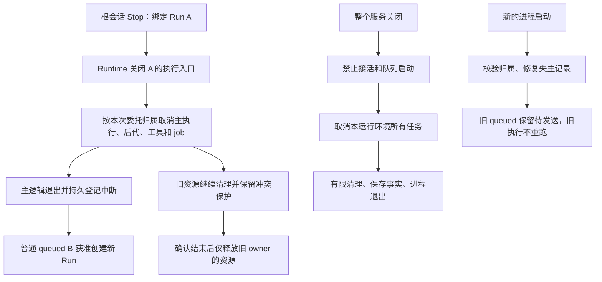

# 2. 实施契约与改动面

> 尚未实施。产品行为来自 [00](00-discussion.md)，基线问题来自 [01](01-problem-analysis-and-current-state.md)，按 [04](04-test-and-acceptance.md) 验收。内部接口、新增字段与状态名是供审查的工程建议；实施前对齐前三轮实际代码，可调整命名，不得削弱下列语义。本会话只写文档。

## 2.1 职责和总体数据流

| 模块 | 本轮职责 | 不承担 |
|---|---|---|
| runtime 装配/运行控制 | 根任务停止协调、执行入口关闭、逻辑交接、恢复门槛 | 不复制工具调度、子结果正文或 UI 状态机 |
| run-manager / run-ledger | 主运行控制、按身份保存终态；交接资格和错误向上报告 | 不把所有子执行强塞进 primary ledger，不管理 OS 进程树 |
| subagent host | 使用第三轮 execution/root 归属冻结旧委托、取消后代、保留实例 | 不自动唤醒旧队列，不直接写 Web 状态 |
| tool scheduler / lifecycle | 沿第二轮取消/settle、可靠保存、真实清理与保护 | scheduler 不依赖会话 DB，不为取消重放工具 |
| shell registry / sandbox | 按精确 owner 清理和释放；保留未确认资源 | 不因根 Run 终态抹去句柄，不跨重启按旧 PID 杀进程 |
| prompt scheduler / store | 正常队列推进、冷恢复 retained、单条重新提交、原子领取 | 不根据浏览器是否连接判断应否运行 |
| 恢复协调（runtime 内部） | 调用各 store 修复、验证一致性、隔离失败会话 | 不成为另一套执行器、持久事件总线或数据库修复平台 |
| server / CLI host | 统一关闭入口、期限、进程退出与外部确认 | 底层库不得 process.exit；serve 不关闭独立 TUI |
| SDK / 投影 / Web / TUI | 同源快照和事件、准确错误、既有输入框交互 | 不自行猜进程存活、不在前端独占执行资格 |

恢复协调可作为现有 runtime 目录内的小模块，不新增公共产品模块或独立服务。存储操作通过所属 store，事务支持向 store 注入同一 transaction context；禁止用跨包 SQL 副本形成第二写入方。

## 2.2 身份、状态与工程取舍

### 身份语义

| 名称 | 含义和约束 |
|---|---|
| sessionId / contextScopeId | 历史和上下文边界；复用不代表沿用执行资格 |
| promptId / userMessageId | 原用户提交及其消息身份；冷恢复保留，不因点发送复制消息 |
| runId | 一次已启动的受管理执行；普通下一条创建新 ID，Steer 不创建新 Run |
| executionId | 第三轮的每次子委托身份，排队时就有；实例 id 不代替它 |
| rootRunId / parentExecutionId 等 | 沿第三轮实际归属链，明确本次根任务及直接委托；不是仅 parentSessionId |
| requestId / callId / jobId | 各自的模型请求、工具调用、外部作业身份，不能填进 runId |
| ownerId / ownerPid | 每个独立 backend 执行环境创建时生成的身份及所属进程；同 PID 可有多个 owner，普通 Run/内部 runtime 热配置重建沿用 owner |

子 execution 即使未领到 runId，也必须能够按 rootRunId 撤销。已接受的创建意图在资格检查与登记之间不能游离，见 §2.3。历史缺归属不得推测成当前 Run。

**普通队列的新增事实：** 建议在接受普通消息时就保存 `submissionOwnerId/submissionOwnerPid`，与 claim 后的执行 owner 分开；内存队列也遵循同一语义。它们表示谁负责此次排队，不以当前浏览器 clientId 或 scopeKey 代替。重新手动提交 retained 时更新此次准入归属，保留原创建事实及恢复原因。不需要新 heartbeat/分布式租约系统。

### 状态的最小分工

- Run/子 execution 的主动 Stop 与失主恢复终态为 `interrupted`，用 reason 区分 user-stop/service-shutdown/process-interrupted；成功/失败先完成登记者保留原终态。工具/job 继续沿第二轮 cancelled/timed-out/error 等结果，不统一改枚举。
- `stopping` 是执行控制阶段：入口已关闭、还在等待主逻辑结束。不是清理完成，也不是把所有历史 Run 改回活动。
- 清理复用前置 C 的 `in-progress/confirmed/unconfirmed` 事实及第二轮的可靠保存/投影接线。逻辑终态不因迟到结果翻成 success；可更新属于原执行的清理事实和已捕获诊断。
- 普通 submission 建议新增非终态 `retained`：原 queued 内容在冷恢复后保留待用户操作；无执行资格，不占运行容量，不进入自动 claim 或 Steer。只保存前端标记不符合契约。
- 会话恢复门槛为 `recovering/ready/blocked` 的运行时投影；失败信息包含 session/root、阶段、错误码与可解释原因。它不是正在执行模型的状态。可依据持久事实重建，不要求另建永久状态表。

| 取舍 | 选择及代价 |
|---|---|
| A→B 交接 | 主执行退出并停止登记后推进；需保留独立 cleanup owner，不能等待所有外部工具物理退出 |
| 冷恢复 | 修记录和协议缺口，不重跑；外部副作用可能未知 |
| queued 冷恢复 | retained 手动单条发送；需后端迁移和全链路识别，不新增用户按钮 |
| owner 不明 | 不擅自夺取活环境；保留/阻断受影响项并解释，可能需要退出旧版本环境后重试 |
| 模块扩展 | 小范围补协调与契约，复用 store/registry；不照搬另一项目完整执行框架 |

## 2.3 根任务 Stop 与下一任务交接

第三轮已确认：父任务确定失败或预算耗尽时，也中断本次未完成子执行，保留结果与可复用实例，见[第三轮决策表](../improve-3/02-optimization-plan-and-change-scope.md#24-自动交付协议)。第三轮先实现必要传播，本轮将执行资格封口、取消传播、迟到事件隔离和资源收尾复用于这些终止出口；保留父任务真实失败/预算原因，不冒充用户 Stop。此复用本身不改变各原因对应的普通队列推进策略，也不把允许的暂时重试升级成整树停止。

### 受理与停止顺序

1. 入口验证根会话控制权限，并绑定请求中的具体 Run A。收到旧 runId 的迟到请求，只返回旧任务事实；不得改成“停止该会话现在的 Run B”。用户不能绕过根入口直接取消子 scope。
2. 在内存中同步关闭 A 的派遣、工具准入、下一模型步和自动 continuation 入口。所有相关入口使用同一根任务资格事实；重复 Stop 复用正在进行的停止操作。先封入口再 await，避免 await 期间接受新派遣。
3. 对已接受但创建尚未完成的子委托也设置停止资格。创建完成时必须重新检查，登记为未执行的中断，不允许先执行再补取消。按第三轮归属遍历所有层级、foreground/background 子执行及所属 job，取消从根向下传播；已终态者不改写。
4. 精确撤销 A 及后代未决审批、模型/工具等待者、continuation 订阅和定时器。沿第一轮一次性回答/撤销语义，迟到批准不更新 always 策略、不执行工具。取消不以数据库写成功为前提。
5. 将旧子 current/pending 委托中断并退出可执行集合，保留 execution 记录、输入和已完成结果。Stop 的记录需覆盖未启动子委托，不能只遍历 host 活动 Map。实例保持可被新主任务明确调用；新输入创建新 execution，不 drain 旧 pendingQueue。
6. 主模型循环/控制流退出，完成主 Run、普通 prompt 和任务树停止事实的可靠登记，以及供 B 读取的历史协议封口。此时才释放**主任务执行槽**、结束对应主投影，使 scheduler 可推进普通 queued B。登记失败按 §2.6 保留待保存事实、有限重试并阻止该会话继续启动；重试仍失败时显示具体错误，不能沿当前吞 ledger 错误路径正常推进。停止与清理不依赖登记成功。
7. 工具实际清理继续由原 owner 跟踪，B 的工具仍遵守相同资源保护。后端 Stop 协议区分“请求已受理”“主执行已中断”与清理事实，不让 Stop API 永远等待外部进程；前端正常 Stop/清理全部静默，不为这些阶段新增文字提示、弹窗或面板。A 退出并登记后直接推进 B，不额外统一等待几秒。

资格检查与任务接受必须有线性化边界：在同一调度互斥区/持久条件更新中二者只能一个先成立。不能使用先读 `active=true`、异步创建后不复查的两步方案。停止事实的存储字段沿实际 run/execution store 扩展，逻辑要求是可幂等重建被中断的树；不引入第二份任务关系图。

### 交接的精确完成条件

`mainSettled(A)` 必须意味着：主循环不再安排工作；当前未完成模型请求已逻辑封口；任务树执行资格已撤销；主任务中断与必要消息事实已保存；旧监听不再推动模型。它**不要求** `cleanupConfirmed(A)`。

若 raw 工具 Promise 还没结束，控制流可按第二轮逻辑 settle 返回，但 raw Promise 必须由 cleanup owner 持有并接收异常，保留对应锁/lease。不得通过“直接丢弃旧 Promise”实现快速 Stop。

`run-manager.finalizeRun`、`projection.done`、adapter admission finally 必须共同遵守该完成条件。sandbox 的逻辑使用权退出与仍在使用资源的清理 lease 分开：不能把 await 真实清理塞进主 completion 阻塞 B，也不能提前 destroy context。资源规则沿用已确认整体前置的[并发与资源保护 C](../prerequisite-follow-ups.md)及第二轮接线，不再冻结旧 coarse 全局互斥；已确认已知文件按资源保护，未知残留 Bash 限制来源主会话及其子代理、其他独立主会话继续；B 若仍属该根会话就继续受限。第四轮不得自行放宽或扩大。

### 完成、Stop、迟到事件竞争

同一 execution/call/request 的终态由条件更新认领，后续路径读取已有结果。Stop 后到达的旧通知、finally、progress 只可更新原身份允许的字段，不能清理 B 的活动索引、重置 B 计时、把 A 的结果注入 B 或把 interrupted 改为 success。

Stop 前已经成功保存的子结果保留成功；父中断后未消费交付仍归原 rootRunId，不自动唤醒新 Run。新主代理如需旧结果，沿第三轮 status/结果路径显式获取。旧执行的迟到输出不无条件追加到 B 已构造的模型上下文；更新原 part/审计并在下一次构造上下文时按原执行关系解释。

## 2.4 资源清理与热重建

### 正常静默，异常通过新调用结果返回

2026-09-22 已确认：正常清理不额外提示。按前置 C.5，旧清理失败或有限观察后仍无法确认，且实际阻塞 B 的某项尚未执行调用时，该调用返回普通工具错误“未执行，资源暂不可用”。由前置 C 负责准入判断和竞争控制，第二轮负责一次可靠保存、原工具行展示及整批结果交付；第四轮不另做锁、清理计时器或专门错误通知。

必须区分旧操作和新调用：新调用没有进入 execute，可明确未执行；旧操作仍可能活着，原保护与清理 owner 不释放。已有等待者同样收到异常结果，未受影响工作继续；不因此自动中断整个 B，不自动重试或在迟到清理确认后重放已失败调用。正常资源竞争和仍在有限观察中的正常清理继续等待，不仅凭经过几秒或没有输出判异常。预算及清理状态转换由前置 C 在实施前明确。

工具仅从真正执行开始独立计时，逻辑结果结束时停止；排队/审批/资源等待不显示 running 计时，取消后的后台清理不继续累计原工具执行时间。与 Thinking 分开，刷新按后端事实恢复。后台 Bash 的派遣调用计时在返回 jobId 时结束，不能冒充后台 job 的运行时长；展示归第二轮。

| 资源 | 清理负责人 / 释放条件 |
|---|---|
| 审批 Promise / continuation / timer | 所属 permission/host/lifecycle；取消或结束时解绑，清理幂等 |
| 模型/network/MCP 调用 | 传 signal，支持时协议取消；停止本地等待不声称远端撤销，不杀共享 MCP server |
| foreground 工具槽与写保护 | 前置 C 的资源规则及第二轮接线；真实清理满足对应释放条件后才释放，reject/unconfirmed 不能冒充确认 |
| background Bash job | registry 持有 root/run/execution/call/scope 归属并直接接收树取消；不要求已返回的派遣调用继续占危险槽 |
| Shell 进程及管道 | 复用前置 C 的 TERM→KILL、退出观察与管道收尾及第二轮接线；主进程 exit 与后代/输出结束分别观察 |
| sandbox/context | 实际依赖未结束时保留 lease，取消任务不等于 destroy；只释放对应 owner 的资源 |
| 已保存结果与 .output | 本轮 Stop 不清除，删除与撤权沿第三轮 |

后台 job 的本轮目标是完整归属和可取消，**不承诺后台 shell 与所有前台文件操作已有全程互斥**。若验收发现后台写入绕过必要保护，必须明确阻断受影响场景并修订范围，不能以“已经归属 rootRunId”冒充冲突隔离。

同进程配置热重建不是冷启动。原 runtime 的未完成 cleanup 必须继续参与 activity 判断；选择等待/拒绝重建并显示原因，不使用退出超时强制丢弃旧保护。普通换 runId 复用 runtime，不承担整套 dispose 成本。

## 2.5 整个服务退出与 serve stop

### 统一关闭入口

CLI host/daemon Supervisor 拥有一个幂等 shutdown 操作，SIGINT/SIGTERM、支持平台的 SIGHUP、显式 stop、HTTP shutdown 与 host 退出进入同一关闭协议。TUI Ctrl+C 在任务运行时仍是 Stop；明确退出 TUI 才关闭其 host，不影响独立 serve。关闭浏览器不触发 shutdown。

顺序：关闭所有所属工作区的新接收/新启动入口（包括懒加载）；取消全部本环境任务、待审批和后台 job；持久保留未启动普通消息；等待资源收尾；保存可确认的状态；关闭传输、数据库和诊断；CLI host 退出。已接受的网络请求必须得到确定的接受/拒绝/中断结果；禁止在退出过程中利用 scheduler finally 又启动下一条。

第一版沿现有 **10 秒整体清理期限**，不是每个工作区各串行等 10 秒。并行清理各 owner，单个清理抛错不能跳过其他清理；使用逐项收集结果而不是 Promise.all 首次拒绝就把其他项遗忘。数据库关闭晚于仍需提交记录的工作；超时撤销后续写资格，不能让旧回调继续使用已关闭 DB。

最后一次状态/诊断保存也纳入同一 10 秒预算，预留收尾时间；到达截止点后只做不延长退出期限的 best effort，不再无限 await 数据库或日志。CLI host 如实报告 `confirmed/unconfirmed` 和超时原因，未保存成功不得伪报落盘。阻塞 JS 事件循环时定时器也无法运行，不承诺进程内计时器可强杀该故障；外部 stop 观察超时后报告未确认。低层 `runtime.dispose()` 返回结构化清理结果/错误，由宿主决定退出，库不直接 process.exit。

### 外部停止命令

1. 保留现有 pid lock/token 和服务身份核验，锁定**原目标实例**；优先已有认证关闭请求或经核验的 SIGTERM。无身份依据不按猜测 PID 发信号。
2. 发出请求只显示“正在关闭”；在独立有限期限内等待原目标进程退出。建议总观察预算为清理预算加小额调度余量（首版 10 秒 + 2 秒，可注入测试），不新增用户配置面板。
3. 原目标进程消失才能报告“服务已退出”。端口关闭、HTTP 200、pid 文件移除、状态文件 stopped 都不是单独的进程退出证据。身份变化/PID 复用/存活检查权限不足时不对新实例发信号；无法确认则报告未确认，不假报成功。
4. 清理完成度独立从匹配目标 token 的关闭记录读取。记录缺失时显示“服务已退出，清理结果未确认”，不把进程消失解释成全部清理成功。
5. 建议结果结构包含 targetIdentity、processExit（confirmed/not-running/unconfirmed）与 cleanup（confirmed/unconfirmed/unknown），映射 CLI 文案和退出码。首版工程映射如下，退出事实与清理事实独立保留：

| 实际观察 | CLI 说明 | 退出码 |
|---|---|---|
| 原目标退出已确认，匹配报告确认清理完成 | 服务已退出 | 0 |
| 原目标退出已确认，匹配报告说明清理失败或超时 | 服务已退出，部分清理未完成 | 1 |
| 原目标退出已确认，报告缺失/无法读取或清理结果未知 | 服务已退出，清理结果未确认 | 1 |
| 调用时确无目标运行且身份检查无冲突 | 服务未运行；不声称历史遗留资源已清理 | 0 |
| 原目标仍活、身份不符/不明、权限错误或超过观察预算 | 退出未确认，附具体原因；不操作新的实例 | 1 |

没有状态文件但发现身份冲突或可疑活进程，不属于“确无目标运行”。客户端只读取与原目标 token 匹配的关闭报告；解析失败归 unknown，不覆盖实际进程退出事实。

每个 token 的关闭记录不得在实际退出前变成“已确认进程退出”；服务自身最多登记“即将退出及清理结果”，实际退出由外部观察确认。新服务启动不能让旧 stop 命令误读新 token 的报告。

## 2.6 冷启动恢复和错误隔离

### 启动顺序与 owner 保护

新执行环境先建立本次 owner，再完成存储迁移与恢复门槛，然后才允许相关会话 scheduler.init/drain、用户发送、Steer 或模型 continuation。serve 可先提供只读状态，但业务接收必须验证恢复门槛。按需打开历史会话也必须经过相同门槛，不能只在首个工作区启动时扫一次。

恢复只作用于**可确定已失效归属**的记录。旧 ownerId 与当前不同不能单独证明死亡；同 PID 下其他仍活 owner、同库独立 TUI/serve 不得改写。PID 存活检查失败或身份不明确时保守保留并说明，不推断死亡。本轮不建立跨进程实时接管协议。

queued 用入队归属而不是 claim owner 判断。旧版本缺归属的 queued 在受控升级（所有使用该库的旧版本执行环境已退出）后迁移为 retained；混用活旧环境时拒绝不安全的迁移/调度并给出明确原因。不得全库扫描 queued 无条件改状态，也不得让新 TUI 自动接手另一个活 serve 的队列。

同一宿主进程内也可能销毁并新建 backend。正常 backend dispose 应在关闭准入后，按自己的 submissionOwnerId 将未启动 queued 持久转 retained，并封口本 owner 的执行；即使 PID 仍活，新 backend 也不需猜测旧 queued 是否失主。若这一步失败，旧环境保留错误事实；新环境不得凭 ownerId 不同就抢占。内部 runtime 热配置重建沿用同一 backend owner，不触发上述 retained 转换。当前进程内可用本地 owner 生命周期事实核验已结束者；跨进程不另建实时 owner 服务。

### 按根会话恢复的过程

1. 校验 session/scope、根委托关系、版本及 owner，读取完整可解析事实。失效运行记录若 parent 已终态但 descendant 仍活动，也按每个记录实际归属检查，不能只从 active root 开始遍历。
2. 保留所有已提交终态和结果。失主 Run、子 execution、starting/running prompt 登记 interrupted；原 queued 转 retained；旧子 pending 退队保留中断记录；Steer 仍归原任务。
3. 对遗留工具调用补齐协议需要的结果/结束记录：有可靠执行前记录但无结果，标 `outcome unknown`；有证据确认未进入 execute，标 `not started`。旧数据缺证据一律 unknown，不能把“没有 start 字段”当未执行。
4. 第二轮执行开始事实必须在调用 execute 之前可靠保存；若保存后、execute 前崩溃，保守归为 unknown。合成记录明确来源 recovery、原 callId/runId/消息归属，不能冒充工具实际返回正文。补模型 tool-call/result 配对但不重放调用，不破坏 provider 原生 model-state。
5. 原子保存一个根会话范围可同事务更新的 run/prompt/child/message 事实；不在事务内 await 模型、网络或文件操作。大范围不能同事务完成时保持该树 recovering，分批幂等提交后重读验证全部不变量，最终才变 ready。任何中途退出，下次从持久事实重算，不依赖“最后保存成功”旗标。
6. 恢复所补 id/唯一键由原 execution/call 与修复种类确定；重复恢复无第二份 synthetic result、delivery 或用户消息。新 owner 竞争用条件更新/版本检查，失败重读，不能覆盖另一个已提交结果。
7. 第三轮子结果/交付保留原 rootRunId，不注入新 Run。已登记导出/删除意图按第三轮协议幂等核对；有原文可重新生成报告文件不等于重跑子代理。未 ready 路径不发布，无全盘孤儿文件扫描/垃圾回收承诺。
8. 快照/live 同源展示修复后的终态、待发送项和清理未确认。恢复完成前不把空 active Map 简单投影成“正常 idle”。

**时间事实：** 冷恢复时不知道实际结束时间，不把恢复时刻伪装成精确执行结束时刻。建议保存 recoveredAt/终态来源；若兼容旧 endedAt 必须填恢复登记时间，同时带 `endTimeSource=recovery`，第二轮时长展示注明中断、结束时间未知，不能展示跨停机时长为精确执行耗时。真实已保存 endedAt 不覆盖。

### 恢复失败

普通中断和 unknown tool outcome 是正常恢复，封口后允许新消息。格式不支持、会话数据无法解析、该树恢复无法可靠提交时，标该根会话及所属子任务 blocked；显示阶段与原因，尽可能只读展示有效历史，不清空、不新建同名空会话、不自动重试外部工具。重新连接、进入会话或下一次执行入口可以触发同一幂等恢复检查；普通历史查询和状态轮询不反复触发写入，不新增“修复全部”按钮。

逐会话校验失败不能让全库列举提前抛错而拖垮所有健康会话。共享 DB 无法读写、迁移失败等不能证明局部的问题，阻止所有依赖该存储的执行并明确服务错误；不能假装其他会话写入仍可靠。关系损坏无法确定子树时，阻断可证明受影响的范围，不随意猜测独立性。

### 原执行环境内的停止登记重试（D11）

1. **先停止，后登记，登记成功才交接。** 保留本 owner 的停止操作身份、原 rootRun/prompt/child/input 归属、已关闭的旧任务准入、主逻辑退出事实及尚未保存的内容。保存失败不能阻止取消信号和资源清理；也不能因内存 active Map 已清空而启动 B。这里要求成功的是执行归属、终态、队列交接和模型历史封口的关键记录；普通调试日志不成为交接门槛。
2. **有限重试由后端负责。** 复用并整理已有存储层重试，只重试可恢复的写入故障；格式损坏、版本不支持等不是忙锁重试。实施 S1 前须明确同一停止登记尝试的次数/总等待预算及错误分类，并允许测试注入。将 SQLite busy_timeout 与现有 busy-retry 的等待一并计入，不在外层再套一组完整重试，不使用无限定时轮询。同步数据库等待不能靠同进程 Promise 超时冒充被打断；服务关闭仍受 §2.5 宿主边界约束。
3. **失败保留，入口共享。** 有限重试仍失败时，该受影响范围保持 blocked 并显示具体保存阶段/原因。重新连接、显式进入会话、下一次执行入口可请求同一个服务端恢复检查；后端按根会话、原 owner 和停止操作身份合并并发请求。普通快照读取、历史分页、状态轮询不自动重试写入；页面不自行写终态或启动 B。不依赖浏览器生命周期，Web/TUI/SDK 进入执行均经过相同检查。blocked 状态不自我 requestDrain 循环，避免把“下一次执行入口”变成无限重试。
4. **只补记录，不重跑工作。** 同一停止操作幂等重试，按原记录身份、唯一键/版本与已提交事实检查；提交结果不明确时先重读核对，不能盲目追加另一份终态、工具结果或通知。不要求旧 owner 死亡，不触碰其他活 owner，不调用模型/工具。主逻辑还未退出时不能解除执行阻断，继续按 stopping 处理。
5. **成功后重新检查，再交给原 scheduler。** 只有主逻辑已退出、关键登记与历史封口可靠保存并核对一致后，才能解除该树的恢复阻断。随后重新检查 owner 仍有效、服务未关闭、其他准入条件和当前队列，用既有条件 claim 推进仍有效的下一条普通 queued；不缓存一个 B 对象直接启动。用户已删除的 B 不能复活，编辑/删除/claim 竞争沿队列协议处理；多个恢复触发不得产生重复 Run。恢复不会让后来触发检查的输入越过先前已接受的普通 queued，也不自动激活 retained。 新提交若触发检查但恢复仍失败，按既有准入规则拒绝接受，不返回成功 receipt，并保留用户输入；恢复成功后才沿正常提交接受该消息。
6. **原环境与冷恢复分开。** “同一服务 PID”不足以证明原环境还在；必须仍拥有上述本地事实。原 owner 已结束或可靠本地事实已丢失时，不猜测交接成功，按本节 owner/冷恢复规则处理；旧 queued 保留待发送，不自动推进。原环境在重试期间开始 shutdown，也不能因晚到的保存成功重新开放接活。

该恢复门槛只证明执行记录与交接事实可用，不清除第一轮独立的审批健康故障，不重建旧 pending Promise/requestId。审批仍为 `PERMISSION_UNAVAILABLE` 时沿第一轮规则处理；页面重连分别进行审批独立同步和 improve-1.1 页面恢复，不能用一个全局 ready 覆盖各域健康。

该入口由 runtime 装配停止事实、存储恢复和调度门槛，复用既有 store/scheduler；不另建持久化框架，不让前端或 scheduler 越层直接修复会话数据库。停止登记失败属于可见的保存错误，不受 D9“正常清理静默”的限制，也不能伪装成某个未执行工具的资源错误。

## 2.7 冷恢复消息与现有输入框

### 后端状态转换

| 起点 | 操作 | 结果 |
|---|---|---|
| queued（当前有效环境） | 正常完成或会话 Stop 后调度 | 正常 claim→starting→running；独立 Run |
| queued（确认旧环境失效） | 冷恢复 | retained，内容/顺序/promptId/userMessageId 保留 |
| retained | 查看/刷新/编辑/其他新消息发送 | 仍 retained，不自动领取，不成为 Steer |
| retained | 用户显式发送该条 | 原子重准入这一个 prompt，更新本次提交时间和 owner，转 queued；其他 retained 不变 |
| queued 或 retained | 垃圾箱删除成功 | cancelled 留审计，从待发送区移除；已经 claim 的返回冲突，不能转成停止 Run |
| interrupted 的旧执行 | 新任务/旧实例复用 | 原记录保持；新工作由明确的新输入建立新执行 |

沿现有编辑租约、鉴权与幂等请求扩展，不先 cancel 再新建 prompt。建议单条重新提交接口携带 promptId、expectedStatus=retained、编辑租约/版本、text 和独立 operationId；它是一条用户发送动作，不是“恢复整个队列”的 API。保存与重新准入应在同一事务完成。双页点击、响应丢失重试返回同一 receipt，不能重复运行；后台领取与 edit/delete/Steer 竞争仅一个胜者。

重新准入必须沿用普通提交的恢复 ready、服务未关闭、目标归属和 `maxQueuedPrompts` 门槛；容量检查与状态转换同事务，与新的普通提交竞争时不能都越过上限。retained 本身不占可执行队列容量。队列满、关闭或校验失败时保持 retained，不提交部分文本/归属更新、不返回成功 receipt；输入框保留修改供用户处理，不发模型请求。单条重新提交的重试须先查原 operationId 的既有成功结果，再决定是否重新检查容量，避免一次已成功的发送在响应丢失后误报队列满。

首次入队时间 createdAt 保留审计；**重新发送时记录本次 acceptedAt**，普通首次提交 acceptedAt=createdAt。总耗时对重新提交项从本次 acceptedAt 计起，到真实 endedAt，排除停机和等待用户重新发送的日历时间。这是对第二轮 createdAt→endedAt 的窄修订，不改变首次正常排队计时。SDK projector 统一使用 acceptedAt ?? createdAt；不得覆盖原 createdAt，也不为同一用户内容复制 message。retained 阶段不显示活动任务计时。

### Web / TUI 交互

- 复用原队列区域和 prompt 输入框；正文只供展示/选取/复制。Web 每条右侧提供铅笔“编辑”、垃圾箱“删除”，有 tooltip、aria-label 和键盘焦点；TUI 用可发现的同义操作/已有快捷入口，不要求终端模拟鼠标图标。
- 点击铅笔才把所选消息放到现有输入框；保留原草稿和所选 prompt 身份。普通 queued 编辑按钮显示“保存”；retained 编辑使用“发送”，只重新准入这一条。清空文本不删除，不允许提交空消息。
- 冷启动后，已恢复的编辑草稿仍留在 prompt 框；若没有原草稿/编辑项，可将最早 retained 显示为当前待发送内容。其他项保留原列表和顺序，不合并、不发送后自动把下一条视为已提交。已有新草稿优先，不被旧消息覆盖。
- 输入框显示 retained 内容不代表后台已接受新执行。取消编辑恢复原草稿，发送成功才解除该编辑关联；失败保留文字和可解释错误。
- 原消息正在被另一个页面编辑时沿租约规则，不同时占用；死环境编辑租约恢复后不成为永久锁，解除前校验 owner/到期。删除当前编辑项时同步退出编辑并恢复原草稿；响应乱序不得恢复已删除项。
- 正常 queued 编辑保存不改队列次序；retained 用户重新发送按此次接受顺序加入当前可运行队列，不越过已经接受的新任务。新提交 D 不隐式激活 retained B/C。
- store 的可执行队列排序使用 `acceptedAt ?? createdAt` 加稳定同刻次序；retained 列表仍按原创建顺序。正常 queued 保存不更新 acceptedAt；不能只改 UI 次序而继续用原 createdAt 领取恢复消息。
- 不增加“继续队列”按钮、批量恢复开关、恢复弹窗或管理页面。不把 interrupted 的旧任务直接作为待发送内容重跑。

### 已接受但未送入模型的 Steer（D12）

第三轮负责 user-steer 的持久接受与目标 Run 绑定，并复用请求输入账本提供是否尝试发送的证据；本轮在根 Stop 时组合展示。`accepted`、进入待消费输入、请求组装、尝试发送和成功完成请求是不同事实。只有已接受、因用户 Stop 终止、且能可靠确认没有送入任何模型请求的项，才显示：

> Task stopped before your steer message was sent.

位置固定为当前会话 queued 卡片上方的一行灰色英文小字，沿现有输入区布局和无障碍文本，不在历史消息旁重复显示。没有普通 queued 卡片时仍使用同一输入区上方位置，不伪造可执行 queued 项来撑出卡片。多条符合条件的 Steer 合并为一条区域提示，原消息内容仍可在 A 的历史中追溯。首次英文文案按用户确认为准，不显示 Queue paused，不增加 Continue 或其他恢复按钮。

提示按根会话和被停止的 run/input 身份从同源投影计算，不依赖组件挂载时钟；切到别的会话不串提示，刷新/双页结果一致。B 自动启动不会把 A 的未发送事实改成 B 的输入状态。首版仅投影该会话最近一次用户 Stop 对应的此类事实，不累积常驻提醒列表；它不是恢复操作或待执行输入。

原 Steer 保留 A 的用户输入审计；取消未消费资格，不重新排队、不自动回填输入框、不发送给 B。B 重建上下文时也不能把该项作为新的待执行用户指令注入；历史审计与模型输入投影分开，不能仅按 user 角色全量回放而绕过原 Run 资格。已经尝试发送但请求失败/被取消，不使用“未发送”提示；旧数据证据不足也不推断。请求是否成功不能单独证明从未发送，取消后的迟到响应不能倒改这个事实。

### TUI 选择、编辑与发送的首版接线

这是沿现有队列区细化的工程按键方案，不新建 `/queue` 页面。当前仅支持 Alt+↑ 编辑最新项；本轮扩展为可选择任一 queued/retained，并在区域底部显示实际可用的英文快捷键。SDK/store 操作与 Web 相同，不新建终端专用队列。

| 焦点/操作 | 行为 |
|---|---|
| 输入框按 Alt+↑，存在待发送项 | 焦点移到队列最后一条；原草稿不变，不自动获取编辑租约 |
| 队列焦点下 ↑/↓ | 在现有条目中移动选择，按 promptId 保持身份；不移动输入光标、不启动任务 |
| 队列焦点下 Enter | 为所选项获取编辑租约，成功才把文字放入原输入框，保留原草稿；失败保留选择与原因 |
| 队列焦点下 Ctrl+D | 按所选身份/版本删除；底部明确显示 Delete，成功才移除；不要求先进入编辑或清空输入 |
| 队列焦点下 Esc | 回到原输入框，草稿保持 |
| 编辑正常 queued，按 Enter | Save，按原顺序继续等待；不更新 acceptedAt |
| 编辑 retained，按 Enter | Send，只发送此项；其他 retained 不跟随 |
| 编辑时 Esc | 释放该编辑关联并恢复原草稿；失败/租约丢失保留可恢复文字，不静默覆盖 |

队列焦点才拦截导航/删除键；普通输入、补全、根任务 Ctrl+C 与宿主退出规则沿现有上下文处理，不能让焦点切换变成新的 Stop。编辑中不沿旧 Ctrl+D cancel-prompt 分支删除队列项，统一先回队列选择后删除；取消编辑不等于删除。被选项被另一页面删除/claim时，刷新到相邻有效项或返回输入框，不将选择索引对应的新项当作原目标。所有变更在真实 PTY 中验证按键可达、无草稿丢失；终端映射冲突可以在 S0/S4 校准组合键，但选择/编辑/删除/发送语义不变。

## 2.8 Stage 与包级改动面

| Stage | 改动范围 | 完成定义 / 04 |
|---|---|---|
| S0 实际基线与协议 | improve-1、1.1、C、2、3实际接口/验收；A/B按实际依赖；SDK/数据库离线迁移和命名 | 取得真实契约，不能把1.1待讨论登记当接口；明确owner/acceptedAt/retained及迁移操作前提；T01/T28/T43 |
| S1 停止整树与交接 | agent `adapters/ui-runtime/composition.ts`、`ui-inprocess.ts`、runtime controller、`runtime/run-manager/{manager,types}.ts`、run-ledger stores、`agents/subagent-host.ts`及子 store、prompt-scheduler/store故障范围与恢复接线 | T02～T10、T38～T40后端部分：根 Stop 完整；关键登记失败阻止交接，修复后条件claim；旧 pending 不复活；B 不等物理清理 |
| S2 清理与退出 | agent scheduler/lifecycle、`tools/{bash,shell-job-registry}.ts`、sandbox；server `runtime/daemon/{supervisor,main,server}.ts`；CLI host/serve/terminal | T11～T17、T42：旧保护持续；关闭入口一致；stop 真等退出；热重建不丢 owner |
| S3 冷恢复与待发送 | agent prompt-scheduler stores、message/session store 恢复接线、子结果/交付 store；`adapters/ui-persistent.ts`；server bootstrap；SDK prompt/snapshot/schema | T18～T29、T40冷恢复部分、T43：owner-aware 修复、保留待发送、失败隔离、幂等、计时 |
| S4 客户端与组合验收 | Web `ui/App.tsx`、selectors、daemon client/event reducer；CLI TUI prompt/store；SDK共享投影；真实入口测试 | T30～T37、T39～T41客户端部分、T44及前阶段：静默Stop、异常工具结果、独立计时、Steer英文提示、图标/选择/保存/发送、刷新≠重启、真实 serve/PTY/模型闭环 |

字段/状态变更会涉及 agent service storage/schema/migrations、SDK DTO/验证、server REST/JSON-RPC 映射和两个客户端，须同批构建。Stage 是实施顺序，不是可把半套协议发布给用户的许可。不得因前三轮文件名不同而另建平行接口；S0 校准后修订方案再实施。

## 2.9 兼容、迁移、历史设计同步与回滚

1. 这是持久语义变化：新增 retained、入队归属、重新接受时间及恢复来源；需要数据库/schema 和 DTO 迁移，不能沿用第二轮“只有可选 JSON 字段、无需 SQL 迁移”的结论。迁移在已备份且旧写入者退出后进行，不在线抢活旧队列。
2. 旧字段缺失保守处理：没有开始证据的工具 unknown；没有可靠 owner 的旧 queued 留待手动发送；已有完成结果不覆盖。新记录的身份/归属缺失视为错误，不偷偷 fallback。
3. SDK/agent/server/Web/TUI 同版本升级；客户端不认识 retained 时拒绝危险发送/Steer 操作并提示版本问题，不能当 queued 降级。每次重建 compiled artifacts 后再验收，不混旧 dist。
4. 历史文档同步：七月子代理旧 queue drain；run-ledger interrupted/owner 恢复；普通队列冷启动自动执行；第二轮 acceptedAt 与恢复未知结束时长；第三轮 retained 不可 Steer、冷恢复产物审计范围。具体历史定位见 01 §1.8。模块侧只补后继引用/接口变更，跨模块状态机仍以本轮为唯一契约。
5. 回滚先关闭新写入者，保留新数据，禁止把 retained 批量转回 queued；旧版本不认识新语义时不能直接启动同库调度器。选择前向修复或经验证的备份恢复，并明确备份之后的历史损失；不得重放工具“补回”外部副作用。
6. `.output` 核对仅处理第三轮已登记原文/导出/删除意图，不扫描整个磁盘，不接管崩溃前进程，不用结果缺失推断工具失败。

### 旧版缺少入队 owner 的升级操作边界

旧版 queued 没有 submission owner，数据库空闲、端口关闭、一个 daemon 已退出，都不足以证明所有 TUI/SDK 写入者退出。普通启动发现这种需要破坏性状态转换的旧格式时，停在 migration-required，不先启动 scheduler/drain，不自动将无归属项认领给新 owner。

支持的升级路径是一次性离线维护，不增加实时跨进程协调：

1. 升级说明要求操作者停止使用该数据库的旧版 serve、TUI 和嵌入 SDK 宿主，并在维护结束前不再启动旧版。新迁移入口核对已知 daemon/owner/可取得的占用证据；发现仍活或身份不明就拒绝。无法枚举所有旧写入者的平台，不能声称程序已自动证明全员退出，离线维护前提必须明确建立。
2. 在上述条件下，用 SQLite 一致备份能力保存原库（包括 WAL 中已提交内容），不能简单复制仍活数据库主文件。进入现有存储迁移层完成 schema 与数据迁移；实际调用方式及备份位置在 S0 对照当时 CLI/API 定稿并写入升级说明，不能虚构当前已有迁移子命令。
3. 缺入队归属的旧 queued 迁为 retained，保留内容、身份、原顺序，不伪造历史 owner；确定失主执行按本节恢复，无法解析的原记录保留并按影响范围阻断。迁移事务/检查点支持中途失败后重复运行，不产生重复记录。
4. 重读并核对关键关系、格式版本和 retained 不可领取后，才开放新版本相关执行入口。失败停在迁移/恢复错误，不返回健康 ready；正常打开只提示具体原因和离线升级步骤，不新增网页修复按钮，也不擅自杀旧进程。

新旧版本混用同库不受支持；新程序的迁移锁不能阻止不认识协议的旧程序稍后重新开库，不能把一次进程扫描或 SQLite 写锁描述成长期互斥保证。无法满足离线条件就不迁移，原库保留。S0必须提供一条可重复的离线成功路径及活旧进程拒绝路径（T43），不能只写“等旧环境退出”就宣布可实施；本段是升级前提和门槛，不是要求第四轮建设跨进程接管服务。

## 2.10 可观测性、风险和本轮不做

记录最小关联身份、原因和时刻：stop accepted、main settled、stop durable、next prompt claimed、next request started、cleanup confirmed/unconfirmed、shutdown deadline、recovery blocked。关联到 run/execution/call/owner，不记录密钥或完整 prompt。正常任务、慢清理 Stop、长历史三种情形分别测量交接耗时；不先承诺未经实测的毫秒 SLA。

高风险：停止与派遣竞争、终态保存失败被吞、清理 owner 提前释放、同库误判失主、恢复写了一半、旧消息误发、stop 误报或误杀新实例。04 要提供具体反例和断言，类型检查不能替代。

不做：跨重启外部进程接管/自动杀进程、通用数据库修复/磁盘垃圾回收、自动重放外部副作用、全新文件级锁、后台 shell 全量隔离平台、TUI 默认 attach、子代理用户独立控制、运行中 A2A、新队列管理页或继续按钮。Stop 不是撤销文件修改；恢复为 unknown 不是宣布外部操作没发生。
