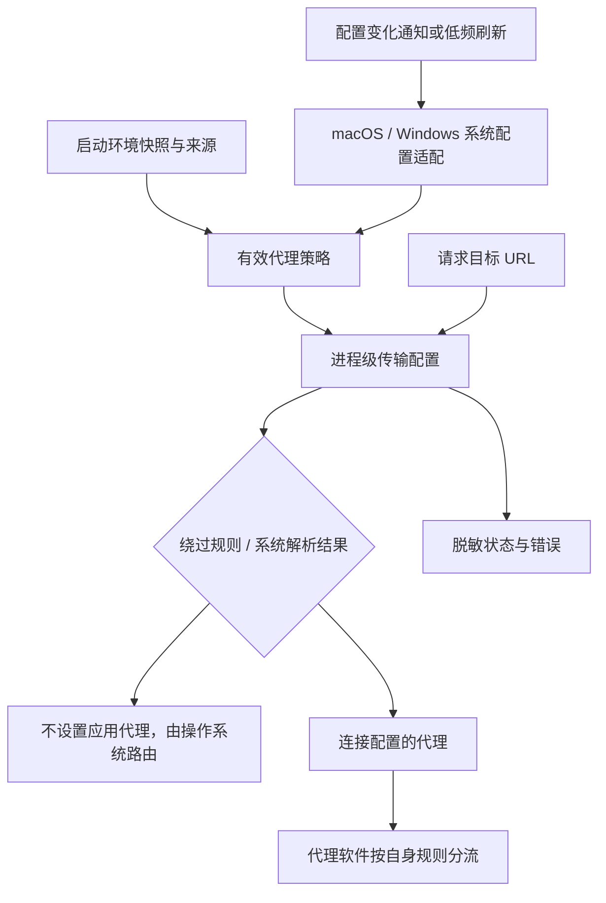

# 02 · 优化方案与改动面

状态：供审阅的开发契约草案。U1–U10 已确认；D3/D4 等新增范围取舍尚待审阅。本文不代表代码已经实现。实施后按 04 验证，不回写本文为进度表。

## 2.1 方案总览

默认遵守**执行请求的进程所在主机、运行用户**的系统代理；显式代理环境变量覆盖。模型配置只决定目标 URL，网络层决定到该 URL 的路线。ohbaby 不维护“Zenmux 代理、智谱直连”的名单。

优先用成熟 Node/Undici 能力安装进程级传输配置。平台检测、策略解析、安装生命周期分开，但不把同一个 NetworkRuntime 贯穿所有业务构造函数。不识别代理软件名称、不读取其私有配置、不调用其控制 API。

本轮探针已证明：Node 原生 API 单独使用不能表达全部系统 bypass，且传入空对象不会关闭代理。实现前先完成最小双栈传输验证：集中 route 判定只需返回代理、直连或明确错误，使用成熟 dispatcher/agent 执行；补丁只放在网络边界，不向业务层扩散。不得把“调用一个 Node API”当成已经实现系统跟随。

放置建议修正：可复用实现位于 `packages/ohbaby-agent/src/utils/network-proxy/`，由 CLI/serve 的显式运行入口调用。这样程序化使用 server 不需要反向依赖 CLI。导入 agent/server 包不能自动修改宿主的全局网络；嵌入方通过显式初始化接入。

## 2.2 设计决策与待审取舍

| ID | 推荐 | 理由和代价 | 未采用/待确认 |
| --- | --- | --- | --- |
| D1 | 一个进程一套策略，启动入口拥有生命周期 | 符合“跟随这台电脑”，避免多 workspace 相互覆盖 | 不增加会话级/模型级代理配置 |
| D2 | macOS 与 Windows 同阶段实现、同等验收 | 用户明确要求 Windows；不能只给 Mac 实测加 Windows 分支 | 不以 mock 代替 Windows 实机 |
| D3 | 首个可发布切片优先静态 HTTP/HTTPS 代理、绕过、环境覆盖、动态切换；识别其他模式并明确报告 | 常见本地 mixed/HTTP 监听入口可使用；纯 SOCKS、PAC、WPAD 不能假装兼容 | **建议，未获范围缩减确认**。若首版要求 PAC/SOCKS，须加入同轮实现及测试，不能静默延期 |
| D4 | 先验证传输路线，再决定是否提高 Node 下限；本轮不改 engines | 原生 API 已证实存在 bypass 和恢复边界；不能为尚不能独立满足需求的 API 先强迫升级 | **待 Stage 1 证据收敛**。若最终使用原生 API，需覆盖 24.14.0/25.4.0 版本边界；若成熟 dispatcher/agent 已满足当前 Node 范围，则保留现有下限 |
| D5 | Linux 首先保证 env 与 OS 路由；桌面代理适配按明确桌面范围提供 | GNOME/KDE 等配置入口不同，容器可能没有桌面配置 | **建议，待审**：不宣称 Linux 所有桌面自动跟随；不以 Linux 支持代替 Windows 宿主继承 |
| D6 | 本轮补原因和路由诊断，不调整重试预算 | 避免连接修复与请求次数放大同时变化 | 不顺带关闭所有 SDK 重试或新增直连重试 |
| D7 | 只对出口测试证明有问题的 SDK 增加适配 | 保留现有 SDK、避免不必要的改动面 | 不能用“通常都用 fetch”作为验收证据 |

备选方案比较：仅 env 支持最小，但不满足 U1/U3/U6；macOS/Windows 常见模式加显式能力边界是当前推荐；完整桌面解析（PAC/WPAD/SOCKS/企业认证）更接近浏览器，但会增加原生集成、打包和测试成本。上述范围需产品审阅，不是技术上做不到。

## 2.3 路由与环境变量契约

### 2.3.1 跟随系统不等于一律远程转发

| 场景 | ohbaby 应有行为 |
| --- | --- |
| 未配置应用层代理 | 不添加应用代理，走 OS 路由；不保证目标站点一定可访问 |
| 系统设置代理地址，代理软件按规则分流 | 请求送到该代理，由它决定直连或节点转发 |
| 代理软件全局模式 | 遵守该模式，不因识别“智谱”而自行绕过 |
| 系统 bypass / NO_PROXY 命中 | 按规则不使用应用代理 |
| PAC 指定当前 URL 使用 DIRECT | 若已支持 PAC，这是显式策略；不属于因连接失败而偷偷直连 |
| TUN/VPN 生效，但无应用层代理配置 | 让 OS 接管；不猜测本地代理端口、不自行叠加代理 |

应用能证明“连接了本地代理”，通常不能证明代理内部最终选择哪个节点或是否 DIRECT。状态不应声称看到了不可见的下游路线。若系统同时明确配置应用代理且开启 TUN，应遵守显式系统配置，不能因猜测 TUN 已接管而删除该设置。

### 2.3.2 环境与绕过契约：复用现成语义，补齐必要边界

- 在既有 dotenv 加载完成后初始化，保留原加载优先级；显式非空 HTTP/HTTPS/ALL 代理环境覆盖系统，非法配置不能回退直连。环境是进程启动快照，另一个 shell 的 export 不改变常驻服务。
- env 的解析、大小写优先级和常见 NO_PROXY 匹配优先复用选定成熟实现，不自建通用匹配语言。Windows 大小写不敏感由平台语义处理，不增加冲突状态报表。
- 薄归一化参考 Kimi：ALL_PROXY 作为缺省来源，但不能把它原样交给不识别 ALL 的 Node API 后声称生效。仅 HTTP、仅 HTTPS、仅 ALL 三种情况在 fetch 与 node:http/https 上必须一致；Stage 1 固定所选库的兼容语义并测试，再映射到另一传输栈，不能各自依赖不同默认 fallback。未支持的代理协议明确报错。
- 只有 NO_PROXY 时仍保留系统跟随，作为额外绕过；`*` 是显式全绕过。localhost、127.0.0.0/8、::1 的本地控制连接必须绕过。不擅自让所有私网绕过。
- 系统 bypass 不等于 NO_PROXY 原字符串：当前本机实际使用 CIDR 和简单主机名绕过，这两项必须在已支持静态系统模式内处理，不能以“高级功能”删掉。优先复用成熟系统解析/匹配实现；必要补充仅使用 Node IP/子网原语和小范围主机名判定，不展开 CIDR 为 IP 列表。至少验证 IPv4/IPv6 字面地址、子域边界、端口及无点主机名；是否涉及 DNS 解析后的地址应按平台验证结果界定，不能猜测。
- 两个传输栈共用同一绕过结果，普通模式使用成熟代理实现；有私有 agent 的 SDK 仅在证据表明绕过集中策略时适配。初始读取失败和未支持模式也必须能在这一集中入口拒绝外部请求，本地控制连接保持可用；单设状态位不构成阻止外发。
- 系统结果只存在内存，不写入 .env、不写成 process.env 中的显式覆盖。状态说明来源即可；不增加请求级策略版本号。
- 单 daemon 的启动环境作用于整个服务；显示配置来源，但不重做全仓 env 管理。workspace 切换和客户端 RPC 不得重装服务进程代理。

## 2.4 平台适配与能力边界

| 环境 | 首要策略 | 必须避免 |
| --- | --- | --- |
| macOS | 读取当前有效系统代理、协议映射、绕过列表；静态配置可评估 `scutil --proxy`；完整 URL 解析评估 CFNetwork 原生能力 | 只查某个命名网卡、只解析 HTTPS 一项、把 PAC 开启当无代理 |
| Windows 用户进程 | 读取当前运行用户的系统/WinINet 配置，区分静态代理、脚本、自动发现、bypass；优先评估原生 API 的维护良好封装 | 只读 `netsh winhttp show proxy` 就声称等同桌面设置；本地化命令输出解析；依赖用户 PowerShell profile |
| Windows 服务账户 | 使用该服务身份可访问的策略；取不到桌面用户配置时明确解释，推荐显式 env | 把交互登录用户设置强加给 LocalSystem；自动提权或改注册表 |
| Linux 桌面 | env 优先；自动检测仅对已实现和测试的桌面 provider 承诺 | 认为所有发行版共享一份全局 GUI 代理配置 |
| Linux server / CI | 显式 env，未配置时不添加应用代理，交给 OS 路由 | 无桌面时启动无意义的 GUI 探测循环 |
| WSL / Docker | 以运行环境为边界；localhost 通常属于该环境，宿主代理地址需可达 | 写死 Windows/Mac 的 localhost 端口；宣称自动继承宿主桌面代理 |
| 远程 serve | 跟随服务端主机与用户；Web/TUI 只展示服务端状态 | 从访问网页的 Windows 浏览器读取设置后声称服务器也生效 |

### PAC / 自动发现 / SOCKS

- PAC 是按目标 URL 计算路线的脚本；只读脚本地址不能完成代理跟随。自动发现还涉及取得脚本与缓存更新。若纳入，优先成熟原生解析，不在主进程用普通 `eval` 执行脚本。
- “Windows 自动检测已勾选”不等于一定有代理；必须区分解析器确定无代理、发现失败、解析能力未实现。不能只见该标志便让所有 Windows 默认配置不可用，也不能把探测超时当确定直连。
- 纯 SOCKS 系统配置不能作为 HTTP URL 交给 HTTP ProxyAgent；支持时需约定 SOCKS 版本、认证和 DNS 在本地还是代理端解析。未支持时明确提示。
- PAC 若返回有序候选且包含 DIRECT，属于系统显式授权的候选；未来支持候选切换时仍须记录原因，并且不得自动重放已经发送的模型 POST/流。未支持候选列表时报告能力限制，不自行取 DIRECT。
- PAC 的结果可能依赖 URL 路径、DNS、时间和网络。不能仅按 hostname 永久缓存；优先复用系统缓存，配置/网络改变时失效，有界缓存不得持久化完整敏感 URL。
- 系统读取异常与“无代理”必须是不同状态。推荐读取失败后阻止新外部请求并报告原因，保持本地 UI 可用和已发送流自然结束；后续成功刷新自动恢复。Linux 明确未启用桌面 provider 是能力边界，状态显示“未读取桌面代理”，不能显示“已跟随系统”。

## 2.5 动态刷新与生命周期

- 初始读取晚于 dotenv，早于第一次外部请求；help/status/stop 等本地管理命令不因网络配置错误不可用。嵌入方显式安装，一个进程一个所有者和清理句柄。
- 首版用一个串行、非重叠、可清理的低频定时器读取系统配置；仅配置变化才更新。建议正常运行中 5 秒内生效，实际间隔在双平台测试后确定。不同时引入平台事件监听、睡眠事件、请求级版本和序号取消体系。
- 每个请求只读已安装策略，不启动系统命令；未执行完的读取不启动第二次，避免乱序写入。定时器恢复运行后刷新，休眠期间不承诺墙钟 5 秒时效。
- 新请求和 MCP 重连使用新路线，同一旧 SDK 实例也必须生效；旧流继续，不主动 destroy 其连接。
- **关闭代理不能调用 `setGlobalProxyFromEnv({})` 了事：本机已证实它是 no-op。** 运行期系统关闭必须发布自有的明确 direct 路线；只有整个代理模块 dispose/卸载时才恢复真实宿主基线。宿主基线可能本来就是代理，不能把它当作系统关闭后的直连策略。
- **restore 只恢复句柄，不等于关闭池。** A→B→关闭不得意外恢复为 A。集中保存真实初始基线，避免 restore 栈决定业务策略；仅 graceful close 自己创建的旧资源，不关闭宿主资源。原生 API 不暴露足够所有权时，改用成熟、可显式关闭的 dispatcher/agent，不自造连接池。
- 首次/刷新读取失败或模式未支持时，集中路由入口返回明确错误，不发布 direct；本地通道和既有流不受主动销毁。恢复读取后自动恢复。实现须对 fetch/http 双栈证明这一行为，不能只记录错误日志。
- 代理进程停止或网络断开仍可能打断旧流：保留部分输出、报告底层原因，不自动重放已经开始的模型请求。退出按现有关闭期限清理定时器和自有资源。

## 2.6 SDK 与进程边界

| 客户端 | 推荐接入 | 发布前证据 |
| --- | --- | --- |
| OpenAI compatible、Responses、Anthropic | 先保留构造方式，统一安装传输 | 实际 SDK 请求命中受控代理；同一实例在切换后使用新出口 |
| fetch 模型探测 | 同上 | 探测和生成不能一个直连一个代理 |
| Tavily、Exa 搜索与网页读取 | 验证它们的 http/fetch/私有 agent 使用方式；必要时局部提供 agent/fetch | 检查原有专有 proxy 参数冲突、双重代理和创建时缓存 |
| MCP HTTP/SSE | 全局配置优先；必要时只在 transport 工厂适配 | 外部连接、后续重连采用策略；loopback MCP 直连 |
| MCP stdio、Shell 工具 | 它们是独立程序，不能被父进程 dispatcher 接管 | 明确 env 继承能力和子进程差异；不宣称热切换覆盖任意 Node/Python/git/curl |

本轮核心承诺针对 ohbaby 自己发出的请求。对新启动子进程可评估传入规范环境，但不覆盖用户显式 `config.env`，不擅自重启已有 MCP。若要求任意子进程全流量一致，需要更大范围的系统层方案，必须另行讨论。

Tavily 默认 Axios 路径不等于必然绕过：本轮 HTTP fixture 已验证同一默认客户端能跟随 Node 全局代理 A→B；显式 `proxies` 则继续走 A。HTTPS 和双重代理仍需补验。`TAVILY_HTTP_PROXY`/`TAVILY_HTTPS_PROXY` 也会创建私有 agent，应纳入冲突检查。不能仅因使用 Axios 就改写 SDK。

内部已有 Tavily 专有配置不能静默覆盖新的全局规则，也不能直接删除破坏嵌入方。需查明公共配置是否可达：公共 ohbaby 入口采用集中策略，冲突须诊断；显式嵌入方自定义客户端不在“默认全局保证”内。

## 2.7 状态、错误、迁移和回滚

状态至少区分：`系统代理`、`系统未配置应用代理`、`环境变量代理`、`显式绕过`、`未支持的系统代理模式`、`系统代理读取失败`。显示运行主机/用户语境和来源，不展示凭证。TUN 存在与否未知时不要把“无应用代理”写成“物理直连”。

建议以现有启动提示、诊断和请求错误呈现，不新建复杂代理设置页。Web 查看服务端提供的状态；即使暂不增加常驻指示器，失败详情也应显示策略来源。

错误先保留 SDK 原因和可验证的底层 code/status，附脱敏的配置来源即可。不要创建连接阶段分类器或为每次请求记录策略版本；不能把所有 ECONNRESET 判定为代理坏了。cause 读取限制深度并防循环，不据此调整重试预算。

严禁记录 API key、Authorization、代理密码、完整查询参数或 PAC 脚本；不关闭 TLS 证书校验来解决企业证书问题。企业受信任 CA 接入和认证方式需独立验证，不承诺等同浏览器单点登录。

保留现有请求重试次数和部分输出保护；错误呈现增强不应顺带把原先非重试错误变为无限或嵌套重试。配置故障不能通过“换路线重发”掩盖。

无数据库迁移，不写 OS 设置，不把系统端口存入模型配置。回滚通过移除显式初始化、恢复原传输句柄和清理观察器完成；不得清空用户 env 或撤销其系统代理。Node 支持范围变化需发布说明，不能只改运行代码不改 engines/CI。

## 2.8 建议不在本轮的事项

- 按模型品牌/国家推测可达性、自动测速挑路线、代理失败偷偷直连。
- 自建代理服务器、VPN、通用网络运行时、每 workspace 一套路由。
- 任意外部子进程的实时代理接管。
- SDK 和外层重试预算的整体重构。
- PAC/WPAD/SOCKS、Linux 全桌面、企业 NTLM/Kerberos 是否首版完整支持属于 D3/D5 的待审范围，不能默认认定用户已同意排除。若采用推荐切片，能力检测与清晰提示仍在本轮。

这里列的是规划建议，不另建 improve-2；后续是否另立议题按实际审阅与验收事件决定。

## 2.9 分阶段与按包改动面

| 阶段 | 目标和主要改动 | 完成定义 |
| --- | --- | --- |
| Stage 1 | 收敛 D3/D4/D5；先验证 bypass/blocked/direct 三种路线在 fetch/http 双栈和旧池生命周期上的最小实现，再做集中初始化；CLI 接入 | 04 T01–T05/T15；原生 API 不足部分有已验证的薄适配路线；声明支持的 Node 上双栈一致；范围不再含糊 |
| Stage 2 | macOS/Windows provider、静态绕过、刷新和清理；按确认范围实现其他协议或明确能力错误 | 04 T06–T10/T16/T17/T19；两平台常见模式一致，常驻服务无需重启跟随 |
| Stage 3 | SDK 实际出口、Tavily/Exa/MCP 局部适配、状态与错误；文档、CI、安装包验收 | 04 T11–T14/T18/T20–T22；多 workspace、远端视角、升级兼容均验证 |

| 包/目录 | 改动类型 | 范围 |
| --- | --- | --- |
| `packages/ohbaby-agent/src/utils/network-proxy/`（拟新增） | 新增 | policy、系统 provider、install/dispose、对应测试；不新增独立 workspace 包 |
| `packages/ohbaby-cli/src/bin.ts` | 修改 | 环境加载后显式初始化，真实命令执行生命周期清理，避免 help/stop 被外网错误阻塞 |
| `packages/ohbaby-agent/src/utils/project-env.ts` | 按需小改 | 记录代理配置来源；不改变全体 env 加载优先级 |
| `packages/ohbaby-agent/src/index.ts` | 按需修改 | 提供嵌入方显式初始化入口，无 import 副作用 |
| `packages/ohbaby-server/src/runtime/daemon/main.ts`、CLI serve 命令 | 小改 | 生命周期所有权对齐，程序化启动与 CLI 不重复初始化；接入状态 |
| `packages/ohbaby-agent/src/services/search-providers/`、`mcp/core/transport.ts` | 测试驱动的小改 | 仅修实际出口不遵守策略的客户端 |
| `packages/ohbaby-agent/src/runtime/run-manager/error-detail.ts`、`packages/ohbaby-sdk/src/` | 按需小改 | 原因和网络上下文；新增协议字段时保持向后兼容并补契约测试 |
| CLI 启动提示、Web 现有错误呈现 | 按需小改 | 清晰显示来源和错误，不新建网络设置产品 |
| package manifests、lockfile、`.github/workflows/ci.yml` | 按选型修改 | 依赖、Node 支持范围、原生目标平台测试和打包 |

## 2.10 关键改动清单

用户明确要求。本表是规划锚点，不是进度表；行号可漂移，以符号为准。新目录内具体拆分由实际实现复杂度决定。

| ID | 类型 | 路径/符号 | 行号快照 | 承重改动 |
| --- | --- | --- | --- | --- |
| C1 | 代码 | `packages/ohbaby-cli/src/bin.ts` / 环境加载后的启动流程 | 655 | 安装发生在发起外部请求前；覆盖 TUI/run/serve 但不影响本地管理命令 |
| C2 | 代码 | `packages/ohbaby-agent/src/utils/project-env.ts` / `loadRuntimeEnvIntoProcessEnv` | 35 | 保留配置来源，避免系统值被误认为用户 env 覆盖 |
| C3 | 新代码 | `packages/ohbaby-agent/src/utils/network-proxy/` | 新增 | 集中策略、两平台 provider、刷新与安装生命周期；必要复杂度集中在此 |
| C4 | 代码 | `packages/ohbaby-server/src/runtime/daemon/main.ts` / `createServerRuntime`、`startDaemonServer` | 147、587 | 独立/嵌入启动所有权明确；关闭时清理自身资源 |
| C5 | 代码 | `packages/ohbaby-agent/src/services/search-providers/tavily.ts` / `createTavilyProvider` | 40 | 验证 SDK 专有传输是否绕过或叠加代理，按证据适配 |
| C6 | 代码 | `packages/ohbaby-agent/src/mcp/core/transport.ts` / `createTransport` | 13 | 区分本进程 HTTP/SSE 与独立 stdio；验证重连 |
| C7 | 代码 | `packages/ohbaby-agent/src/runtime/run-manager/error-detail.ts` / `normalizeRunError` | 84 | 展示可证实原因，不意外改变重试预算 |
| C8 | 配置 | 根及 CLI/agent/server `package.json`、CI | 版本字段/矩阵 | 若抬升 Node 下限，声明、运行时能力检查、CI 和安装验证必须一致 |
| D1 | 文档 | `docs/ohbaby-server/architecture.md` | 生命周期/边界 | 说明进程级策略与嵌入方显式所有权 |
| D2 | 文档 | `docs/config/tools/implement/schema.md` | defaults | 若客户端代理入口发生变化，说明与全局策略的关系，不无意扩大公共配置 |
| D3 | 文档 | `docs/core/llm-client/test.md`、`docs/ohbaby-server/test.md` | 网络/集成测试 | 加入真实出口和代理切换风险，避免仅 mock SDK |

## 2.11 与 00 对齐

U1 → §2.3–2.4；U2 → §2.3.2/2.7；U3 → §2.5；U4 → §2.4/2.7；U5 → §2.1/2.3.1；U6 → D2/平台矩阵与真实 Windows 验收；U7/U8 → 本文草案与关键改动清单；U9 → 集中薄适配、不识别具体软件、不引入网络框架；U10 → 本轮外部意见及传输探针用于校正规划，不冒充实现验收。

下一步先关闭 Stage 1 的 bypass/双栈/生命周期技术缺口，再据证据收敛 D3（协议覆盖）、D4（Node 下限）、D5（Linux 桌面范围）。其余常规实现选择不应重复要求用户批准；也不能把尚未收敛的兼容性承诺藏进实现细节。
