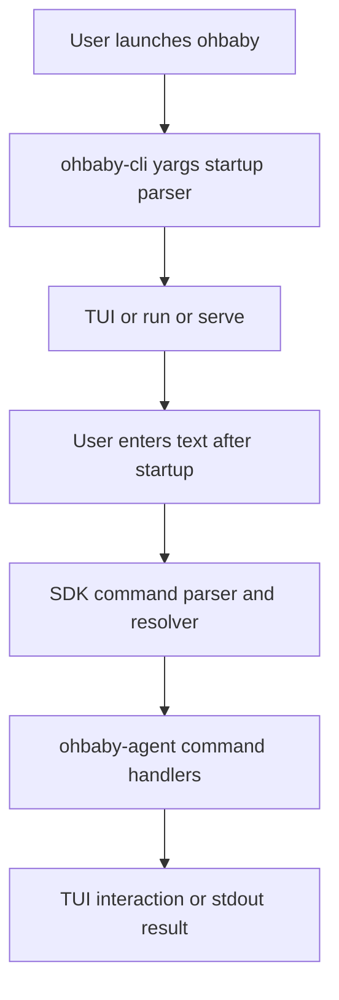

# CLI and Commands Boundary Design

日期: 2026-05-31

## 背景

ohbaby 后端即将收尾，目前职责边界最模糊的是 `cli` 和 `commands`：

- `commands` 当前在后端，同时 SDK 中已有命令契约。
- `ohbaby-cli` 依赖 SDK 契约，但 TUI 中仍存在命令解析、类型和补全的重复实现。
- CLI 启动入口当前仍在 `ohbaby-agent`，导致 `ohbaby-agent` 反向依赖 `ohbaby-cli`。
- 目标结构是 `ohbaby-cli` 包拥有 CLI 和 TUI，`ohbaby-cli -> ohbaby-agent -> ohbaby-sdk`，SDK 契约作为跨包边界。

本设计先对齐实施边界。实现阶段分两个临时分支推进：先做 commands 迁移和优化，再做 CLI 入口迁移。

## 已确认原则

### 启动命令和运行时命令分离

`yargs` 只负责进程启动时的子命令和参数解析，例如：

- `ohbaby`
- `ohbaby --mode plan`
- `ohbaby --permission full-access`
- `ohbaby run --input "hello"`
- `echo "hello" | ohbaby run`
- `ohbaby serve`

SDK command resolver 负责 ohbaby 启动后的 slash command 输入，例如 TUI 输入框中的 `/status`、`/models`、`/permission`。

`run` MVP 不支持裸 positional prompt，也暂不支持 `--command`。如需向 `run` 传入用户文本，使用 `--input` 或 stdin。

### SDK resolver 是 slash command 唯一权威语义

commands 分支中，SDK command resolver 负责统一 slash command 的解析和匹配语义。TUI 不再保留一套独立 resolver 作为事实标准。

TUI 可以保留展示层需要的状态、补全渲染和 dialog 管理，但命令 path、alias、参数归属、surface 过滤、父命令行为等语义必须来自 SDK。

### `/models` 是当前模型入口

命令名使用复数 `/models`，不使用 `/model`。

当前批次保持单模型范围：

- `/models` 展示当前 provider、baseUrl、当前模型和可读取到的模型信息。
- 如果当前配置只有一个模型，就只列出一个模型。
- 如果现有只读配置中已经包含多个 model profile，可以只读列出，但不做新增、修改、删除和持久化切换。
- 本批次不实现 TUI 输入 API key。
- 本批次不实现 provider 新增、修改、删除。
- 本批次不实现多 provider 配置 schema 改造。

后续 `/models` 可以升级为 Model Center，但不进入当前 commands 分支。

### `/permission` 是唯一权限入口

`/permission default` 和 `/permission full-access` 不单独注册为 slash commands。

TUI 中输入 `/permission` 后打开权限选择器，由用户选择 `default` 或 `full-access`。非 TUI 场景中 `/permission` 展示当前权限状态。

`permission.toggle-mode` 继续作为隐藏内部命令或 TUI 快捷键行为存在，不进入可见 catalog。

## Commands 分支范围

commands 分支优先完成命令契约收敛和 catalog 优化，不迁移 CLI bin 入口。

### SDK 契约

SDK command contract 增补 TUI 需要的展示字段，例如 `title`，并保持字段含义稳定。

SDK 提供统一的解析、匹配和解析结果类型：

- 识别 slash input 和普通 text input。
- 支持 command path 和 alias。
- 支持 surface 过滤。
- 支持父命令行为，例如可交互父命令。
- 明确 extra argv 对命令匹配的影响。

TUI command runtime 复用 SDK 解析结果，不再自定义一套冲突语义。

### Catalog

可见命令清单收敛为：

- `/status`
- `/exit`，别名 `quit`、`q`
- `/help`，别名 `?`
- `/models`
- `/sessions`
- `/new`
- `/compact`
- `/resume`
- `/permission`

删除或不再注册：

- `/tools`
- `/abort`
- `/model`
- `/model list`
- `/model current`
- `/session`
- `/session new`
- `/session compact`
- `/session resume`
- `/permission default`
- `/permission full-access`

其中 `/compact` 和 `/resume` 可以继续接受必要参数，例如 `--force` 或 `--session_id`，但参数解析语义由 command invocation 明确承载。

### `/models` 行为

TUI 行为：

- 打开模型信息视图或轻量选择视图。
- 展示当前 provider、baseUrl、当前 model。
- 展示从当前配置读取到的 model profiles。
- 如果只有一个模型，不制造多模型交互。
- 不展示 provider CRUD 表单。
- 不要求用户输入 API key。

非 TUI 行为：

- 输出当前 provider、baseUrl、当前 model。
- 输出可读取到的模型列表。
- 出错时返回结构化 command error，并提示配置文件路径或缺失字段。

### `/status` 行为

`/status` 可以包含当前模型摘要，例如 provider、model 和 baseUrl 的非敏感信息。

`/status` 不展示 API key 值。

### `/permission` 行为

TUI 行为：

- 打开权限选择器。
- 选项为 `default` 和 `full-access`。
- 用户确认后更新当前运行时权限状态。

非 TUI 行为：

- 展示当前权限状态。
- 不通过 `/permission default` 或 `/permission full-access` 直接修改。

## CLI 迁移分支范围

CLI 迁移分支在 commands 分支之后进行。

目标是把 CLI 入口和 CLI IO 移到 `ohbaby-cli` 包内，让 CLI 和 TUI 同属 `ohbaby-cli`：

- `ohbaby-cli` 拥有 bin entry。
- `ohbaby-cli` 使用 `yargs` 管理启动命令。
- `ohbaby-agent` 不再依赖 `ohbaby-cli`。
- `ohbaby-cli` 通过后端公开 API 或适配层调用 `ohbaby-agent` 能力。

启动命令设计：

- `ohbaby` 默认进入 TUI。
- `ohbaby run --input <text>` 执行一次性输入。
- `ohbaby run` 可以读取 stdin。
- `ohbaby serve` 作为服务模式入口保留或占位，具体行为由现有后端能力决定。
- 不支持裸 positional prompt。
- 不支持 `--command`。

## Config 和多模型配置边界

当前 `config/llm` 仍保持单模型读取语义，不在 commands 分支中改成多 provider schema。

当前批次可以在文档中预留未来方向，但不实现：

- TUI 中新增 provider。
- TUI 中修改 provider。
- TUI 中删除 provider。
- TUI 中输入和保存 API key。
- provider 级别的独立 `baseUrl` 和 `apiKeyEnv` 矩阵。
- 选择模型后热切换当前 LLM client。

未来 Model Center 的推荐方向：

- `~/.ohbaby-agent/model.json` 保存 provider、baseUrl、apiKeyEnv、models、defaultModel 等非密钥配置。
- `~/.ohbaby-agent/.env` 保存 API key，第一阶段优先于数据库。
- 数据库或系统 keychain 作为后续增强，适合有用户账户、云同步或 workspace profile 后再引入。

这些问题统一记录到 `docs/problem-lists/`。

## 数据流

## 错误处理

SDK resolver 应返回明确失败原因：

- 不是 slash input。
- 未匹配命令。
- 命令不支持当前 surface。
- 参数不符合命令约束。

`/models` 应避免泄露 API key。配置缺失或无效时展示可操作信息，例如缺失 `model.json`、缺失 `provider`、缺失 `defaultModel`、缺失 `apiConfig.baseUrl` 或缺失 `apiConfig.apiKeyEnv`。

多 provider 配置、API key 持久化和热切换失败场景不在当前 commands 分支中处理。

## 测试策略

commands 分支至少覆盖：

- SDK parser 和 resolver 的 slash/text 解析。
- path、alias、surface、parent behavior、extra argv 的匹配规则。
- catalog snapshot 或等价测试，确保可见命令集合符合本设计。
- TUI command runtime 复用 SDK resolver 的集成测试。
- `/models` handler 的单模型输出。
- `/permission` handler 不依赖 `/permission default` 和 `/permission full-access` 独立命令。

CLI 迁移分支至少覆盖：

- `ohbaby` 默认进入 TUI 的启动路径。
- `ohbaby run --input <text>`。
- `ohbaby run` stdin。
- 不支持裸 positional prompt。
- 不支持 `--command`。
- package bin 和依赖方向。

## 后续 problem-list 项

需要单独记录并延后：

- 多 provider 配置 schema。
- `/models` Model Center 的 provider/model CRUD。
- TUI 输入 API key 的持久化方式。
- `.env`、数据库、系统 keychain 的取舍。
- 选择模型后写回默认模型并热切换运行时 LLM client。
- 同名模型跨 provider 或 baseUrl 时的唯一标识。
- `/models` 大量模型时的 PgUp/PgDn 分页和焦点规则。

## 验收

本设计完成后，先由用户确认 spec。确认后再进入 implementation plan，并按两个临时分支实施：

1. commands 分支：SDK resolver 权威化、catalog 优化、`/models` 单模型展示、`/permission` 单入口。
2. CLI 迁移分支：bin 和 CLI IO 移到 `ohbaby-cli`，引入 yargs 启动命令。
